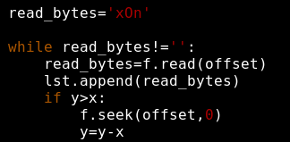
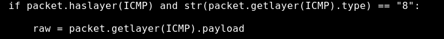
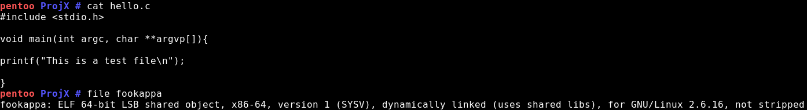
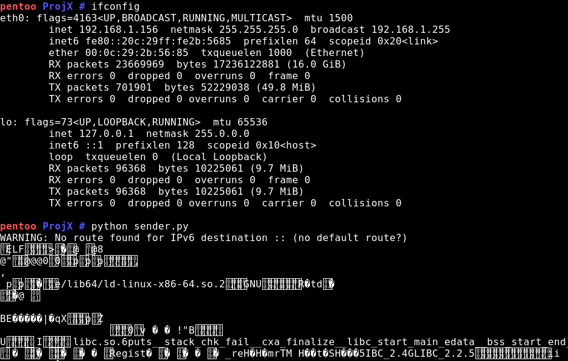
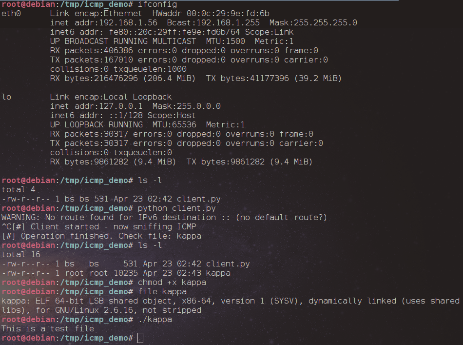
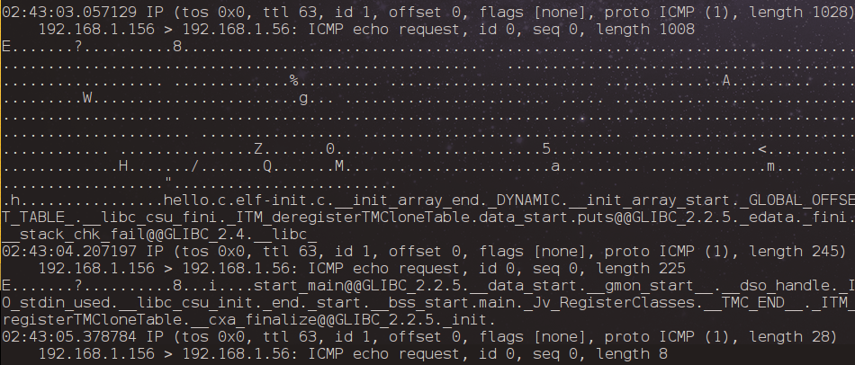
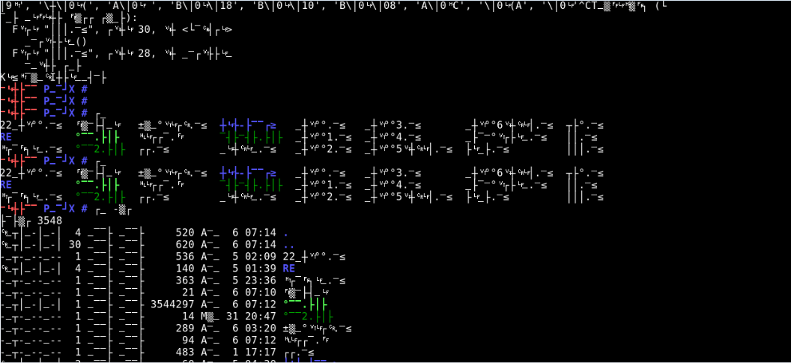

Hello w0rld. In this post I will show how it is possible to (mis)use ICMP protocol for file transfers with scapy.

“In computer security, a covert channel is a type of computer security attack that creates a capability to transfer information objects between processes that are not supposed to be allowed to communicate by the computer security policy.” _Source: [Wikipedia](http://en.wikipedia.org/wiki/Covert_channel)_

I have to give credit to the GhostInTheShellcode 2015 for “borrowing” the idea from the forensics challenge (see my previous post!). It is quite tricky to achieve, but the effort is worth it for the result. Network filtering restricts the traversal of specific packets or all the traffic of a kind. A firewall (pseudo)entry might be similar to “allow src dst http” “allow src dst icmp” and the (invisible usually) implicit deny restrict all other traffic. In cases like this there are 2 solutions; either use the existing “allow” for transferring data or switch to a different protocol which is allowed. ICMP is usually allowed because it was created for network troubleshooting mainly. More over messages like ICMP timestamps are blocked but echo requests/responses are not. A network admin that denies ICMP traffic will have troubleshooting difficulties when problems arise. The idea is not new, and according to the wish list of metasploit we should expect to see ICMP/UDP file transfers add-ons/functionalities to be introduced soon.

My idea can be summarized as the following:

1. We have 2 ends, sender and receiver (else we can imagine it as attacker/compromised host)
2. Attacker wants to send a file, let’s say an ELF or a PE file to the compromised host and for a reason he doesn’t want to use the solutions that exist already (meterpreter> upload function for example)
3. ICMP is connectionless/ and not really stateful as TCP however it keeps track in a timed fashion (it can be considered stateful)
4. I want to be able to parse a file and break it down to multiple chunks so that I can have different sizes of payloads
5. Then I will send these chunks
6. Client will receive these “pings” or more accurately this ICMP echo requests
7. At the side of compromised host/receiver a file will be created and the payload of these requests will be appended.

For dealing with my ideas, I created 2 python scripts, a sender and a sniffer for grabbing the file. The sender is straightforward. The only thing that I had to add is the way of tearing down a file to multiple chunks and then parse these chunks for sending them. I used an "offset" so that in the future I can change the offset and have my chunks in different sizes. For the screenshot below you need to know that **x=1** and **y=2**. So the seek() will be executed just once for moving the file descriptor "offset" bytes ahead.

<figure>

<figcaption>

Setting the offset for subsequent read

</figcaption>

</figure>

After the sender was done the "client" was the next step. I used the sniff() from scapy which I have to admit I didn't really enjoy. There are several things that I learned out of this process most notable that the _count_ refers to the number of packets that will be received and NOT to the number of packets that will be received from the filter (packets that "hit" the filter!).

Another issue that I had to solve was that I wanted specifically to grab the _Type 8_ "_echo request_" messages. However when I was setting a _filter=icmp_ and then in my callback function an if statement as the following I was getting back duplicate packets.

<figure>

<figcaption>

This didnt work really

</figcaption>

</figure>

Because of that I had to use a statement as _if raw in downloadlist_ so that I removed the double entries from my list.

Another funny problem would arise in the case that another machine pings the receiver. In that case the payload of the echo request would be appended on the file. For this I just created an if statement and grab the packets coming from a specific source address.

For testing our scripts in a "real case" scenario we placed the client on the host with IP 192.168.1.56 and the sender on 192.168.1.156. A simple ELF file was created.

<figure>

<figcaption>

File used for transfer

</figcaption>

</figure>

Then we launched the client and the sender and...

<figure>

<figcaption>

Sender. Sorry for the painful output of the non-printable chars :(

</figcaption>

</figure>

<figure>

<figcaption>

Client receiving the file and.. boom!

</figcaption>

</figure>

As you can imagine this PoC does not employ a way of obscuring what was sent. We can see that from what tcpdump spits...

<figure>

<figcaption>

tcpdump clearly shows that some sort of an executable file that uses libc was transfered!

</figcaption>

</figure>

There are multiple limitations and challenges here.

1st  The receiver/compromised host will reply back the payload that will be received; a behavior that is not good

2nd ICMP does not have a “window-size” as TCP; there isn’t any “sliding window” that will allow us to send multiple chunks of a file in a single window. We need to take care of that somehow.

3rd The ordering of data chunks is also a challenge. If the 2nd chunk arrives before the 1st one because of network-related issues (maybe a different route was chosen…) then the receiver/compromised host will reconstruct the file incorrectly

4th Since scapy will be used (for now) we have all the limitations related to its capabilities (root access, installation dependencies, etc).

In order to make it happen we need a small script to behave as a client and another one for the sender. The sender should also take care of the breaking up of the file to chunks of a specific size (must be less than the max\_payload\_size).

Assuming that the ICMP type 8 messages are permitted then detection of a file transfer happening like that comes down to whether an IDS look for “abnormal” traffic. The type 8/0 messages depending on the OS (\*nix/Windows/etc) have a similar payload every time that are getting sent (however it depends on the OS, Windows do not have the same payload with Linux). For finding the actual file though, a reconstruction of the file is necessary. Dealing with avoidance we have the following paths that we can use:

- Encrypt the payload with a key hardcoded into client/server is obviously the strongest way. This would provide end to end encryption and from the network side it “shouldn’t” be possible to find what was sent.
- Encrypt the payload with a key that is sent through or a value of a packet. This is less “safe” when compared to method 1. But it is still difficult to reverse it. Even if you have the ciphertext and you can extract which algorithm was used you still need to know the key.
- Doing transposition/permutation. So imagine that we have an array with bytes where z = 0 and y = position of last element. By just reversing the order in the way transposed\[y\]=element\[z\] we can create a sequence that wouldn’t make sense at first place (Keep in mind that we do that per chunk (we can also do it per file but this leads to a smaller obfuscation)… so if we have a chunk size of 50 bytes and we are sending it on the reverse order if a file is big then it wouldn’t be so obvious what it is). This approach is (I guess) a way of performing steganography since we just hide the method that we use and we do not encrypt the actual payload. Still though there would be cases where an image header (or a trailer) sent on the reverse order would give away the fact that this is a header. For example the “.exe” if it is sent in that way it will look as “exe.” and would spoil our technique! Still though from a network forensics standpoint the analyst must find a way to find the start/end of the file and the correct sequences in order to reverse the process and reconstruct the file. There are multiple ways of performing this and only sky is the limit… So another example is to use a matrix x\*y with the byte sequence of the payload and then shift the columns and the arrows around (similarly to AES process but without XORing) and then send the new matrix to the client who reverses the process.
- Use encoding instead. Still though encoding with base 64 can be easily spotted.
- Use a mixed approach of the the previous 2.

Hiding the message though, doesn’t prove the fact that something sneaky happened. If an IPS monitors the ping requests and realizes that the payload is not the one that it should be then it can just discard the packets. There also firewalls that perform stateful inspection of ICMP.

Covert channels are becoming more and more used. We have seen already steganography been used in videos, music but also in networking protocols. A malware author might use ICMP and/or UDP for dropping his downloader and the necessary protection mechanisms must be therefore deployed for mitigating that risk.

Food for thought:

- Add also encryption to each chunk by hardcoding a key
- Porting it to C for making it a Portable Executable (PE-File)
- Writing it alternatively (still in python) with ctypes
- Add steganographic ways for obscurity
- Use other fields for the actual transfer of a file

You can find the sender/client scripts in our github [here](https://bitbucket.org/jumpseclab/kit-kappa-icmp-transfer "KIT download page") 

If you are still here, thanks for your time ;)

Blooper Section!

This happened while testing the sender with an offset=3!

<figure>

<figcaption>

Blooper: When computers decide not to speak human-languages...

</figcaption>

</figure>
