In this blog post I am going to tackle the topic of detecting common attacks using Active Directory logs. It is important to understand the power of data in InfoSec world. Too much data means you’ll be spending rest of the week digging through millions of log entries to try and figure out what the adversary was up to. You can set filters to help you through this, however it can get computationally expensive very fast depending on how your filters operate. It also requires you to know what to specifically look out for! You need to have confidence in your filters and test them thoroughly from time to time to make sure they actually work.

  

On the other hand, too little data means you might not have enough log entries to investigate and provide full evidence of what malicious techniques were attempted. For this reason, it is a constant battle of finding the middle ground of having hard evidence and not overwhelming your SIEM. Another golden question to ask is: are we even logging the correct events?

  

One of the ways to get around this problem is configuring the correct Group Policies on the Domain Controllers. In this blog post I want to focus solely on command line logging because it is a quick win and it shows immense amount of detail into what processes and commands are executed. We start off by enabling the correct settings in the Group Policy using Group Policy Editor. The steps are detailed below:

  

  
  

- Follow the path **_Policies → Administrative Templates → System → Audit Process Creation. And enable “include command line in process creation events”_**

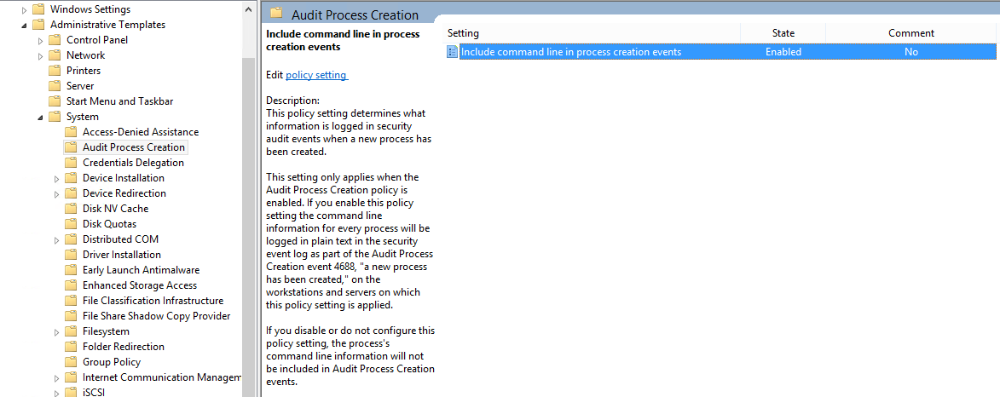

  
  

- Follow the path **_Policies → Windows Settings → Security Settings → Advanced Audit Policy Configuration → Audit Policies → System Audit Policies → Detailed Tracking_**. And enable both **_Successful_** and **_Failure_** configuration for “**_Audit Process Creation_**” and “_**Audit Process Termination**_” as shown below.

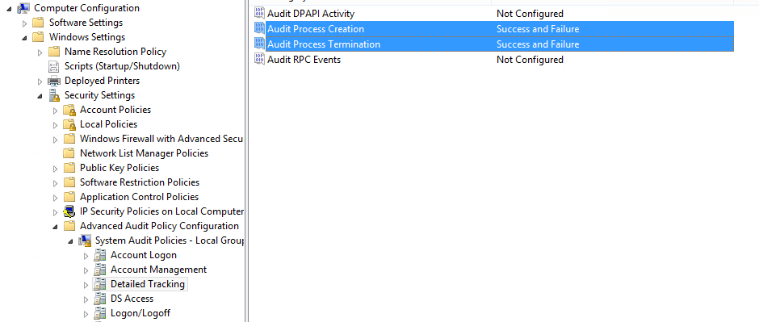

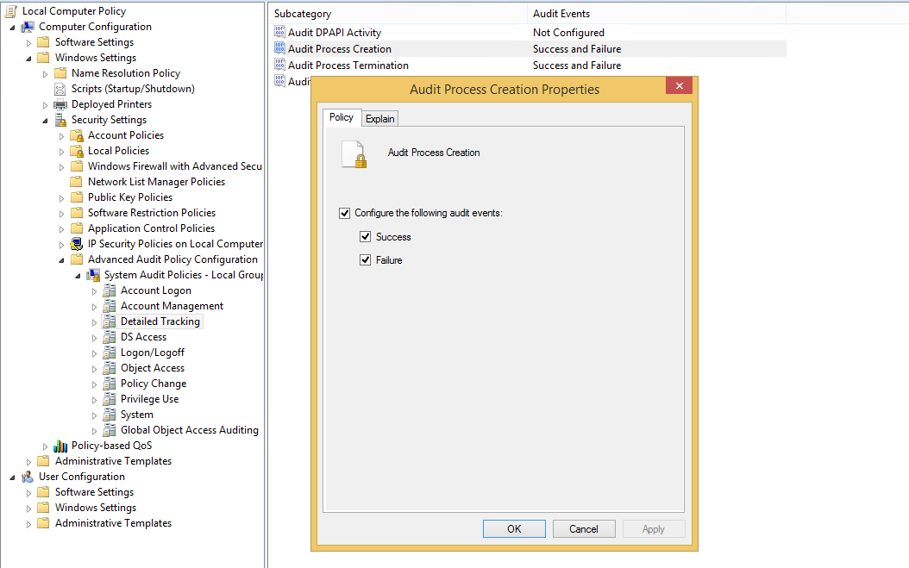

  
  

After configuring these settings, run the good old group policy update on command prompt as administrator using the command **_gpupdate /force_**. At this point, you should be able to see all commands being executed via command prompt.

  

We can test this by running some commands and viewing the logs to verify as shown below by running some test commands. We can see that by running test commands **event ID 4688** (New process created) event is generated showing what was typed in the command prompt.

  

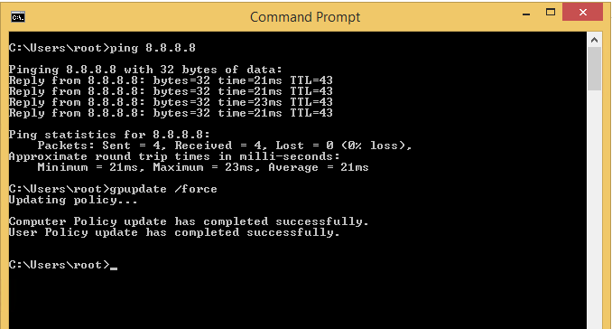

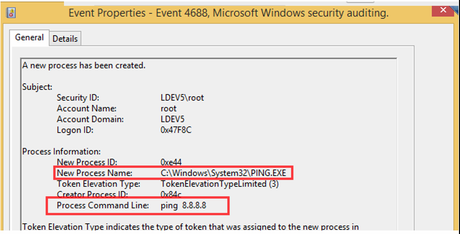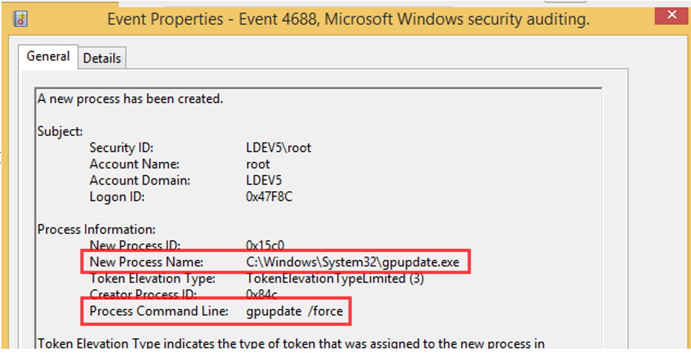

  
  
  

Now, we can move forward and test this with the psexec module from Metasploit using the _exploit/windows/smb/psexec_ module as shown below.

  

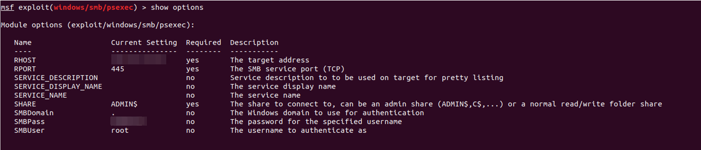

  

  

After setting the correct parameters, we execute the exploit and observe the logs produced from this action.

  

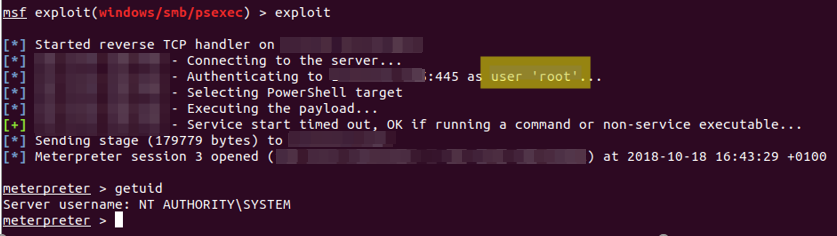

  

  
Now this will generate a lot of events and keeping up with the incoming logs using Windows Event Viewer will be almost impossible. The best way to analyse these events is to parse these events through a SIEM solution for better log management. After everything is set up correctly, we can now begin the hunt! Monitoring the recent activity on the target machine, we see some interesting events:

  

- **Event ID 7045** – A service was installed in the system

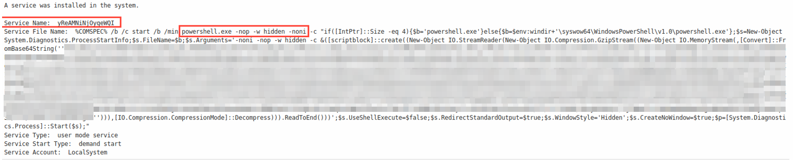

  

The details around this event shows that the service named **_yReAMNiNjOyqeWQI_** was installed by the user root (which we know is the user used for this exploit). There are some interesting parameters defined here such as **\-nop**, **\-hidden** and **\-noni**

  

Such parameters can be used for obfuscation purposes. However, it becomes harder to detect these obfuscation parameters with keyword matching when there are multiple valid execution argument aliases for them. For example, for **\-NoProfile** argument alone, argument substrings such as **\-NoP**, **\-NoPr** **\-NoPro**, **\-NoProf**, **\-NoProfi** and **\-NoProfil** are all valid! This is where we chuck keyword matching filters out of the window and look towards regular expressions for detection.

  

Focusing more on the name of the service being installed (_**yReAMNiNjOyqeWQI**_) looks like gibberish which is exactly what it is. Looking at the source code of the psexec module for Metasploit framework, we see that the display name is essentially 16 character long random text! We just found another possible filter that could help us detect these types of exploits.

  
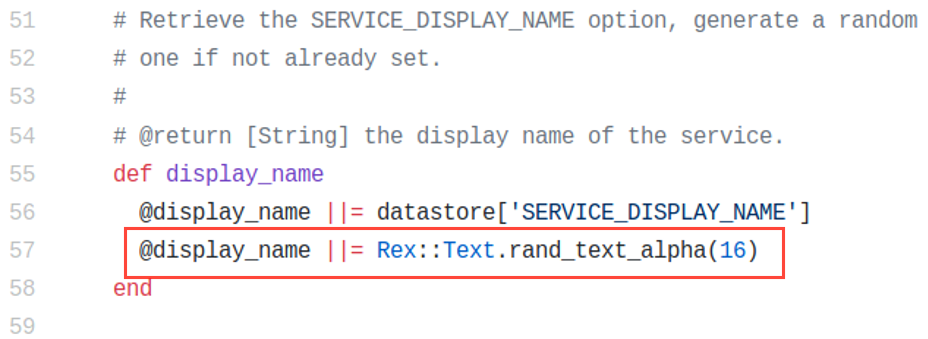

  
Furthermore, we can also see a new process created (with **event ID 4688**) which logs the actual command being executed during this attack!  

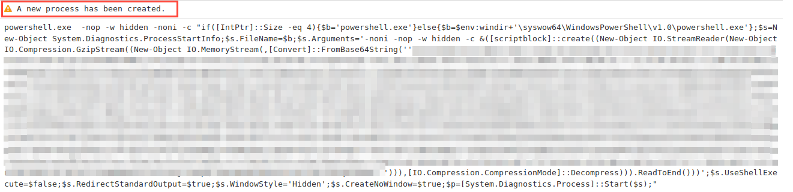

  
Do you remember the thing we did with the group policies earlier? It wasn’t just to fill this blog post with random text and screenshots…nope… instead setting those group policies accordingly will allow you to log what was executed in command prompt as shown above! This is very useful in monitoring what crazy things are being executed on your windows network.  

  
That’s all for now, I hope you found this helpful as well as interesting. In the next part of this blog post series I will reveal more ingesting detection techniques.
