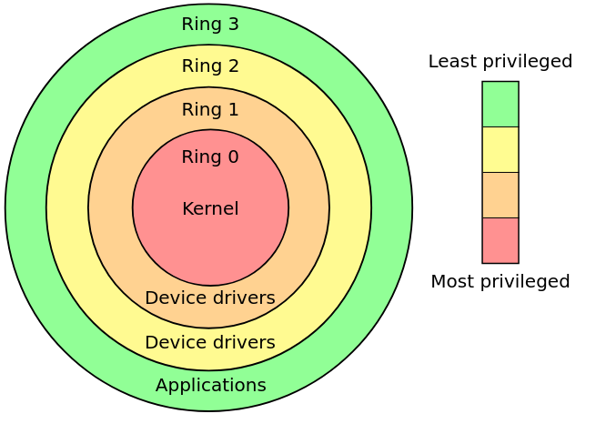
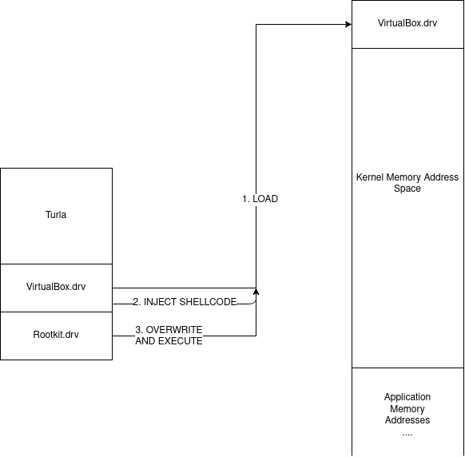
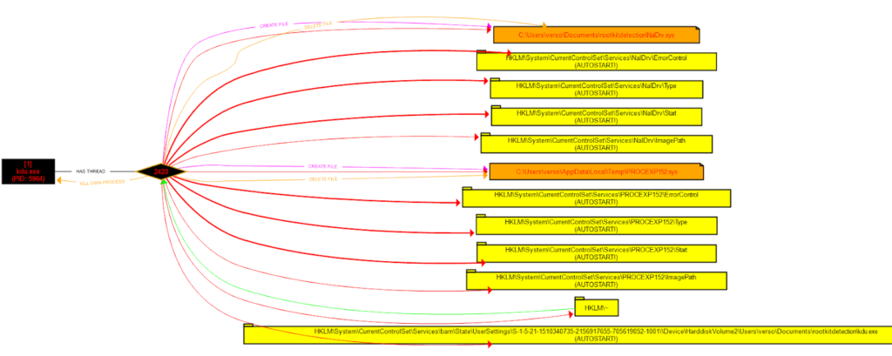

_Author: Thom (_[_@rootkid8_](https://twitter.com/rootkid8)_), Sysmon Mastery Help from Rana ([@sec\_coffee](https://twitter.com/sec_coffee))_

## Introduction

Even before my birth, rootkits have been one of the most sophisticated and successful ways of obtaining persistence on a machine, and now in 2020 there are ever more trivial ways of escalating from system to kernel. Recently JUMPSEC’s youngest red team researcher [@\_batsec\_](https://twitter.com/_batsec_) [raised the bar once more using rootkit techniques to universally evade Sysmon](https://blog.dylan.codes/evading-sysmon-and-windows-event-logging/). This method of defeating Event Tracing for Windows is an incredible feat and the world of Windows logging is left shaken. As a result, we’re going to go down the rabbit hole of kernel driver rootkits, specifically looking at the use of vulnerable kernel drivers to escalate to ring-zero. First we need to start with some basics, how the Windows kernel implements defence-in-depth, how to bypass these restrictions, and how network defenders and system administrators can detect these techniques as “trivially” as attackers can implement them (skip to the end for a Sysmon Config). 

## Some OS Basics

For those of us who don't know, operating systems and common CPU's define hierarchical protection domains to implement defense in depth. Code executing on the CPU is run in one of these rings using CPU modes - with ring 3 being user-land and ring 0 being kernel-land.   



Only certain applications that require access to low level devices and hardware should be allowed access to run code in rings 2, 1 and 0, which is enforced at a microcode level on the CPU as well as by the operating system. In theory this privilege domain is sound, and its introduction expelled the days of causing total system crashes with one line of buggy code in user-land. However, the implementation of these rings at the operating system level, and worse-so at the driver level is reasonably vague and undocumented, opening up an entire space for kernel driver exploits as post exploitation privilege escalation and persistence mechanisms. 

## Writing a Kernel Mode Driver

We’re going to look more closely at how Windows handles device drivers, since these drivers allow access to kernel space, we will hopefully uncover some of the ways to get arbitrary code to run in kernel mode without the use of a signed driver. Heck, [writing a kernel mode driver isn’t a particularly challenging task](https://docs.microsoft.com/en-us/windows-hardware/drivers/gettingstarted/writing-a-very-small-kmdf--driver), but if you want it to run on a target system it will require setting up “Test Mode” on the operating system or completely disabling device driver signing enforcement (DSE) globally which requires access to the boot settings, or through running the following command followed by a reboot:  

```
bcdedit /set testsigning on
```

Both of these techniques are about as stealthy as using a sledgehammer to hide the noise of your power drill, and not only will most ordinary users recognise the **Test Mode** warning on their device, many organisations restrict this functionality group wide, [and if they don’t then they really should.](https://docs.microsoft.com/en-us/windows-hardware/drivers/install/the-testsigning-boot-configuration-option) There is of course a way to hide the watermarks and warnings, but again this is a sledgehammer approach since bcdedit will be caught by a blue team with any real level of sophistication.  

Instead, we need to bypass Driver Signature Enforcement and PatchGuard, both of which being Windows kernel protection mechanisms. One to prevent unsigned drivers being loaded and another to prevent drivers from modifying critical kernel data structures through integrity checks. Again, any blue team should be able to detect the loading of a driver with an expired certificate - [SwiftOnSecurity’s handy Sysmon config will anyway!](https://github.com/SwiftOnSecurity/sysmon-config)  

## The Story of One Kernel Driver Loader...

In order to explore these kernel mode drivers, we need to take a trip back in time. There used to be (and still are) some fantastic base projects for kernel mode drivers like the ones we’re investigating. Written by a legend in this space [@hfiref0x](https://twitter.com/hfiref0x?lang=en) - we’ll start with [TDL or Turla Driver Loader](https://github.com/hfiref0x/TDL). Around 4 years ago, this tool was a rootkit developer's wet dream. It’s the supercedent to [DSEFix](https://github.com/hfiref0x/DSEFix), another driver loader written by hfiref0x, that became obsolete due to its modification of kernel variables that got blocked by PatchGuard rendering it a guaranteed blue screen generator - a fun prank but not what we’re looking for.   

TDL acts as a fully functional driver loader that can be used independently of the Windows loader. As a byproduct it defeats 64-bit driver signature enforcement as well. The magic of Turla is the offensive technique it uses to get a custom driver to load into kernel memory. It comes packaged with a vulnerable version of a VirtualBox kernel mode driver, it loads and exploits this driver to overwrite kernel memory with a custom crafted driver before jumping to the DriverEntry function to begin execution. Effectively this can be visualised as so:  



This technique is somewhat akin to process hollowing, but instead of creating a suspended thread and mapping our code into it, we load a known driver and use shellcode to map our malicious code into that segment of memory.  

The technique is surprisingly simple, but extremely effective. Since the VirtualBox driver runs in kernel mode already, by dropping shellcode that now runs in kernel land we can execute an mmov, an mmap, and a jump (in reality it’s much more complex than that but just for simplicity’s sake we rely on those three instructions). This means that all the target kernel driver needs is permission to read and write physical memory, and have a code execution CVE for it to become a candidate for kernel driver loading.  

Clearly hfiref0x doesn’t sleep, and soon after TDL, [Stryker](https://github.com/hfiref0x/Stryker) was released, yet another kernel driver loader. This time the loader was crafted to [exploit a CPU-Z driver](https://www.cpuid.com/softwares/cpu-z.html) instead, functioning very similarly to its predecessor. Now again in 2020,  hfiref0x strikes again with the release of Kernel Driver Utility ([KDU](https://github.com/hfiref0x/KDU)) just 2 months ago, the same concept is being used, except now KDU supports multiple vulnerable drivers as “functionality providers''. Hilariously named, these functionality providers are the keys to the kingdom, and if we have any hopes of detecting rootkits that use this technique we need to understand how KDU loads these drivers, how it exploits them, and what breadcrumbs we can search for on systems to check for compromise.  

Looking briefly at the Github attributes we can see there are 4 CVE’s associated with the project:

- [cve-2015-2291](https://cve.mitre.org/cgi-bin/cvename.cgi?name=CVE-2015-2291) [](https://github.com/topics/cve-2019-18845)\- IQVW32.sys intel ethernet driver vulnerability
- [cve-2019-18845](https://cve.mitre.org/cgi-bin/cvename.cgi?name=CVE-2019-18845) [](https://github.com/topics/cve-2018-19320)\- MsIo64.sys and MsIo32.sys Patriot Viper vulnerability
- [cve-2018-19320](https://nvd.nist.gov/vuln/detail/CVE-2018-19320) [](https://github.com/topics/cve-2019-16098)\- GDrv graphics driver vulnerability 
- [cve-2019-16098](https://cve.mitre.org/cgi-bin/cvename.cgi?name=CVE-2019-16098) - RTCore64.sys and RTCore32.sys vulnerability

With more providers mentioned in the README:  

- ATSZIO64 driver from ASUSTeK WinFlash utility of various versions;
- GLCKIO2 (WinIo) driver from ASRock Polychrome RGB of version 1.0.4;
- EneIo (WinIo) driver from G.SKILL Trident Z Lighting Control of version 1.00.08;
- WinRing0x64 driver from EVGA Precision X1 of version 1.0.2.0;
- EneTechIo (WinIo) driver from Thermaltake TOUGHRAM software of version 1.0.3.

The most notable thing regarding these vulnerabilities is that they all expose ring-zero code execution capabilities, enabling the entire kill-chain of KDU. Even more interestingly  CVE-2019-16098 even states in the description: **_These signed drivers can also be used to bypass the Microsoft driver-signing policy to deploy malicious code._**   

As a disclaimer, we can note that hfiref0x states KDU and all similar tools are not actually hacking tools, they are for driver developers to make their lives easier. **A lazy AV will flag this tool as malware**, but also because in many senses of the word, KDU is malware in the same way a remote access tool for sysadmins can be malware.

## Static Analysis 

**\[WARNING: RABBIT HOLE AHEAD\]**

**If you’re not interested in KDU source code or boring operating system details then skip to Dynamic Analysis.**  

Examining the source code of KDU we see an abstraction layer that is implemented by the driver loader, each provider has the following structure:  

```
144 typedef struct _KDU_PROVIDER {                          
…………………………………………………
161     struct {
162         provRegisterDriver RegisterDriver; //optional
163         provUnregisterDriver UnregisterDriver; //optional
164
165         provAllocateKernelVM AllocateKernelVM; //optional
166         provFreeKernelVM FreeKernelVM; //optional
167
168         provReadKernelVM ReadKernelVM;
169         provWriteKernelVM WriteKernelVM;
170
171         provVirtualToPhysical VirtualToPhysical; //optional
172         provReadControlRegister ReadControlRegister; //optional
173     
174         provQueryPML4 QueryPML4Value; //optional
175         provReadPhysicalMemory ReadPhysicalMemory; //optional
176         provWritePhysicalMemory WritePhysicalMemory; //optional
177     } Callbacks;
178 } KDU_PROVIDER, * PKDU_PROVIDER;
```

I’ve ignored the unimportant fields, but from here we can understand what it takes to construct a provider, and we can see there are function pointers required for:  

- reading and writing virtual memory, 
- mapping virtual addresses to physical addresses, 
- reading and writing physical addresses 
- reading two kernel registers - the PML4 and the Control Register

It should be pretty clear so far why we need to be able to read and write physical and virtual memory addresses, but what are the PML4 and the control register and why does the exploit require them? Well if you’re familiar with Linux kernels then the PML4 is simply the base address to the multi-level page table that the kernel uses to map linear virtual address spaces to processes. In order to replace our driver in memory we need to be able to find where it’s stored in memory which requires reading from the page table to find the address space of the target driver. Hence we can read this base address from the PML4 register.   

The control register should also be familiar to kernel developers or assembly folks, but to those of you who don’t know - it’s a 64-bit register that has a few important use cases required by virtual memory mapping and paging. In cases where either no function is defined for mapping virtual memory to physical memory, and nothing for reading the PML4, KDU uses the control register value to find the page directory address. This allows it to translate virtual addresses to physical addresses so it can walk through the page table and overwrite physical kernel memory regions:  

```
 39  BOOL PwVirtualToPhysical(
 40     _In_ HANDLE DeviceHandle,
 41     _In_ provQueryPML4 QueryPML4Routine,
 42     _In_ provReadPhysicalMemory ReadPhysicalMemoryRoutine,
 43     _In_ ULONG_PTR VirtualAddress,
 44     _Out_ ULONG_PTR* PhysicalAddress)
 45 {   
 46     ULONG_PTR   pml4_cr3, selector, table, entry = 0;
 47     INT         r, shift;
 48     
 49     *PhysicalAddress = 0;
 50     
 51     if (QueryPML4Routine(DeviceHandle, &pml4_cr3) == 0)
 52         return 0;
 53     
 54     table = pml4_cr3 & PHY_ADDRESS_MASK;
 55     
 56     for (r = 0; r < 4; r++) {
 57         
 58         shift = 39 - (r * 9);
 59         selector = (VirtualAddress >> shift) & 0x1ff;
 60         
 61         if (ReadPhysicalMemoryRoutine(DeviceHandle,
 62             table + selector * 8,
 63             &entry,
 64             sizeof(ULONG_PTR)) == 0)
 65         {   
 66             return 0;
 67         }
 68         
 69         if (PwEntryToPhyAddr(entry, &table) == 0)
 70             return 0;
 71         
 72         if ((r == 2) && ((entry & ENTRY_PAGE_SIZE_BIT) != 0)) {
 73             table &= PHY_ADDRESS_MASK_2MB_PAGES;
 74             table += VirtualAddress & VADDR_ADDRESS_MASK_2MB_PAGES;
 75             *PhysicalAddress = table;
 76             return 1;
 77         }
 78     }
 79     
 80     table += VirtualAddress & VADDR_ADDRESS_MASK_4KB_PAGES;
 81     *PhysicalAddress = table;
```

Digging deeper into the source code we actually discover that there are two drivers at play here: a victim driver and a vulnerable driver. Initially I presumed these to be the same driver, but the code appears to unpack, load and start the vulnerable driver first - this is the _provider_ - after which it calls KDUMapDriver which tries to load the victim driver.

In the case of KDU, the victim driver is always the process explorer **PROCEXP152**.sys driver, it bootstraps shellcode into the IRP\_MJ\_DEVICE\_CONTROL callback of PROCEXP152, before finally unloading it, triggering the shellcode to execute inside PROCEXP152, allowing the target driver to be loaded into kernel memory.  

Finally, let’s take a look at the core loader functionality, we want to understand the shellcode bootstrapping, and the system calls used to help us figure out what level of detection is possible. This snippet of code is where the bootstrapping happens inside KDUSetupShellCode:  

```
382         //
383         // Resolve import (ntoskrnl only) and write buffer to registry.
384         //
385         isz = FileHeader->OptionalHeader.SizeOfImage;
386
387         DataBuffer = supHeapAlloc(isz);
388         if (DataBuffer) {
389             RtlCopyMemory(DataBuffer, Image, isz);
390
391             printf_s("[+] Resolving kernel import for input driverrn");
392             supResolveKernelImport((ULONG_PTR)DataBuffer, KernelImage, KernelBase);
393             
394             lResult = RegOpenKey(HKEY_LOCAL_MACHINE, NULL, &hKey);
395             if ((lResult == ERROR_SUCCESS) && (hKey != NULL)) {
396
397                 lResult = RegSetKeyValue(hKey, NULL, TEXT("~"), REG_BINARY,                                        
398                     DataBuffer, isz);
399
400                 bSuccess = (lResult == ERROR_SUCCESS);
401
402                 RegCloseKey(hKey);
403             }
404             supHeapFree(DataBuffer);
405         }
406     }
```

We see that first it finds the `**ntoskrnl**.exe` base address - this is the starting address space of the kernel mapped memory region, containing important structures such as the page directory of mapped memory for all processes on the system. This is important because most process monitoring tools should be able to detect if this image is loaded. After this it calls `KDUStorePayload` on the driver filename passed to it - interestingly this function writes a byte buffer that is just the raw bytes of the **`rootkit.sys`** _(or whatever input kernel mode driver you specify)_ to a registry hive in `HKLM` with the key “~”:


_\[`4d5a` is hex for `MZ` also known as the magic bytes in the header of a PE image.\]_  

A fun part of this registry write is that KDU doesn’t clean up after itself so this artifact remains on the system as an IOC even after KDU’s removal. I’ve thrown together a little powershell script that you can find in the appendix for incident responders to check whether any PE data has been written to registry keys. It will detect KDU in it’s default state as well as any basic attempts at KDU modifications that change the target hive, and any other tools that write executable data to the registry.  

Furthermore, we come across this function call inside `VictimBuildName` in `**victim**.cpp` that writes the victim driver **`.sys`** in the `%TEMP%` directory:  

```
 61 LPWSTR VictimBuildName(
 62     _In_ LPWSTR VictimName
 63 )
 64 {
 65     LPWSTR FileName;
 66     SIZE_T Length = (1024 + _strlen(VictimName)) * sizeof(WCHAR);
 67
 68     FileName = (LPWSTR)supHeapAlloc(Length);
 69     if (FileName == NULL) {
 70         SetLastError(ERROR_NOT_ENOUGH_MEMORY);
 71     }
 72     else {
 73
 74         DWORD cch = supExpandEnvironmentStrings(L"%temp%\", FileName, MAX_PATH);
 75         if (cch == 0 || cch > MAX_PATH) {
 76             SetLastError(ERROR_NOT_ENOUGH_MEMORY);
 77             supHeapFree(FileName);
 78             FileName = NULL;
 79         }
 80         else {
 81             _strcat(FileName, VictimName);
 82             _strcat(FileName, L".sys");
 83         }
 84     }
 85
 86     return FileName;
 87 }
```

This is exciting, as file writes are also solid ways of detecting malicious activity, especially if the write operations are hardcoded into the executable and not generated on the fly or randomly.

## Dynamic Analysis

Now that we have some potential indicators of execution for KDU from the source code: registry writes, files writes and image loads, we’re going to write some tests to see how this works in practice. To test these providers, I compiled KDU from source, wrote a custom kernel mode driver that acts as a tiny example rootkit, and wrote a batch script to execute **`kdu -map -prv <ID> rootkit.sys`** repeatedly with each of the providers in sequence. In each case we analyse the changes made to the system, in this example we’ll be using Procmon, and Sysmon.  

The procmon test shows a pretty clear pattern of events demonstrated by the following diagram:

<figure>



<figcaption>

Sysmon output

</figcaption>

</figure>

Using our custom Sysmon config, we also see the following events traced by Sysmon:   

1. Create %TEMP%**PROVIDER**.sys 
2. Set HKLMSystemCurrentControlSetServices**PROVIDER**Start registry value to 3 (Manual Start)
3. Set HKLMSystemCurrentControlSetServices**PROVIDER**ImagePath to %TEMP%**PROVIDER**.sys
4. _DRIVER LOADED_**_: PROVIDER.sys_**
5. Create %CD%**PROCEXP152**.sys
6. Set HKLMSystemCurrentControlSetServices**PROCEXP152**Start registry value to 3 (Manual Start)
7. Set HKLMSystemCurrentControlSetServices**PROCEXP152**ImagePath to %CD%**PROCEXP152**.sys
8. _DRIVER LOADED_**_: PROCEXP152.sys_**
9. Unsigned Image loaded **rootkit.sys**

This makes more sense if we understand that the registry values in **HKLMSystemCurrentControlSetServices<Driver>** are set and unset when Windows services are loaded, and these actions aren’t actually performed by the KDU code directly. Instead these events can be read as:  

1. Unpack vulnerable (provider) driver to `%CD%`
2. Start it
3. Write rootkit binary data to `HKLM~` registry hive
4. Unpack victim driver (`**PROCEXP152**.sys`) to `%TEMP%`
5. Start it
6. Unsigned rootkit kernel driver loaded into kernel memory

This is almost exactly the pattern evident from the source code, although we had to add an explicit rule to pick up the binary data in `HKLM~`. What we can note here as well is that this entire process relies on the loading of a very particular version of a vulnerable driver - this means it’ll have a particular hash which we could also use as a signature, as well as the final event - an unsigned driver still gets loaded into memory is the biggest telltale sign of something suspicious happening.

## Conclusion

Now, [obviously we could have just executed KDU right at the start of this and obtained the IOC’s instantly, but where’s the fun in that](https://www.reddit.com/r/blueteamsec/comments/fychxz/detect_ghostinthelogs_when_executed_disables_all/)? Instead you should now understand one fairly general technique for elevating from system to kernel, the inner workings of kernel level driver loaders (and the many similar tools using this technique), as well as how we can detect them.   

These detection techniques aren’t particularly sophisticated however, and nothing prevents an adversary from patching or tweaking these variables so KDU writes to different registry hives or disk locations. Or worse yet, making it load the victim and vulnerable drivers from memory instead of dumping them to disk first, in which case we would only see the starting and stopping of the vulnerable and victim driver services. Then simply patching the vulnerable drivers with arbitrary null bytes before loading them would modify the hashes detected by Sysmon. Such is life in cybersecurity… In part 2 we’re going to look at some more sophisticated evasion techniques that rootkits use, and how we can detect those too, so stay tuned!  

The supporting work in this area is my only credit, people like [@hfiref0x](https://twitter.com/hFireF0X), [@fuzzysec](https://twitter.com/FuzzySec), and of course our dude [@\_batsec\_](https://twitter.com/_batsec_) constantly finding ways to break the Windows kernel and invalidate the integrity of our operating systems is one of the many wonders of this world.   

## Appendix

1. Some sysmon rules for detecting KDU and similar tools (the DriverLoad and ImageLoad events may require you to update your exclusion filters) as the vulnerable drivers that get loaded often appear legitimate and are even signed by Microsoft in the case of `**PROCEXP152**.sys`.

```
<Sysmon schemaversion="4.23">
    <EventFiltering>
        <RuleGroup name="" groupRelation="or">
            <DriverLoad onmatch="include">
                <ImageLoaded condition="contains" name="MITRE_REF=T1014,NAME=Rootkit">TempPROCEXP152.sys</ImageLoaded>
                <Hashes condition="is" name="MITRE_REF=T1014,NAME=Rootkit">C06DDA757B92E79540551EFD00B99D4B</Hashes>
            </DriverLoad>
        </RuleGroup>
        <RuleGroup name="" groupRelation="or">
            <ImageLoad onmatch="include">
                <Signed name="MITRE_REF=T1014,NAME=Rootkit" condition="is">false</Signed>
                <ImageLoaded name="MITRE_REF=T1014,NAME=Rootkit" condition="is">C:WindowsSystem32ntoskrnl.exe</ImageLoaded>
            </ImageLoad>
        </RuleGroup>
        <RuleGroup name="" groupRelation="and">
            <FileCreate onmatch="include">
                <TargetFilename name="MITRE_REF=T1014,NAME=Rootkit" condition="contains">AppDataLocalTempPROCEXP152.sys</TargetFilename>
            </FileCreate>
<FileCreate onmatch="exclude">
                <Image condition="contains">procexp64.exe</Image>
                <Image condition="contains">procexp.exe</Image>
                <Image condition="contains">procmon64.exe</Image>
                <Image condition="contains">procmon.exe</Image>
            </FileCreate>
        </RuleGroup>
        <RuleGroup name="" groupRelation="or">
            <RegistryEvent onmatch="include">
                <TargetObject name="MITRE_REF=T1014,NAME=Rootkit" condition="contains">PROCEXP152ImagePath</TargetObject>
                <TargetObject name="MITRE_REF=T1014,NAME=Rootkit" condition="contains">RTCore64ImagePath</TargetObject>
                <TargetObject name="MITRE_REF=T1014,NAME=Rootkit" condition="contains">GdrvImagePath</TargetObject>
                <TargetObject name="MITRE_REF=T1014,NAME=Rootkit" condition="contains">ATSZIOImagePath</TargetObject>
                <TargetObject name="MITRE_REF=T1014,NAME=Rootkit" condition="contains">MsIo64ImagePath</TargetObject>
                <TargetObject name="MITRE_REF=T1014,NAME=Rootkit" condition="contains">MsIoImagePath</TargetObject>
                <TargetObject name="MITRE_REF=T1014,NAME=Rootkit" condition="contains">GLCKIo2ImagePath</TargetObject>
                <TargetObject name="MITRE_REF=T1014,NAME=Rootkit" condition="contains">EneIo64ImagePath</TargetObject>
                <TargetObject name="MITRE_REF=T1014,NAME=Rootkit" condition="contains">EneIoImagePath</TargetObject>
                <TargetObject name="MITRE_REF=T1014,NAME=Rootkit" condition="contains">WinRing0x64ImagePath</TargetObject>
                <TargetObject name="MITRE_REF=T1014,NAME=Rootkit" condition="contains">WinRing0_1_2_0ImagePath</TargetObject>
                <TargetObject name="MITRE_REF=T1014,NAME=Rootkit" condition="contains">EneTechIo64ImagePath</TargetObject>
                <TargetObject name="MITRE_REF=T1014,NAME=Rootkit" condition="contains">EneTechIoImagePath</TargetObject>
                <TargetObject name="MITRE_REF=T1014,NAME=Rootkit" condition="contains">NalDrvImagePath</TargetObject>
                <TargetObject name="MITRE_REF=T1014,NAME=Rootkit" condition="contains">HKLM~</TargetObject>
            </RegistryEvent>
        </RuleGroup>
    </EventFiltering>
</Sysmon>
```

1. A basic PowerShell script for incident responders to help perform analysis on target machines. The script simply recurses through the entire `HKLM` registry space and checks for any executable data (by checking the PE header magic bytes and length of the entry).

[https://gist.github.com/thomjs/e7c5f6087ff646acf32dae89e9c7ecf2](https://gist.github.com/thomjs/e7c5f6087ff646acf32dae89e9c7ecf2)

## References

1. [https://blog.dylan.codes/evading-sysmon-and-windows-event-logging/](https://blog.dylan.codes/evading-sysmon-and-windows-event-logging/)
2. [https://github.com/hfiref0x/KDU/](https://github.com/hfiref0x/KDU/)
3. [https://swapcontext.blogspot.com/2020/01/unwinding-rtcore.html](https://swapcontext.blogspot.com/2020/01/unwinding-rtcore.html)
4. [https://eclypsium.com/wp-content/uploads/sites/2/2019/08/EXTERNAL-Get-off-the-kernel-if-you-cant-drive-DEFCON27.pdf](https://eclypsium.com/wp-content/uploads/sites/2/2019/08/EXTERNAL-Get-off-the-kernel-if-you-cant-drive-DEFCON27.pdf)
5. [https://www.secureauth.com/labs/advisories/gigabyte-drivers-elevation-privilege-vulnerabilities](https://www.secureauth.com/labs/advisories/gigabyte-drivers-elevation-privilege-vulnerabilities) 
6. [https://www.fuzzysecurity.com/tutorials/expDev/23.html](https://www.fuzzysecurity.com/tutorials/expDev/23.html)
