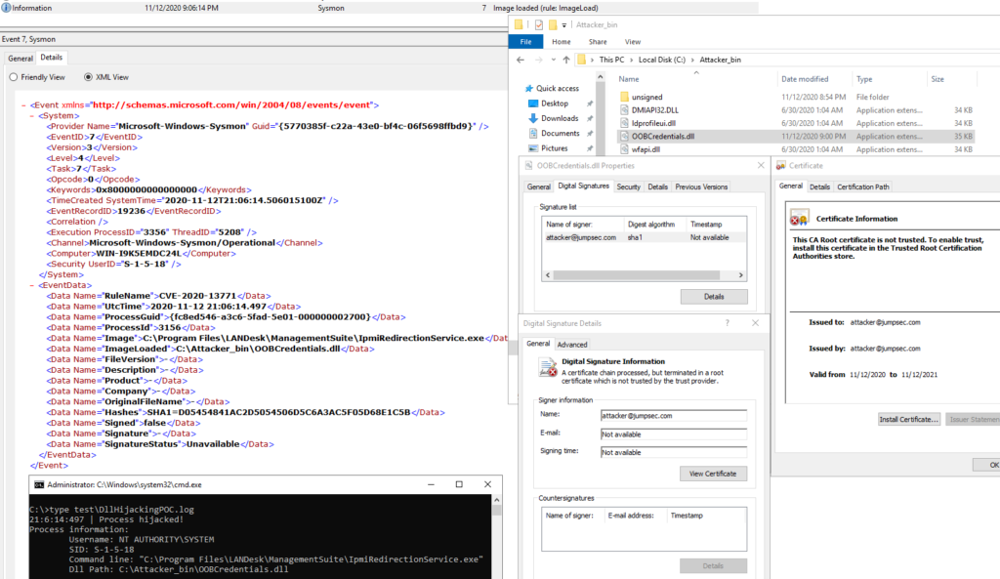
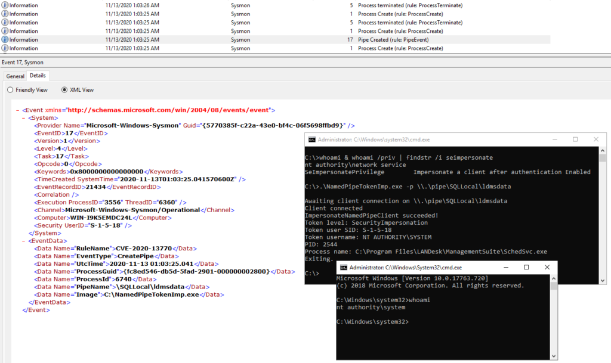

Background

Recently we posted a bunch of [advisories](https://labs.jumpsec.com/tag/ivanti/) relating to Ivanti Unified Endpoint Manager, a couple of which are for vulnerabilities which can be used to achieve local privilege escalation.

At JUMPSEC, whenever we find a new vulnerability, we like to challenge ourselves to write rules to detect it being exploited. We learn a lot doing this, it’s kind of fun tweaking the exploit to try and evade detection and really challenges us to write good detection rulesets.

Naturally, with the right signatures you can detect future exploitation of an issue, but it’s also fun/scary (delete as appropriate!) to run this on historical data and find out if someone else got there first and the vulnerability has been exploited in the wild already…

We enjoy doing it, we know it is valuable to our clients and we’d love to see more of it being done which is why we’re making an effort to share some detail relating to our recent Ivanti advisories.

Introduction

Because of the high number of components that make up an operating system, attackers with local access have a very wide array of possible ways to interact with the system in malicious ways, even when limited to low privileges. This corresponds to a greater effort required to properly monitor for suspicious behaviour and detect attacks.

In light of the recent vulnerabilities affecting Ivanti Unified Endpoint Manager we want to briefly touch on how it is possible to detect local privilege escalation attack, specifically addressing [CVE-2020-13770](https://labs.jumpsec.com/advisory-cve-2020-13770-ivanti-uem-named-pipe-token-impersonation/) and [CVE-2020-13771](https://labs.jumpsec.com/advisory-cve-2020-13771-ivanti-uem-dll-hijacking/).

You have probably heard of Sysmon already, but in case you have not, it is a handy tool available in the Windows Sysinternals toolsuite which can track, record and store detailed system events. These events can then be viewed within Windows Event Viewer, and are usually collected by SIEM software for aggregation and analysis.

We’re focused on Sysmon in this writeup.

Technical details

In this section we give a brief explanation of the vulnerabilities and an example of Sysmon configuration rules to log exploitation attempts, along with the rationale behind them so you can adapt them to your existing configuration if needed. These will act as a solid first point of detection, and while the events thereby generated will be by themselves a confident indicator for malicious activity, they can be further correlated with other events for even more precise monitoring.

CVE-2020-13771 - DLL search order hijacking

To exploit this vulnerability a local attacker needs to create a malicious DLL library and place it in a particular path on the filesystem. This path is entirely dependent on the host configuration; the vulnerable software relies on Windows' [DLL Search Order for desktop applications](https://docs.microsoft.com/en-us/windows/win32/dlls/dynamic-link-library-search-order#search-order-for-desktop-applications), reported below, for locating and loading a DLL file.

With SafeDllSearchMode enabled:

1. The directory from which the application loaded.
2. The system directory. This is usually C:\\Windows\\System32\\ and/or C:\\Windows\\SysWow64\\ depending on the OS and process architecture.
3. The 16-bit system directory. This is usually C:\\Windows\\System\\
4. The Windows directory. This is usually C:\\Windows
5. The process' current directory.
6. The directories that are listed in the PATH environment variable. Note that this does not include the per-application path specified by the App Paths registry key. The App Paths key is not used when computing the DLL search path.

With SafeDllSearchMode disabled:

1. The directory from which the application loaded.
2. The process' current directory.
3. The system directory. This is usually C:\\Windows\\System32\\ and/or C:\\Windows\\SysWow64\\ depending on the OS and process architecture.
4. The 16-bit system directory. This is usually C:\\Windows\\System\\
5. The Windows directory. This is usually C:\\Windows
6. The directories that are listed in the PATH environment variable. Note that this does not include the per-application path specified by the App Paths registry key. The App Paths key is not used when computing the DLL search path.

SafeDllSearchMode is essentially a setting, enabled by default, which places the process' current directory later in the search order to try mitigate this type of vulnerabilities. Its value can be set to 1 (enabled) or 0 (disabled) in the following registry key:

```
HKEY_LOCAL_MACHINE\System\CurrentControlSet\Control\Session Manager\SafeDllSearchMode
```

In both circumstances the OS will look for a DLL file in the directories listed in the PATH environment variable, in the order as they appear, in case the library has not been not found yet. This variable needs particular attention, as it is easy to end up with directories writable by Everyone; moreover many software installers will silently append their directories to it.

If a local attacker - or a remote one with an arbitrary filesystem write primitive - is able to place the malicious library in one of these paths, taking precedence over the path where the legitimate library is found - or regardless of precedence, if the legitimate library is not found at all - the file will be loaded by the vulnerable process, which will execute its DllMain function in its own context.

Going back to the Ivanti Unified Endpoint Manager instance, the DLL files referenced in the advisory are not found by the processes, leaving the attacker a handful of possible paths to place his implant.

To log exploitation attempts we can instruct Sysmon to record ImageLoad events; as the DLL file needs to have the precise filename the process is looking for, or else it will not be loaded, the filename is a good attribute to set filters on. Since legitimate libraries usually are signed by the software vendor or publisher, we can filter on this criteria to only log unsigned or untrusted images. The following rules will record library loading events on any process for all unsigned/untrusted libraries with these specific filenames, found anywhere in the filesystem:

```
<Sysmon schemaversion="4.22">
    <EventFiltering>
        <RuleGroup name="CVE-2020-13771" groupRelation="and">
            <ImageLoad onmatch="include">
                <!-- Only log unsigned / invalid signature images -->
                <SignatureStatus condition="is not">Valid</SignatureStatus>
                <!-- Only log these images -->
                <ImageLoaded condition="image">ldprofileui.dll</ImageLoaded>
                <ImageLoaded condition="image">wfapi.dll</ImageLoaded>
                <ImageLoaded condition="image">DMIAPI32.DLL</ImageLoaded>
                <ImageLoaded condition="image">logonsrv.dll</ImageLoaded>
                <ImageLoaded condition="image">ldprofileui.dll</ImageLoaded>
                <ImageLoaded condition="image">OOBCredentials.dll</ImageLoaded>
            </ImageLoad>
        </RuleGroup>
    </EventFiltering>
</Sysmon>
```

<figure>



<figcaption>

DLL Hijacking event captured by Sysmon. The image will show up as unsigned if the certificate is not trusted.

</figcaption>

</figure>

CVE-2020-13770 - Named pipe token impersonation

This vulnerability is another classic in privilege escalation techniques; in fact, it is one of the methods meterpreter attempts when one runs "getsystem". The issue takes place when a process opens a named pipe object without explicitly specifying proper security attributes. These security attributes can be specified when calling [CreateFile](https://docs.microsoft.com/en-us/windows/win32/api/fileapi/nf-fileapi-createfilea) on the "dwFlagsAndAttributes" parameter; among them, the following two are interesting from an attacker's perspective:

- SECURITY\_DELEGATION - Impersonates a client at the Delegation impersonation level.
- SECURITY\_IMPERSONATION - Impersonate a client at the impersonation level. This is the default behavior if no other flags are specified along with the SECURITY\_SQOS\_PRESENT flag.

The first effectively allows for impersonation on remote hosts, while the second only allows that to happen locally. The problem relies on the fact that "SECURITY\_IMPERSONATION" is the default value when no other attribute is specified, or when the "SECURITY\_SQOS\_PRESENT" flag is not set, which leads to this vulnerability being often introduced unwarily.

Upon opening a named pipe with one of these two security attributes, the server has the access to obtain the client's token and use it during subsequent access checks; in cases where the client has higher privileges than the server, the server would effectively obtain elevation of privileges. Any process can open a new named pipe object, granted that one with the same name does not already exist, although the impersonation process requires the server process to hold the SeImpersonatePrivilege privilege. By default this is assigned to service users, such as "nt authority\\network service".

A further requirement for the privilege escalation process is that the client must write some data to the named pipe before the impersonation process can take place. It is therefore possible for a process to open the pipe with insecure security attributes but not be exploitable to achieve EoP.

With regards to detecting exploitation on Unified Endpoint Manager, having identified on which named pipe object the impersonation takes place, pipe creation events can be filtered on their name. Any process other than the legitimate pipe servers can be appended to the exclude rules to be filtered out. Since the pipe is specific to Ivanti software, such a configuration will be effective in giving no false positive. Further events can optionally be correlated to the one targeted here, such as process creations or file operation performed by the same process creating the named pipe object. Note that the exclude rule might need to be edited to the reader's version of SQL Server.

```
<Sysmon schemaversion="4.22">
    <EventFiltering>
        <RuleGroup name="CVE-2020-13770" groupRelation="and">
            <PipeEvent onmatch="include">
                <!-- Monitor CreatePipe events -->
                <EventType condition="is">CreatePipe</EventType>
                <!-- Only log these named pipes -->
                <PipeName condition="is">\SQLLocal\ldmsdata</PipeName>
            </PipeEvent>
            <PipeEvent onmatch="exclude">
                <!-- Only log if the pipe is not created by these (legitimate) processes -->
                <Image condition="is">C:\Program Files\Microsoft SQL Server\MSSQL13.LDMSDATA\MSSQL\Binn\sqlservr.exe</Image>
            </PipeEvent>
        </RuleGroup>
    </EventFiltering>
</Sysmon>
```

<figure>



<figcaption>

CreatePipe event captured by Sysmon.

</figcaption>

</figure>
