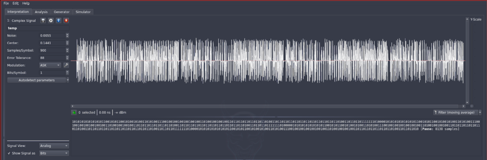
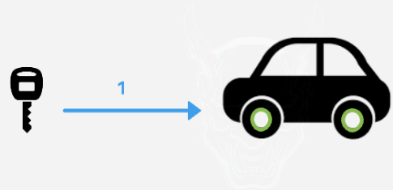
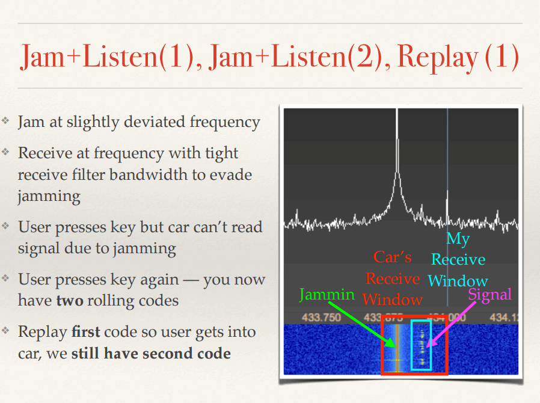
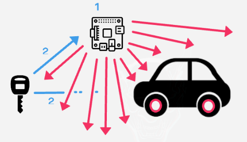
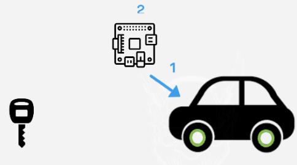
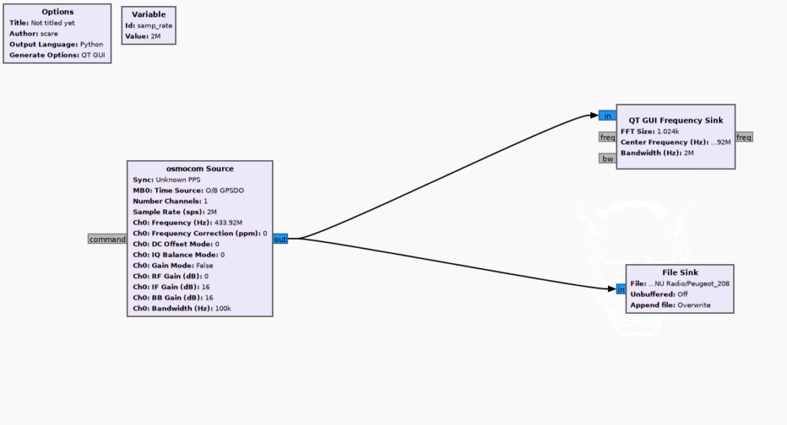
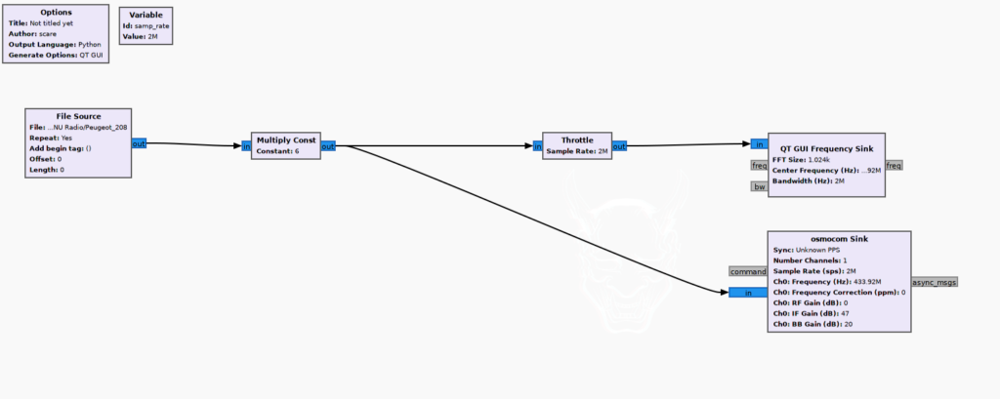
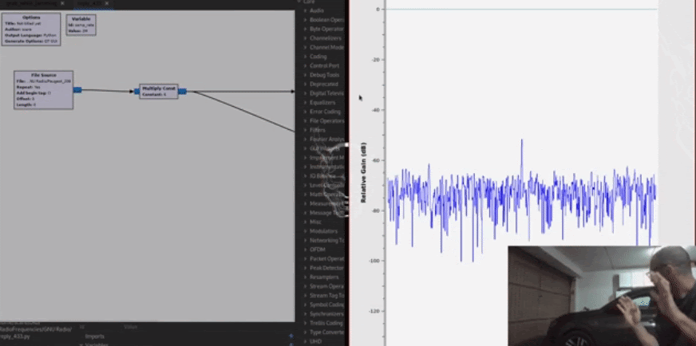

# Introduction

I recently researched modern algorithms used by keyfobs to open cars. Since most of the blogs online talking about the topic are unfortunately quite old and in general and do not precisely describe the exact path followed in detail, nor the code used. I thought that talking about my experience could be interesting and inspiring for other researchers.

I won’t go in depth on certain topics and I will assume that the reader has a general background in basic signals theory and is comfortable with terms like radio frequencies, gain, filters…

All the scripts used to reproduce the attack are downloadable at the following link:

[**Github.com: Rolling\_Code\_Bypass**](https://github.com/0x5c4r3/Rolling_Code_Bypass)

**NOTE**: This thread is the first part of a research that focuses on finding a way to automatically bypass car mechanisms implementing different algorithms. Following posts will be shared during the next few months.

**DISCLAIMER**: All the information provided on this post is for educational purposes only. JUMPSEC is no way responsible for any misuse of the information.

# Background

## Algorithms

Two are the main algorithms used to send opening signals to cars:

\- **Single code**: The keyfob always sends the same code to the car that accepts it and opens. This is an old implementation used by cars manufactured until ~2002. This legacy implementation lacks basic security since whoever intercepts the signal is able to use it to open the car (known as a replay attack). Surprisingly, in my experience, I still found modern cars implementing such algorithms. 

\- **Rolling code**: The keyfob uses an array of codes, each of which is only usable once. This much safer implementation that protects against replay attacks and is mostly used in modern cars, the most recent version will be our main focus for this research. \[2\]

# My Path

## Tools Used

In order to detect Radio frequencies from a computer, there’s the need to use radio peripherals capable of converting radio signals from analog to digital . In my experience, I tried to use all of the most well known ones, to then choose which is the best for transmitting, receiving and jamming (see section 3.3).

My choices have been the following:

\- **HackRF**: Best device for RFHacking so far. Wide range of frequencies handled, versatile, easy to use, quite a lot of documentation online. It’s been the most used hardware device for the entire research. \[3\]

\- **Yard Stick One**: Not much documentation online, I personally did not like the way it’s implemented with the RFcat firmware loaded. I ended up using it only for jamming. \[4\]

\- **RTL SDR**: Only able to receive signals. I’m not happy about this piece, it gets overheated very often until there’s the need to unplug it and wait for it to cool down. I used it initially to track signals, but once I started testing with the HackRF, there has not been the need to use it anymore.

## First Test: Replay Attack

To start playing around with radio frequencies, I bought a cheap radio doorbell - made of a transmitter (an actual button to stick out of the doorstep) and a couple of receivers that ring when the doorbell is clicked, then I started playing around with that. Since doorbells are quite cheap and do not need an enhanced security, they implement a basic single code algorithm, useful for testing.

With that in mind, the first step was to see the signal sent from the remote doorbell using HackRF and _gqrx_, a tool that visualises radio frequencies. Once the frequency and other settings have been set up, I observed the output shown in Figure 1.


_Figure 1 - gqrx tracking the signal of the doorbell when the button is clicked._

Note that usually the real frequency can be slightly moved from the one detected, depending also on the temperature of the room. From the specs, we know that the doorbell works at 433.92 MHz.

Once visualized, I tried to dump the data the doorbell is sending.



_Figure 2 - Universal Radio Hacker (urh) \[6\] showing the recorded signal as a waveform._

 If carefully analyzed, we can see that the waveform is actually containing 4 equal repeated signals. Below the waveform, the software is able to convert the signal to bytes. This happens through the specified modulation (in the picture on the left, Amplitude-shift keying, aka ASK). The problem with approaching modulations is that since it can totally change the output code, we should know which type the signal is using and that is often not specified.

To bypass that problem, I chose to work at Signal level, modifying the actual signal and not dealing with the output code.

Once I recorded the signal, I cropped it to a single repetition and transmitted it through the HackRF, making the doorbell receiver ring and proving that the path followed was right.

# Rolling Code Bypass Theory

Since hacking into a doorbell was not as satisfying as I expected, I tried to raise the level of the research to Rolling codes, trying first to understand the exact process needed.

The methodology I am going to describe requires both some exploitation techniques and a little bit of social engineering.

The  basic “Rolljam Attack” - that’s how various blogs online call it - is based on forcing the victim to send 2 (instead of 1) opening signals, intercepting them in a way that the owner of the car will not notice that one of the two codes has been stolen and is ready to be used. Also, the attacker needs to be close enough to the car so that the signal can be both sent and received.



_Figure 3 - Basic functionality of a general Keyfob._

The key of such attack is **Jamming**, sending a strong signal that blocks the car receiver from detecting the message sent from the keyfob.

Since the frequency of a signal depends on different factors, some of which are casual - like the temperature - the receiver has a range of accepted frequencies, also called bandwidth.

The Jamming signal must be sent within the car’s receiving window (or bandwidth), at a slightly moved frequency from the one used from the keyfob.



_Figure 4 - A representation of a Rolling Code Bypass attack, showing the jamming frequency within the car receiving window._

The tricky part of the attack is that, while jamming, the attacker has to be able to detect and filter the signal sent by the owner of the car trying to open his vehicle. If the attacker is able to do so, the rest of the path is just a matter of implementation.

Looking at Figure 4, we can clearly see all the signals we are dealing with: the **Jamming** signal (Green), slightly moved from the actual frequency used from the **keyfob** (Pink), both within the car receiving window (Red).


_Figure 5 - A device jamming and storing the first code simultaneously._

Once the first code has been stored from the device used by the attacker (that usually is a computer with some radio dongles) and not received by the car because of the jamming, the owner of the car will think that the car did not received the signal because of other reasons and will try to open it again. While clicking the button the second time, the device will store the second signal, stop jamming and send the first signal in a matter of milliseconds.



_Figure 6 - A device jamming and storing the second code simultaneously._



_Figure 7 - A device sending the 1st code received, opening the car._

The car will receive the 1st signal from the device and open and the owner will think that now everything worked properly, but the reality is that the attacker will still own the 2nd code able to open the car.

# Implementation

In this example, I will explain how I hacked into a Peugeot 208 from 2020 that implements rolling code. Since the key to the rolling code attack and the most difficult part of its bypass is the ability to jam and record at the same time, I will focus on the explanation of such functionality, skipping the rest of the process since it is only a matter of implementation and it is easily replicable.

Note that the car and keyfob communicate at a frequency of 433.92 MHz.

After several tests and implementations that ended up being not functional, I reached a proper one using the Yard Stick One to jam and the HackRF to deal with the unlocking signals sent from the keyfobs.

Here’s the really simple Python3 script I wrote to jam the signal:

```python
from rflib import *

d = RfCat()
d.setFreq(433800000)
d.setMdmModulation(MOD_ASK_OOK)
d.setMdmDRate(4800)
print("Starting")
while(1):
	d.RFxmit(b"\x17\x17\x17\x17\x17\x17\x17\x00\x00\x00\x00\x00\x00"*10)
```

As you can see from the script, the jamming frequency is set at 433.80 MHz, exactly 120 kHz below the frequency used by the keyfob but still in the range accepted by the car.

Once the script is run, the car won’t be able to receive other signals and will keep being closed even if the owner clicks the opening button.

Meanwhile we are jamming, we need to use a tool able to both record and send signals from my laptop. I personally found _GNU Radio_ the best tool to do so, and I wrote two scripts, one to record and the other one to replay the signal recorded.



_Figure 8 - 1st script used to save the signal received in a file._

The first script is made of a _osmocom_ \[5\] Source block that is set to work with the HackRF, recording a signal at a central frequency of 433.92MHz with a bandwidth of 100 kHz. The bandwidth setting will allow the HackRF to cut out the jamming signal, cleaning it and recording only the part we need (the actual keyfob opening signal). It will then send it to a live GUI that will show us the peaks in the frequency spectrum and save it to a file called _Peugeot\_208_.

All of these must happen while the Python3 jamming script represented in the portion of code above keeps running.



_Figure 9 - 2nd script used to replay the signal previously saved._

Once the python script has been interrupted, the second script will grab the _Peugeot 208_ file with the filtered signal in it, multiply it and send it to both a GUI and to the HackRF, which will transmit it to the car.

And here’s the magic:



The car will receive the signal and open.

## References

\[1\] [https://en.wikipedia.org/wiki/Remote\_keyless\_system](https://en.wikipedia.org/wiki/Remote_keyless_system)

\[2\] [https://en.wikipedia.org/wiki/Rolling\_code](https://en.wikipedia.org/wiki/Rolling_code)

\[3\] [https://greatscottgadgets.com/hackrf/one/](https://greatscottgadgets.com/hackrf/one/)

\[4\] [https://greatscottgadgets.com/yardstickone/](https://greatscottgadgets.com/yardstickone/)

\[5\] [https://osmocom.org/](https://osmocom.org/)

\[6\] [https://github.com/jopohl/urh](https://github.com/jopohl/urh)

\[7\] [https://gqrx.dk/](https://gqrx.dk/)
