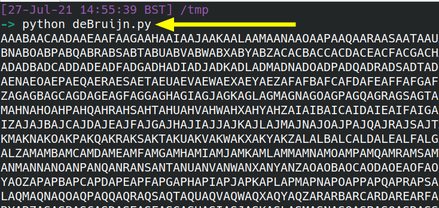

## **_The censored text cracking tool_**

By Caleb Herbert

In this post, Caleb explores **Depix** and its potential to recover sensitive text from reports that were redacted by the original authors. You can use our guidance to enter the challenge and test your GPU’s mettle against the gauntlet we’ve thrown down!

# **1\. What is Depix and how is it used?**

When sensitive information is about to be displayed to a reader, an author may **blur the sensitive text** so it can no longer be recognised. **Blurring** is intended to be used to redact text **FOREVER**… but I think that isn’t true anymore. We have some tooling that can unblur that text, and uncover quite interesting things that the original authors would have rather we didn't know.

This [fascinating Twitter exchange](https://twitter.com/nieldk/status/1416659174759469057?s=20) offers the perfect example of how the **Depix** tool could be deployed to steal redacted, sensitive credit card information?!

- 
- 

# **2.What is Depix and what can it do?**

[Depix is a Python program](https://github.com/beurtschipper/Depix) designed to recover censored text to a readable format via a simple command. _Sounds too good to be true right?_ In this post, we’ll be evaluating how effective Depix is at defeating obfuscation.

The Depix tool assumes that all text positioning of all characters is done at pixel level. Pixelation is an author’s attempt to redact and obfuscate specific chunks of text they consider to be sensitive. For example, a test report may pixelate and blur a user’s password that the tester had been able to recover. As a high-level overview, leveraging pixelation-as-redaction lowers the resolution and quality of an image to undermine its readability.

A big caveat to Depix’s use-case is that it **relies on the redaction tool operating in a specific way**: the text must have been pixelated with a linear box filter, since it processes every block separately. What this means is that the tool takes a quadrant of the pixels and overwrites them based on specific averages of those collected pixels. If you have obfuscated your sensitive text by using a **nice thick, opaque box** then you don’t have anything to worry about….but if you used pixelation as obfuscation, then **you may have 99 problems and de-obfuscation is one**.


## 2.1 Reversing pixelation

Given that the _algorithm_ that Depix un-pixelates the text follows a specific ‘recipe’, it may not always be effective.

Depix deploys almost a **brute force** method to recover the original text. It takes all printable characters and then begins to pixelate these characters in different combinations. This brute force is compared with the original, blurred text and continues until the same pixelated, numeric value can be replicated.

## 2.2 Why is there a concern? 

Depix **_could_** have a serious impact on the existing archive of documents and videos that exist across the internet.


The possibility of this tool means any files which have been redacted and publicly disclosed, or YouTube videos which have passwords/texts or IPs redacted can be recovered and stolen. If malicious actors, organisation competitors, or even script kiddies got their hands on this, the censored private information would be at serious risk. 

They would only need to screenshot/download the files or images and run Depix against it. Granted, they’d have to have used a specific set of tools to censor the text but if so, the risk remains. 

# **3\. Depix in action**

We’ve teased you enough, let’s see this tool in action!

We’re going to do this twice. The **first time** we’ll be using the author’s practice example, to ensure the tooling works as expected. The **second time** we’ll conjure up our own redacted, pixelated image and see how well the tooling still recovers the original text. 

## **3.1 Setup Depix**

Go to the [Github repo for Depix](https://github.com/beurtschipper/Depix), and download the .ZIP that contains all of the tooling. Extract the .ZIP in a directory you are happy with.

You’ll want to traverse to two directories down (/Depix-main/Depix-main) and then install the requirements that Depix requires to work


## 3.2 Test images

There are two important directories we’ll need for this experiment: /**testimages/** and /**searchimages**/ 

- The test image directory includes censored text which you can practice recovering. 
- The search image directory includes images which are used like a dictionary to recover pixelated text. The image includes all upper- and lower-case alphanumeric letters with and without spaces for testing purposes. 


Close up, the above image looks like this - a collection of printable characters. 


### 3.2.1 De Bruijn sequence 

Interestingly, the above image can actually be re-created fresh on your own local machine. You don’t have to do this, as a sequence is already provided for you. However, it is interesting to see how it is produced.

In the ether of the internet, there is this orphaned [script](https://gist.github.com/rgov/891712#file-debruijn-py-L16) that will produce the sequence of printable characters necessary to also use **Depix.**




## 3.3 Test recovery

To recover redacted text there are specific methods, depending on the tools that obfuscated the original text. This is a **significant limitation** that the original author recognises, however we’ll put that aside for now and come back to it later. 

If **Notepad** is used and pixelated with **Greenshot** we need the following command: 

```python
python3 depix.py -p images/testimages/testimage3_pixels.png -s images/searchimages/debruinseq_notepad_Windows10_closeAndSpaced.png -o images/output.png
```

The command specifies the Path to the Pixelated Image (-p), Path to the Search Image (-s) and Path to Output (-o). 

If **sublime** text editor is used and pixelated with **Gimp**, this command is used: 

```python
python3 depix.py -p images/testimages/sublime_screenshot_pixels_gimp.png -s images/searchimages/debruin_sublime_Linux_small.png --backgroundcolor 40,41,35 --averagetype linear 
```

The _backgroundcolour_ option filters out the coloured background of the editor and specifies the linear _averagetype_ as that’s the default averaging within Gimp. 

### 3.3.1 Example

This **example** leverages the first instance of Notepad & Greenshot. 

In the image below, we see that depix begins brute forcing the images for a match.

> Remember, it isn’t actually attacking the **pixelated image**. Rather, it leverages the De Bruijn image (with all the printable characters) to generate combinations of letters that can be pixelated to match the **obfuscated image.** 


Depending on the size of the redacted image this can take a while. We used the author’s original, example image. As this was the ‘ideal’ condition to operate under, the brute force took around 60-90 seconds to complete! 


## **3.4 Results** 

This was the censored file we tested against - not a very pretty sight, but very redacted nonetheless. 


This obfuscated image was fed into **Depix.** These are the results from the brute force.


Although the results aren’t perfect. We are still able to interpret the results. For reference, the original message said, “_Hello from the other side.”_ 

Not bad. _It’s pretty good_

<figure>


<figcaption>

We're 10 layers deep in meme culture with this one

</figcaption>

</figure>

# **4\. Re-creating the test** 

In our example we were operating under **ideal conditions.** As we know, in the real world, nefarious activities hardly ever take place under ideal conditions!

Let’s **recreate the experiment**. This time, it will be original content, not the author’s supplied example: **we’ll create our own text, obfuscate it, and try to brute force it.**

## 4.1 Setup part two

We opened **Notepad** on our Windows machine. We added the shameless plug text we wanted to redact:


In order to **pixelate** this text, I used Depix’s example obfuscator: **genpixed.py** I was able to redact the text inside the image. Greenshot would be useful if only key words were redacted but to show it’s capability I redacted the whole thing: 

```python
python genpixed.py -i Capture.PNG -o Capture1.PNG
```

with -i being the input image and -o being the output image.

## 4.2  A disappointing recovery

To then **recover** this **obfuscated** text, we ran this big old one-liner:

```python
python depix.py -p Capture1.png -s images/searchimages/debruinseq_notepad_Windows10_closeAndSpace d.png -o images/output1.png
```

After around **45/50 minutes**, Depix finally had a returned output… unfortunately it **failed to** **recover the pixelated text.** 


We wondered if this was due to the length of the text we offered Depix. So we re-created this experiment with "Hello World". The results still did not yield success.

- 
- 

This could be due to a number of reasons:

- Minor issues in the pixel layout
- The character font is different
- A faulty De Bruijn image is leveraged for the dictionary attack
- Or good old human error

Regardless, one or more of these issues frustrated Depix and it failed to depixelate our original content. **Whereas I’m sure it has a strong potential in the future, It currently has a  limited scope of what it can return.**

# 5\. Reviewing Depix

Depix’s python program was straightforward to use. Under the ideal demo example conditions, the results were impressive considering how pixelated the sample was beforehand. But it wasn’t perfect and failed to work for our real-life original content, though we gave some reasons why that could be the case.

In addition, Depix isn’t the answer to deobfuscating all pixelated text. There are only a couple of situations where it works. If the pixelation scale or cell size was different, the results would return nothing. If the pixelation was done with a tool other than the supported ones, it simply does not work. Moreover, you’d have to arbitrarily know or guess the specific tools used and hope that the Depix tool would work at de-obfuscating them. In the author’s Github, they recognise this current limitation. 

> **The Depix tool poses minimal risk to security at present, as it requires specific criteria to be met to be effective.**

For now, however, there is a small chance that users can depixelate images, so it’s recommended to use a **full box at full opacity** to redact files. 

<figure>


<figcaption>

You can pick a less offensive colour of course

</figcaption>

</figure>

# **5\. Challenge**

If you fancy having a go at this yourself, and your GPU is beefy enough for the Herculean challenge, we’d love for you to have a go at de-obfuscating this image. If you crack the code, @ us on Twitter and we’ll **organise for something interesting to be delivered to you**. 


If you do use Depix (even outside of our challenge), we would be interested to hear about your experience. **Let us know on twitter:** [**@JumpsecLabs**](https://twitter.com/jumpseclabs?lang=en) 

**Caleb Herbert** is a Red Team Researcher @ JUMPSEC
