**[By Dray Agha](https://twitter.com/Purp1eW0lf)**


The Windows registry is a vast and complex topic and cannot be understood and defended in one article. One particular area of interest from a security perspective is registry run keys. In this article, we discuss who uses run keys, how to uncover abuse, and how to eradicate evil from them. 

## An Introduction to Run Keys

**_What are registry run keys?_** Run keys are an obscure mechanism of the registry to execute something on a Windows system when a user logs in or the machine boots up. 

A number of advanced adversaries have abused run keys due to their problematic nature. For example, [**Fancy Bear**](https://securelist.com/sofacy-apt-hits-high-profile-targets-with-updated-toolset/72924/) (also known as [**APT28**](https://download.bitdefender.com/resources/media/materials/white-papers/en/Bitdefender_In-depth_analysis_of_APT28%E2%80%93The_Political_Cyber-Espionage.pdf)), [**TA456**](https://www.proofpoint.com/us/blog/threat-insight/i-knew-you-were-trouble-ta456-targets-defense-contractor-alluring-social-media), and [**Group 123**](https://blog.talosintelligence.com/2018/01/korea-in-crosshairs.html) enjoy weaponizing run keys to achieve persistent access to a compromised network. Run keys have housed all manner of malicious content - from simple executables to macro-riddled spreadsheets.

> MITRE ATT&CK® records this particular persistence tactic as the sub-technique [**T1547.001**](https://attack.mitre.org/techniques/T1547/001/)**.** It is not a super common technique for adversarial campaigns, however it can offer ardent persistence - all the more reason for you and I to explore this obscurity further. 

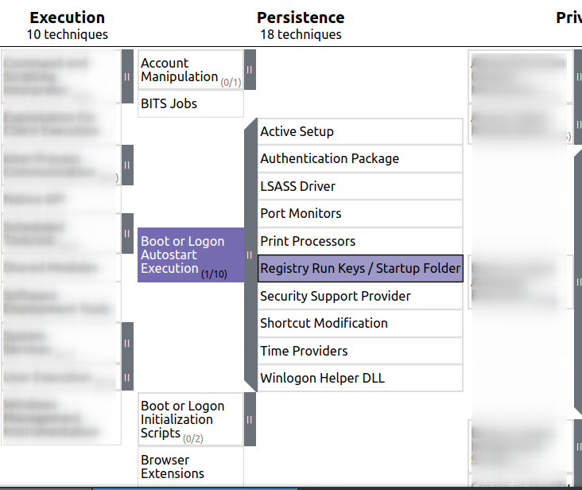

Though advanced attackers abuse run keys on occasion, **I find it is a mechanism that is not discussed widely enough, even though it is quite straightforward to query run keys for evil.** 

The silence on this registry capability isn’t from technical gaps across the infosec community. **Rather, run keys are an unexpected executable component of the ‘config database’ that is the Windows registry.** This means they often don’t get the same level of attention compared to bigger, more well-known attacker techniques and OS components. However, I recently came across this interesting snippet on the infosec social circuit:

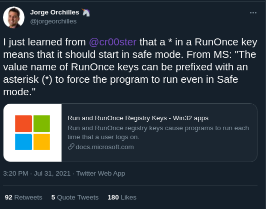

Before we get into how to hunt for malicious run keys, **let’s detour down the Windows registry.** 

## The Windows Registry

The Windows registry is a labyrinthine place. On the surface it presents itself as a [**centralised database**](https://docs.microsoft.com/en-us/troubleshoot/windows-server/performance/windows-registry-advanced-users) to store information pertaining to user and machine settings. **The reality is that it’s more a menagerie of weird and wonderful capabilities** that Microsoft sometimes obscurely document, despite these capabilities possessing devastating potential.

I could spend hours writing about the inconsistencies and capriciousness of the Windows registry. Trying to understand the limits and parameters of its potential is truly maddening. It seems like the byzantine **nature of the registry offers an adversary an unfair advantage** to stash away their persistence mechanisms and skulk outside the network until the Blue Team has averted their gaze. 

Trying to decipher what is benign and what is malevolent in the windows registry can be considered Sisyphean, especially during an incident.

## Run keys

I hope so far I have conveyed just how difficult it is to tame the registry. To make matters worse, run key capabilities are criminally under-documented by Microsoft, who [**devote a mere six paragraphs**](https://docs.microsoft.com/en-us/windows/win32/setupapi/run-and-runonce-registry-keys) to them.

Run keys live in the registry. They are configurable to allow a program to execute when a user logs in or the computer is turned on.  “_But hold on!_”, I hear you angrily cry, “_Windows already has a_ **_Task Scheduler_**, _THAT’S how you schedule tasks!!!_”

Well, not according to our Lord and Saviour Bill Gates. Moreover, run keys have some crucial differences that make comparisons to Windows’ [**Task Scheduler**](https://docs.microsoft.com/en-us/windows/win32/taskschd/task-scheduler-start-page) somewhat limited.

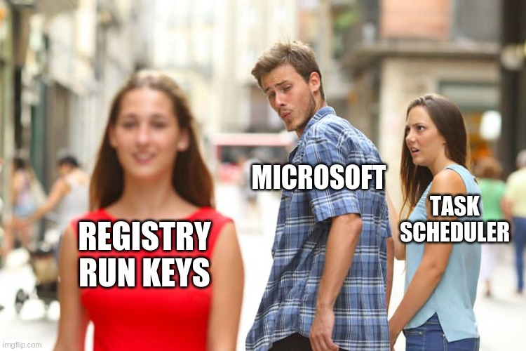

In contrast to Windows Task Scheduler, **registry run keys possess a number of unique characteristics**:

### Character Limitations

**Run keys can only store commands that are less than 280 characters.** So an adversaries’ one-liner must form as few characters as a Tweet. I hope Microsoft didn’t intend for THAT to be a low-tier defence mechanism, as your basic script-kiddie reverse shell will barely cost you 50 characters. 

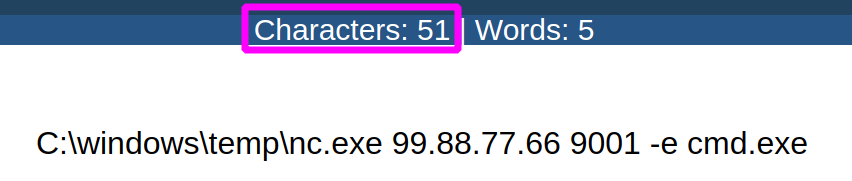

Moreover, compiling your own malicious executable and firing it off via the run keys will cost you very few characters but achieve maximum effect. So whilst the character limitation is unique compared to other system timers, it’s a trivial obstacle. 

### Special Character Behaviour

**Another unique feature of run key considers how special characters change the behaviour of the scheduled command.** Specifically, the **exclamation mark**  ( ! ) and the **asterisk /** **wildcard** ( \* ). By default, the run key wipes itself after execution - whether it fails to execute its task or not. These two special characters can be deployed to alter this behaviour.

If, on your next threat hunting session or incident response, you see this bad boy right here with an exclamation mark, you have encountered a run key that will persist until it has run its allocated command for sure. **If for whatever reason the evil command does not run, the exclamation mark ensures that it will not delete itself until it runs successfully.** 

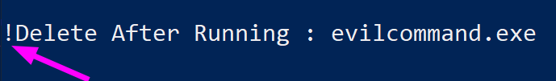

**The prefixed exclamation of a run key can be defeated by booting the computer in Safe Mode.** To ensure that a run key is executed regardless of boot mode, **an adversary can leverage an asterisk / wildcard which forces the command to run.** 

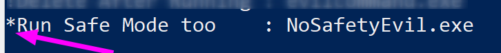

Run keys are configured to wipe themselves after running, by default, which means that unless your logging and detection is sharp, these kinds of malicious activities could go by unnoticed, unless you go through the painstaking  process of forensically recovering the image of the machine

# Hunting Run Keys


Is this your face right now? This was my face when I first encountered run keys. This may actually be my face all the time, to be honest. _#blueteamproblems_

Although run keys may seem complicated and obscure, **I promise you they are anything but.** They are wonderfully easy to query and monitor, and they show up fabulously in a SIEM when an adversary manipulates their values. **Let’s prove it together.**

## Finding Run Keys

There are a number of places where malicious run keys can be deployed. We’re just going to focus on the top four locations, but if you read some [**red team documentation**](https://dmcxblue.gitbook.io/red-team-notes/persistence/registry-keys-startup-folder) you’ll find some more registry locations to deploy run key persistence. 

Anyway, in the Windows registry, if you look under HKey Local Machine and Current User, and traverse a couple of directories, you’ll find **Run** and **RunOnce.** 

```powershell
"HKLM:\Software\Microsoft\Windows\CurrentVersion\Run"
"HKCU:\Software\Microsoft\Windows\CurrentVersion\Run"
"HKLM:\Software\Microsoft\Windows\CurrentVersion\RunOnce"
"HKCU:\Software\Microsoft\Windows\CurrentVersion\RunOnce"
```

**The directories are important here.** The behaviour of the run key is contingent on the registry location it is written in: 

- If you see something written in **HKLM:\\** it means this was written as a **high-privileged** user (most likely Admin) or SYSTEM.
    - Run keys written here can **execute when the machine boots up** 
- If you see something something written in **HKCU:\\** it means this was written as just a **normal user**
    - Run keys written here will **only execute when the user logs in**.
- If you see something written to **\\RunOnce** it **will** be removed after execution
- If you see something written in **\\Run** it **will not** be removed after execution
    - These can be complicated by the **special character behaviour** that we already discussed.

## What do Run Keys look like IRL ?

**In real life, you actually have to sift a little bit of the registry’s noise to get to the meat of a run key.** Allow me to share with you two examples, where the first has not been filtered with PowerShell, and the second is enjoying a luxurious yet temporal life as filtered PowerShell.

Look at this mess. What even is this? **We don’t even need the stuff highlighted in the red box, it’s just noise.** We know this is the ‘HKLM’ Drive and ‘Run’ ChildName…...we know that because we are the ones who traversed here! Honestly…

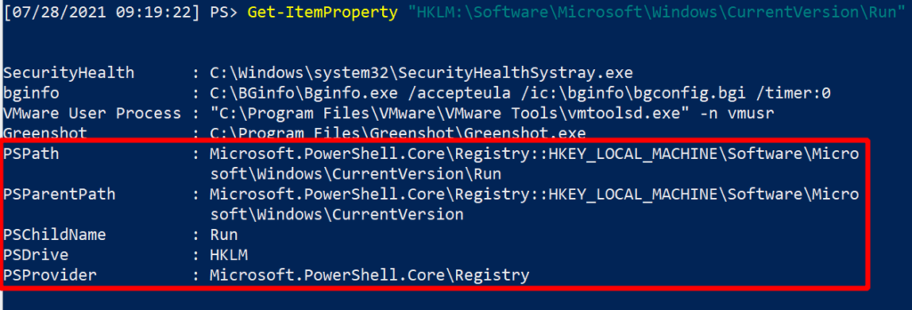

Let’s filter out the noise with some PowerShell:

```powershell
Get-ItemProperty "HKLM:\Software\Microsoft\Windows\CurrentVersion\Run" | select -property * -exclude PS* | fl
```

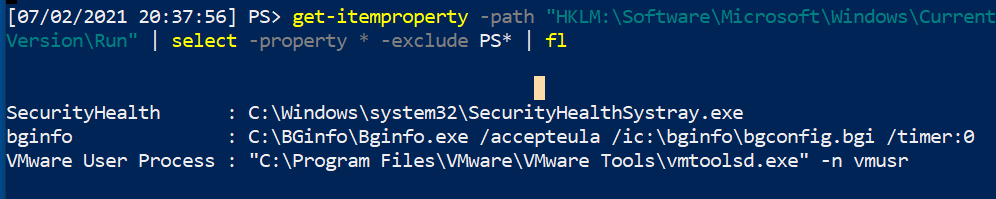

Look at how superior this is. Imagine running this glorious filtered-one-liner, and getting thousands of endpoints returning information in this kind of clear, noise-free way; the stuff Blue Team dreams are made of. **This kind of filtered PowerShell is fantastically suited to be run enterprise-wide to identify anomalies beyond the standard builds across your network.** 

If you look in the run keys, you'll find the entries’ name and accompanying commands _(name: command)._ The legitimate contents of the run keys can vary and it’s your task to understand what is normal in your enterprise, as this will allow abnormal inconsistencies to stand out. 

As you hunt, you may want to filter out legitimate startup items in the registry runkeys. This is easily done. Using the same PowerShell as above, we can use the \`-exclude\` flag which already removes \`PS\*\`. Just add a comma, and remove the other run key names that you don’t want to see. 

```powershell
Get-ItemProperty "HKLM:\Software\Microsoft\Windows\CurrentVersion\Run" | select -property * -exclude PS*, Vmware*,bginfo*  | fl
```

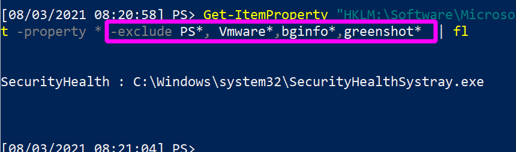

## Malicious Run Keys

Let us emulate some of the adversaries' behaviour. We will insert some malice onto a run key, and then I will show you:

- **First,** how to loop through and find it automatically;

- **Second,** how you eradicate it from the machine without damaging the other legitimate run keys.

Pretend we have pwned a machine, and are looking to maintain persistence. We compile evilcommand.exe, which bypasses all anti-virus known to man and gives us a reverse shell. **We can force one of the run keys to execute our malicious program**:

```powershell
Set-ItemProperty "HKLM:\Software\Microsoft\Windows\CurrentVersion\RunOnce" -Name '!Delete After Running' -Value "evilcommand.exe"
```

- If you append \`-whatif\` to the end of a lot of powershell one-liners, it will not actually run your command. Instead, it will show you what the effect COULD be if you ran it. 

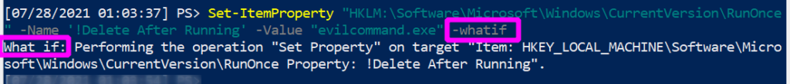

- When you want to really run something, tag on \`-verbose\` so you can get confirmation that the PowerShell you expected has taken effect.

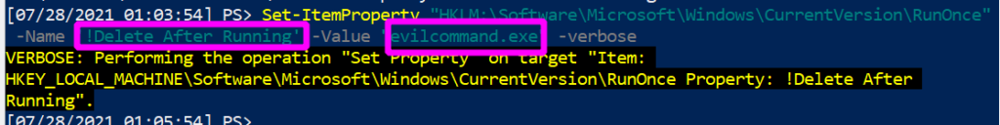

Without all of the noise, this is what we have forcibly co-opted the run key to do for us: we have created a run key named “**Delete\_After\_Running**”, whose execution **value** will be “**evilcommand.exe**”. Notice the **exclamation point**, which as we have discussed will ensure the program will run before it self-deletes, guaranteeing our successful re-entry to this compromised machine.


**The Task Scheduler is oblivious to this**. It does not and cannot recognise that this run key task has been scheduled. If I were Microsoft, I’d probably include that functionality in Task Scheduler…

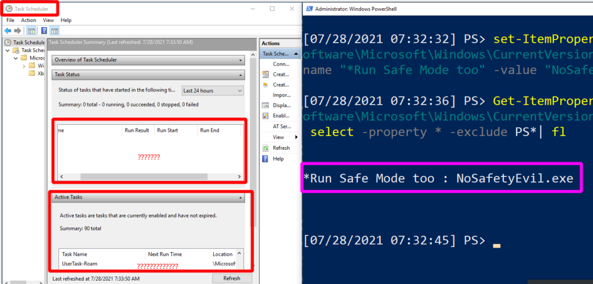

## Finding Run Key evil

**A quick Powershell ‘for loop’ can collect the contents of these four registry locations.** 

When drafting this script, I (and now you, too) made life easier by ensuring the code produced output that was **pre-filtered and added colours**. This will make our task that bit easier to determine **IF** something **abnormal** (read: evil) exists and **WHERE** it exists.

```powershell
$items = @("HKLM:\Software\Microsoft\Windows\CurrentVersion\Run","HKCU:\Software\Microsoft\Windows\CurrentVersion\Run","HKLM:\Software\Microsoft\Windows\CurrentVersion\RunOnce","HKCU:\Software\Microsoft\Windows\CurrentVersion\RunOnce");

foreach ($item in $items) {
	write-host "----Reg location is $item----" -ForegroundColor Magenta; 
	get-itemproperty -path "$item"  | select -property * -exclude PS* | fl
}
```

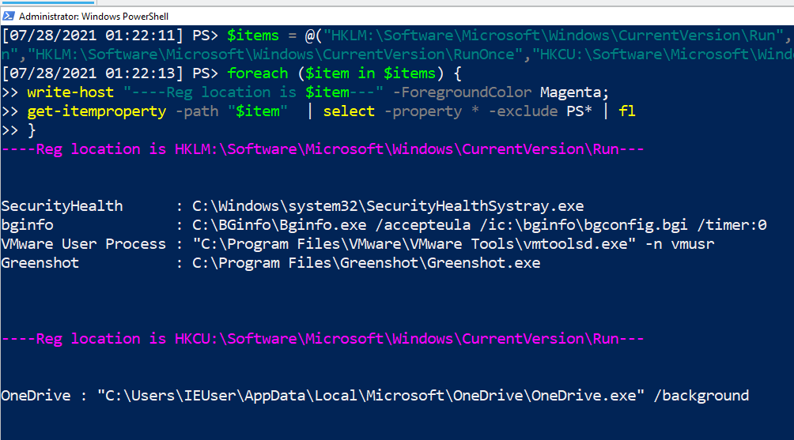

And if we look hard enough, **we identify something abnormal**. Once we take the executable and reverse engineer it, we can determine it is a malicious executable from the adversary. 

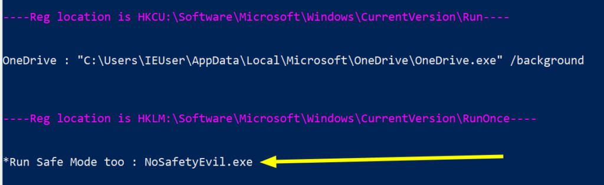

If you identify a malicious run key, you are of course obliged to remove it from the machine. Let’s discuss how in a moment, **after we discuss what this evil looks like from a SIEM / SOC perspective.**

## Monitoring for Evil

**Let’s discuss what this looks like from a detection and monitoring perspective.** 

For our example, we are using the built-in **Windows Event Viewer**, and then adding [**Sysmon**](https://docs.microsoft.com/en-us/sysinternals/downloads/sysmon#:~:text=System%20Monitor%20\(Sysmon\)%20is%20a,changes%20to%20file%20creation%20time.) and [**Florian** **Roth’s**](https://github.com/Neo23x0/sysmon-config) config of rules for detection. You could then feed this sysmon log data into a SIEM, and monitor hundreds of thousands of endpoints for run key malice (and other stuff too).

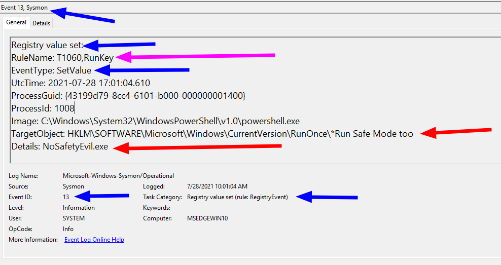

There is a wealth of information here worth considering: 

- The **BLUE** arrows: event info
    - The **Event ID 13 involves registry values** **modification**, and this ID will be consistent in any environment. 
    - The **EventType** and **Task Category** spell out exactly what is happening here too: **a registry value is being set**

- The **RED** arrows**:** specific info
    - The **TargetObject** shows the **full path** for the run key registry we are changing. It also shows the **name** we called it, and includes the special character that modifies the behaviour
    - The **Details** section shows the command / executable the run key is forced to run

- The **PINK** arrow: MITRE ATT&CK reference
    - This may not be in every sysmon config. However **Florian Roth** includes the MITRE ATT&CK tactic number in a particular event.

> **Rather than get attack alerts for every Event 13, I’d recommend you go on a bit of a discovery exercise of what the run keys in your environment normally do.**  
> 
> Across the entire enterprise do they have the same consistent contents? 
> 
> Or does the finance department run software that legitimately alters the run key? 
> 
> Would you be able to baseline this and then create a small alert for any new, inconsistent run key changes to a workstation in the finance department?
> 
> **This has greater value than hoping to catch one rogue Event 13 out of a million.**

### Interactive detection

If you want a more interactive detection experience, might I recommend a tool like [**Dr Michael Cohen’s Velociraptor?**](https://docs.velociraptor.app/). 

Velocitaptor is a tool (and philosophy) that deserves its own article, so I will be brief here. Velociraptor is an endpoint response agent that you can install on every single endpoint across your enterprise, and orchestrate from one server via a web-app. This distributed tool allows us to then query thousands of machines at once. 

Built in to Velociraptor is a hunt that queries every Windows machine specifically for their startup process, and part of this hunt includes [**querying run keys**](https://github.com/Velocidex/velociraptor/blob/master/artifacts/definitions/Windows/Sys/StartupItems.yaml)**.**  As you can see, this hunt targets a number of the registry run keys that our previous PowerShell query also hunted for. Velociraptor targets an additional few run keys, as well as some other startup locations (but I leave that to you to investigate this all further).

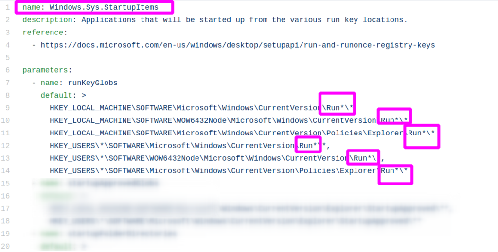

If we fire off this startup detection hunt, we will be given a beautifully formatted table of results. In real production environments, you will find more noise than this so be warned! But look at what we detected - a single machine in our domain currently running **C:\\evil.exe**, shocking stuff. 

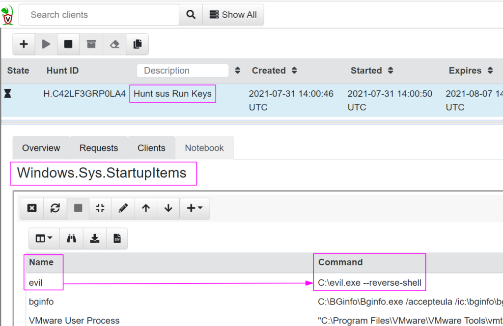

**Fortunately now we know and can eradicate it from the host - I’ll show you how.** 

## Eradicating Run Key Evil

It’s time. 


**Be surgical here.** If you aren’t precise in your commands, you will **accidentally remove** run key entries that are **legitimate**.  It's important you remove with **\-verbose** too and double-check it has gone, to make sure you have removed what you think you have. 

Off the back of our PowerShell for loop, copy and paste the **full path** location that the evil was detected. And double check this is where the malicious run key resides.

```powershell
Get-ItemProperty "HKLM:\Software\Microsoft\Windows\CurrentVersion\RunOnce" | select -property * -exclude PS*| fl
```

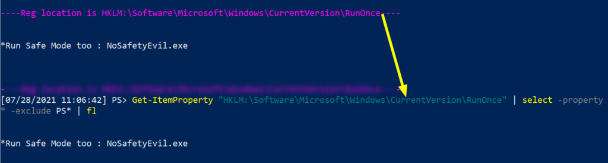

Then pick the EXACT name of the run key entry you want to remove. Copy paste it, include any special characters too please. **Don’t copy** the executable details that come **after the colon** ( : )

```powershell
Remove-ItemProperty -Path "HKLM:\Software\Microsoft\Windows\CurrentVersion\RunOnce" -Name "*Run Safe Mode too" -verbose
```

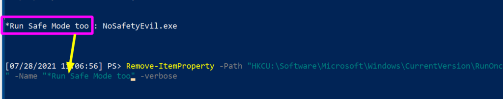

We get our verbose message returned to us confirming that we are indeed removing the run key we think we are.

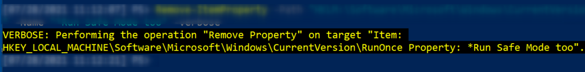

Then check again to be sure it's gone. If you still have the malicious run key here, double check you have copied and pasted appropriately, as fat-fingering paths and registry names are very real problems.

```powershell
Get-ItemProperty "HKLM:\Software\Microsoft\Windows\CurrentVersion\RunOnce" | select -property * -exclude PS*| fl
```

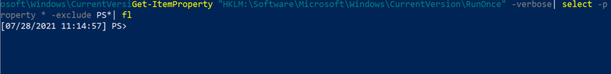

# Unpicking Run Keys

**Run keys are obscure mechanisms of persistence for sure. But I hope this article has instilled confidence in how straightforward it is to monitor, detect, control, and remove any malicious activity involving your run keys.**

As a defender, sometimes our roles are framed as being consistently at a disadvantage compared to the adversary. They can leverage zero-days, they can trick users, they can run across time zones with bigger budgets. **Whilst we must consistently be at the top of our game, they only need to be lucky once.**

**All of this is true, but I find that sometimes we could invert this framing to focus on the advantages we possess compared to the attacker.**

This is **OUR** environment. This is **OUR** registry. And these are **OUR** run keys. We know how it all works, and we should be here waiting for the adversary to so much as sneeze in our domain without us knowing about it. Sure, have a foothold. But we aren’t naive, we expect compromise. And we will catch you, kick you out, and ensure your future attempts at re-entry are that bit harder. 


**Understand what is normal for your environment so you know when a registry run key manipulation is out of place, and foster a hostile network so an adversary can’t move an inch without you knowing about it and containing them.**

There’s a lot to do and never enough time or resource to do it, but that’s why we’re in infosec right? 

## Some Bedside Reading

There are so many other janky registry entries that can do weird things with run keys. We didn’t mention, for example, how entire folders can become mechanisms of persistence via registry run keys! You can read more [**here**](https://www.picussecurity.com/resource/blog/picus-10-critical-mitre-attck-techniques-t1060-registry-run-keys-startup-folder), [**here**](https://dmcxblue.gitbook.io/red-team-notes/persistence/registry-keys-startup-folder), and [**here**](https://attack.mitre.org/techniques/T1547/001/).

If you enjoyed this article or especially if you DIDN’T enjoy this article, give these other ones a go: looking at [**hacking cars**](https://labs.jumpsec.com/car-hacking-manual-bypass-of-modern-rolling-code-implementations/) and breaking their keyfob encryption; evaluating the potential [**de-obfuscate redacted text**](https://labs.jumpsec.com/can-depix-deobfuscate-your-data/) in sensitive documents; and advanced techniques to defend your [**C2's**](https://labs.jumpsec.com/obfuscating-c2-during-a-red-team-engagement/) honour.

Any questions, comments, or criticisms please drop me a line

**[Twitter](https://twitter.com/Purp1eW0lf) [Github](https://github.com/Purp1eW0lf/)**

**Dray Agha,** Security Researcher

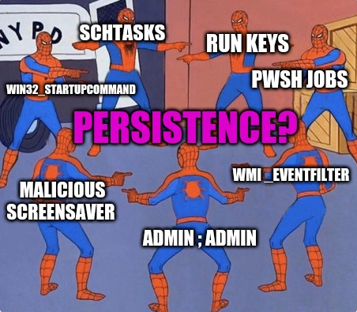
