By [**Muhammet Ali A**](https://twitter.com/hit1t)**[rıtürk](https://twitter.com/hit1t)**

In this article, Muhammet takes us on a deep technical journey to persevere beyond the limitations of the proxy tool Burp Suite, and explore non-HTTP, application-layer protocols using ‘MITM RELAY’.

# Introduction

As an offensive security tester, we often rely on Burp Suite. While an excellent resource when penetration testing, it’s not without limitations, as we explored in our previous article on [**utilising custom python scripts.**](https://labs.jumpsec.com/burp-suite-python-scripter/) 

To get around some particular limitations in a recent case, I used a cool tool called [**MITM\_RELAY**](https://github.com/jrmdev/mitm_relay) which is described as a “hackish way to intercept and modify non-HTTP protocols through Burp & others”. 

This tool allows us to compensate for Burp Suite’s limitations and extend it’s proxying capabilities for protocols beyond HTTP. Let’s explore why this is important when looking to secure an application. 

# Simulating a man-in-the-middle

Imagine **a mobile application**. We’ll call it **Alpaca App.**


It has loads of great features that keep you connected with your favourite Alpaca friends. Besides being cool, the mobile app needs to be **secure** when you’re using it to access the big bad internet. 

Our task in this article is to understand if the app is broadcasting and transferring data securely or insecurely enough for an adversary to **intercept** the traffic. This can also be understood as **man-in-the-middle** (MITM) attack, whereby a malicious (and nosy) actor eavesdrops on the network traffic that a machine is innocently transmitting and steals or manipulates the data for their evil purposes. 

An important tool for MITM research involves **proxying**, which acts as an intermediate between two machines - and can be weaponized for evil purposes. [**Burp Suite**](https://portswigger.net/burp/documentation/desktop/tools/proxy/getting-started) is a staple tool for studying web app and mobile app communications, as it proxies the information between the client and server so we can research exactly how the application works.

Definitions aside, let’s talk about the technical complications for proxying our specific mobile app. Take a big old sip of coffee, and let's get to work.


# The limits of Burp Suite

Burp Suite is able to catch **HTTP** **communications.** This is a specific application-layer protocol. The diagram below shows the process by which Burp Suite proxies communications over HTTP protocol. 

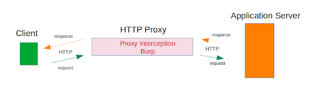

However, Burp Suite is **ONLY** able to proxy this specific protocol. **Unfortunately, Alpaca App doesn’t use HTTP to communicate. It uses XMPP instead.** So what now? 

> The Extensible Messaging and Presence Protocol (XMPP for short) is another application-layer protocol that is some decades old now, and originally went by the name **Jabber.** 

**Thankfully, we can use our new tool to intercept anything we want.** 

# Proxying XMPP traffic using MITM Relay

As mentioned earlier, we are trying to understand whether **Alpaca App is communicating securely.** Because it communicates via XMPP, we need to intercept that traffic and then study it. Let’s explain that again through a diagram: 

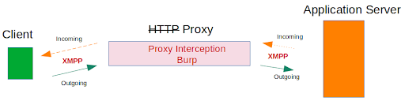

Not bad. So now we have a limited tool (Burp Suite) and we have a tool that can upgrade it (MITM\_RELAY), so let’s get to work combining this so Burp Suite can understand Alpaca App’s XMPP!

> Burp Suite has [**its own extension**](https://portswigger.net/burp/documentation/desktop/tools/extender) for [**XMPP protocol interception**](https://portswigger.net/bappstore/1d0986521ace4b2dbf0b70836efa999d), but I didn’t find this to be as effective as the MITM\_RELAY tool. 
> 
> The Burp XMPP extension would occasionally drop packets, which is obviously not ideal when trying to build a robust picture of the security of the app. The Burp extension, while having some good features, needed quite a bit of tinkering to make it work. 
> 
> In contrast, I found the MITM\_RELAY tool easier to use, but really, you can use anything that you feel comfortable with!

The [**creators**](https://github.com/jrmdev/mitm_relay) of the tool made a nice diagram below about how the tool works, and how to intercept different types of traffic via HTTP (Burp Suite) Proxy.

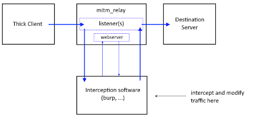

Digging deeper, the relay server has **three** **key** functions:

- **Relay Listener**
    - A **listener** for a specific protocol and a specific source port will **forward** the traffic to our **target IP and target PORT**
- **Packet Wrapper and Unwrapper**
    - This component will wrap all traffic into HTTP form and deliver it to the proxy tool. When the proxy tool forwards the traffic on, it will unwrap the traffic to it’s original protocol)
    - So XMPP --->> HTTP --->> XMPP
- **Echo Web Server**
    - This web server is a required part of this. As we’re sending the request over out proxy tool there will need to be a response after we finish sending the request

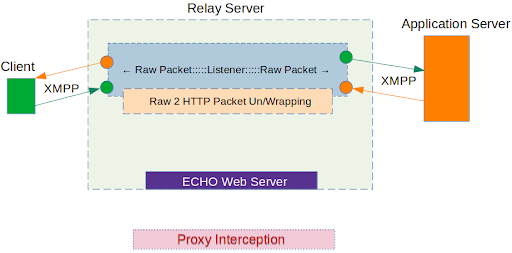

Let’s go through this step by step. Assume our first XMPP packet has left **Alpaca App,** and was intending to reach **Alpaca Inc.’s servers** out in the big internet. 

1\. It will pass through our relay server, be wrapped in HTTP, and sent to the Proxy server (Burp Suite)

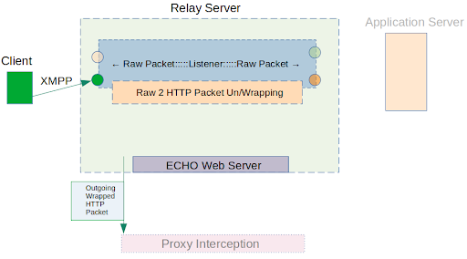

2\. After completing the wrapping-modification of the initial request, we will send it to the **Echo Web server.** This will forward it to the upper level to unwrap it to the original protocol (XMPP) readying it to send to the Alpaca Inc. Server as originally intended:

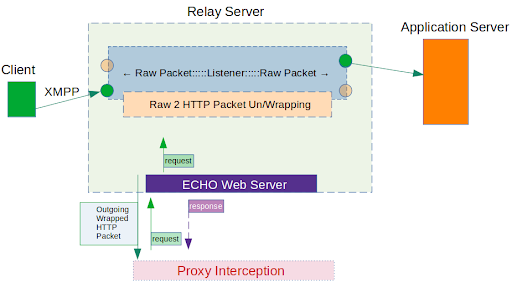

3\. So far we have managed to successfully send Alpaca App’s XMPP traffic to the Alpaca Inc. server, situated on the internet. It is now the Alpaca Inc. server’s turn to answer us. Lets see how that works in return:

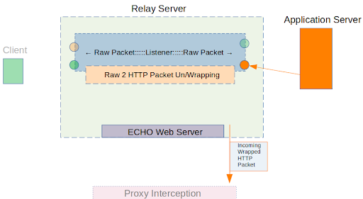

The application server then answers in the Alpaca app. We now have the ability to modify our requests to change the information we receive. 

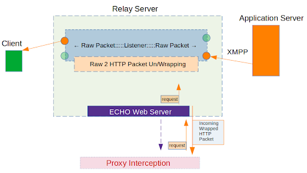

4\. When we are done examining Alpaca Inc.’s server response, we will let the XMPP packet go back to the client-side, (the Alpaca App). The same wrapping, unwrapping, and echo repeating occurs here to deliver the traffic back. 

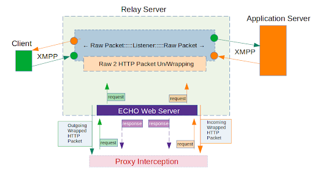

So far, so good? Are you doing alright? Here’s an alpaca meme to lighten things up.


We have followed the process from the first XMPP traffic from Alpaca App on our mobile phone, through our Burp Suite-MITM\_RELAY that wraps it up in HTTP, and then when it unwraps it back to XMPP and gives it the Alpaca Inc. Server - and then back again through this whole apparatus.

I hope you enjoyed the visuals, and they provided some benefit. **Let’s open up the command-line, so you can replicate this and set this up too!**

# Getting hands-on!

Are you ready to do this yourself? You’ll need:

1. **[MITM\_RELAY script](https://github.com/jrmdev/mitm_relay)**
2. **A proxy tool** (Burp, in our case)
3. **Two mobile clients:** talking to each other using an the app’s XMPP protocol, 
4. **A firewall rule:** needed to route the traffic from mobile client to relay server.

## Setting up the environment

### MITM\_RELAY

For our MITM\_RELAY setup, let's look at the parameters we need:

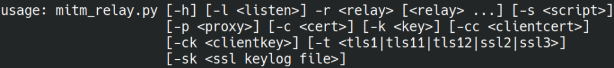

- `-r`:  Relaying settings. This parameter helps us to configure the relay
    - \[local port\] : \[dest\_host\] : \[dest\_port\]
    - Or adding protocol: \[udp:|tcp:\] lport: rhost : rport
    - Example: tcp:8083:142.250.187.238:443 
- `-l` **:** Relay listener. This is the address the relays will listen on. 
    - Be careful when setting this address, your relay listening address must be reachable from the client of you.
    - And must be the same in  --to--destination  in iptables rule you use
- `-p`**:** The proxy parameter, in this case our proxy server will be in place

**Our MITM relay is now ready**

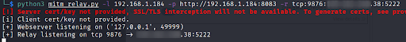

### Proxy Setup

We then can set up the rest of our proxy tooling and client-side Alpaca mobile app communication. 

- Our proxy tool (Burp Suite) is listening on **192.168.1.184:8083**
- I am using a XMPP based chat mobile application. You, however, can choose any kind of application you would like to test. 

### Firewall Setup

We will need to manipulate the firewall for our task. Fortunately for us, my colleague SHD already talks about how to use [**iptables**](https://labs.jumpsec.com/obfuscating-c2-during-a-red-team-engagement/) to create super specific firewall changes.

Lets leverage a visual to show what we’ll need our firewall to do: 

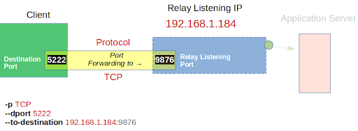

Our firewall will need to do some very specific port forwarding…there are two ways to utilise **iptables** to achieve this task.

You can either forward one specific port on TCP/UDP for all destinations to the relay: 

```shell
iptables -t nat -A OUTPUT -p tcp --dport 5222 -j DNAT --to-destination 192.168.1.184:9876
```

Or you can forward one specific port on TCP/UDP for one specific destination to the relay:

```shell
iptables -t nat -A OUTPUT -p tcp -s DEST_IP--dport 5222 -j DNAT --to-destination 192.168.1.184:9876
```

For the application you are researching, you have the task of identifying which ports to use and forward to - I unfortunately do not have the answers for your application. But I do have the answers for the Alpaca App, so let’s keep going. 

## Ready to start testing? 

Now that our environment is set up, let's fire up our mobile application (Alpaca App) and see where the packets go.

### Client to Server

In the top half of the screenshot (below), we can see MITM\_RELAY confirm its listening configuration and then confirm it has received the new client (new connection)  that it will forward on. 

The lower half of the screenshot is our Burp Suite proxy tool that is receiving relay’s forwarded information.

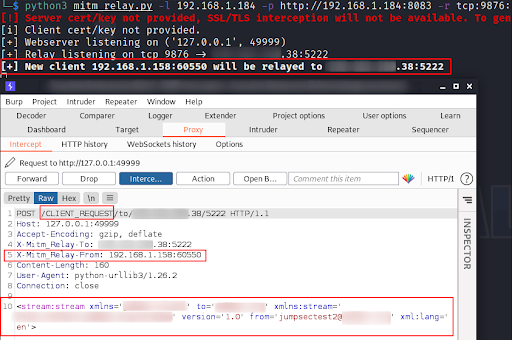

### Server to Client

And on return from the Alpaca Inc. servers, Burp Suite intercepts the communication destined for the Alpaca mobile app.  

**X-Mitm\_Relay-to** and **X-Mitm\_Relay-From** indicates the changes between **thick** **client** and **application** **server** addresses dynamically, based on the where the packets come from.

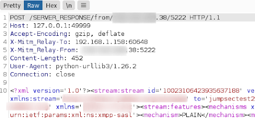

### Alpaca App chat

Let’s use the cool chat in the Alpaca App to send our best buddy a message.


This message goes from Alpaca App --->> MITM\_RELAY --->> Burp Suite proxy. If we recall, this converts the original XMPP into HTTP, which Burp Suite can understand.

We can see the intercepted contents in Burp Suite:

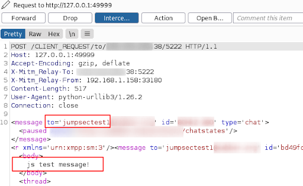

Now we have intercepted the message in the Alpaca App chat, we can drop or forward the message further. Let’s make sure it gets through.

Here we can see the actual conversation between the two mobile devices. Both are using the Alpaca App and communicating through XMPP. 

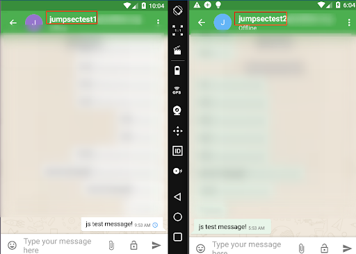

# There and back again

The moral of this story is that we do not have to give up on our security tooling if it has default limitations. On the contrary, we can layer up the tools we use and extend the capability of the tools that we are comfortable with. 

In our example, we extended Burp Suite’s HTTP-default capabilities with MITM\_RELAY so we could assess the Alpaca App that uses the XMPP protocol. 

I hope you found this useful, and remember it next time you need to research TEXT-based traffic in Non-HTTP protocols. 

**Intercept everything and enjoy my friends!**


**Muhammet Ali Arıtürk** is a Security Researcher @ JUMPSEC. 

You can [**follow him on Twitter**](https://twitter.com/hit1t)**.**
