**[By Dray Agha](https://twitter.com/Purp1eW0lf)**


JUMPSEC investigators recently observed an adversary weaponising PowerShell Jobs to schedule their attack, whilst responding to an incident. In this article, we discuss what PowerShell jobs are, how they can be leveraged for malicious purposes, and how defenders can protect, detect, and respond to neutralise the threat. 

# What are PowerShell Jobs

Adversaries are known to [schedule parts](https://attack.mitre.org/techniques/T1053/) of their campaign once they have infiltrated a target network. They may timetable their attack for an opportune moment (such as during unsociable hours, based on the region in which the infrastructure is hosted, or support teams reside) or set up a recurring task to ensure ongoing [persistence](https://attack.mitre.org/tactics/TA0003/). 

[PowerShell jobs](https://docs.microsoft.com/en-us/powershell/module/psscheduledjob/?view=powershell-5.1) aren’t designed to be inherently malicious and have many legitimate use cases. However, as is often the case in cyber security, the innate functionality of PowerShell Jobs and its susceptibility to abuse means it can also be leveraged by an adversary. 

## Using legitimately

When using the command line for most operating systems, users have to run a command and wait a microsecond for the system to return with a reply. This can be inconvenient - for example, when running a script that will take a while to run, or when you know that you want to run the command at a specific time or date in the future. 

When using PowerShell, a job allows you to push a task into the background. PowerShell will continue to work on your query behind the scenes and allow you to continue using the shell for other things. 

```powershell
#Push command to the background
Start-Job -ScriptBlock {date}

#Retrieve the results of the backgrounded command
Receive-job -name X

```

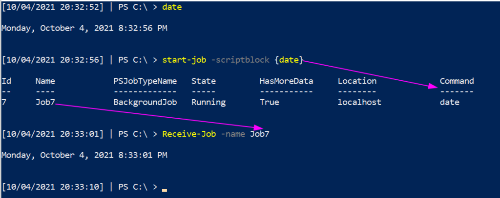

## According to schedule

PowerShell jobs can also be **scheduled** to execute on very particular conditions

```powershell
#organise when the task should trigger
$trigger = New-JobTrigger -Daily -At "4:15 AM" -DaysInterval 3;

#register the PowerShell job
Register-ScheduledJob –Name Collect_date –ScriptBlock {date} –Trigger $trigger
```

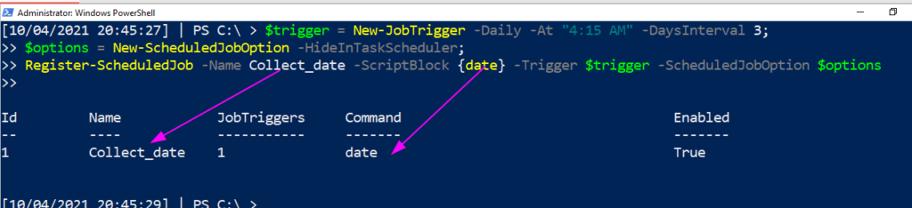

There are numerous ways to go and find where our scheduled job is located

```powershell
#Either of these work just fine
Get-ScheduledJob -id x
Get-ScheduledTask -taskname x
```

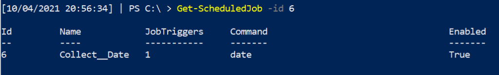

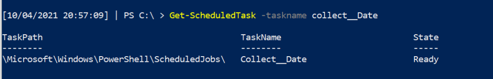

We can also find out a scheduled job’s date, time, and frequency are due to be executed

```powershell
Get-JobTrigger -name x
```

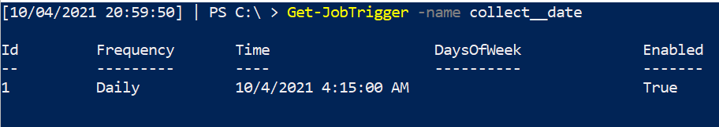

# Malicious scheduled jobs

In the above example, we’re completing the rather boring scheduled job of collecting the date. A more interesting representative example of how PowerShell jobs can be leveraged by attackers was found during our response to a recent incident. 

Whilst this article won’t recreate the exact syntax the attacker used for obvious reasons, we’ve provided a functionally similar example below.

## Using for evil

Let’s schedule a malicious PowerShell Job to run at **3 o’clock in the morning on Christmas Day** \- a gift to incident responders and sysadmins everywhere!

```powershell
#schedule the job for Christmas
$trigger = New-JobTrigger -Once -At "12/25/2021 3:00 AM";

#point to the malicious script to execute
$file = C:\SuperEvil.ps1

#try to hide this job from the Task Scheduler GUI….will still show up in the command line and GUI (if the right options are selected in ‘View’)
$options = New-ScheduledJobOption –HideInTaskScheduler;

#and now schedule the job
Register-ScheduledJob –Name Christmas_Day -FilePath $file –Trigger $trigger –ScheduledJobOption $options

```

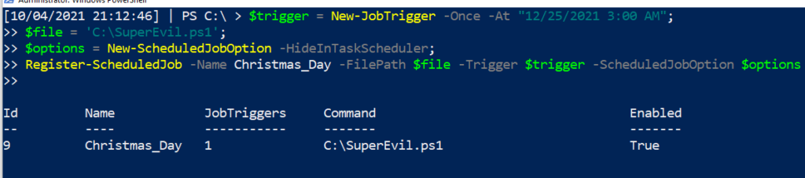

Now, we’ve emulated how an adversary could weaponise a PowerShell job to strike when the defenders are less likely to be able to manually react and respond. In these cases, automated measures to prevent and detect the threat are essential.

# Hunting Malicious Jobs

Now, you know me, I'm not about to show you something malicious without showing you the defensive counterpart! Let's put our Blue Team hat on

## Monitoring

From a monitoring and detection point of view, if we combine [Sysmon](https://docs.microsoft.com/en-us/sysinternals/downloads/sysmon#:~:text=System%20Monitor%20\(Sysmon\)%20is%20a,changes%20to%20file%20creation%20time.) and [Florian Roth’s](https://github.com/Neo23x0/sysmon-config) config of rules, we can see how a PowerShell job would be flagged

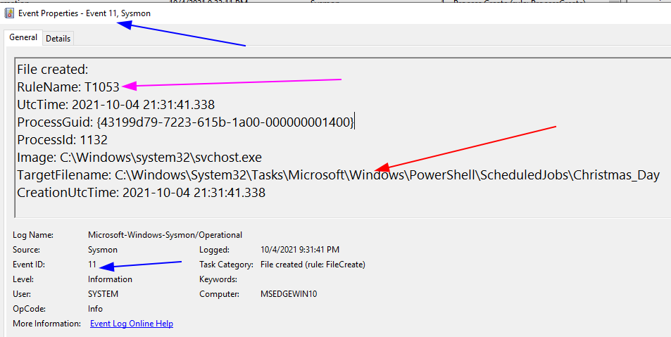

- The BLUE arrows: event info
    - The Event ID 11 involves file creation
- The RED arrows: specific info
    - TargetFileName shows that the scheduled job has been written to the Task directory
    - Notice, however, we have no visibility to WHAT this task does….we just know it has been registered.
- The PINK arrow: MITRE ATT&CK reference
    - This may not be in every sysmon config. However Florian Roth includes the MITRE ATT&CK tactic number in a particular event. This allows security analysts to schematise the event data they are observing with the wider TTPs of an adversary. 

In the above sysmon/endpoint log based SIEM, we would _have_ some visibility of scheduled jobs. However this data won't be enough for an analyst to work with. We need to dig deeper beyond **passive monitoring** to **active threat hunting** to identify exactly what this scheduled job is about. 


## Hunting

In our JUMPSEC clients’ environments, we have found no system-level usage of scheduled jobs. This suggests that scheduled jobs you identify are deliberately put there and are worth investigation.

You can query the scheduled jobs on a machine with this straight forward command

```powershell
Get-ScheduledJob
```

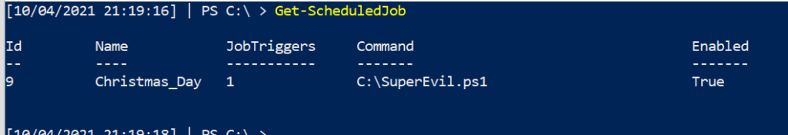

You can also examine _when_ this scheduled job is due to be executed

```powershell
Get-ScheduledJob | 
Get-JobTrigger |
Ft -Property @{Label="ScheduledJob";Expression={$_.JobDefinition.Name}},ID,Enabled, At, frequency, DaysOfWeek
```

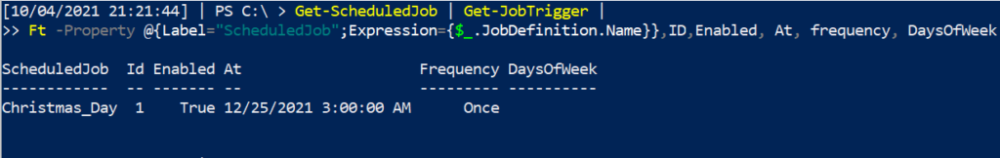

Knowing that this premeditated attack will ruin Christmas for an incident responder, let’s neutralise the malicious PowerShell job that has been scheduled. 

## Responding

You can remove a PowerShell scheduled job in two different ways, neither of which present a disadvantage. 

```powershell
#option one
Unregister-ScheduledTask -TaskName Christmas_Day -verbose -Confirm:$false

#option two
Unregister-ScheduledJob Christmas_Day -verbose -Confirm:$false
```

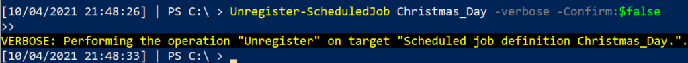

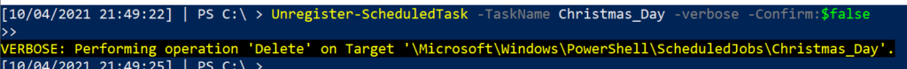

We can confirm that the malicious tasks have been eradicated from this machine.

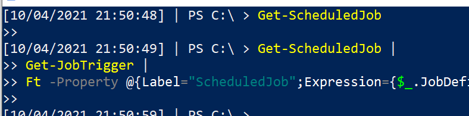

# Scheduling Security

This article took inspiration from a real life attack, and examined how an adversary could abuse PowerShell scheduled Jobs to both gain persistence, and quietly dwell on a network before picking the opportune moment to strike. Scripted attacks must be proactively identified and eliminated, as automated attack chains can be speedily operated by an attacker, reducing the opportunity for defenders to respond. **It’s important you are scouring your network for the recurring tasks that can give an attack a backdoor into your environment.**  

> **Related articles**: We recently wrote about how [registry run keys](https://labs.jumpsec.com/running-once-running-twice-pwned-windows-registry-run-keys/) can offer adversaries a stealthy persistence mechanism

Detect and investigate any recurring tasks you see in your environment, and you may just catch an adversarial campaign before they can cause any damage. Deny them the pleasure of striking on Christmas Day!

Any questions, comments, or criticisms please drop me a line

**[Twitter](https://twitter.com/Purp1eW0lf) [Github](https://github.com/Purp1eW0lf/)**

**Dray Agha,** Security Researcher


