**[By Dray Agha](https://twitter.com/Purp1eW0lf)**


In this article, we discuss some Digital Forensics and Incident Response (DFIR) techniques you can leverage when you encounter an environment **without Windows event logs**.

# Where are the logs?

At JUMPSEC, we regularly respond to security **incidents with ineffective logging** and auditing for the purposes of a cyber incident. In some cases, organisations we encounter don’t have any recognisable SIEM or centralised log repository. In others, organisations with otherwise sufficient logging have seen **adversaries intentionally manipulate the logs on an endpoint to prevent analysis** - sometimes even wiping them entirely. 

> Clearing the event logs on a Windows machine [is trivial](https://www.youtube.com/watch?v=00EwvDKaKyQ). It is a recognised behaviour of adversaries \[[T1070.001](https://attack.mitre.org/techniques/T1070/001/)\] who wish to evade and frustrate investigators’ efforts to unravel the TTPs of a malicious campaign. Without the event logs on a machine, you cannot use beautiful tools [like Chainsaw](https://github.com/countercept/chainsaw) to easily piece together the story for your client. 

Thankfully, our guidance is relevant to all situations where logs are unavailable to support an investigation. 

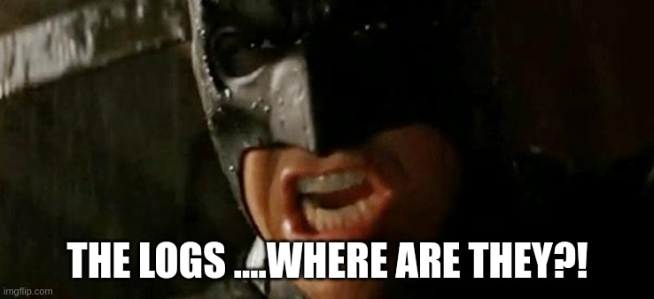

# Log-less investigations

For the rest of this article, I would like us to **operate under a log-free paradigm - where the event logs cannot be utilised in an investigation**. I’d like us to discuss **three** DFIR techniques that you can easily deploy when next conducting analysis on a machine that an adversary has tampered with. The machine may or may not have the required logs, or you may not trust the evidence - meaning we must verify past events through other means.  

As we do not have the permanency that event logs offer, we are left with volatile forensic data. Simply put, **if you do not get to most forensic data as quickly as possible then it may be gone forever**. If the machine is rebooted, the data can be lost; if the machine is left on and is used, many pieces of forensic evidence may be overwritten and lost forever.

> [Taking a forensic image](https://www.hackingarticles.in/comprehensive-guide-on-ftk-imager/) is out of scope for this article, however it may be advisable to do it as quickly as possible to ensure you can access the volatile, capricious data consistently throughout an investigation. 

There are many techniques for digital forensics. To understand and deploy the more advanced tools, there are many wise sages who I would recommend, such as [Richard Davis’ 13Cubed](https://www.youtube.com/channel/UCy8ntxFEudOCRZYT1f7ya9Q). In particular, there are three (or **four, if you’re feeling brave**) post-log techniques I consider to have a **low barrier** to entry in terms of technical capability, have general **resiliency** to adversarial manipulation, and are **relevant** to Windows endpoints and servers:

- [**PSReadLine**](#PSReadLine) (PowerShell History)
- [**Prefetch**](#prefetch) (PEcmd)
- [**Shimcache**](#shimcache) (AppCompatcache)
- BONUS: [**USN Journal**](#usn-journal) (via Velociraptor)

# PSReadLine

**This first one is a technique I do not see discussed that much**. And I’m not sure why. It has definitely illuminated parts of an attack that were once a mystery to me in the early stages of an investigation. The only detailed post I can find is [a blog by Sophos](https://community.sophos.com/sophos-labs/b/blog/posts/powershell-command-history-forensics), but I find it lacks some of the operational guidance that an investigator needs. 

[PsReadLine is a PowerShell module](https://docs.microsoft.com/en-us/powershell/module/psreadline/?view=powershell-7.2) that can do lots of cool things. Most pertinent for our conversation is its ability to **offer insight into the history of the PowerShell** commands previously run.

If we run some commands, we can instantly recall them via `history` (this isn’t the DFIR part, I promise).

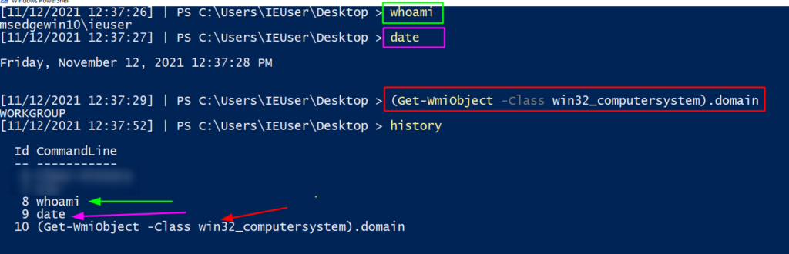

However, if the machine is rebooted (`` `Restart-Computer` ``), or the history cleared (`` `Clear-History` ``) then that history is lost. 

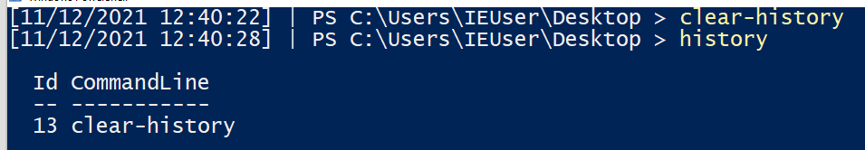

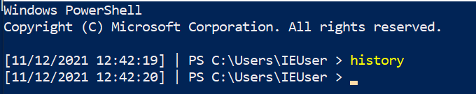

Moreover, running the `history` command **will only return the history of the current user and session** - so other users who sign into the machine and run commands will remain a mystery… _Or maybe not?_

### PSReadLine: Retrieve PowerShell History

PSReadLine will save the [last four thousand commands](https://social.technet.microsoft.com/Forums/en-US/7c3cd614-f793-4b99-b826-3dff917ebe88/powershell-commands-history-windows-10-1809-psreadline?forum=win10itprogeneral#:~:text=By%20default%2C%20the%20PowerShell%20in,separately%20for%20PowerShell%20and%20ISE.) a user has run into a particular file. **If you query each users’ _ConsoleHost\_history.txt_, you can retrieve these commands.** 

```powershell
get-content C:\Users\*\AppData\Roaming\Microsoft\Windows\PowerShell\PSReadline\ConsoleHost_history.txt
```

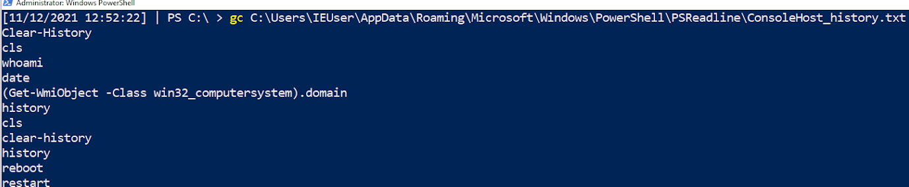

Here, we can see the commands I ran above. These were **previously lost** to us when the machine was rebooted and/or the history wiped… **but here they are available for us** to piece together what the adversary did!

I wouldn’t want you to have to manually do this for every user’s history - that would waste your precious time! On an endpoint, we can **run a quick loop** that will print every user _ConsoleHost\_history_ file:

```powershell
$Users = (Gci C:\Users\*\AppData\Roaming\Microsoft\Windows\PowerShell\PSReadline\ConsoleHost_history.txt).FullName;

$Pasts = @($Users);

foreach ($Past in $Pasts) {
    write-host "`n----User Pwsh History Path $Past---" -ForegroundColor Magenta; 
    get-content $Past
}
```

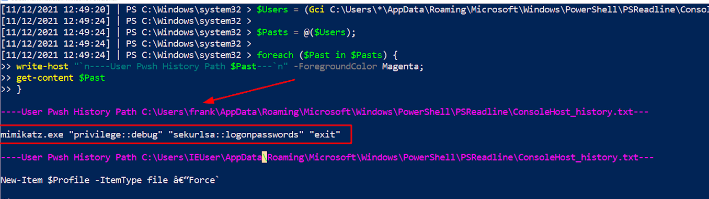

From our short script, in the pink text we've printed the users’ Console History file. This will snitch on last four thousand commands from each **user account**. We can also see that in the red arrow and box **Frank’s account** is highlighted for **deploying Mimikatz!** Below Frank’s commands, we can see the IEUser’s PowerShell history begins to also be printed. 

This was the first technique to trace the steps of the adversary. But keep in mind some caveats: 

- First, an attacker may just delete this file as part of their clean up operation; 
- Second, it will only record PowerShell - not cmd or wmic; 
- Third, it will only record up to 4096 PowerShell commands; 
- and finally, **the console host history text file will [not be available on all Windows OS’ and builds](https://www.cloudsavvyit.com/8722/using-psreadline-in-powershell/)**[**.**](https://www.cloudsavvyit.com/8722/using-psreadline-in-powershell/)  

# Prefetch

If you go to the directory `C:\Windows\Prefetch` on a Windows **endpoint**, you're in for a treat. 

Prefetch (also known as prefetcher) is **a caching technique** whereby an application is monitored and catalogued for the first few seconds it is launched, to make **re-launching more efficient.** 

If this sounds like something awesome for [a log-less investigation](https://www.youtube.com/watch?v=f4RAtR_3zcs), then you’re right!

If you sort by the prefetch files recently written to, **you can see the executables recently deployed by both the user and the computer itself.**

```powershell
dir 'C:\Windows\Prefetch' | sort LastWriteTime -desc
```

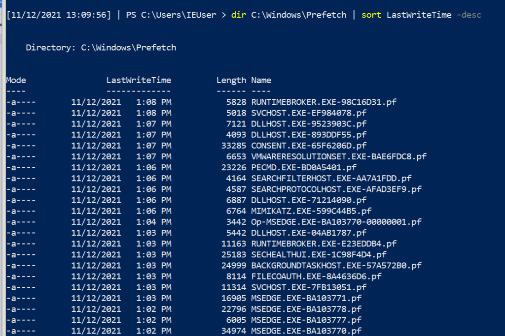

If we look very closely at the prefetch files (.PF), we can see that **Mimikatz** makes a special guest appearance!! This **evidences that Mimikatz has been executed**, but we don't get any more context from the name of the prefetch file.

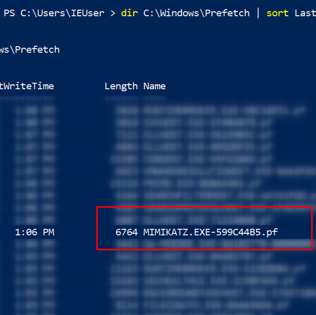

### Prefetch: PECmd

The contents of a prefetch file cannot be simply read to gather more execution context! This is where [Eric Zimmerman’s PEcmd](https://github.com/EricZimmerman/PECmd) comes to save the day. **This tool will carve through the prefetch directory or a prefetch file**, and **make it easier for investigators** to see the discrete info about the prefetched data. 

```
# I’d advise picking the -f flag, and picking on one of the prefetch files you see in the directory
.\PECmd .exe -f 'C:\Windows\prefetch\MIMIKATZ.EXE-599C44B5.pf' 

#get granular timestamps by adding -mp flag
.\PECmd .exe -f 'C:\Windows\prefetch\MIMIKATZ.EXE-599C44B5.pf' -mp

# If you don’t know what file you want to process, get the whole directory. Will be noisy though and I wouldn’t recommend
.\PECmd .exe -d 'C:\Windows\Prefetch' --csv . #dot at the end means write in current directory

```

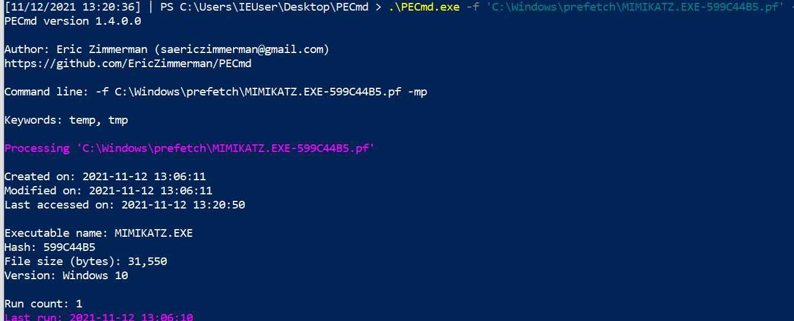

You get a whole load more with PECmd. Let’s look in more detail at what you’re given. 

First, we can see the various times associated with this executable (creation, modification etc). We’re also told about the executable name and file size. Interestingly, on the last line **we can see the amount of times the executable has been run** (once, on our instance) as well as the time it was last run.

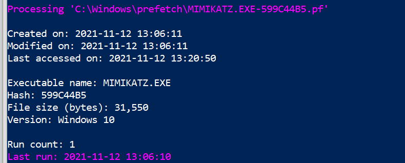

Next, we are given **insight into the directories and then the files that were involved in this execution** - this is again another excellent way to better map the granular behaviour the adversary had during their attack. 

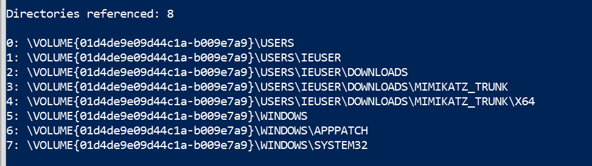

Note that Eric Zimmerman is kind enough to highlight the offending executable. PEcmd can do even more if you want to [check out some other blog posts and docs](https://binaryforay.blogspot.com/2016/01/introducing-pecmd.html). 

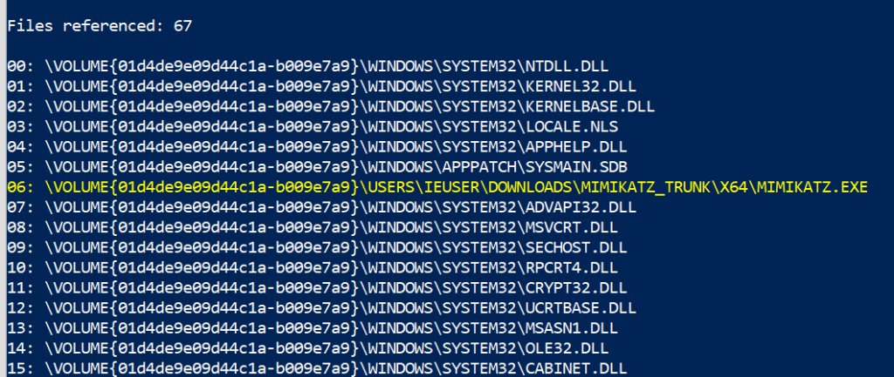

There are some caveats for this second technique:

- First, prefetch exists from Windows XP onwards, but PEcmd **will only work from Windows 8 above;**
- Second, **you don’t retrieve the arguments or parameters used** and so can only know the base executable that the adversary leveraged;
- Third, the relevancy of prefetch is **time-based** - so if you do not collect it after an incident and the machine continues to be used then you may lose the evidence;
- Fourth and most important, **prefetch has to be enabled on servers, as [Microsoft disables recording prefetch on Windows servers by default](https://www.forensicfocus.com/forums/mobile-forensics/prefetch-on-windows-servers/#:~:text=1.-,Is%20there%20a%20technical%20reason%20that%20this%20is%20off%3F,like%2C%20well%E2%80%A6running%20applications.). It is enabled on normal Windows endpoints.** You can **[enable prefetch recording](https://truesecdev.wordpress.com/2015/11/25/how-to-enable-prefetch-in-windows-server/)** with the following on a Windows Server:

```powershell
reg add "HKEY_LOCAL_MACHINE\SYSTEM\CurrentControlSet\Control\Session Manager\Memory Management\PrefetchParameters" /v EnablePrefetcher /t REG_DWORD /d 3 /f;
 
reg add "HKEY_LOCAL_MACHINE\Software\Microsoft\Windows NT\CurrentVersion\Prefetcher" /v MaxPrefetchFiles /t REG_DWORD /d 8192 /f;
 
Enable-MMAgent –OperationAPI;
 
net start sysmain
```

# Shimcache

[Shimcache](https://www.fireeye.com/content/dam/fireeye-www/services/freeware/shimcache-whitepaper.pdf) analysis is our third technique to gather insight into an attacker’s past activities. 

Shimcache - called AppCompatCache on a Windows machine - was originally made to determine interoperability issues between Windows versions and applications.  Like prefetch, [we can leverage shimcache to identify evidence of execution](https://www.youtube.com/watch?v=7byz1dR_CLg) on a machine when we do not have event logs. 

[Another Eric Zimmerman tool](https://ericzimmerman.github.io/#!index.md) called **AppCompatCacheParser** can give us insight into what was run on the system. 

```powershell
.\AppCompatCacheParser.exe -t --csv . --csvf shimcache.csv
```

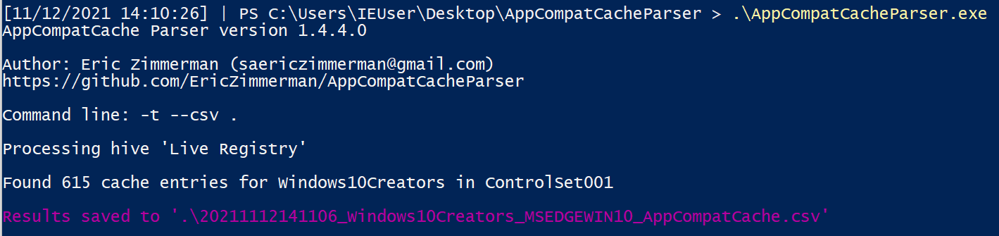

This will create a CSV, which you could import to your spreadsheet of choice… but some quick PowerShell can give you some visibility. There will be a lot of noise here, but if we filter through we can find something quite interesting.

```powershell
import-csv .\shimcache.csv | sort lastmodified -Descending | fl path,last*
```

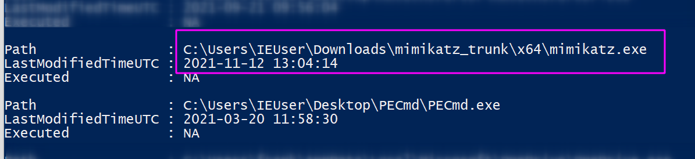

Despite not having access to the event logs, if we query **shimcache we can see proof of Mimikatz’ execution**, once again. Shimcache is a relatively straightforward artefact to query. It does however have **some complications**, as its implementation varies in Windows versions over the years. And again, if an investigator is not quick enough to gather the shimcache data then it may be lost!

# BONUS: USN Journal

The USN journal isn’t as easy an artefact to investigate as it is **extremely** **verbose.** I’ve included it as **a bonus fourth tip**, in case the above three techniques fail to deliver you any insight for your log-less investigation. 

The USN journal leverages some of the artefacts we have previously encountered (like prefetch). **It also can reach much further back** into the past, compared to other volatile artefacts, and identify files that were long deleted - excellent for DFIR purposes \[[1](https://www.youtube.com/watch?v=1mwiShxREm8), [2](https://www.youtube.com/watch?v=_qElVZJqlGY)\].

[Dr Michael Cohen’s Velociraptor](https://github.com/Velocidex/velociraptor) is an excellent tool to help us leverage the USN journal to see what an adversary did. Fortunately, there is [a dedicated blog](https://velociraptor.velocidex.com/carving-usn-journal-entries-72d5c66971da) that offers step-by-step advice on how best to leverage Velociraptor to hunt USN details.

> **I’d recommend Velociraptor for its low technical barrier** to [deploy many other advanced forensic techniques](https://www.hackingarticles.in/threat-hunting-velociraptor-for-endpoint-monitoring/), including prefetch hunts.

### USN Journal: Velociraptor

We can download Velociraptor on a machine we are investigating and launch it straight there - n**o need to set up any server-client infrastructure**, when in an emergency: 

```powershell
velociraptor.exe gui  #spin this up as admin
```

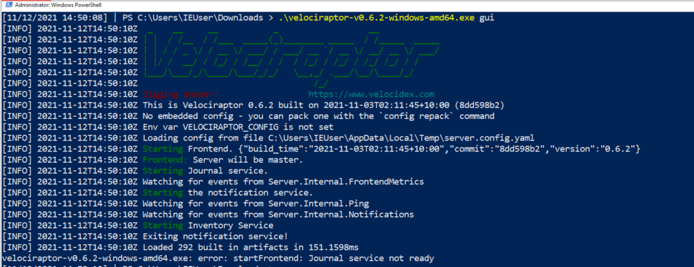

The web browser will pop up, and we will be met with Velociraptor's GUI. We can traverse to the main hunting page and name our hunt. We can then pick the **USN** **forensic** **hunt**, and fire it off.

Whilst the results are being collected and parsed, we can write some VQL ([Velociraptor Query Language](https://velociraptor.velocidex.com/the-velociraptor-query-language-pt-1-d721bff100bf)) to **sort the results by timestamp**, and filter out some other headers we don’t care about: 

```sql
SELECT Usn,Timestamp,Filename,Fullpath,FileAttributes,Reason,SourceInfo FROM source()
ORDER BY Timestamp desc
```

In our USN journal results, we can see **the relics of a Mimikatz** execution, along with the timestamp that we can use to map the adversaries timeline. 

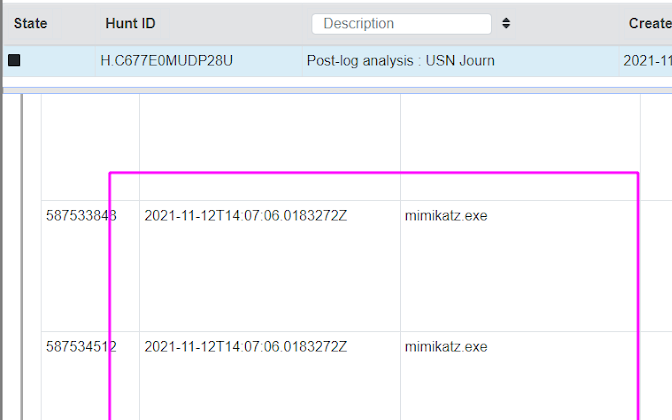

Unfortunately, the USN journal is often **challenging to navigate when used in a real life incident.** My arbitrary example with Mimikatz doesn’t quite convey the **complexity** and **verbosity** that you will face when leveraging the USN journal in a real investigation. For example, in our artificial scenario, just **a few runs** of Mimikatz resulted in near **97 rows** in the USN journal, via Velociraptor.

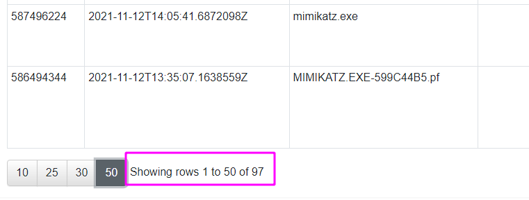

# Burn the logs, see if I care!

This has been an overview into a number of **easy to use, highly-reliable, rapid digital forensics techniques**. I have found these techniques **useful in investigations where the event logs can no longer be trusted or accessed** due to adversarial tampering, or perhaps where **logging was not set up** in the first place by the client. 

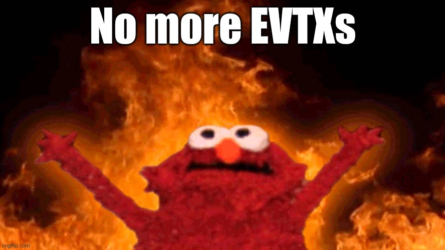

We have barely scratched the surface of digital forensics and incident response. There are still a whole load of techniques you can deploy when you find that Windows event logs cannot deliver you the puzzle pieces you need:

- If you want to read about **amcache,** I can recommend this [excellent paper](https://www.ssi.gouv.fr/uploads/2019/01/anssi-coriin_2019-analysis_amcache.pdf)
- Checkout the rest of [Eric Zimmerman’s awesome tools!](https://ericzimmerman.github.io/#!index.md)
- If you need to explore a **forensic** **image** or **memory dump**, I can recommend some [cheat sheets](https://github.com/Purp1eW0lf/Blue-Team-Notes#Digital-Forensics) (shameless plug) on leveraging tools like [Volatility](https://github.com/volatilityfoundation/volatility/wiki)
- For more information on DFIR techniques, [Richard Davis 13Cubed videos](https://www.youtube.com/c/13cubed/videos) [](https://www.youtube.com/c/13cubed/videos)are essential educational resources

When you’re next tasked with **a log-less investigation**, see if you can leverage **PowerShell history, prefetch, shimcache, and the USN journal** to identify any undiscovered nuance to your adversaries’ campaign. 

Any questions, comments, or criticisms please drop me a line

**[Twitter](https://twitter.com/Purp1eW0lf) [Github](https://github.com/Purp1eW0lf/)**

**Dray Agha,** Security Researcher
