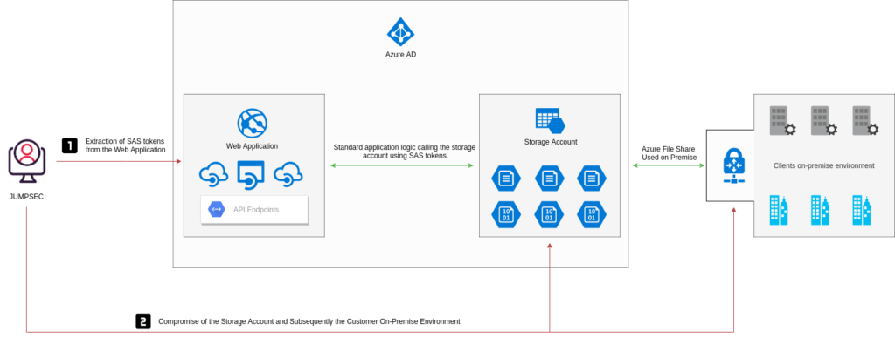
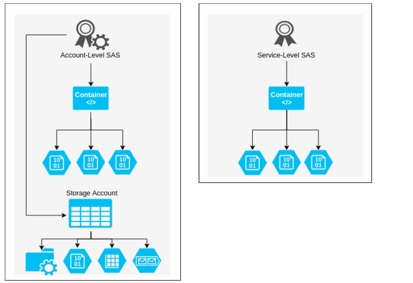
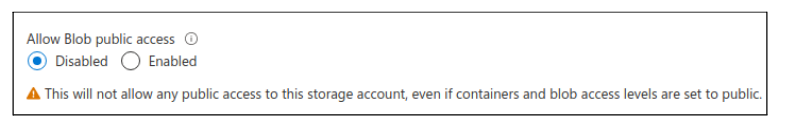

Tom Ellson - Head of Offensive Security

**Summary / TLDR;** 

During a recent client security assessment I came across a number of insecure Azure Storage Accounts. On delivery of the recommendations, it struck me that the client was somewhat unaware of the risks associated with their Azure Storage Accounts. Despite that, the client had a multi-cloud policy and had correctly deployed Amazon S3 buckets elsewhere in their network.

This blog post is designed to raise awareness of the risks posed by insecure Azure Storage Accounts, analysing the features most interesting to an attacker in terms of exploitable functionality that may be introduced by misconfiguration. It is not intended to be exhaustive and should be used as an accompaniment to existing guidance released by Microsoft. 

## **Background**

Insecure storage accounts have dominated the headlines for all the wrong reasons over the last couple of years, particularly when related to cloud services. Misconfiguration of Amazon S3 storage buckets, for example, has been identified as one of the most commonly exploited security issues for users of cloud services.

As a result, last year Amazon updated the default configurations of S3 buckets to be private and accessed only by users explicitly granted access, in addition to producing revised best practice guidance on how to secure them effectively. However, this only applies to newly deployed services, meaning previously deployed instances continue to be vulnerable where they had been deployed with insecure configurations. 

Azure Storage Accounts are the Microsoft equivalent of Amazon S3 buckets, and are susceptible to many of the same challenges. Namely, that (as with other cloud services) they are often deployed by teams without the security know-how to configure them effectively, and that default deployments will often lack the necessary level of controls for their environment unless they are explicitly enabled by the IT team.  

## **Client Environment** **Overview**

The application was deployed successfully in Azure and was making use of Azure file storage accounts containers and blob storage. There was a javascript file being loaded - lets call it **main.js**. **Main.js** contained several interesting looking _core.windows.net_ domain names.

Further to this, the js file also contained the SAS tokens required to access the resource. The SAS tokens were being used to access resources in the front end, rather than hard coding the access token in the backend and creating a front end function to access the resource through an endpoint or parameter. The SAS tokens were set with an excessive lifetime and granted full permissions on the containers, blobs and file shares. 

Here's an example:

[https://jstest20.blob.core.windows.net/fd81344e-e9c1-4bfa-b64f-9e6380aea347**?comp=list**&sv=2019-12-12&ss=bfqt&srt=sco&sp=rwdlacupx&se=2020-07-31T03:41:59Z&st=2020-07-30T19:41:59Z&spr=https&sig=REDACTED](https://jstest20.blob.core.windows.net/fd81344e-e9c1-4bfa-b64f-9e6380aea347?comp=list&sv=2019-12-12&ss=bfqt&srt=sco&sp=rwdlacupx&se=2020-07-31T03:41:59Z&st=2020-07-30T19:41:59Z&spr=https&sig=REDACTED)

This immediately jumped out as a risk, because from here we were able to traverse the blob containers and file share containers to gain access to sensitive information without even having to authenticate to the application, as the .js file was loaded as the page was rendered.

## **Attack Path Analysis**

The following graphic demonstrates the attack path in which a threat actor would move from compromising the web organisation whilst only making a single request to the web application.



## **Attack Surface**

As an attacker, the most interesting and exploitable functions I would look for would be regarding the information that can be used to further gain access to an environment or corporate data. In the example graphic, the attacker gained access to the corporate on premise environment whilst only making a single request to the main.js file on the web server.

The lack of segregation plays a part in the compromise of enterprise resources. The file share that is used as a development storage account, is also used to store corporate documentation and configuration files that can be used to facilitate an on-premise connection.

Traditional methods of container compromise include being able to access the resources without authentication, or an AWS or Azure administrator unintentionally allowing public access to cloud storage. This is made difficult due to the amount of warnings that are in place to help educate the user on what they are about to expose themselves to. 

Azure Storage Accounts compromise could enable an attacker to host a malicious website, pose as a legitimate business or initiate a watering hole attack - thereby poisoning legitimate users' traffic.

Examples of real work applications of misconfigured storage accounts include the usage of Azure File Storage accounts being used to host content for job postings - e.g. where an administrator who has provisioned access has used a SAS token within the front end rather than using an account token in the backend and wrapping a client side function around it.

## **Storage Account Overview**

**First, let’s take a look at storage accounts and the function they perform. In essence, users (either solo or part of an Azure AD tenant) can create storage accounts within Azure resources; these storage accounts can be used as object storage within the cloud.** 

The Azure storage account contains all Azure storage that being blobs, containers, queues, tables, and disks. When spinning up a storage account the name of the storage account has to remain unique as it will be a namespace for your Azure storage data. In some cases, this data is accessible over the public internet (more on that later). 

The schema takes the following approach when deploying storage:

- _https://jstest20.blob.core.windows.net/_
- _https://jstest20.file.core.windows.net/_
- _https://jstest20.queue.core.windows.net/_
- _https://jstest20.table.core.windows.net/_
- _https://jstest20.dfs.core.windows.net/_
- _https://jstest20.z13.web.core.windows.net/_

File shares can also be set up in the Azure storage accounts to access resources over SMBv3 (port 445), and using an account key to authenticate and mount the share locally. 

## **Shared Access Tokens (SAS)** 

Microsoft defines three types of SAS: _Service SAS, Account-level SAS_, and _User Delegation SAS_. 

The account-level SAS can provide access to various services present within the storage account, e.g blob, file, etc. providing access to the resource, service level API's, container API’s, object API’s, etc. and gives pretty much free reign on reading, writing and deleting storage account contents. In contrast, the service SAS gives access to just one service within a storage account.

### Account-Level vs Service-Level 

The main difference between the three from an attacker perspective is ease of control of the Storage Account. Account-level SAS tokens will grant access to all resources (depending on the SignedResourceTypes (more on this below). Account-level tokens can be used to grant access to all containers, blobs, file shares, queues and tables within the storage account. 



The graphic above demonstrates the difference between Account-level and Service-level SAS tokens. The example shows that an account-level SAS token can be used to access blobs and containers, however if the SignedServices  is over permissive, such as ss=bfqt this will allow the SAS token to be used for all Storage Account services. The SignedResourceTypes is set to sco - allowing the SAS token to be used for service-level, container-level, and object-level API’s.

### Account-level SAS

An Account-level SAS was introduced with version _2015-04-05_. It delegates access to resources in **one or more** of the Azure Storage Account services. All of the operations available via a service SAS are also available via an Account-level SAS.

We aren't going to reinvent the wheel here by explaining all concepts of how SAS tokens work and how they are constructed. In essence, the Account-level SAS can be used to access blobs, containers and other storage account features. The SAS token is made up of the SAS URI, which contains the Storage URI and SAS Token.

#### **Storage Resource:**

https://jstest20.blob.core.windows.net/fd81344e-e9c1-4bfa-b64f-9e6380aea347/test.txt

#### **Account-level SAS Token:**

?sv=2019-12-12&ss=bfqt&srt=sco&sp=rwdlacupx&se=2020-07-31T00:09:01Z&st=2020-07-30T16:09:01Z&spr=https&sig=REDACTED

#### **Account-level SAS URI:**

https://jstest20.blob.core.windows.net/fd81344e-e9c1-4bfa-b64f-9e6380aea347/test.txt?sv=2019-12-12&ss=bfqt&srt=sco&sp=rwdlacupx&se=2020-07-31T00:09:01Z&st=2020-07-30T16:09:01Z&spr=https&sig=REDACTED

There are several parameters that make up Account-level SAS tokens, but for the purpose of this post, 5 will be discussed.

- Signature (sig)
    - Sig=XXXX
- SignedExpiry (se):
    - se=2020-07-31
- SignedPermission (sp)
    - sp=rwdlacupx
- SignedServices(ss)
    - ss=bfqt
- SignedResourceTypes (srt)
    - sr=sco

#### **Signature**

**Arguably**, the most important on this list is the Signature. The signature is used to authorise the request to the endpoint or resource. MFST says _“The string-to-sign is a unique string constructed from the fields that must be verified in order to authorize the request. The signature is an HMAC computed over the string-to-sign and key using the SHA256 algorithm, and then encoded using Base64 encoding.”_  

#### **SignedExpiry**

The SignedExpiry parameter is also important. An extended lifetime means increases the risk of abuse if the SAS token is compromised, as long as it has not been revoked, or the container / resource deleted. It is vital that the expiry time is fit for purpose and valid for the period required. 

#### **SignedPermission**

SignedPermission defines what permissions are allocated to the SAS token. **_rwdlacupx_**  is the most permissive, and allows for read (r), write (w), delete (d), list (l), add (a), create (c) , update (u), and process (p)**_._** 

When interacting with blobs and file storage, the following permissions are not required in order to gain full control over the containers and file shares.

- _Add (a)_
- _Update (u)_
- _Process (p)_

_More on this can be found here:_

[https://docs.microsoft.com/en-us/rest/api/storageservices/create-account-sas](https://docs.microsoft.com/en-us/rest/api/storageservices/create-account-sas)

Just like expiry, it is vital that these permissions are accurate for the client / user trying to access the resource; incorrect configuration of these could lead to data loss and/or compromise.

#### **SignedResourcetypes**

SignedResourceTypes is another big one. It determines the type of SAS token you possess. For example _sr=sco_ will give you access to the stated service, object and container APIs. A must for providing external users access to the storage account.

#### **SignedServices**

Finally SignedServices, in essence, which services the SAS token has access to; blob, queue, file, or table. As you can imagine, these are often heavily over-permissive, with administrators giving out SAS tokens that bear the following privileges: (access to everything).

**?sv=2019-12-12&ss=bfqt&srt=sco&sp=rwdlacupx&se=2021-07-31T00:31:36Z&st=2020-07-30T16:31:36Z&spr=https**

### Service-Level SAS

A service-level SAS delegates access to resources in just one of the storage services. The services range from blob, Queue, Table or File. Service-level SAS can be granular to blobs, containers and directories

The service-level SAS can be generated within the Azure portal, but the configuration is limited. Recently Azure released the ability to provide granular permissions or containers in which the depth could be specified, to provide restriction around traversing containers and sub directories.

The below C# snippet can generate service level SAS tokens and provide granular access to resources, in the below example, the token is granted for read, write and list permissions to the container testfile01 inside the storage account jsteststorage111. This service level SAS is granted on a container level, meaning that any attempts to access any other resources will not work.

[https://gist.github.com/tdesec/ccb41e4606c](https://gist.github.com/tdesec/ccb41e4606c1ea83a264bf14d439ed76)[1ea83a264bf14d439ed76](https://gist.github.com/tdesec/ccb41e4606c1ea83a264bf14d439ed76)

```csharp
public void GetAdHocContainerSasToken(){
var containerName = "testfile01";

var connectionString = "DefaultEndpointsProtocol=https;AccountName=jsteststorage111;AccountKey=XXXXXXXXXXXXXXXXXXXXXXX==;EndpointSuffix=core.windows.net";

var sasBuilder = new ShareSasBuilder()
{
ShareName = containerName,
Resource = "s", //Value b is for generating token for a Blob and c is for container
StartsOn = DateTime.UtcNow.AddMinutes(-2),
ExpiresOn = DateTime.UtcNow.AddMinutes(10),
};

sasBuilder.SetPermissions(ShareSasPermissions.Read         | ShareSasPermissions.Write| ShareSasPermissions.List); //multiple permissions can be added by using | symbol

var sasToken = sasBuilder.ToSasQueryParameters(new StorageSharedKeyCredential(GetKeyValueFromConnectionString("AccountName"), GetKeyValueFromConnectionString("AccountKey")));

Console.WriteLine($"{new ShareClient(connectionString, containerName).Uri}?{sasToken}&restype=directory&comp=list");

```

<table><tbody><tr><td></td></tr></tbody></table>

### User-delegated SAS

A "user delegation" SAS allows for signing of the SAS token using an AzureAD account. This method allows for SAS creation without the need for account key usage.

It is always recommended to use a User Delegation SAS when possible. A user delegation SAS provides additional security benefits compared to a service or an account SAS. User-delegated SAS tokens are only valid for a maximum of 7 days, any attempt to set the expiration date later than 7 days will result in failure. This makes them particularly tricky to compromise and is a metric that increases the overall security of the token.

Below is an example of creation of a user delegated SAS token, the user has already authenticated to AzureAD user the az command.

```json
az storage account list

"primaryEndpoints": {
      "blob": "https://jsteststorage111.blob.core.windows.net/",
      "dfs": "https://jsteststorage111.dfs.core.windows.net/",
      "file": "https://jsteststorage111.file.core.windows.net/",
      "internetEndpoints": null,
      "microsoftEndpoints": null,
      "queue": "https://jsteststorage111.queue.core.windows.net/",
      "table": "https://jsteststorage111.table.core.windows.net/",
      "web": "https://jsteststorage111.z33.web.core.windows.net/"
    },

az storage container generate-sas --account-name jsteststorage111 --name test --permissions acdlrw --auth-mode login --as-user --expiry 2021-09-11

"se=2021-09-11&sp=racwdl&sv=2018-11-09&sr=c&skoid=e156ac44-6e88-4d07-9777-3716bd6dc45a&sktid=0339c78f-95d6-477b-a564-dd9e6f897c1b&skt=2021-09-10T17%3A54%3A34Z&ske=2021-09-11T00%3A00%3A00Z&sks=b&skv=2018-11-09&sig=vym9zUUuYUmSzp1%2BNoBGzC5YeXGBGVxtYxC7HAZgfTc%3D"
```

## **Privately Accessible Storage Accounts**

Now to look at the public access denied storage accounts. Visiting the endpoint gives quite a generic error that defines that public access is not permitted. This can be used to enumerate public vs private storage accounts. **If the SAS token is compromised, the storage account is still accessible.**



**GET https://jsteststorage111.blob.core.windows.net/**

```
<Error>
<Code>PublicAccessNotPermitted</Code>
<Message>Public access is not permitted on this storage account. RequestId:54d84fc4-601e-0051-57a8-66d68b000000 Time:2020-07-30T19:34:11.0871138Z</Message>
</Error>

```

Using a compromised SAS token, again we have access to list the container; unlike the unauthenticated calls, with SAS tokens you can list container names. Below we generated an Account-Level SAS token to list the containers.

**GET https://jsteststorage111.blob.core.windows.nett/?comp=list&restype=container&sv=2019-12-12&ss=bfqt&srt=sco&sp=rwdlacupx&se=2020-07-31T03:41:59Z&st=2020-07-30T19:41:59Z&spr=https&sig=XXXXX**

```
<EnumerationResults ServiceEndpoint="https://jsteststorage111.blob.core.windows.net/">
<Containers>
<Container>
<Name>fd81344e-e9c1-4bfa-b64f-9e6380aea347</Name>
<Properties>
<Last-Modified>Thu, 30 Jul 2020 15:16:12 GMT</Last-Modified>
<Etag>"0x8D8349B7EC39B39"</Etag>
<LeaseStatus>unlocked</LeaseStatus>
<LeaseState>available</LeaseState>
<PublicAccess>blob</PublicAccess>
<DefaultEncryptionScope>$account-encryption-key</DefaultEncryptionScope>
<DenyEncryptionScopeOverride>false</DenyEncryptionScopeOverride>
<HasImmutabilityPolicy>false</HasImmutabilityPolicy>
<HasLegalHold>false</HasLegalHold>
</Properties>
</Container>
</Containers>

```

This creates two possible attack vectors for malicious actors to leverage. They are:

- Knowing the storage account name, container name, and whether the container is set to allow anonymous access makes the storage account publicly accessible to anyone.
- Compromising a SAS token, depending on what permissions the SAS token has, will determine what level of compromise is possible. If the token is granted the list permission (**_sp=\*l\*)_** is granted **_rt=sco_** and has not expired, the storage account / service can be fully compromised.

## **Enumerating Storage Accounts and SAS Tokens**

Services such as greyhat warfare ([https://buckets.grayhatwarfare.com/](https://buckets.grayhatwarfare.com/))  provide the ability to search through publicly exposed and accessible Azure Storage Accounts. This is important to prevent public access to these blobs and file shares. Ensuring the appropriate SAS token hygiene and application logic is also paramount. 

Whilst services like greyhat warfare are great for looking into anonymous S3 buckets and storage accounts, this also highlights another potential risk; **the disclosure of SAS tokens being cached by various search engines and searching services.**

We conducted a mapping exercise on Azure Storage Accounts that had over permissive SAS tokens assigned to them:

- DuckDuckGo - 25 +Storage accounts with rwdlacupx 
- Google - 50+ Storage accounts with rwdlacupx  
- Bing - 10 + Storage accounts with rwdlacupx 

Queries to find SAS tokens are as follows:

- site:core.windows.net rwdlacup - **Looking for Account SAS’s**
- site:core.windows.net inurl:"sp=rl" - **Looking for Read / List**
- site:core.windows.net inurl:"sp=rwl" - **Looking for Read / Write / List**
- site:core.windows.net inurl:"sr=c" - **Looking for Container-level Service SAS tokens**

Also looking for storage accounts within github code wielded alot of results, most of which pertained to SAS tokens that had not expired due to time, however the account key could have been cycled from within Azure.


An attacker could facilitate a compromise of service just by using the exposed SAS token within Google's search results. A SAS token with update, list, read and write permissions would allow an attacker to pull all files and potentially replace genuine served documentation with malware embedded documents. This in essence could facilitate compromise on the organization's clients and internal staff. If the file share or blob storage is used for other documentation than static content, access to the client's environment, and IP could lead to the full compromise of resources or usage as a watering hole for malware serving and deployment.

Furthermore, after reviewing the github results, its clear organisations are not treating SAS tokens like specific credentials for resources, rather they are forgetting the importance of keeping the token safe.

# **Defensive Controls and Mitigation**s

In order to properly protect against this threat, organisations should start with the implementation of the correct business and application logic, whereby the SAS token is never leaked within the public domain. SAS tokens should be granted granularly and should be treated like API keys, in such they have the correct expiry and permissions set. 

The correct mitigating controls should be put in place to ensure that SAS tokens are only provisioned with the correct authorisation and once the administrator who is in control of the Storage Accounts, has provided the correct information for doing so. 

### Stored Access Policies 

A stored access policy can be used to define a set of pre-existing parameters within the SAS token creation process. The policy can be chosen when creating a SAS token to ensure it adheres with the standard defined by policy. 

**The pros of using a Stored Access Policy to create SAS tokens are as follows:**

- They can be defined by an administrator and as such have organisational controls over SAS tokens and their attributes. 
- Misconfigurations of SAS tokens are less likely to occur due to an already defined policy being used to generate them.
- Revocation and invalidation require just a specific change or deletion of the policy in order to facilitate incident response.

From a defenders perspective, its crucial that storage accounts access is logged and monitored, this can be done Azure Monitor, a good reference to that can be found here:

[https://docs.microsoft.com/en-us/azure/storage/blobs/monitor-blob-storage?tabs=azure-portal](https://docs.microsoft.com/en-us/azure/storage/blobs/monitor-blob-storage?tabs=azure-portal)

### Revocation and Invalidation Planning

If a SAS is leaked, it can be used by anyone who obtains it, which can potentially compromise the storage account as such a method of revocation and invalidation is required as recovery for the instance in which a token is compromised.

A method of invalidation is required to ensure that the SAS token, like API key or standard credentials can be revoked in real time. Luckily if the SAS token has been generated using the storage account key, in order to revoke the SAS token the administration need just cycle the account key, therefore invalidating the signature of the SAS token. If User-Delegation SAS tokens are compromised, the revoke-delegation-keys command revokes all of the user delegation keys associated with the specified storage account. This revokes all delegation keys that pertain to the storage account and as such renders them useless.

```
az storage account revoke-delegation-keys \
    --name <storage-account> \
    --resource-group <resource-group>
```

### Logging and Visibility

Defenders can monitor Azure Storage accounts logs for any malicious traffic, that being the use of the **_comp=list_** parameter / value within the request. It's unlikely a valid user who is accessing any publicly facing Storage Account will ever require listing the directories.

The following request should be flagged as potentially nefarious, due to the **comp=list:**

https://jstest20.blob.core.windows.net/fd81344e-e9c1-4bfa-b64f-9e6380aea347**?comp=list**&sv=2019-12-12&ss=bfqt&srt=sco&sp=rwdlacupx&se=2020-07-31T03:41:59Z&st=2020-07-30T19:41:59Z&spr=https&sig=REDACTED

### Ingestion into Azure Sentinel

Organisations for a defence in depth approach should look to be using Azure sentinel and integration to their choses SIEM vendor for a holistic view of the overall defensive stance of the shared storage services. Monitoring should always take place on key assets that contain sensitive data and content.

To make detection collaboration easier, Azure sentinel can ingest Azure storage account logs, this allows for defenders to query access logs. Importantly, queries can be run based on _Authentication type_ and _Operation name_. 

For instance, an event where the Authentication type was set to anonymous and the Operation name was “Listblobs” should raise concerns. Albeit if you are implementing detection controls on storage account access, this should be the final step on damage control. Prior to this, storage account contents should be vetted to ensure all content present is required to be accessed publicly and without authentication. 


#### **Example Defensive KQL Queries**  

<table><tbody><tr><td><strong>union StorageBlobLogs | where Uri contains "jestestc1"</strong><strong>| where OperationName == "ListBlobs"</strong><strong>| where AuthenticationType == "Anonymous"</strong></td></tr></tbody></table>

### Additional Resources

It is important to make sure that when SAS tokens are assigned and created that the appropriate secure metrics are followed, ensuring the principle of least privilege is adhered to. 

You can find more comprehensive guidance here:

- [https://docs.microsoft.com/en-us/azure/storage/common/storage-account-overview](https://docs.microsoft.com/en-us/azure/storage/common/storage-account-overview)
- [https://docs.microsoft.com/en-us/azure/storage/common/storage-sas-overview](https://docs.microsoft.com/en-us/azure/storage/common/storage-sas-overview)
- [https://docs.microsoft.com/en-us/rest/api/storageservices/create-account-sas](https://docs.microsoft.com/en-us/rest/api/storageservices/create-account-sas)
- [https://docs.microsoft.com/en-us/rest/api/storageservices/delegate-access-with-shared-access-signature](https://docs.microsoft.com/en-us/rest/api/storageservices/delegate-access-with-shared-access-signature)
- [https://notsosecure.com/identifying-exploiting-leaked-azure-storage-keys/](https://notsosecure.com/identifying-exploiting-leaked-azure-storage-keys/)
