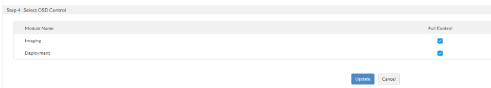
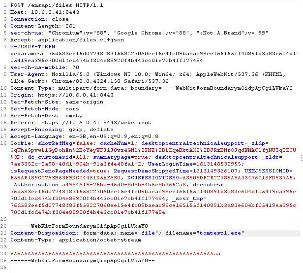
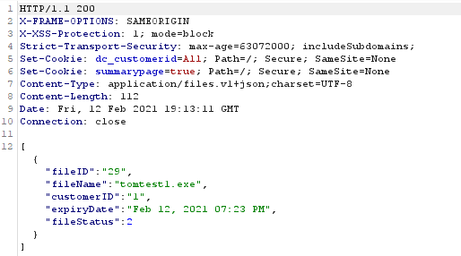
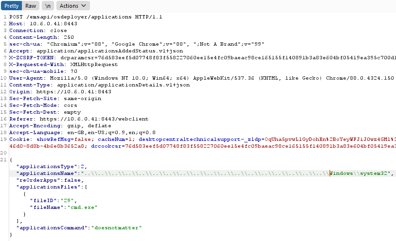
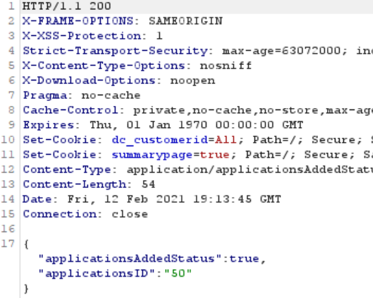
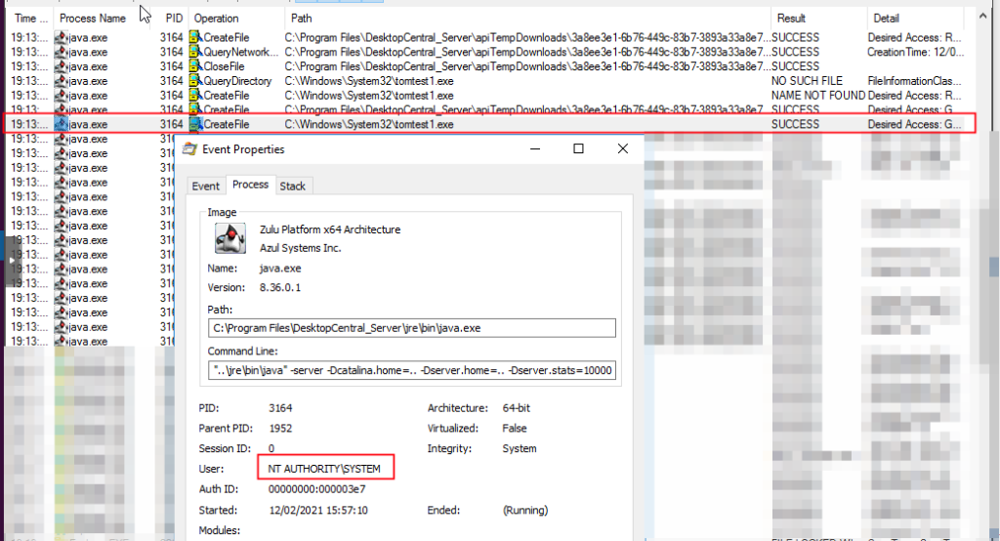
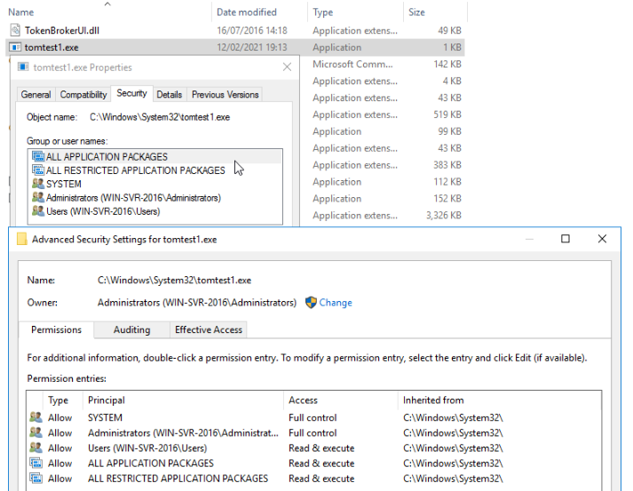
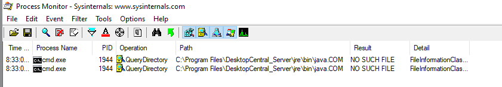

**Software**: Zoho ManageEngine Desktop Central  
**Affected Versions**: Before 10.0.662  
**Vendor page**: https://www.manageengine.com/products/desktop-central/vulnerabilities-in-reports-module.html  
**CVE Reference**: CVE-2021-46165 & CVE-2021-46166  
**Published**: 09/01/2022  
**CVSS 3.1 Score**: 8.8 High  
**Attack Vector**: SQL Injection / Arbitrary File Write  
**Credits**: Tom Ellson

This is the second post in our two part series on ManageEngine Desktop Central. All of the reported issues have since been acknowledged and resolved by ManageEngine.

JUMPSEC researchers have discovered multiple vulnerabilities in ManageEngine Desktop Central Application (MEDC). This is an endpoint management system that is used widely across the globe and is a prevalent vendor. Successful exploitation of these vulnerabilities would allow an adversary to execute code in the context of highest integrity (NT AUTHORITY / SYSTEM).

**In this second post, we will explore ways of exploiting the issues identified in our previous post, to facilitate attack path traversal leveraging the vulnerabilities identified.**

## **Summary**

The application grants users full control over the "Images" and "Deployment" modules within the "OSD Controls". This allows the user to add an application using the "add applications" control within the admin functionality of the "OS Deployment" tab.

Once the user adds the application, the "_applicationsName_" parameter is vulnerable to a path / directory traversal attack. This in turn allows an attacker or user with malicious intent to upload / write any file to the operating system with the highest integrity as SYSTEM. This can then be leveraged to cause denial of service or code execution as SYSTEM.

<table><tbody><tr><td></td></tr></tbody></table>

## **Attack Path Traversal**

This attack chain begins with a POST request to the files API endpoint. This endpoint takes standard _webkitformboundary_ data. As there are no file upload restrictions, the endpoint can be used to upload all files inclusive of dll's and exe’s. As seen below, the POST request to the _/emsapi/files_ endpoint allows for an exe file to be uploaded. Upon successful upload the endpoint returns JSON including the _fileID_, _fileName_, _customerID_, _expiryDate_ and _fileStatus_. Making note of the _fileID_ is important here as it is used in subsequent API requests.

<table><tbody><tr><td></td></tr></tbody></table>

  
The _/emsapi/files_ endpoint can be used to introduce any files to the system. Using this function, we attempted to introduce said files to a location other than the intended directory. The initial attempt at traversal on the files API endpoint was unsuccessful, as the filename parameter does not accept any form of path or directory traversal. This is controlled by file name checks on that parameter which prevents the usage of unicode characters and characters that can be used as a traversal technique.

The _/emsapi/osdeployer/applications_ endpoint allows for the user to create a new “_application_” in the system. Upon creation of an _application_, a folder is created in the applications directory with the file that was uploaded in the previous API call that corresponds with the _fileID_.

The _applicationName_ is used as a basis to create the application directory folder, meaning traversal and identification of the created folder was trivial; developers often forget input sanitation that would prevent the traversal of the file system in order to create files and folders that should belong to the application directory.

If an _applicationName_ is requested that already exists, the application folder will not be created but the file will still be written. Therefore the _system32_ directory can be used and the _system32_ folder will not be overwritten, but the file that pertains to the fileID will be uploaded into _system32_.

<table><tbody><tr><td></td></tr></tbody></table>

Upon issuing the above API call, the previously uploaded file (_tomtest1.exe_ - _fileID_ 29) is written to the _C:\\windows\\system32_\\ directory. At this point we had proved arbitrary file write through the application creation endpoint. As per the figure below, the file is being written with the highest file integrity - “NT AUTHORITY\\SYSTEM”. Upon file creation, the _java.exe_ binary creates the file and sets the owner to the local administrator's group.

<table><tbody><tr><td></td></tr></tbody></table>

Upon achieving arbitrary file write, it's important to understand the scope of what can be achieved. Arbitrary File Write (AFW) differs from Arbitrary File Overwrite (AFO). File overwrite is more beneficial to us as we don't really need to find a binary that is called upon file service execution. 

However, in this case we had AFW and not AFO, so it was necessary to find an executable or dll that is loaded at run time but was not present on the system. This could be done using first order dll hijacking. However, we opted for an approach similar to what was described [here](http://google.com) The following Java.com binary is missing from the system at service start time.

## **Summary**

This Arbitrary File Write allows for complete control over the Manage Engine Desktop Central Server as it can be used to execute code.

Whilst this attack requires some levels of privilege to have been obtained already and access to the application creation functionality. This functionality can be abused to achieve code execution at service start time. 

This has been reported to the vendor and has been fixed as of the most recent version. The vendor was comprehensive with remediation and quick to respond issues outlined.
