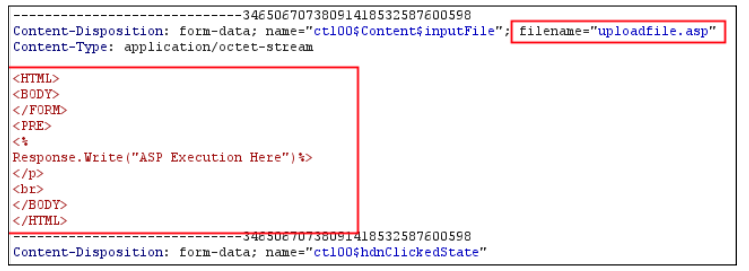
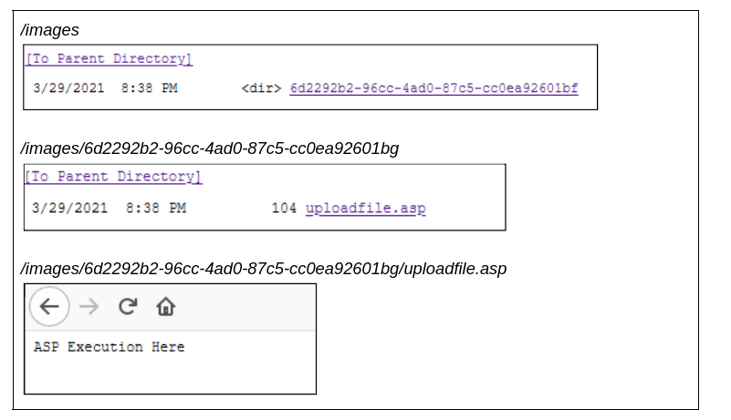
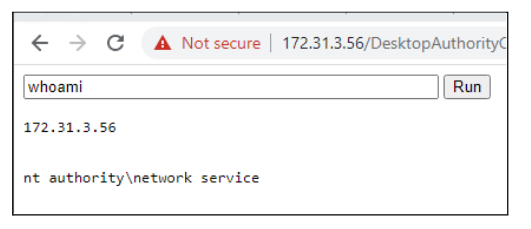
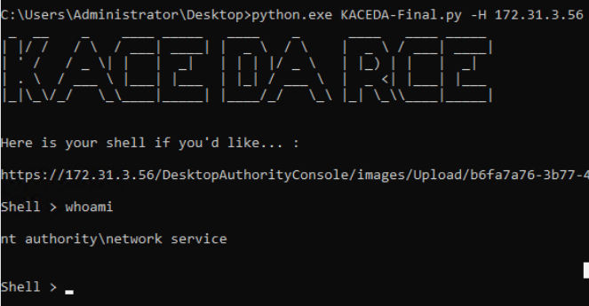
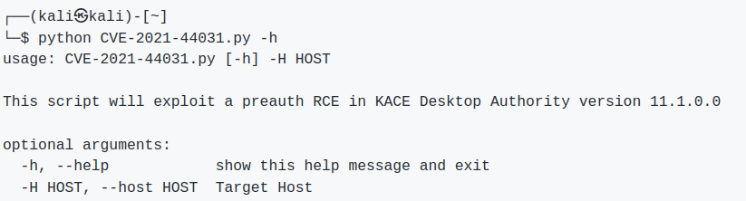
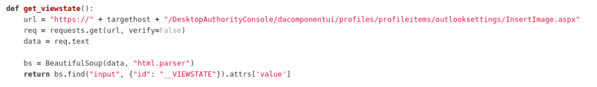
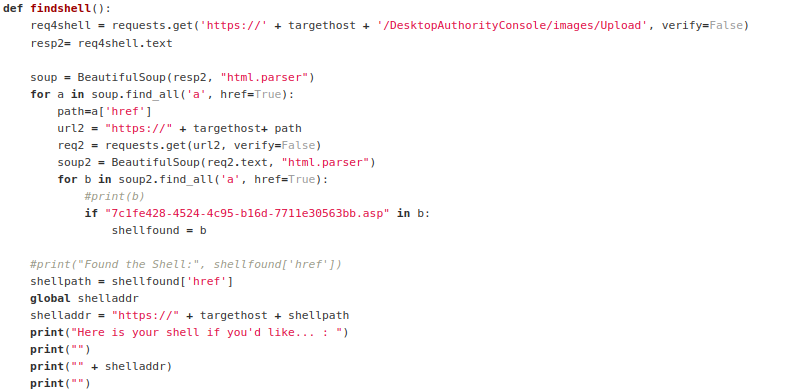
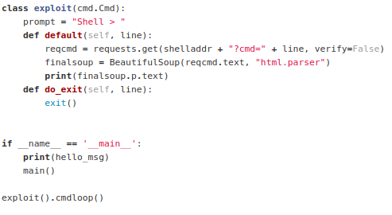

**Software**: QUEST KACE Desktop Authority  
**Affected Versions**: 11.1 and earlier.  
**Vendor page**: https://www.quest.com/products/kace-desktop-authority/  
**CVE Reference**: CVE-2021-44031  
**Published**: 19/11/2021  
**CVSS 3.1 Score**: 9.8 Critical  
**Attack Vector**: Pre-authenticated Remote Code Execution  
**Credits**: Tom Ellson

JUMPSEC recently discovered multiple vulnerabilities in Quest KACE Desktop Authority 11.1. This is an endpoint management system that is used widely across the globe and is prevalent within a wide range of organisations. A pre-auth remote code execution on the KACE Desktop Authority platform exists in which successful exploitation of these vulnerabilities would allow an adversary to achieve remote code execution without first needing to authenticate to the service.

[**https://cve.mitre.org/cgi-bin/cvename.cgi?name=CVE-2021-44031**](https://cve.mitre.org/cgi-bin/cvename.cgi?name=CVE-2021-44031)

[**https://support.quest.com/essentials/vulnerability-reporting-acknowledgements**](https://support.quest.com/essentials/vulnerability-reporting-acknowledgements)

[**https://support.quest.com/kace-desktop-authority/kb/336098/quest-response-to-desktop-authority-vulnerabilities-prior-to-11-2**](https://support.quest.com/kace-desktop-authority/kb/336098/quest-response-to-desktop-authority-vulnerabilities-prior-to-11-2)

## **Summary**

Due to inadequate authorisation controls, an API endpoint lacking correct authorisation checks allows for an unauthenticated user to upload files. It also does not restrict the file types that can be uploaded, therefore any files can be introduced to the system without proper prevention controls.

By default the KACE service uses Windows IIS, meaning that an ASP file can be uploaded using the vulnerable API endpoint. The file is placed in the images directory on the webroot and the asp code is rendered upon browsing to the file resulting on code execution.

## **Attack Analysis**

Within the system, it is possible to upload an image as part of the outlook settings and options within the Desktop Authority console. In an attempt to find machines that can be accessed without authentication, our attention was brought to the _dacomponentui_ directory, **this directory by default had directory listing enabled.**

From here it was a matter of finding interesting .aspx files as they loaded without authentication being required to the KACE Desktop Authority system. _profiles/profileitems/outlooksettings/InsertImage.aspx_ stood out. The endpoint allows for file upload to what seemed to be the outlook portion of the application, as described before. 

Further testing was performed on this endpoint and using process monitor we were able to determine the directory to which the files are written to when uploaded using this endpoint. Uploading a file using the _InsertImage.aspx_ endpoint will input the file into the _images_ directory and is placed in a folder with a randomly generated GUID.

Querying the following endpoint will provide the opportunity to upload an image as part of the outlook settings and the folder to be placed in the aforementioned images directory.

As seen below, it was trivial to upload an ASP file containing code that would render upon accessing the file.

```
https://{serverIP}/DesktopAuthorityConsole/dacomponentui/profiles/profileitems/outlooksettings/InsertImage.
```



Following the upload of the file, the GUID is generated and the folder is created in the images directory. The images directory has directory listing on by default.



<table><tbody><tr><td></td></tr></tbody></table>

In order to weaponise this, you simply upload a malicious ASP file that allows for code execution. This can be seen below:



The flaw with this implementation is threefold. **Firstly**, the application does not require authentication to access the _insertimage.aspx_ page. The _insertimage.aspx_ page should have a valid users session in order to facilitate access. **Secondly**, the upload functionality is not checking the file type upon upload, meaning any file type can be introduced into the system through this endpoint. **Thirdly**, the _images_ directory has directory listing enabled, meaning regardless of the randomly generated GUID, the attacker can still enumerate the directory to which the file is uploaded to. 

## **Exploitation**

Finally, to round this exploit off, I built a python script to automate code execution. 





The script makes a request to the Desktop Authority service to retrieve the _VIEWSTATE_.



Once the _VIEWSTATE_ is scraped from the service, the script then makes a _POST_ request to upload the file to the _insertimage.aspx_ page. This takes the _VIEWSTATE_ parameter and other webfit boundary items in order to successfully upload the malicious asp file (`7c1fe428-4524-4c95-b16d-7711e30563bb.asp`) into the images directory. Once the upload has succeeded, a GET request is made to the /images endpoint to enumerate the randomly generated GUIDs that are generated at folder creation time. 



Following this, another GET request is made to GUID, and another to the file name once the script has enumerated it. One final GET request is made to the uploaded ASPX file and appends the CMD parameter to the request, which instructs the ASPX file to run the supplied data within the _CMD_ parameter. The output is then returned to the user within the CLI.



## **Final Thoughts**

The vendor responded in a timely fashion and provided updates relating to the fix.
