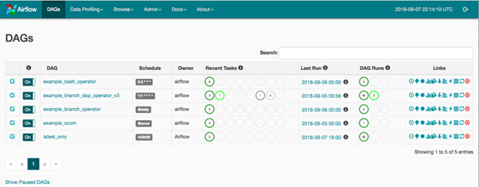

I recently worked on a project focused on log anomaly detection using manageable machine learning pipelines. The pipelines mainly include **data collection --- feature extraction --- feature engineering --- detection/prediction --- updating (maintenance)**. 

It’s important to have a solid UI to manage the pipelines so I can easily review the chain of pipelines. After much research, I found many engineers recommended [Airflow](https://airflow.apache.org/). 

In airflow, the core concept is the **Directed Acyclic Graph** (DAG). Through the implementation, I have confirmed that this is a truly powerful tool to manage the machine learning pipelines, instead of relying on shell scripts. But, I did encounter some challenges during the process and also, fortunately, found solutions for them. 

The challenges can be split into two main aspects, **pipeline management** and **dynamic generation for tasks**. 

- **Pipeline management -** During the process of solving the problem about pipeline management, I met the following problems when implementing the machine learning pipelines in Airflow:

- How to solve the **dependencies within one DAG**

- How to solve the **dependencies between Dags**

- How to overcome known issues with [ExternalTaskSensor](https://airflow.apache.org/docs/apache-airflow/stable/howto/operator/external_task_sensor.html):

- How to overcome issues with the **execution time** 

- **Dynamic generation for tasks -** When I tried to integrate the pipelines with our own **[ELK](https://www.elastic.co/what-is/elk-stack)** stack, I found the problem about **how to dynamically generate the tasks in a dag**. This problem comes from the different log types, which include Linux, Windows, VPN and so on. I also found the same type of logs from different clients require different treatment too. The generation of tasks should be **scalable** and **automatic**. 

In the first place, I had many choices to make. For the operator, I can choose from the PythonOperator, BaseOperator, or BashOperator. For the dependencies, I can choose TriggerDagRunOperator, Xcom, or SubDag.

After some testing, I found the most effective solution is usually the simplest, even when not 100% perfect. I chose the following combination:

**BaseOperator + DummyOperator + Plugins + Xcom + For loop + ExternalTaskSensor**

#### **1\. DummyOperator Usage**

[DummyOperator](https://airflow.apache.org/docs/apache-airflow/1.10.12/_modules/airflow/operators/dummy_operator.html) can be used to group tasks in a DAG. In order to structure different tasks into one nice workflow, I used the DummyOperator to connect them. They won’t be executed by the executor. After introducing those two tasks, there is a common start task and a common end task to connect all middle parallel tasks.

<table class="has-black-background-color has-background"><tbody><tr><td><mark style="background-color:rgba(0, 0, 0, 0)" class="has-inline-color has-white-color">start_task = DummyOperator( task_id=</mark><mark style="background-color:rgba(0, 0, 0, 0)" class="has-inline-color has-vivid-green-cyan-color">'start_task'</mark>, <mark style="background-color:rgba(0, 0, 0, 0)" class="has-inline-color has-white-color">dag=dag</mark> <mark style="background-color:rgba(0, 0, 0, 0)" class="has-inline-color has-white-color">)</mark> <mark style="background-color:rgba(0, 0, 0, 0)" class="has-inline-color has-white-color">end_task = DummyOperator( task_id = </mark><mark style="background-color:rgba(0, 0, 0, 0)" class="has-inline-color has-vivid-green-cyan-color">'end_task'</mark>, <mark style="background-color:rgba(0, 0, 0, 0)" class="has-inline-color has-white-color">dag = dag )</mark></td></tr></tbody></table>

PNG1：[Airflow graph view](https://assets.bbhub.io/company/sites/40/2018/05/airflow.png)

For the dynamic generation of tasks, I want to introduce a kind of structure to organise the code. Most of the logs share the same processing logic, so I need to introduce several automatic variables inside the tasks. The basic structure would look like the following:

<table class="has-white-color has-black-background-color has-text-color has-background"><tbody><tr><td><mark style="background-color:rgba(0, 0, 0, 0)" class="has-inline-color has-vivid-green-cyan-color">''' &nbsp; def Dynamic_Function(variable): &nbsp; &nbsp; &nbsp; task_1 = Function1( &nbsp; &nbsp; &nbsp; task_id = 'task_{}'.format(variable), &nbsp; &nbsp; &nbsp; dag = dag, &nbsp; &nbsp; &nbsp; ... &nbsp; &nbsp; &nbsp; ) &nbsp; &nbsp; &nbsp; return task_1 '''</mark> <mark style="background-color:rgba(0, 0, 0, 0)" class="has-inline-color has-luminous-vivid-amber-color">for </mark><mark style="background-color:rgba(0, 0, 0, 0)" class="has-inline-color has-white-color">variable</mark> <mark style="background-color:rgba(0, 0, 0, 0)" class="has-inline-color has-luminous-vivid-amber-color">in</mark> <mark style="background-color:rgba(0, 0, 0, 0)" class="has-inline-color has-white-color">variables:</mark> &nbsp; task_1 = Dynamic_Function(variable)</td></tr></tbody></table>

The variables can be read it from the environment variables or just set it as a list:

\# the python way to read environment values from .env file:

<table><tbody><tr><td>os.getenv<mark style="background-color:rgba(0, 0, 0, 0)" class="has-inline-color has-vivid-green-cyan-color">('variables'</mark>).split(<mark style="background-color:rgba(0, 0, 0, 0)" class="has-inline-color has-vivid-green-cyan-color">''</mark>)</td></tr></tbody></table>

This method is not that complex, but it is quite useful when there are multiple tasks sharing the same processing logic and there is only one difference of variable in them, allowing the project to be easily scaled.  

#### **2\. Plugin Operator and BaseOperator**

For the Function1, it is defined in a customised way in **plugins/operators.** You can find the detailed information on this [link](http://michal.karzynski.pl/blog/2017/03/19/developing-workflows-with-apache-airflow/)**.** The main context is shown below**:**

<table class="has-black-background-color has-background"><tbody><tr><td><mark style="background-color:rgba(0, 0, 0, 0)" class="has-inline-color has-luminous-vivid-amber-color">from </mark><mark style="background-color:rgba(0, 0, 0, 0)" class="has-inline-color has-white-color">airflow.plugins_manager</mark> <mark style="background-color:rgba(0, 0, 0, 0)" class="has-inline-color has-luminous-vivid-amber-color">import</mark> <mark style="background-color:rgba(0, 0, 0, 0)" class="has-inline-color has-white-color">AirflowPlugin</mark> <mark style="background-color:rgba(0, 0, 0, 0)" class="has-inline-color has-luminous-vivid-amber-color">from</mark><mark style="background-color:rgba(0, 0, 0, 0)" class="has-inline-color has-white-color"> airflow.utils.decorators</mark> <mark style="background-color:rgba(0, 0, 0, 0)" class="has-inline-color has-luminous-vivid-amber-color">import</mark> <mark style="background-color:rgba(0, 0, 0, 0)" class="has-inline-color has-white-color">apply_defaults</mark> <mark style="background-color:rgba(0, 0, 0, 0)" class="has-inline-color has-luminous-vivid-amber-color">class </mark><mark style="background-color:rgba(0, 0, 0, 0)" class="has-inline-color has-luminous-vivid-orange-color">MyFirstOperator</mark><mark style="background-color:rgba(0, 0, 0, 0)" class="has-inline-color has-white-color">(BaseOperator): &nbsp; &nbsp;</mark> &nbsp; <mark style="background-color:rgba(0, 0, 0, 0)" class="has-inline-color has-pale-pink-color">@apply_defaults&nbsp; &nbsp;</mark> <mark style="background-color:rgba(0, 0, 0, 0)" class="has-inline-color has-luminous-vivid-amber-color">&nbsp; def </mark><mark style="background-color:rgba(0, 0, 0, 0)" class="has-inline-color has-luminous-vivid-orange-color">__init__</mark><mark style="background-color:rgba(0, 0, 0, 0)" class="has-inline-color has-white-color">(self, my_operator_param, *args, **kwargs):&nbsp; &nbsp; &nbsp; &nbsp; &nbsp; &nbsp; &nbsp; &nbsp; &nbsp; self.operator_param = my_operator_param &nbsp; &nbsp; &nbsp; super(MyFirstOperator, self).__init__(*args, **kwargs) &nbsp; &nbsp;</mark> &nbsp;<mark style="background-color:rgba(0, 0, 0, 0)" class="has-inline-color has-luminous-vivid-amber-color"> def</mark> <mark style="background-color:rgba(0, 0, 0, 0)" class="has-inline-color has-luminous-vivid-orange-color">execute</mark><mark style="background-color:rgba(0, 0, 0, 0)" class="has-inline-color has-white-color">(self, context):&nbsp; &nbsp; &nbsp; &nbsp;</mark> &nbsp; &nbsp; &nbsp; &nbsp; ... <mark style="background-color:rgba(0, 0, 0, 0)" class="has-inline-color has-luminous-vivid-amber-color">class</mark><mark style="background-color:rgba(0, 0, 0, 0)" class="has-inline-color has-luminous-vivid-orange-color"> MyFirstPlugin</mark><mark style="background-color:rgba(0, 0, 0, 0)" class="has-inline-color has-white-color">(AirflowPlugin):</mark> <mark style="background-color:rgba(0, 0, 0, 0)" class="has-inline-color has-white-color">&nbsp; name =</mark><mark style="background-color:rgba(0, 0, 0, 0)" class="has-inline-color has-vivid-green-cyan-color"> "my_first_plugin"&nbsp; &nbsp;</mark> &nbsp; <mark style="background-color:rgba(0, 0, 0, 0)" class="has-inline-color has-white-color">operators = [MyFirstOperator]</mark></td></tr></tbody></table>

I use it for the reason that I do not need to put all my code in the DAG. Otherwise, the DAG code would be extremely redundant and hard to manage.

I use **BaseOperator** instead of PythonOperator because of the simplicity. The PythonOperator is more complex to control and needs to set more unnecessary parameters.

**With the above two solutions, the dynamic tasks can be easily built in one DAG now**. The following solutions are more for the connection and concurrency problems I met during a project. 

#### **3\. Xcom & ExternalTaskSensor**

Now, I have to solve three key problems:

- How to save the result for the next task? 

- How to get the result from the last task?

- How to make sure the result is within the right time interval?

Airflow provides powerful solutions for those problems with [**Xcom**](https://airflow.apache.org/docs/apache-airflow/stable/concepts/xcoms.html) and [ExternalTaskSensor](https://airflow.apache.org/docs/apache-airflow/1.10.4/_api/airflow/sensors/external_task_sensor/index.html).

To save the result from the current task, Xcom is used for this requirement. It is a bit similar to git. To use it, xcom\_push and xcom\_pull are the main functions needed. But there is a limitation for the size, which is [**48KB**](https://airflow.apache.org/docs/apache-airflow/stable/_modules/airflow/models/xcom.html). Normally, you do not need to worry about the size, but it is advisable to try to save the middle variable value in xcom while not using big files. 

If you want to extract the result obtained from the previous DAG with a specified task combing with the dynamic tasks, the extraction process is independent and you should use the ExternalTaskSensor with the following setting:

<table class="has-black-background-color has-background"><tbody><tr><td><mark style="background-color:rgba(0, 0, 0, 0)" class="has-inline-color has-luminous-vivid-amber-color">for</mark> <mark style="background-color:rgba(0, 0, 0, 0)" class="has-inline-color has-white-color">variable</mark> <mark style="background-color:rgba(0, 0, 0, 0)" class="has-inline-color has-luminous-vivid-amber-color">in</mark> <mark style="background-color:rgba(0, 0, 0, 0)" class="has-inline-color has-white-color">variables:</mark> <mark style="background-color:rgba(0, 0, 0, 0)" class="has-inline-color has-white-color">... &nbsp; # create the task to depend on the up_stream dag &nbsp; external_sensor = ExternalTaskSensor(</mark> <mark style="background-color:rgba(0, 0, 0, 0)" class="has-inline-color has-white-color">&nbsp; task_id=</mark><mark style="background-color:rgba(0, 0, 0, 0)" class="has-inline-color has-vivid-green-cyan-color">'ext_sensor_task'</mark>, <mark style="background-color:rgba(0, 0, 0, 0)" class="has-inline-color has-white-color">&nbsp; external_dag_id='xxx',</mark> &nbsp; external_task_id=<mark style="background-color:rgba(0, 0, 0, 0)" class="has-inline-color has-vivid-green-cyan-color">'xxx_{}'</mark><mark style="background-color:rgba(0, 0, 0, 0)" class="has-inline-color has-white-color">.format(variable),</mark> &nbsp;<mark style="background-color:rgba(0, 0, 0, 0)" class="has-inline-color has-white-color"> timeout =</mark> <mark style="background-color:rgba(0, 0, 0, 0)" class="has-inline-color has-pale-pink-color">300</mark>, <mark style="background-color:rgba(0, 0, 0, 0)" class="has-inline-color has-white-color">&nbsp; dag=dag, &nbsp; ) ...</mark></td></tr></tbody></table>

I have to mention here, **you should not use end\_task in the previous DAG.** If you do not want all tasks to be finished on the previous day, then go through the next day.

#### **4\. Execution Time**

Execution time is kind of limited in Airflow in version 1.x. I have not tested the 2.x. In version 1.x, it does not help to change the timezone in airflow.cfg.

But you can use the specified way to solve the problem. The **pendulum library** is a really great option.

<table class="has-black-background-color has-background"><tbody><tr><td><mark style="background-color:rgba(0, 0, 0, 0)" class="has-inline-color has-luminous-vivid-amber-color">import</mark> <mark style="background-color:rgba(0, 0, 0, 0)" class="has-inline-color has-white-color">pendulum</mark> <mark style="background-color:rgba(0, 0, 0, 0)" class="has-inline-color has-white-color"># get the format date string current_date = pendulum.datetime.now().strftime(</mark><mark style="background-color:rgba(0, 0, 0, 0)" class="has-inline-color has-vivid-green-cyan-color">"%Y, %m, %d, %H</mark><mark style="background-color:rgba(0, 0, 0, 0)" class="has-inline-color has-white-color">") dag = DAG( &nbsp; dag_id = dag_id, &nbsp; # get the datetime type value &nbsp; start_date = pendulum.strptime(current_date, "</mark><mark style="background-color:rgba(0, 0, 0, 0)" class="has-inline-color has-vivid-green-cyan-color">%Y, %m, %d, %H"</mark><mark style="background-color:rgba(0, 0, 0, 0)" class="has-inline-color has-white-color">).astimezone(</mark><mark style="background-color:rgba(0, 0, 0, 0)" class="has-inline-color has-vivid-green-cyan-color">'Europe/London'</mark><mark style="background-color:rgba(0, 0, 0, 0)" class="has-inline-color has-white-color">).subtract(hours=</mark><mark style="background-color:rgba(0, 0, 0, 0)" class="has-inline-color has-pale-pink-color">1</mark><mark style="background-color:rgba(0, 0, 0, 0)" class="has-inline-color has-white-color">), &nbsp; default_args = default_args, &nbsp; schedule_interval = timedelta(hours=</mark><mark style="background-color:rgba(0, 0, 0, 0)" class="has-inline-color has-pale-pink-color">1</mark><mark style="background-color:rgba(0, 0, 0, 0)" class="has-inline-color has-white-color">), )</mark></td></tr></tbody></table>

With this setting, you can introduce a trial task before the current time and you can make sure the time is the same as your local timezone. 

**5\. ExternalTaskSensor Stuck Problem**

When people design dependent tasks in different dags, the ExternalTaskSensor is a common function to use. But if you do not follow some best practices, it can quite easily get stuck. The main problem relates to the time settings for DAGs. Among the errors that can occur, the most common is where the previous task generates a large middle value and it is impossible to transfer to an external task because of the [**size limitation**](https://airflow.apache.org/docs/stable/_modules/airflow/models/xcom.html) for middle value storage. 

So, how to best set the time for DAGs? Based on an answer from [**stackoverflow**](https://stackoverflow.com/questions/46807297/airflow-externaltasksensor-gets-stuck): the DAGs don't need to have the same start\_date. If you create your ExternalTaskSensor task without the execution\_delta or execution\_date\_fn, then the two DAGs need to have the same **_execution date_**. It so happens that if two DAGs have the same schedule, a scheduled task running in each interval will have the same execution date.

The optimal choice is to exclude execution\_delta and execution\_data\_fn if you encounter challenges when computing the time. You should **never manually trigger (in the Links column) the DAG in WebUI** **if the result will be sent to the next DAG**. It will generate different execution dates. In practice, I defined the same start\_date by setting a specific date. When I start the DAGs in Web UI, I will **press all the DAG buttons** at the same time if those DAGs are dependent on one other.

PNG2：[DAGs View](https://airflow.apache.org/docs/apache-airflow/1.10.4/ui.html)

This is a very brief description of my solutions for the tricky problems I encountered. Thanks for reading!

#### **References:**

[**How do I trigger Airflow -dag using TriggerDagRunOperator**](https://stackoverflow.com/questions/45568439/how-do-i-trigger-airflow-dag-using-triggerdagrunoperator) - [_I have found following link: https://www.linkedin.com/pulse/airflow-lesson-1-triggerdagrunoperator-siddharth-anand…_stackoverflow.com](https://stackoverflow.com/questions/45568439/how-do-i-trigger-airflow-dag-using-triggerdagrunoperator)

[**Airflow ExternalTaskSensor gets stuck**](https://stackoverflow.com/questions/46807297/airflow-externaltasksensor-gets-stuck) - [_I'm trying to use ExternalTaskSensor and it gets stuck at poking another DAG's task, which has already been…_stackoverflow.com](https://stackoverflow.com/questions/46807297/airflow-externaltasksensor-gets-stuck)

[**Sensing the completion of external airflow tasks**](https://medium.com/@delmira91/sensing-the-completion-of-external-airflow-tasks-827344d03142) - [_(Not the best title)_medium.com](https://medium.com/@delmira91/sensing-the-completion-of-external-airflow-tasks-827344d03142)

[**Creating a dynamic DAG using Apache Airflow**](https://towardsdatascience.com/creating-a-dynamic-dag-using-apache-airflow-a7a6f3c434f3) - [_Today we want to share with you one problem we solved by using Apache Airflow. We have a project comprising more than…_towardsdatascience.com](https://towardsdatascience.com/creating-a-dynamic-dag-using-apache-airflow-a7a6f3c434f3)
