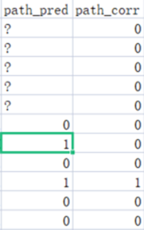

When designing and implementing a machine learning model, ensuring it is continually updated is a challenge that all engineers encounter. 

In this article, I explore the online machine learning technique that I used during a project and present how it was implemented for effective results.

## **Choosing a machine learning method**

Machine learning solutions can be mainly split into offline and online methods. **Online** machine learning is a method in which data becomes available in a sequential order and is used to update the best predictor for future data at each step, as opposed to batch learning techniques which generate the best predictor by learning on the entire training data set at once. 

From this concept, the core components are the **data in a sequential order** and **updating at each step**. Online machine learning is necessary is based on the following reasons:

- Detection models need to be updated instantly, within a relatively short time

- Computation and storage costs need to be minimised for a large dataset

- New types of patterns need to be integrated quickly

## **Using Apache Airflow**

It’s important to have a solid UI to manage the pipelines so I can easily review the chain of pipelines. After much research, I found many engineers recommended Apache Airflow. 

Some of the core concepts for Airflow are described below:

- **Directed Acyclic Graph (DAG)** – is a collection of all the tasks you want to run, organised in a way that reflects their relationships and dependencies.

- **Scheduler and Interval** - The Airflow scheduler monitors all tasks and DAGs, then triggers the task instances once their dependencies are complete. And the interval is used to set up the time period to rerun for a dag.

While using Airflow, we encountered two key challenges: 

- No default option exists for user feedback to be provided based on the prediction result. 

- It is vital that storage requirements are kept to a manageable level, and that the task can be completed quickly enough to enable the business process to function on-time.

## **How we structure different datasets**:

In order to split train and update processes, we separate training, testing, and updating. The update folder is what we use to provide corrected predictions with csv format. The format is depicted as following:

Png1: pred and corr

The 1 in path\_pred is the anomaly prediction. The path\_corr is copied initially from path\_pred and then corrected by the analyst.

## **How to achieve online learning in Airflow**:

In order to overcome the drawback without interactive mode in Airflow, I had to implement a custom offline solution. Thanks to the powerful automation of Airflow, I just need to set a location and input the corrected prediction result there. Then, the Airflow will read the data from the specific location as an update DAG.

## **Practicality and speed considerations in online learning**:

As we solved the online machine learning part, we now face the problem about time consumption, and storage. 

As for time consumption, the prediction is made within every interval. The data is sent to the update folder to await reading by DAGs.  Every prediction with the timestamp as the filename can be treated as one batch. Instead of reading and extracting the whole batch of data, I chose only the wrong prediction (after correction) and subsequently extracted the sequence (use LSTM model) from that row in csv. 

seq\_array = df.query("path\_pred=='1' & path\_corr in \[0,'0'\]")\['seq\_path'\].values

Png2: read single prediction sequence

After splitting the sequences into multiple X and Y (number is less than the total data in a batch), I trained the model based on the chosen data, attempting to integrate the right prediction with certain attempts. 

<table class="has-white-background-color has-background"><tbody><tr><td><code><mark style="background-color:rgba(0, 0, 0, 0)" class="has-inline-color has-luminous-vivid-amber-color">for</mark></code> i <mark style="background-color:rgba(0, 0, 0, 0)" class="has-inline-color has-luminous-vivid-amber-color">in </mark>range(len(batch_y)): &nbsp; &nbsp; &nbsp; &nbsp; # extract the predict_proba for batch_y &nbsp; &nbsp; &nbsp; &nbsp; pre_proba = pred_y[i][int(np.argmax(batch_y[i]))] &nbsp; &nbsp; &nbsp; &nbsp; # set the exit condition &nbsp; &nbsp; &nbsp; &nbsp; success_flag = <mark style="background-color:rgba(0, 0, 0, 0)" class="has-inline-color has-luminous-vivid-amber-color">False</mark> &nbsp; &nbsp; &nbsp; &nbsp; no_of_attempts =<mark style="background-color:rgba(0, 0, 0, 0)" class="has-inline-color has-pale-pink-color"> 0</mark> &nbsp; &nbsp; &nbsp; &nbsp; # retrain on the single input and output &nbsp; &nbsp; &nbsp; <mark style="background-color:rgba(0, 0, 0, 0)" class="has-inline-color has-luminous-vivid-amber-color">&nbsp; while</mark> pre_proba &lt;= desired_proba <mark style="background-color:rgba(0, 0, 0, 0)" class="has-inline-color has-luminous-vivid-amber-color">and</mark> (no_of_attempts&lt;attempts): &nbsp; &nbsp; &nbsp; &nbsp; &nbsp; &nbsp; &nbsp; &nbsp; &nbsp; &nbsp; &nbsp; &nbsp; &nbsp; &nbsp; &nbsp; &nbsp; &nbsp; exec_model.fit(np.reshape(batch_x[i],(<mark style="background-color:rgba(0, 0, 0, 0)" class="has-inline-color has-pale-pink-color">1</mark>,<mark style="background-color:rgba(0, 0, 0, 0)" class="has-inline-color has-pale-pink-color">-1</mark>)), np.reshape(batch_y[i],(<mark style="background-color:rgba(0, 0, 0, 0)" class="has-inline-color has-pale-pink-color">1</mark>,<mark style="background-color:rgba(0, 0, 0, 0)" class="has-inline-color has-pale-pink-color">-1</mark>))) &nbsp; &nbsp; &nbsp; &nbsp; &nbsp; &nbsp; &nbsp; &nbsp; &nbsp; &nbsp; &nbsp; &nbsp; no_of_attempts +=<mark style="background-color:rgba(0, 0, 0, 0)" class="has-inline-color has-pale-pink-color"> 1</mark>  &nbsp; &nbsp; &nbsp; &nbsp; &nbsp; &nbsp; pred_one_y = exec_model.predict_proba(np.reshape(batch_x[i],(<mark style="background-color:rgba(0, 0, 0, 0)" class="has-inline-color has-pale-pink-color">1</mark>,<mark style="background-color:rgba(0, 0, 0, 0)" class="has-inline-color has-pale-pink-color">-1</mark>)), verbose=<mark style="background-color:rgba(0, 0, 0, 0)" class="has-inline-color has-pale-pink-color">2</mark>) &nbsp; &nbsp; &nbsp; &nbsp; &nbsp; &nbsp; pre_proba = pred_one_y[<mark style="background-color:rgba(0, 0, 0, 0)" class="has-inline-color has-pale-pink-color">0</mark>][int(np.argmax(batch_y[i]))] &nbsp; &nbsp; &nbsp; &nbsp; &nbsp; &nbsp; &nbsp; &nbsp; &nbsp; &nbsp; &nbsp; &nbsp; print(<mark style="background-color:rgba(0, 0, 0, 0)" class="has-inline-color has-vivid-green-cyan-color">"Attempt Number %d, Predicted Proba for this iteration %f"</mark> %(no_of_attempts, pre_proba))  &nbsp; &nbsp; &nbsp; &nbsp; &nbsp; &nbsp;<mark style="background-color:rgba(0, 0, 0, 0)" class="has-inline-color has-luminous-vivid-amber-color"> if</mark> pre_proba &gt; desired_proba: &nbsp; &nbsp; &nbsp; &nbsp; &nbsp; &nbsp; &nbsp; &nbsp; success_flag = <mark style="background-color:rgba(0, 0, 0, 0)" class="has-inline-color has-luminous-vivid-amber-color">True &nbsp; &nbsp; &nbsp; &nbsp; &nbsp; &nbsp; &nbsp; &nbsp; break</mark>  &nbsp; &nbsp; &nbsp; &nbsp;<mark style="background-color:rgba(0, 0, 0, 0)" class="has-inline-color has-luminous-vivid-amber-color"> if</mark> (success_flag ==<mark style="background-color:rgba(0, 0, 0, 0)" class="has-inline-color has-luminous-vivid-amber-color"> False</mark>)<mark style="background-color:rgba(0, 0, 0, 0)" class="has-inline-color has-luminous-vivid-amber-color"> and</mark> (no_of_attempts &gt;= attempts): &nbsp; &nbsp; &nbsp; &nbsp; &nbsp; &nbsp; print("<mark style="background-color:rgba(0, 0, 0, 0)" class="has-inline-color has-vivid-green-cyan-color">[-] Failed to incorporate this feedback"</mark>)  <mark style="background-color:rgba(0, 0, 0, 0)" class="has-inline-color has-luminous-vivid-amber-color">&nbsp; &nbsp; &nbsp; &nbsp; if</mark> success_flag == <mark style="background-color:rgba(0, 0, 0, 0)" class="has-inline-color has-luminous-vivid-amber-color">True</mark>: &nbsp; &nbsp; &nbsp; &nbsp; &nbsp; &nbsp; print(<mark style="background-color:rgba(0, 0, 0, 0)" class="has-inline-color has-vivid-green-cyan-color">"[+] Feedback incorporated \n"</mark>) &nbsp; &nbsp; &nbsp; &nbsp; &nbsp; &nbsp; print(<mark style="background-color:rgba(0, 0, 0, 0)" class="has-inline-color has-vivid-green-cyan-color">"Took %d iterations to learn!"</mark> %(no_of_attempts))</td></tr></tbody></table>

Png3: update based on single x and y array

By implementing this solution, the model can be trained much quicker and save time overall. To reduce storage requirements, every file in the update folder is unlinked after being processed. 

Of course, it is not possible to ensure every model will be more accurate after retraining. To manage this risk, I apply A/B testing here as well. The updated model is saved to another location and only replaces the original after performing as expected in testing.
