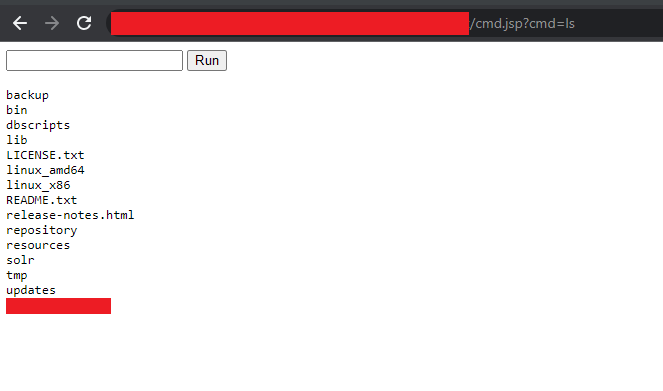
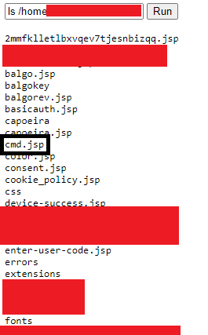
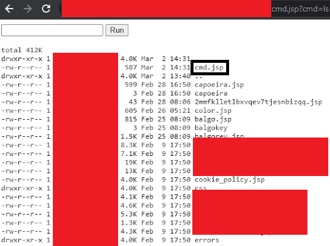
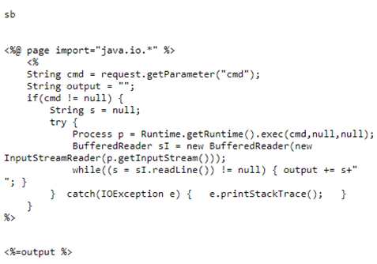
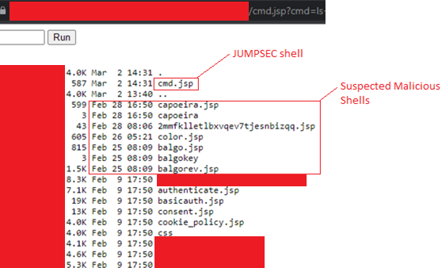

At the time of writing I am enjoying some non-billable time in the wake of a demanding engagement spanning across several months. As such, I thought it would be a good time to write up a war story from a recent project in which we came head to head against genuine and active threat actors whilst on an engagement.

To set the scene, I am working on a purple team project in which we are to cover both the external and internal estate. This tale comes from the external portion of the engagement and as such my colleague and I are going about our usual external red team attack methodology. During this external phase we identify several instances of servers running a software that will remain unnamed for confidentiality’s sake. I will say that this was a third-party software that is used for Identity Access Management, and it appeared to be used in several environments (pre-prod, production, etc) within the client’s estate.

We fingerprint the exact version of the technology in-use and find that it is in fact vulnerable and outdated. Specifically, it is vulnerable to an unrestricted file upload vulnerability. As is so often the case, metasploit had created a module for the automated exploitation of this vulnerability - great news! As this is not a covert red team, and therefore getting detected is not an issue, I attempt to exploit the file upload vulnerability using meterpreter and msfvenom. Alas, the exploit fails. Undeterred, I look to manually verify the vulnerability myself as I so often find myself doing when metasploit fails me.

I find a proof-of-concept script on Github and read through the code. It looks good so I quickly write (steal) a JSP webshell to accompany the script and point the pair at my client’s vulnerable servers. This time, it works. With what feels like ‘too good to be true’ ease I’ve got remote code execution on the production Single Sign On (SSO) and Identity Access Management (IAM) server! As always in these cases I let the client know immediately before digging a little bit deeper.

When landing on an unknown machine I want to immediately perform some situational awareness. From an external perspective this may look slightly different to internal. Some of the main questions include: What OS/distribution am I using? What user and permissions do I have? Am I domain-joined? Do I have visibility into the internal network?

I quickly determine these answers and find that I am running as a low-privileged user, on a unix machine, that is not domain-joined. Not as juicy as I originally thought, but this is still the production SSO and IAM box so I am hopeful. At this point I get my first inclination that maybe such a trivial exploit chain may have already been abused. I run an _ls_ to look for the existence of other webshells beyond just my own.

\[caption id="attachment\_19445" align="aligncenter" width="663"\] Output of 'ls' command\[/caption\]

As you can see it appears that I am in the site root of the server. However, what I do not see is the name of my own webshell (cmd.jsp) meaning that my file must not have been uploaded to the site root, more likely it is in the webroot.

To find the location of the webroot I simply use my webshell to search for the location of my webshell file name to find where all files uploaded via this exploit would land on the file system. Sure enough, I found the appearance of my webshell in a folder that we will falsely call _/home/UserName/AppName/Authenticated._ The natural next step is to list the contents of this directory as seen in the screenshot below.

\[caption id="attachment\_19451" align="aligncenter" width="265"\] Contents of Webroot\[/caption\]

Whilst this was useful, it was listing the files in alphabetical order which made it difficult to process which file could be a malicious JSP file versus one naturally used for webserver installation. I do another _ls_ command but this time listing the contents of the directory in descending order of date modified. That helps clear things up!

\[caption id="attachment\_19452" align="aligncenter" width="556"\] Contents sorted by Date Modified\[/caption\]

I immediately notice the large number of files that have the exact same last modified date and time on Feb 9th. My assumption is that Feb 9th was when the webserver was installed, as all the installation files share this modification date. This leaves 8 files that have been uploaded in the 21 days since installation. The top entry (cmd.jsp) is my webshell and can be excluded. Judging by the time stamps and similar file names this still leaves several unaccounted for JSP files. Naturally, I did a _cat_ on those files and sure enough…they were also webshells.

\[caption id="attachment\_19453" align="aligncenter" width="477"\] Threat Actor Webshells\[/caption\]

At this point I know we have stumbled upon something bad. I phone the client and let them know the news whilst I continue trying to attribute some of the webshells. Due to the fact that some of the files had very similar names and were uploaded consecutively I can safely assume that they belong to the same threat actor. When grouping as such, I arrive at the conclusion that there have been 4 threat actors who have exploited this in the last 5 days!

This is, of course, not counting any threat actors who had deleted their webshells when not in use like I had done. In the same vein, it is important to bear in mind that this was only one of several appearances of this vulnerable server in the estate.

I reach out to the client to ask permission to repeat the same process on the other vulnerable instances, but by this point the client has engaged their Managed Detection and Response (MDR) provider who has already begun the digital forensics work of identifying the extent of the damage,  whilst the client’s security team begin working on a patch. I write up a professional document containing all my findings, remediation steps, etc., and hand it over to both parties.

Later that evening I receive an email saying that the vulnerability has been patched and, thankfully, it appears it was caught before it became too much of an issue. However, the MDR provider did see attempts to jump from the external box to the internal network, and confirmed that the box had been enrolled in a crypto mining bot network to use its resources for crypto mining. All things considered this was a pretty good outcome after the initial shock of compromising such a sensitive system.

And with that quick turnaround my brief headbutt with a genuine and active threat actor(s) came to an end. It is not every day that you get findings like this but it lit the fire in me to get more exposure to the Incident Response side of things, and the client was happy we’d found and fixed a critical vulnerability in just a handful of hours. Wins all round!
