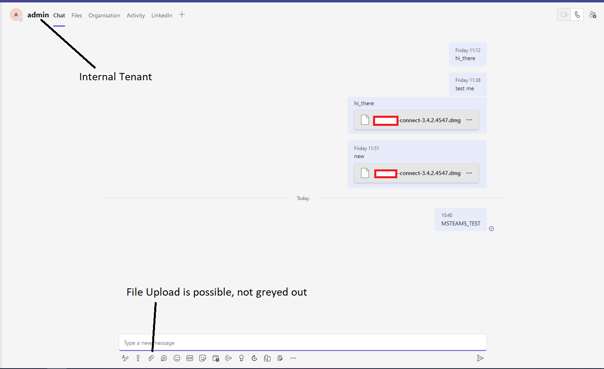
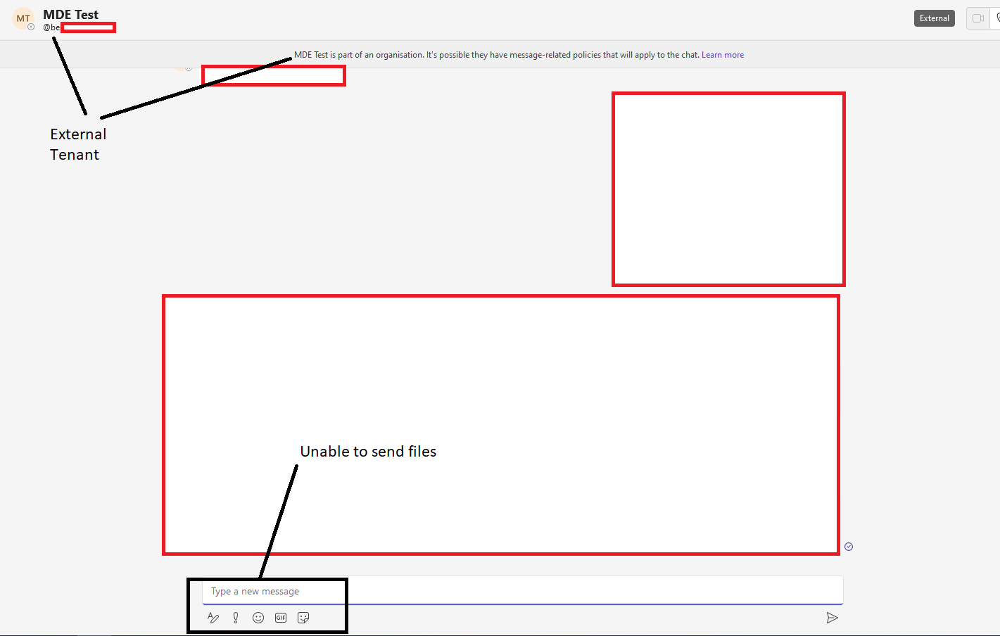
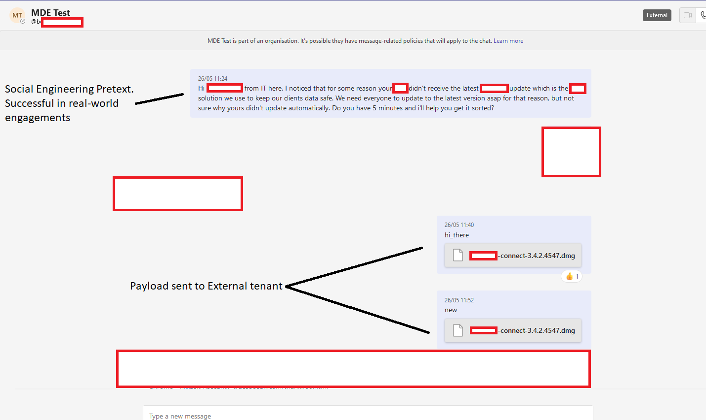
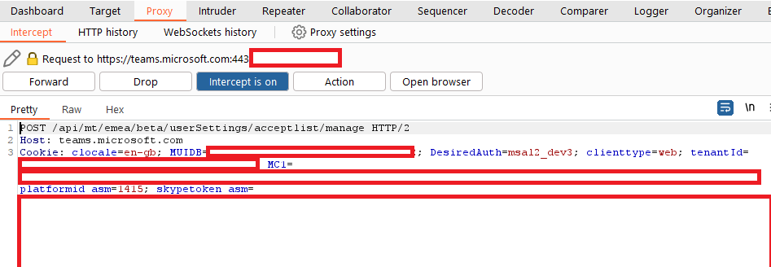

### **TL;DR**

Max Corbridge (@CorbridgeMax) and Tom Ellson (@tde\_sec) of JUMPSEC’s Red Team recently discovered a vulnerability in the latest version of Microsoft Teams which allows for the possible introduction of malware into any organisations using Microsoft Teams in its default configuration. This is done by bypassing client-side security controls which prevent external tenants from sending files (malware in this case) to staff in your organisation. JUMPSEC has detailed remediation options, as well as some detection opportunities. 

### Introduction

Introducing malware into target organisations is becoming increasingly difficult. Many of the traditional payload types (.exe, Office Macros, etc) are now heavily-scrutinised or have been proactively addressed to reduce their [_efficacy_](https://learn.microsoft.com/en-us/deployoffice/security/internet-macros-blocked). Similarly, payload delivery avenues such as phishing are becoming increasingly monitored and secured to reduce the ease with which threat actors’ malware can reach end-user devices. Mail security controls, IP blocklists, domain reputation, email HTML, content inspection, third-party mail security products, URL filtering and many more must be bypassed for a phishing campaign to traverse all anti-phishing security controls and land in a target’s inbox. 

As such, threat actors and red teams alike are looking for newer and potentially overlooked avenues of payload delivery. One such novel avenue is Microsoft Teams External Tenants. Organisations that use Microsoft Teams (91% of the Fortune 100 according to [_this article_](https://www.linkedin.com/pulse/91-fortune-100-companies-use-teams-techbanditshack)) inherit Microsoft’s default configuration which allows users from outside of their organisation to reach out to their staff members. By allowing this, an entirely new avenue of social engineering (and now payload delivery as this blog will explain) is created.

### Detail

Microsoft Teams allows any user with a Microsoft account to reach out to ‘external tenancies’. Here, external tenancies can be thought of as any business or organisation using Microsoft Teams. These organisations each have their own Microsoft tenancy, and users from one tenancy are able to send messages to users in another tenancy. When doing so, an ‘External’ banner appears alongside the name as seen below. 

\[caption id="attachment\_19671" align="aligncenter" width="391"\] External banner applied to incoming message requests\[/caption\]

As someone who spent a long time doing purely social engineering (phishing, vishing, smshing, etc.) this is not a show stopper by any means. In my experience, whilst this banner (and the subsequent pop-up) may deter a handful of targets, there is still a significant percentage of staff that would click on a message from an external tenant and accept the subsequent warning that the user is ‘external’. In fact, this was proven only last month, as the techniques used in this blog post were successfully used to gain an initial foothold in a client’s environment as part of a red team engagement. This is especially true if the malicious party is impersonating a known member of your organisation, and has purchased and registered a brand-impersonation domain as red teams often do.

When messaging staff in another organisation you are blocked from sending files to them, unlike with members of your own tenancy. See below the difference:

\[caption id="attachment\_19672" align="aligncenter" width="1496"\] Messaging a member of the same organisation\[/caption\]

\[caption id="attachment\_19673" align="aligncenter" width="1421"\] Restrictions when messaging someone in a different organisation\[/caption\]

So far, this is nothing new. However, having leveraged this social engineering avenue in the past I began wondering if this security control could be bypassed to allow for seamless delivery of payloads directly into a target's inbox on our red team engagements. I began looking online, and articles [_like this_](https://aadinternals.com/post/teams-policies/) suggested that certain security controls are actually implemented client-side in Microsoft Teams.

I raised this with JUMPSEC’s Head of Offensive Security (Tom Ellson) and no more than 10 minutes later we had bypassed the security control and were able to send files into a target organisation. Exploitation of the vulnerability was straightforward using a traditional IDOR technique of switching the internal and external recipient ID on the POST request, usually here:

```
/v1/users/ME/conversations/<RECIPIENT_ID>/messages 


```

\[caption id="attachment\_19674" align="aligncenter" width="1429"\] Payload delivered directly into a target inbox\[/caption\]

When sending the payload like this, it is actually hosted on a Sharepoint domain and the target downloads it from there. It appears, however, in the target inbox as a file, not a link. 

Having identified the issue, I wanted to validate that this vulnerability would work as intended as an avenue for payload delivery into a target organisation, and not fall short for some unknown reason when used in a mature client environment. As such, last month I used this vulnerability to deliver our red team C2 (malware) payload directly into a target inbox to gain our initial foothold on a covert red team engagement. This allowed for a much more simple, reliable, and user-friendly payload delivery avenue than traditional phishing journeys. 

### Why is this a big deal?

The true reason I see this to be a potentially lucrative avenue for threat actors to deliver payloads is the fact that this bypasses nearly all modern anti-phishing security controls mentioned in the introduction of this advisory. 

Firstly, it is very straightforward to buy a domain similar to your target organisations and register it with M365. It avoids the need to use mature domains, with web servers, landing pages, CAPTCHAs, domain categorisation, and URL filtering. This is a huge time saver, as this can cost several days or more on a red team engagement when setting up the various bits of infrastructure needed for a convincing phishing campaign. 

Secondly, it avoids the now-rightfully-dangerous act of clicking on a link in an email, something that staff have been trained to avoid for years now, greatly reducing the likelihood of a typical staff member detecting this as a phishing attack. The payload will now be served by a trusted Sharepoint domain, and will arrive in the form of a file in a target’s Teams inbox. As such, the payload inherits the trust reputation of Sharepoint, not a malicious phishing website.

Finally, when this vulnerability is combined with social engineering via Teams it becomes very easy to start a back-and-forth conversation, jump on a call, share screens, and more. By comparison, it makes social engineering via email feel very stagnant, and stop-start. When using this on a real engagement the pretext of an IT technician was used to ask the target if they could jump on a call to update some critical software. Once on the call this vulnerability was leveraged to deliver a payload and, when combined with a full social engineering attack, was implicitly trusted by the target. 

### Impact

This vulnerability affects every organisation using Teams in the default configuration. As such it has huge potential reach, and could be leveraged by threat actors to bypass many traditional payload delivery security controls. Having now proven this hypothesis, and used this vulnerability to successfully deliver malware that compromised a target machine in a client's environment, I feel this has been successfully demonstrated as an exploitable finding.

### Remediation and Detection

This vulnerability was reported to Microsoft, who validated that the vulnerability is legitimate, but said that it ‘did not meet the bar for immediate servicing’. I think this is a shame, but was nonetheless expected. As such, JUMPSEC has added this section to help organisations who might be concerned about the above findings. 

Firstly, I urge you to review if there is a business requirement for external tenants to have permission to message your staff in the first place. Of course, many businesses do legitimately require communication with other organisations, service providers, and more. That is not the case, however, for all businesses that use Teams. If you are not currently using Teams for regular communication with external tenants, tighten up your security controls and remove the option altogether. This can be done in Microsoft Teams Admin Center > External Access.

If you do require communication with external tenants, but there are only a handful of organisations that you regularly communicate with, then you can change the security settings to only allow communication with certain allow-listed domains. This would be a good middle ground for shutting down this attack path, without affecting your business operations. This can be done in Microsoft Teams Admin Center > External Access. 

If either of the above will not work in your unique business case you have a few options. Firstly, endeavour to educate staff on the possibility of productivity apps such as Teams, Slack, Sharepoint, etc, for launching social engineering campaigns. It is not just email that is being abused any more, and yet it seems, in my personal opinion, that when using alternative avenues to email there is an inherent trust, due to the rich history connecting phishing and emails. 

Regarding detections, there is currently limited support from Microsoft. Whilst there are plenty of Teams logs (see here for a full list [https://learn.microsoft.com/en-us/microsoft-365/compliance/audit-teams-audit-log-events?view=o365-worldwide](https://learn.microsoft.com/en-us/microsoft-365/compliance/audit-teams-audit-log-events?view=o365-worldwide)) these do not currently cover the crucial ‘External Tenants Messaging your Staff’, or even better ‘Staff Member Accepts Message Request from External Tenant’. The latter would be preferable, as it would eliminate alerts from previously-known external tenants (your service providers, etc) and focus just on new message requests. I have reached out to Microsoft to attempt to turn on these logs so that they can be monitored in line with the increased usage of Teams for social engineering. If you agree that this should be made available, then please give the feature request a thumbs up (https://feedbackportal.microsoft.com/feedback/idea/16fe3111-4410-ee11-a81c-000d3a7a48db)

Whilst not a perfect solution, it would be possible to use web proxy logs to alert on, or more likely gain some baseline visibility into, staff members accepting external message requests. In EMEA, when a Teams user accepts a message request from an external tenant it sends a POST request to a unique URI which you can monitor:

/api/mt/emea/beta/userSettings/acceptlist/manage

 

\[caption id="attachment\_19675" align="aligncenter" width="947"\] URI for accepting external message requests\[/caption\]

The difficulty, at present, is turning this into a useful piece of telemetry with usernames, and the message in question. Monitoring this will, however, give you an idea of how common this transaction is in your estate, and allow you to potentially implement some of the mitigation factors mentioned above with a more educated understanding. 

### Conclusion

As a Red Teamer regularly tasked with achieving an initial foothold in a target organisation, I have a unique appreciation and concern for the above-mentioned finding. With over 270 million active monthly users, Teams is incredibly common in target organisations. JUMPSEC’s Detection and Response Team (DART) have seen a trend towards novel phishing and payload delivery techniques leveraged in the wild, including but not limited to using Teams external tenancies for social engineering. With threat actors continually experimenting with new social engineering attacks, organisations are having to expand their security awareness to cover previously-overlooked frontiers.
