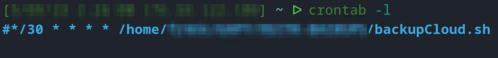
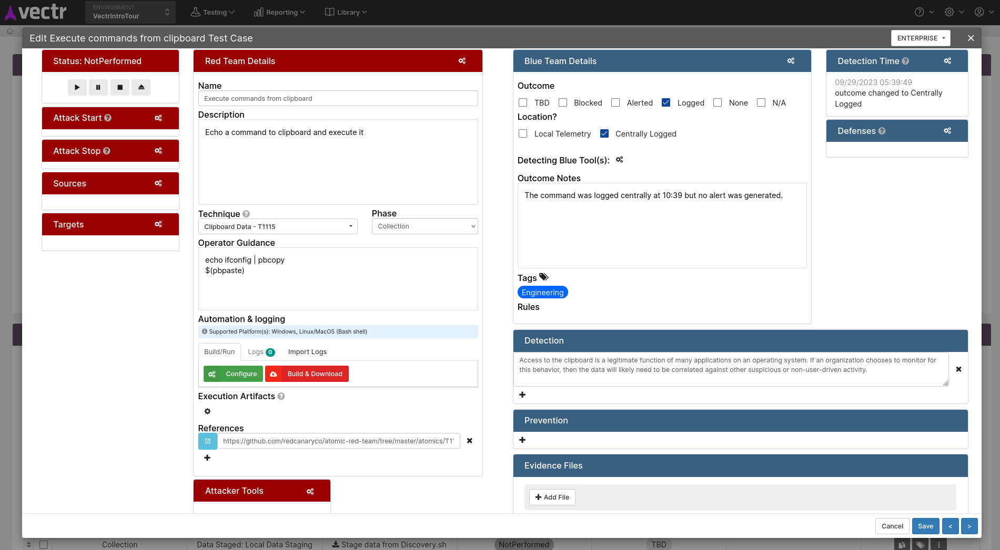
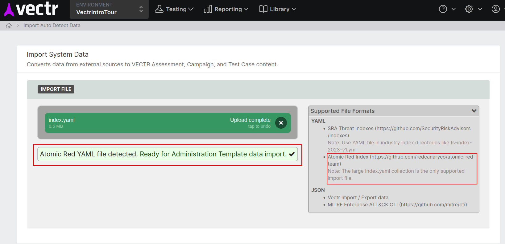
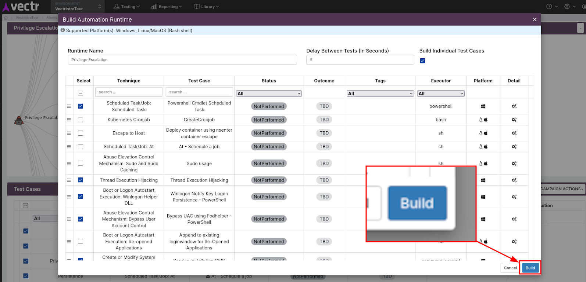
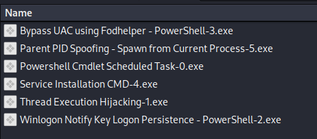
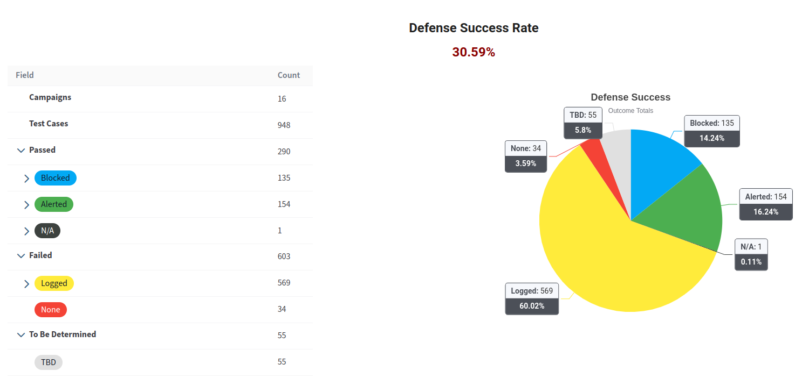

## Introduction

As anyone who has conducted a lengthy purple team engagement will tell you, logging and centralising the huge amount of data from these engagements can quickly become overwhelming. In the past we have seen attempts to use generic productivity software, such as Sharepoint, to attempt to track the huge number of activities and logs generated by both the red and blue teams. However, as you can imagine, shoehorning large quantities of engagement data from two teams with different operating procedures into a single application not built for this purpose can be…tricky.

As purple team enthusiasts, we believe we have found a better solution to this problem, and sharing that with the wider security community is the purpose of this blog post. We also want to share some guidance when using this framework to help others avoid making the mistakes we have in the past.

## What is VECTR?

First of all, what is VECTR? VECTR is an open-source purple team framework that can assist in all phases of purple team exercises, from planning and executing test cases to sharing the relevant information with clients and colleagues. At its core, VECTR is a tool that enables red and blue teams to work together towards a common goal. The framework helps with streamlining operations, enhancing collaboration, and provides advanced reporting capabilities which we have found to be very useful. It allows purple teams to achieve a more comprehensive and proactive approach to improving security by highlighting the gaps that will help build, or improve, defensive controls.

However, keep in mind that VECTR is still just a tool in your arsenal and it will not automate the above-mentioned tasks for you (at least not yet!). It therefore still requires a certain amount of manual labour for planning and entering test cases, maintaining and setting up the hosting server and importing libraries or backing up your databases. However, as a framework it does a good job of organising what can often become an enormous and convoluted data set of a lengthy purple team into something manageable and built for purpose.

## Setup and Backup

The framework was developed by SRA (SecurityRiskAdvisors), it’s open-source and is available here: [https://github.com/SecurityRiskAdvisors/VECTR](https://www.google.com/url?q=https://github.com/SecurityRiskAdvisors/VECTR&sa=D&source=editors&ust=1695990756685968&usg=AOvVaw0izs_1WzGwrSSxOt8_V-8j). The setup is relatively straightforward and can be achieved by following the installation documentation located at [https://docs.vectr.io/Installation/](https://www.google.com/url?q=https://docs.vectr.io/Installation/&sa=D&source=editors&ust=1695990756686426&usg=AOvVaw16aNSRVjOiaTb-Vhgj5OYr).


###### _Starting up the VECTR instance._

  

VECTR stores engagement data in a MongoDB database. When delivering purple team engagements this database can be exported and has, in our case, been included as a deliverable to be used by our clients to explore the details of the engagement in their own time.

As VECTR will soon become the home of all of your important engagement data, it is crucial to have regular backups! To eliminate human error we create a cron job which executes a script that backs up the VECTR’s mongo database. We have shared this below.

```
#!/bin/bash
#  1. the script logs into the vectr box via ssh 
#   and executes mongodump on the mongo container -
#        to save a snapshot of VECTR's database in /tmp.
#  2. the dump is then moved out of the docker container 
#   and on the hosting box's /tmp folder, archived as .tgz.
# 3. using scp, a copy of the database dump is move onto your 
#   local machine in ~/PurpleTeam/VECTR_Backups
#
now=$(date "+%b_%d_%Y_%H.%M")
echo backup day and month:"$now"

# run mongodump in the container, put it in the /tmp/ directory in the container. 
# This is using the default password and default container name:
ssh -i ~/.ssh/vectr_box_rsa root@10.10.0.10 "docker exec -w /tmp purpleteam-vectr-mongo-1 /bin/bash -c 'mongodump --username mongouser --password mongopsw --authenticationDatabase admin"

# copy the file out of the container:
ssh -i ~/.ssh/vectr_box_rsa root@10.10.0.10 "docker cp purpleteam-vectr-mongo-1:/tmp/dump$now.tgz ."

# copy the file to local machine:
scp -i ~/.ssh/vectr_box_rsa root@10.10.0.10:"/root/dump$now.tgz" ~/PurpleTeam/VECTR_BACKUPS/
```

###### _The above script can be used and executed regularly using a cronjob._

  



###### The picture shows the crontab that execute the backup script every 30 minutes.

  

In the worst case scenario, the mongo database can be restored to another VECTR instance running on a different box:

```
# Copy the database backup onto the new machine and then copy it to the VECTR’s 
# mongo container using the following command:
docker cp /home/ubuntu/dump.tgz instance_name-vectr-mongo-1:/home/
# Extract the database inside the docker container:
tar -xzvf dump.tgz
# Enter the container using bash:
docker exec -it instance_name-vectr-mongo-1 bash
# It is now possible to restore the database using the following command on the 
# VECTR hosting container:
mongorestore ./databasename -db --username mongodbuser --password mongodbpassword --authenticationDatabase admin
```

###### _Procedure to restore a mongodb database on VECTR._

  

## Key Features

Here are some of the features that we believe make VECTR an attractive option for purple teamers:

- Easy deployment
- Atomic Red Team integration
- Automation of test cases execution via custom runtimes
- Maintenance and backup integrations
- Reporting features (charts and graphs)
- MITRE Navigator integration
- Detection rules libraries
- Customisation options

One of the things we love about VECTR is how clearly it was built for purple team engagements. As you can see below, each test case is split into red team and blue team. This allows for the red team to carry out a test case and log the outcome, evidence and change the status of the test case ready for the blue team. Built into the same test case item you have a section for the blue team to update if it was detected, prevented or alerted, and provide their own evidence. There really is no other tool we have found that makes centralising engagement activity so straightforward.



###### _How the Red and Blue team collaboration experience looks like in VECTR._

  

## Atomic Red Team

As many purple teamers know, Atomic Red Team (ART) is a collection of Tactics, Techniques and Procedures (TTPs) that can speed up the process of identifying gaps in detection and response controls. It does this by automating the execution of techniques that are commonly carried out by advanced threat groups, allowing you to cover far more ground than manual testing alone. VECTR provides a nifty out-of-the-box integration for this library that can then be used to build specific “campaigns” (as labelled by VECTR). VECTR will generate an executable file in which all of your selected TTPs can be conducted one after another, hugely speeding up the process of mimicking the TTPs of a wide range of threat actors. We found that this freed up more time for the manual activities, whilst still allowing us to get wide coverage.



###### _Importing the ART library on VECTR to be used in our campaigns._

  

The techniques can be individually “deployed” and executed on a target system (Windows, MacOS or Linux) or performed sequentially by leveraging the “Automation Runtime” executable generated from the VECTR dashboard.



###### _Selecting techniques to include in the Automation Runtime executable._

  



###### _Individual techniques compiled through VECTR’s Automation Runtime feature._

  

## Reporting

Finally, we mentioned that we leverage the charts and graphics implemented in VECTR. The data and information logged in your test cases can be easily converted into visual representations of the security estate. We have found this to be especially useful when presenting to executive or non-technical audiences.



###### _A pie chart generated off the test cases carried out and their result._

  

## Conclusion

In summary, we found VECTR to be an exceptional tool for purple team engagements and collaborative projects that require both red and blue teams working together. The framework provides a great number of features out of the box, as well as opportunities for customisation. For this reason, we continue to use it during our purple team engagements and would like to extend a thank you to the team over at SRA for maintaining it.
