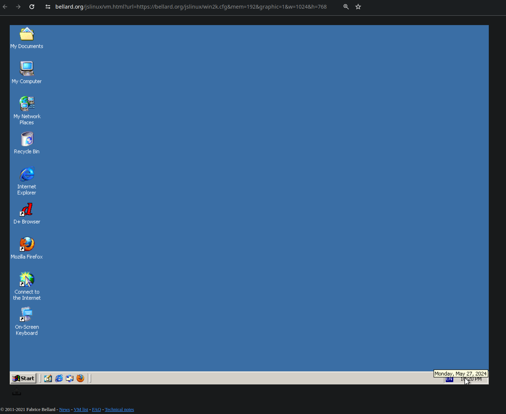
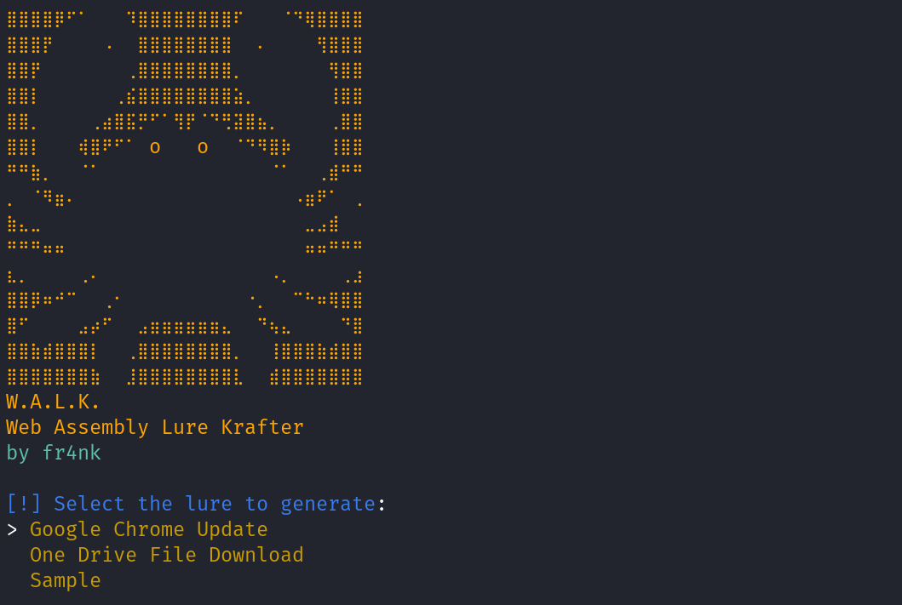
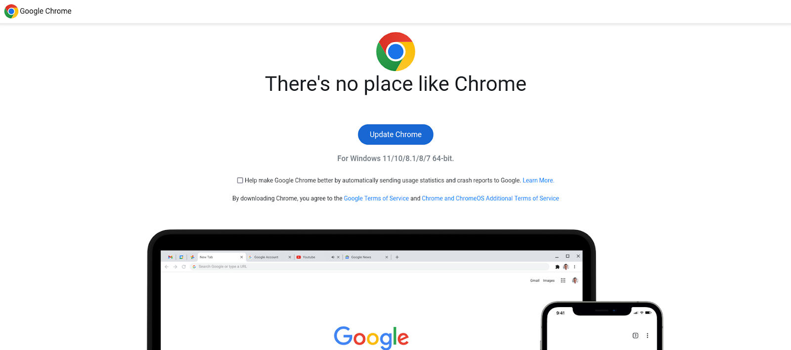
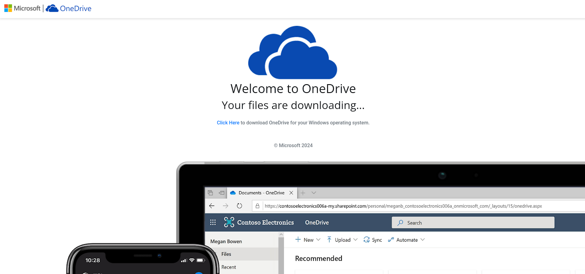
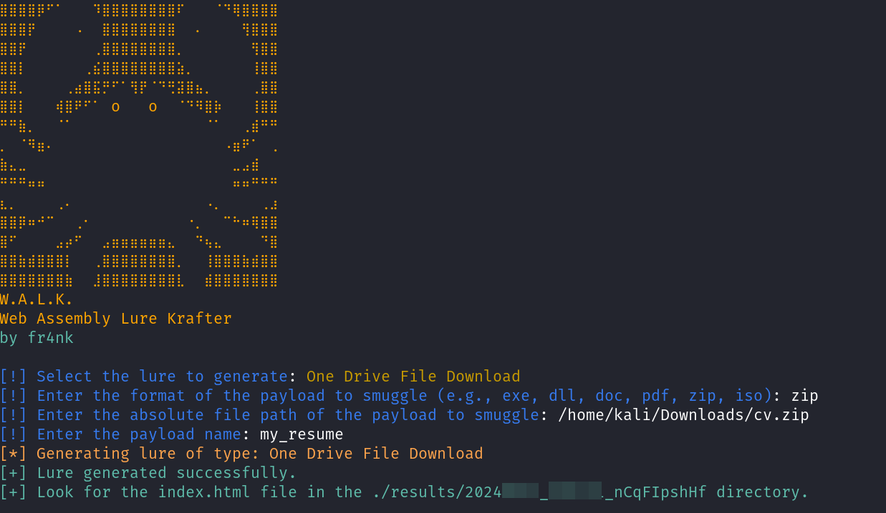
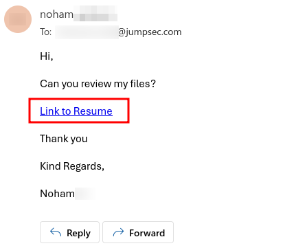
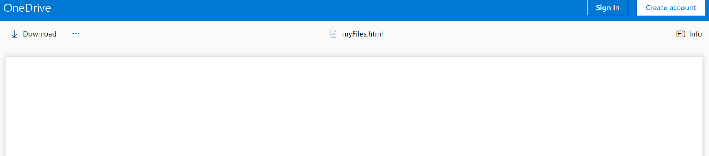

**_TL;DR_**

This blog post introduces Web Assembly (WASM) as a powerful alternative to traditional web technologies, highlighting its appeal to cybersecurity professionals for evading security measures for initial access. WASM has been observed being leveraged in the wild as a new payload delivery avenue which can land payloads in a hardened email inbox or instant messaging chats. A new tool, W.A.L.K. (Web Assembly Lure Krafter), is released alongside this blogpost to automate the generation of payloads using Rust, bringing back HTML smuggling attacks and enhancing red teamers tradecraft.

# Introduction

Everyone is aware that the internet is powered by a plethora of platforms, services and technologies, but all the web content we see nowadays were fundamentally built using HTML, CSS and JavaScript. This has been the holy trinity of the web that allowed creative developers to build an amount of sites and content on the internet that cannot possibly be explored in the span of a lifetime, at least not in a non-automated fashion (and I guess I’m including the dark web too there).

At the same time not everyone is aware that a different way of building web pages has been available to developers and browsers for almost a decade, and this is called Web Assembly.

Web Assembly (also known as WASM) was released to the public for the first time in 2017. It has allowed internet wizards and obscure developers alike to simulate operating systems or play Doom ([Doom 3 Demo](https://wasm.continuation-labs.com/d3demo/)) from within browsers (yes, it can play Doom!), opening the world wide web to a new way of building content that was once only reserved for compiled programming languages.

Windows 2000 rendered in browser using Web Assembly ([view](https://bellard.org/jslinux/vm.html?url=https://bellard.org/jslinux/win2k.cfg&mem=192&graphic=1&w=1024&h=768)). More projects can be found on [madewithwebassembly](https://madewithwebassembly.com/).

# What is WASM?

WASM’s origins can be traced back to asm.js, a subset of JavaScript designed to facilitate the deployment of C and other demanding applications within web browsers. Recognising its potential, it was W3C that spearheaded it's evolution into the open standard now known as Web Assembly. Web Assembly’s strengths lay in its core promise of speed and performance, far outpacing traditional JavaScript. It allows browsers to perform intensive computations with efficiency and stability, avoiding many of the pitfalls of JavaScript's limitations.

It operates in two primary formats: a compact binary format for the browser's Virtual Machine (VM) and an assembly-like textual format. While earlier technologies like Adobe’s Flash struggled with this, Web Assembly stands out, although it still remains under scrutiny for [potential vulnerabilities](https://www.youtube.com/watch?v=QWsSNRQN7v8). Importantly though, Web Assembly supports the seamless execution of code from multiple languages such as C, C++, Rust, and Go.

# Why is WASM interesting to cybersecurity folks?

You probably guessed it by now! As it is a lesser known alternative to build web content, it is also more interesting for threat actors that want to circumvent classic email filters and their security controls.

From the red teaming perspective WASM presents features that can introduce malicious capabilities such as:

- Run malicious content within browsers.
- Evade traditional known-malicious JavaScript functions, like window.local.href (a property in JavaScript that gets or sets the URL of the current window, usually used to redirect the browser to a different URL) and window.navigator.msSaveOrOpenElob (typically used to download files from a web application, it allows for the saving or opening of a blob).
    
- Bypass detection mechanisms typical of conventional file type signatures.

Consider all of the mechanisms that browsers, web service providers, operating systems and security companies have developed and implemented over the years to identify, detect and alert against suspicious web pages that try to execute malicious code. Such defences have been mostly adapted to the malicious JavaScript and HTML tags that can be contained in a web page. So, what happens when instead we use Web Assembly to build a web page? We observe security controls becoming nearly non-existent when attempting to determine whether the web page is nefarious or legitimate.

Combine WASM with techniques such as payload smuggling and you get a modern and stealthy initial access tactic that gets past modern email and instant messaging defences allowing your initial access to land in your target’s inbox unhindered!

When I read about this I was way too excited not to dive into this evolved way of smuggling payloads and therefore, if you haven’t before, I’m honoured to introduce you to WASM smuggling and the tool I have built to automate payload generation.

# Smuggling Payloads using W.A.L.K.

I was never a proficient developer (even more so for languages such as C or Rust) so I asked for some help from my favourite AI companion to better understand the concepts behind WASM smuggling. I started from this amazing article from [deliver.to](https://blog.delivr.to/webassembly-smuggling-it-wasmt-me-648a62547ff4) and managed to create a few web lures leveraging Rust, which inevitably led me to wanting to build a tool to automate the process. The above deliver.to’s article describes how attackers have been using Rust to recreate classic HTML smuggling techniques that get past the craziest email controls. Bonus - it also gives some nice templates coded in Rust!

On top of this, a [CrowdStrike article](https://www.crowdstrike.com/blog/ecriminals-increasingly-use-webassembly-to-hide-malware/) also described how threat actors have been using this technique for a few years now (the article is from 2021) and together with NetSPI’s blog post on [SilkWASM](https://www.netspi.com/blog/technical-blog/adversary-simulation/obfuscating-html-smuggling-with-web-assembly/) I felt like I had enough examples to start building towards executing this tactic and going through the process needed to generate lures to be weaponised for initial access.

At this point, we know that this technique is actively being used by malicious actors, it can circumvent traditional mail security controls and can be combined with obsolete and disused HTML smuggling techniques to perform older attacks in a modern fashion. Although bringing back Beef hooks may sound exciting, these were not very effective against modern browser sandboxing features. Yet attacks such as [SVG Smuggling](https://blog.delivr.to/html-smuggling-recent-observations-of-threat-actor-techniques-74501d5c8a06) could be fruitful when built using WASM.

The process of creating a standalone WASM smuggling lure is somewhat tortuous if you are not a proficient Rust developer and I will purposefully skip the part where I tell you how to manually set one up. There is enough information on the internet to understand and guide you through this process. Nonetheless, allow me to introduce you to my new tool W.A.L.K. (Web Assembly Lure Krafter) which I developed to ease the above-mentioned process of building a standalone WASM payload smuggling lure.

The lure generated by the tool is based on prebuilt lure templates coded in Rust. It embeds payloads to smuggle through in a single HTML file which can then be sent in either instant messaging chats or via email attachments.

W.A.L.K. can be found at the following Github repository:

> [https://github.com/JumpsecLabs/WALK_WebAssembly_Lure\_Krafter](https://github.com/JumpsecLabs/WALK_WebAssembly_Lure_Krafter)

Follow through the repo’s README to set up your Rust environment and the relevant WASM libraries. Once done, navigate to the project’s root folder and simply run the tool from the command line using cargo run.

This will start W.A.L.K., presenting a menu with 3 lure templates to select from. The selection will be used to generate a template that embeds a custom payload and delivers it differently based on the lure selected.

The “Google Chrome Update” lure was designed to simulate a Google Chrome binary download motivated by a pretext such as “I.T. wants you to upgrade your version of Chrome”. The download button will trigger the download of the payload you embedded during the generation through W.A.L.K.

The “One Drive File Download” template instead uses a lure based on the looks of Microsoft OneDrive. The lure generated off this template will trigger a file download 4 seconds after rendering the web page, simulating the delivery of files via a shareable OneDrive link.

As an example, this can be used with the pretext of wanting to provide HR (or a recruiter) with your resume and perhaps smuggle a payload through with it.

After the lure is selected, the program will guide through all the other options and values needed to build the HTML smuggling payload in Web Assembly. For example, the program will ask for the file extension to utilise for the downloaded payload, its location on the file system for the payload to be embedded as well as the file name shown for the file when downloading the payload.

Once the lure is compiled, W.A.L.K. will show the relative file path of the generated lure. The file to smuggle consists of a standalone “index.html” file contained in the results folder of the project. Such index.html files can then be uploaded and sent via email or chat, effectively allowing your payload to be transported and smuggled through.

The above-mentioned lures, wrapped in a single HTML file, have been observed successfully landing in hardened corporate email inboxes, surprisingly circumventing any active controls that we are used to experiencing when dealing with email and instant messaging chats (e.g. spam filtering/classification, file AV scans), even when the message comes from standard non-corporate inboxes that present TLDs such as gmail.com, outlook.com, live.com, etc..

The figure shows how the index.html file can be embedded into the email body to look more legitimate.

For example, in this case both the email provider and OneDrive malware scans did not pick up the malicious contents of the file (called myFiles.html) and allowed the Download to happen from their platform.

The index.html file can then be sent in various ways and linked to your messages using a number of methods that may allow more or less number of clicks before the victim executes the contents of the smuggled payload. The reader is left with the arduous task of determining the best way to convey their smuggling lure to their victims and how many clicks their targets will need to go through before execution.

Although not properly documented as of now, W.A.L.K. was designed for modularity. This means that it is possible to create more lure templates to expand the menu selection and allow new templates to be utilised with the tool. Despite not being documented yet, these capabilities are there and anyone interested can dive into the code in the repository to leverage this feature. There will eventually be a follow up blog post explaining how to create new Web Assembly lures in Rust and how to make them so that they can be used to expand W.A.L.K.'s lurebase.

# Conclusions

Although attacker-centric, this blogpost is intended to be a heads up for detection and response practitioners, but also to any defensive security researchers who feel the urge to dive into the intricacies of such a technique after reading this blog post.

Current security controls do not yet seem capable of determining the IoCs and the heuristics involved, and so we are in need of additional detection and prevention mechanisms that can reduce the risk of malicious web assembly attacks.

I really hope you enjoyed this article and will find my tool useful for your future red team engagements or to develop better defences and controls.

So long, and wish you the best of fun in your hacking journeys!

# Credit

Credit where credit is due. This section is dedicated to give a big shout out to NetSPI for the initial research done into weaponising WASM for initial access as described in their article, linked here:

[The Silk Wasm: Obfuscating HTML Smuggling with Web Assembly](https://www.netspi.com/blog/technical-blog/adversary-simulation/obfuscating-html-smuggling-with-web-assembly/)

And another thank you to the researchers at delivr.to who have released an amazing  research on how to build your WASM lure using Rust, which was used as a starting point for W.A.L.K. and really helped me understand this technique. You can find their research here:

[WebAssembly Smuggling: It WASM’t me](https://blog.delivr.to/webassembly-smuggling-it-wasmt-me-648a62547ff4)

# Resources:

- Link to W.A.L.K. (JUMPSEC Github):
    - [Github - W.A.L.K. Web Assembly Lure Krafter](https://github.com/JumpsecLabs/WALK_WebAssembly_Lure_Krafter)
- HTML Smuggling
    - [https://www.outflank.nl/blog/2018/08/14/html-smuggling-explained/](https://www.outflank.nl/blog/2018/08/14/html-smuggling-explained/)
    - [https://assume-breach.medium.com/home-grown-red-team-lnk-phishing-in-2023-revisited-again-2b8c885b9836](https://assume-breach.medium.com/home-grown-red-team-lnk-phishing-in-2023-revisited-again-2b8c885b9836)
- Web Assembly Smuggling Research
    - [https://www.netspi.com/blog/technical/adversary-simulation/obfuscating-html-smuggling-with-web-assembly/](https://www.netspi.com/blog/technical/adversary-simulation/obfuscating-html-smuggling-with-web-assembly/)
    - [https://blog.delivr.to/webassembly-smuggling-it-wasmt-me-648a62547ff4](https://blog.delivr.to/webassembly-smuggling-it-wasmt-me-648a62547ff4)
- Videos
    - Modern Initial Access and Evasion Tactics: [https://youtu.be/DyyD48iKsKE](https://youtu.be/DyyD48iKsKE)
    - Desperate Infection Chains:[https://youtu.be/CwNPP\_Xfrts](https://youtu.be/CwNPP_Xfrts)
- CTI
    - [https://www.crowdstrike.com/blog/ecriminals-increasingly-use-webassembly-to-hide-malware/](https://www.crowdstrike.com/blog/ecriminals-increasingly-use-webassembly-to-hide-malware/)
