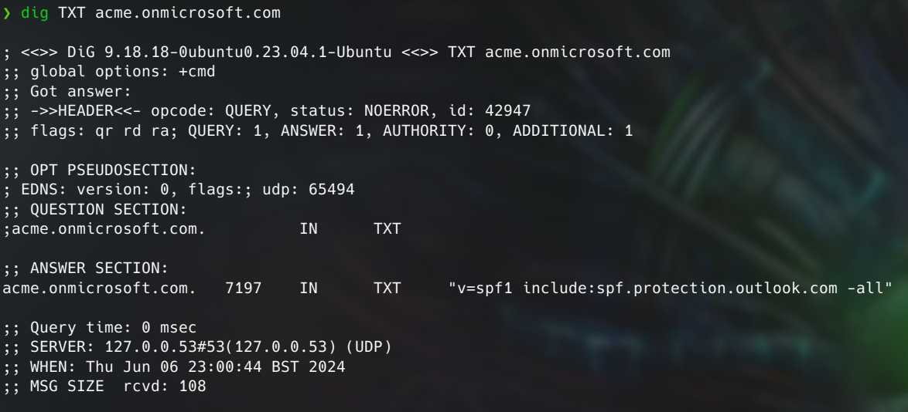
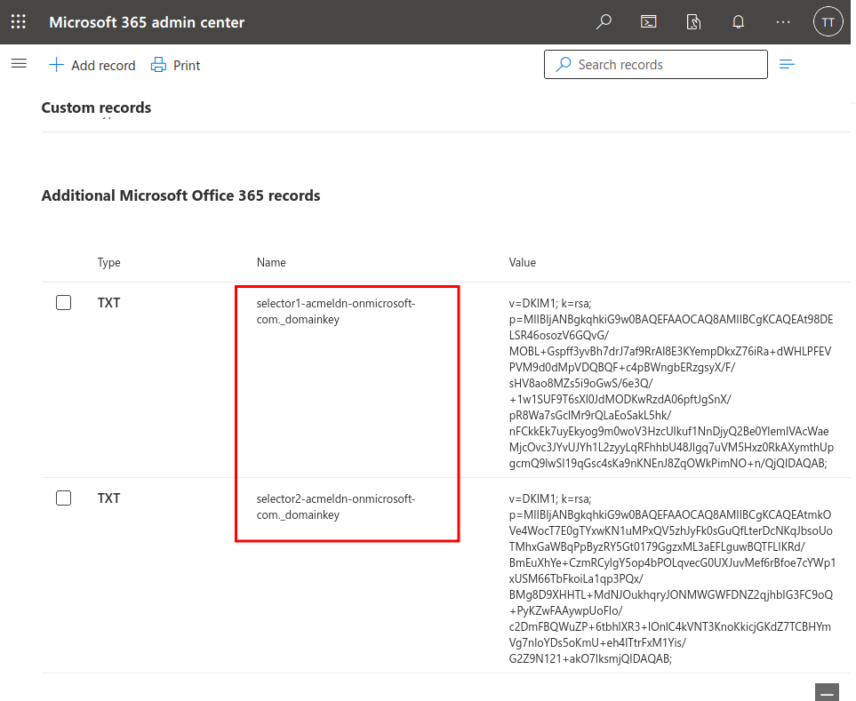
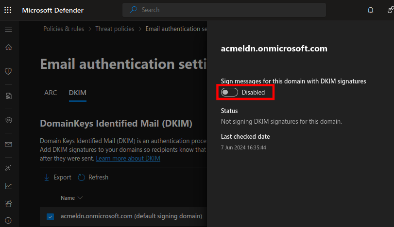
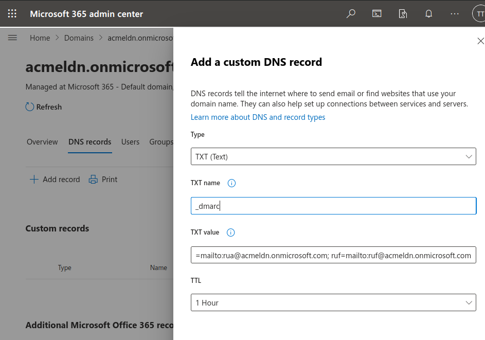
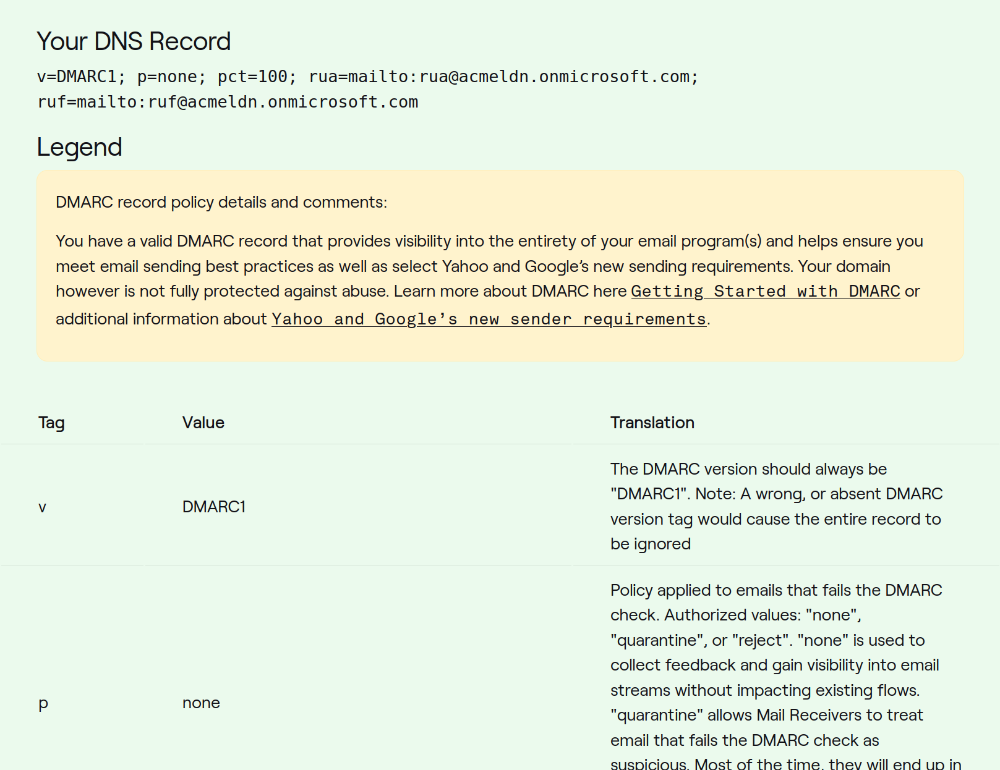

In this labs post, I will introduce you to modern security controls that are currently used (but not always correctly) by the vast majority of enterprises, and hopefully by the end of this write-up, the topic will become a little clearer and the concepts will become easier to grasp.

In today’s world of spammers, intruders, and fake emails, having a robust setup for your email deliveries is crucial. Email security is a constant challenge, with businesses and individuals facing an increasing number of virus-infected emails and phishing scams daily. Protecting systems and sensitive data requires vigilance and continuous effort.

According to Zscaler’s latest annual phishing report, the past year saw a 58% increase in phishing attacks (_[https://www.zscaler.com/blogs/security-research/phishing-attacks-rise-58-year-ai-threatlabz-2024-phishing-report](https://www.zscaler.com/blogs/security-research/phishing-attacks-rise-58-year-ai-threatlabz-2024-phishing-report)_). This rise highlights the growing need for effective email security measures to ensure that malicious emails do not end up in our corporate or personal inboxes.

A significant advancement is the availability of enhanced security options designed to shield us from harmful emails. These innovative methods significantly enhance the safety of email interactions. What’s more, these improved security measures are effective regardless of whether you’re sending or receiving emails. By adopting these new approaches, we can substantially minimise the risks associated with email-related threats, thereby fostering a safer experience for all parties involved.

### **Sender Policy Framework (SPF)**

It’s an email authentication protocol designed to assist mail servers in identifying and thwarting spam, phishing, and spoofing attempts. This mechanism relies on DNS records to publish a roster of authorised mail servers and validate the origins of emails.

```
                    
                    +-------------------------+
                    | Mail Sender's Domain    |
                    | (e.g., example.com)     |
                    +-------------------------+
                               |
                               | Sends Email
                               v
                    +-------------------------+
                    | Recipient's Mail Server |
                    +-------------------------+
                               |
                               | Queries DNS for SPF Record
                               v
                    +-------------------------+
                    | DNS Server              |
                    +-------------------------+
                               |
                               | Returns SPF Record
                               v
                    +-------------------------+
                    | Recipient's Mail Server |
                    +-------------------------+
                               |
           +---------------------------------------+
           |                                       |
   Compares IP Address                      Action Based on
   with SPF Record                          SPF Verification
           |                                       |
           |                                       |
           v                                       v
    +--------------+                       +----------------+
    | Match Found  |                       | No Match Found |
    +--------------+                       +----------------+
           |                                       |
           v                                       v
   Accepts Email                           Rejects/Quarantines/
                                            Marks Email as Spam

```

Here’s how it works: When an email is dispatched from domain A, the mail server of domain B scrutinises domain A’s SPF record. If no SPF record is found for domain A, it signifies that the mail server isn’t an authorised sender. Consequently, the email fails the SPF check and is either flagged as spam or rejected outright.



In the provided example, the SPF record includes the version of SPF being utilised and lists Outlook mail servers. Additionally, it employs the “-all” flag, indicating a strict policy where any mail server not explicitly listed in the SPF record will fail the check. Conversely, “~all” signifies a softer policy where failures are treated less strictly.

One limitation of SPF is its restricted scope of protection. It solely verifies the sender’s IP address against the domain’s SPF record, leaving a vulnerability against spoofing of the `From:` email header, a common tactic used to deceive recipients.

### **Domain Keys Identified Mail (DKIM)**

This email authentication protocol is designed to detect forged sender addresses by enabling receivers to verify if an email is legitimately sent from a specified domain. It introduces a unique domain name identifier to emails, distinct from other identifiers, and secures it through encryption using public and private keys. The public key is shared as part of the DNS record to verify the email signature and is stored on the sender’s email server, while the private key resides on the sender’s computer and is used to generate a unique digital signature for each outgoing email. This signature, essentially a hash value derived from the email’s content and headers, is encrypted with the private key and included in the email header.

> ```
> DKIM-Signature: v=1; a=rsa-sha256; d=example.com; s=selector1;
>  h=from:to:subject:date:message-id;
>  bh=47DEQpj8HBSa+/TImW+5JCeuQeRkm5NMpJWZG3hSuFU=;
>  b=abc123...
> 
> ```

The DKIM header provides essential information including the DKIM version being utilized, the signing algorithm employed, the domain of the entity that signed the email, the selector used to locate the public key in DNS, and a list of headers included in the signature, along with the body hash and signature data.

In essence, DKIM serves to verify that the email content has not been tampered with during transit and that it originates from an authorised mail server for the specified domain.

### **Domain-Based Message Authentication Reporting and Conformance (DMARC)**

This mechanism serves as an authentication layer, providing an additional level of security beyond SPF and DKIM. It introduces an extra policy alignment layer and reporting mechanism.

The policy enables specification of how to handle emails that fail SPF and DKIM checks—options include none, quarantine, or reject. When both SPF and DKIM checks pass, it confirms the legitimacy of the email, verifying that it originates from an approved server and that header information remains unaltered. For SPF alignment, the domains specified in the `From:` header and Return-Path must match.

For DKIM, the domains specified in the `From:` and `d=` fields must align.

> ```
> v=DMARC1; p=reject; rua=mailto:dmarc-reports@example.com; 
> ruf=mailto:dmarc-forensics@example.com; fo=1; adkim=s; aspf=s;
> 
> ```

Above is the example DMARC record can be found as TXT record in DNS of a domain.

`v=` specifies DMARC version `p=` specifies policy that handles emails that are failing authentication (either none, quarantine, or reject) `rua=` is an address to send aggregate reports `ruf=` address to send forensic reports `fo=1` specifies format of forensic reports `adkim=s` specifies alignment mode for DKIM (where s = strict and r = relaxed), `aspf=s` specifies alignment mode for SPF (s = strict and r=relaxed)

Configuring DMARC can be challenging, but there is a valuable resource available at [https://dmarc.org/2016/07/common-problems-with-dmarc-records/](https://dmarc.org/2016/07/common-problems-with-dmarc-records/) that comprehensively addresses common issues encountered during the implementation of this protocol.

### **Bolstering Email Security - O365 example**

By default, in our Microsoft 365 tenants, the SPF record is automatically configured during tenant creation, alleviating concerns about it for the time being. Our focus now shifts to setting up the DKIM record, especially in scenarios where we manage our own domain DNS. To verify the SPF record, you can use the following command:

❯ `dig acmeldn.onmicrosoft.com txt`

> ```
> ;; ANSWER SECTION:
> 
> acmeldn.onmicrosoft.com. 3508   IN      TXT     "v=spf1 include:spf.protection.outlook.com -all"
> 
> ```

To set up DKIM, we first need to check for our domainGUID. This can be done by using the dig command to check for the existing domainGUID.

❯ `dig acmeldn.onmicrosoft.com mx`

> ```
> ;; ANSWER SECTION:
> acmeldn.onmicrosoft.com. 3508   IN      TXT     "v=spf1 include:spf.protection.outlook.com -all"
> 
> ```

Next, we visit the Microsoft Admin Center at [https://admin.microsoft.com/AdminPortal/Home#/Domains](https://admin.microsoft.com/AdminPortal/Home#/Domains), where we navigate to the DNS records tab to add records. The DomainGUID is specified just before “[mail.protection.outlook.com](http://mail.protection.outlook.com/)”. With this information, we can now manually add CNAME records to our DNS. The records will look like this:

> ```
> Hostname: selector1._domainkey
> Value: selector1-acmeldn._domainkey.acmeldn.onmicrosoft.com
> TTL: 3600Hostname: selector2._domainkey
> Value: selector2-acmeldn._domainkey.acmeldn.onmicrosoft.com
> TTL: 3600
> 
> ```



 

Next, we can enable DKIM in the Microsoft Defender Security Dashboard ([https://security.microsoft.com/authentication?viewid=DKIM](https://security.microsoft.com/authentication?viewid=DKIM)).



Et Voila! With our SPF and DKIM records set up and ready for our outgoing email stream, we can now proceed to enable DMARC. DMARC helps us verify unauthenticated usage of our domain email and ensures validation of the `From` email field. To accomplish this, we can publish the following TXT record in the Microsoft 365 admin center at [https://admin.microsoft.com/AdminPortal/Home#/Domains](https://admin.microsoft.com/AdminPortal/Home#/Domains).

> ```
> Name: _dmarc
> Value: v=DMARC1; p=none; pct=100; 
> rua=mailto:rua@acmeldn.onmicrosoft.com; 
> ruf=mailto:ruf@acmeldn.onmicrosoft.com
> TTL: 3600
> 
> ```



In order to verify our configuration, we can use [https://dmarcian.com/dmarc-inspector/](https://dmarcian.com/dmarc-inspector/)



### **Endnote & Next steps**

Once SPF, DKIM, and DMARC have been successfully implemented, it’s crucial to monitor SMTP logs. By carefully investigating these logs, we can pinpoint the reasons why emails are being blocked. Additionally, aggregate and forensic reports provide valuable insights into the numbers and sources of messages that pass or fail the checks.

The next step involves increasing the DMARC policy to `p=quarantine` and monitor the emails. Gradually increasing the `pct=` value allows us to verify the fail/pass rate. After some time, we can further enhance security by changing the policy `top=reject`. Again, gradual increases in the `pct=` rate enable us to monitor for any false positives or email anomalies, leveraging DMARC logs and inspectors mentioned above.

In short:

1. 1. Add the DMARC record `v=DMARC1; p=none; pct=100; rua=mailto:rua@example.com; ruf=mailto:ruf@example.com`
    2. After some time - enable quarantine within the policy `v=DMARC1; p=quarantine; pct=100; rua=mailto:rua@example.com; ruf=mailto:ruf@example.com`
    3. Gradually change the `pct=` value from 10-100
    4. After some time - change policy to reject `v=DMARC1; p=reject; pct=100; rua=mailto:rua@example.com; ruf=mailto:ruf@example.com`
    5. Gradually change the `pct=` value from 10-100
    6. Test and verify for email deliveries and if legitimate email is rejected by repeating the steps above.

### References:

- [https://learn.microsoft.com/en-us/defender-office-365/email-authentication-about](https://learn.microsoft.com/en-us/defender-office-365/email-authentication-about)
- [https://www.esecurityplanet.com/networks/how-to-set-up-and-implement-dmarc-email-security/](https://www.esecurityplanet.com/networks/how-to-set-up-and-implement-dmarc-email-security/)
