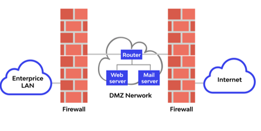
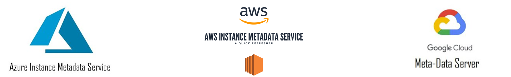
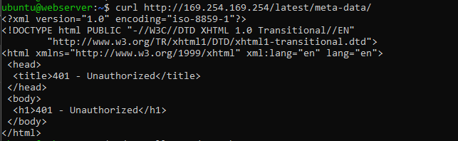
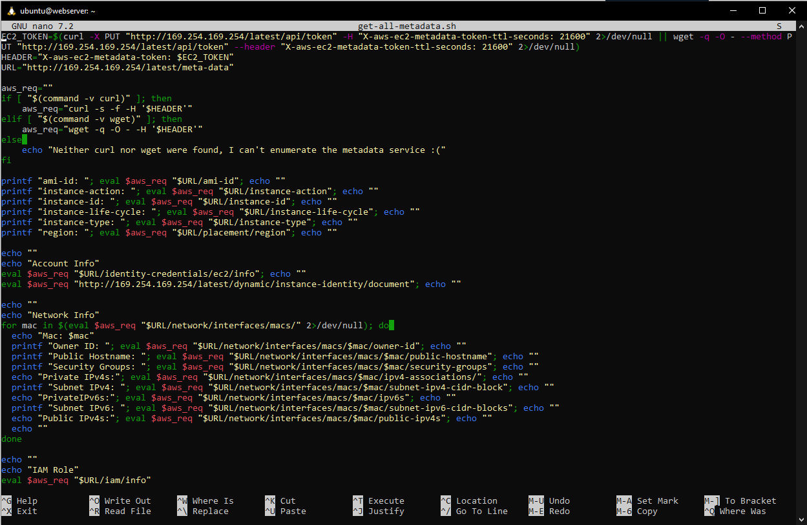
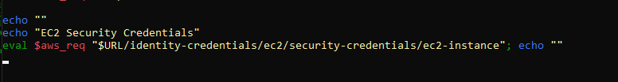
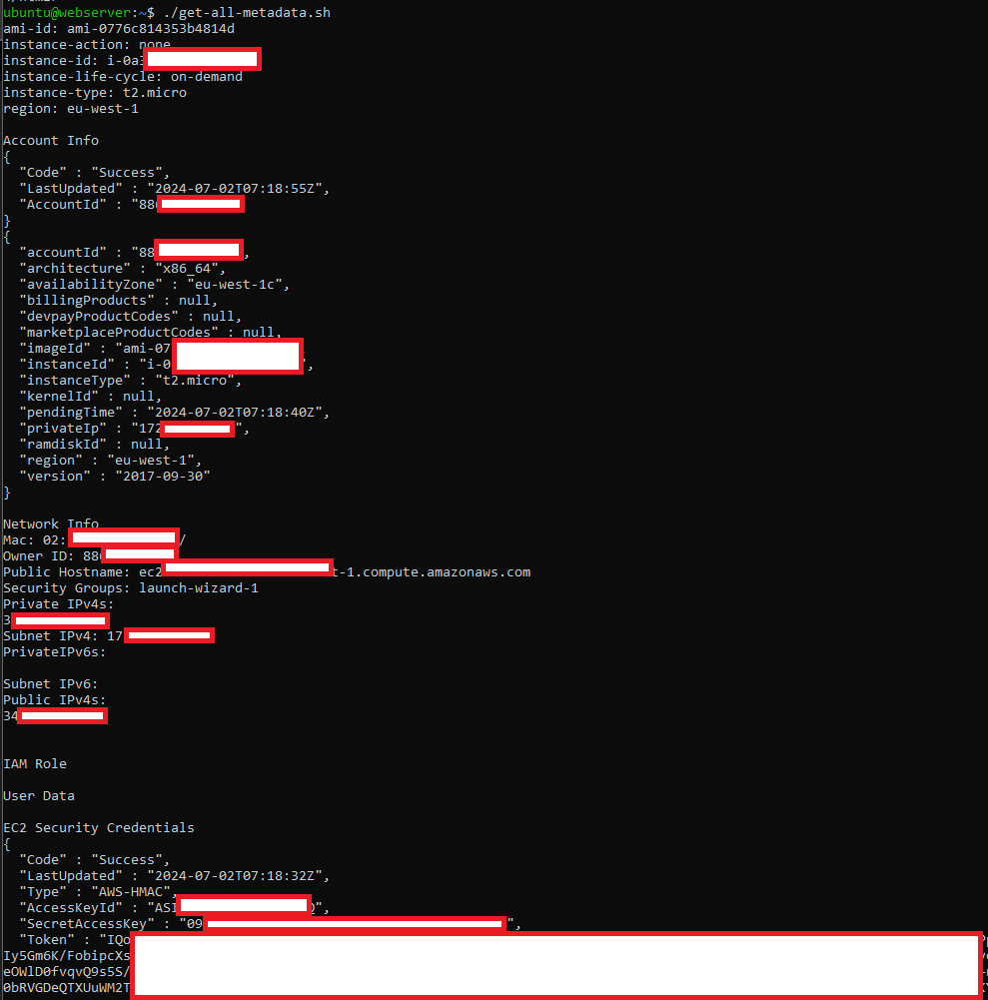
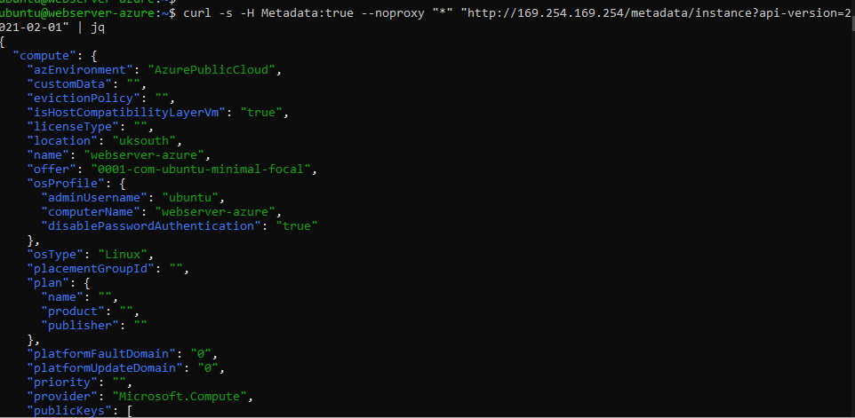
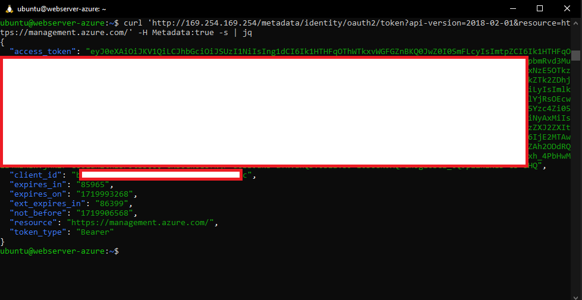
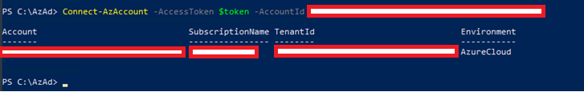
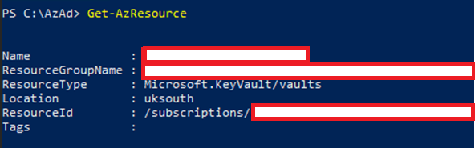

## **Introduction**

I’ve recently spoken at several conferences about the changes that are underway within red teaming as a result of cloud migration. My team and I have been delivering majority cloud red team work over the last year and the differences are becoming more apparent by the day. One point I’ve mentioned as ‘controversial’ at several of these events is that cloud migration has actually made AppSec more important than ever. I went some way to trying to explain why I think this is during my talks, but it was something that I felt deserved its own blog post to explore in more detail, with clear examples of how compromise of an on-prem application can look different to a cloud-hosted one.

## **Disclaimer**

AppSec is a huge domain and one that I will not try to pretend I am currently in a position to speak with authority on as I’ve been focused almost entirely on red teaming over the last few years. Whilst I was an application pentester many moons ago I will be discussing this topic from the perspective of a red teamer / threat actor looking to achieve notable impact from the compromise of an application, namely initial access into an organisation. 

## **The Traditional Approach**

So, before jumping into the cloud-hosted application side of things, let’s briefly discuss the ‘traditional’ approach with which I will be comparing it to. Whilst there are countless ways of hosting a web application, let’s simplify it with a common setup looking something like the below image. 

 

###### _Reference: https://www.wallarm.com/what/what-is-a-dmz_

 

In the above image we can see that the application is being hosted in the ‘demilitarised zone’ or DMZ as would be typical of an on-premise application. This means that the application is effectively firewalled off from the public internet and enterprise (I usually use the term ‘corporate’) networks except for connections that are strictly necessary. Overall, the intention here is to limit the potential impact that could come from compromising said application, crucially preventing it from having unfettered access into the corporate network. This makes sense, as many applications hosted as such are internet-facing and therefore face a considerable risk of compromise. 

 

In traditional setups, you also have a few common additional layers of security to bypass if you wanted to truly weaponise an application you had compromised. Firstly, you will often be using a dedicated ‘service account’ to run the web server. This account is often only used for running this one web server, and as such has next-to-no permissions to do or access anything else. Finally, you may also find that your exploit (for example a malicious file upload vulnerability) lands in what is called the ‘web root’. This is the directory on the web server in which you store all the contents used for hosting the web server such as config files, images, etc. In these scenarios you may find that the service account you have now compromised cannot even explore the web server’s file system, and instead is strictly limited to the web root. 

 

When you add all of this up, you may find instances where your super awesome remote code execution vulnerability actually has very limited impact in terms of progressing an attack path towards the internal estate and / or critical assets. This exact scenario happened to me on a purple team engagement last year, in which I exploited a vulnerability to get remote code execution on a web server, only to find that it was firewalled off from the corporate network, restricted to the web root, was not domain-joined, and my account had very little permissions. Ultimately this meant that its ‘usefulness’ to me was limited. In fact, one interesting tidbit about that story is that by listing the contents of the web root by ‘time modified’ I was able to discern that several genuine threat actors had also compromised that web server the same way within the last 5 days or so. Naturally this kicked off an IR engagement, which ultimately discovered that the threat actors, like myself, had found limited impact from the compromise of the web server so had installed crypto miners and called it a day. A full write up of this story was posted last year and can be found [here](https://labs.jumpsec.com/butting-heads-with-a-threat-actor-on-an-engagement/).

## **Cloud-Hosted**

So, how do things change when we are discussing a cloud-hosted web application? Well, let me start by saying that achieving the same level of defence in depth is certainly possible with a cloud-hosted web application. However, it is our experience that, just like we see overly permissive IAM roles and abusable default settings in every cloud environment we work in, this is rarely as well locked down when it comes to the far less understood world of cloud. 

 

Additionally, beyond the access control and ‘identities’ belonging to these cloud-hosted applications generally not undergoing the same level of scrutiny as on-premise (partly due to ‘least privilege access’ being a mire in the complex world of cloud permissions) we are also able to leverage a nice feature that all cloud providers have implemented in different ways, called the Metadata Service. 

 

 

To understand why the metadata service exists I am going to directly quote a great video on the topic from risk3sixty which I urge you to watch [here](https://www.youtube.com/watch?v=OaG6wHlhbCQ).

 

_“It is an internal IP address that is attached to any given EC2 instance by default, that provides a set of information that can be used by application developers who need their application to automatically perform some tasks”_ \- Risk3Sixty

 

Here, AWS-specific terminology can be interchangeably used with Azure or GCP terminology, as the same features exist for the same reasons across them all. They even all use the same IP address for this [http://169.254.169.254](http://169.254.169.254), meaning you do not need to know the specific implementations. As risk3sixty put it, the ‘set of information’ which can be requested here is vast, but can include some very useful information to an attacker. Top of mind is the web application’s session token that it uses to authenticate to the cloud environment and perform actions. 

 

In order to access this service, we simply need the ability to issue requests as the web application to this specific endpoint. Once we know which endpoint houses the data that is of interest to us we can generate a request and receive back our information. Specifically, we need to coerce the application into sending a HTTP request to the specific metadata endpoint, and read the result. It should go without saying, therefore, that gaining remote code execution on the web server will in almost all cases be sufficient to retrieve that data. However, this could also be leveraged by less ‘impactful’ (in the traditional sense) vulnerabilities such as SSRF. As you might imagine, this could breathe entirely new life into the potential impact of SSRF vulnerabilities.

 

Cloud vendors realised that these vulnerabilities could potentially open doors to new attack vectors, and so introduced additional controls to protect against them. In all modern metadata services you are required to send additional HTTP headers with specific values, meaning that you are more likely back in the realm of remote code execution. However, in older versions you may find that this is not required, meaning that SSRF could still be sufficient.

 

With the theory out of the way let’s look at some practical examples in Azure and AWS. Here are the steps I would take if I landed on an cloud-hosted web servers.

## **AWS**

Firstly, check the version of the metadata service in use. As mentioned, older versions (IMDSv1) do not require additional headers, modern versions (IMDSv2) do.

 

###### Figure 1:  401 response (missing headers) from main metadata endpoint, meaning IMDSv2 is in use

 

As we are working with IMDSv2 we will need to create a bash script or similar which will request the necessary headers, and then include them in subsequent requests which ask for metadata. The script below can be found [here](https://book.hacktricks.xyz/pentesting-web/ssrf-server-side-request-forgery/cloud-ssrf#abusing-ssrf-in-aws-ec2-environment).

 

###### Figure 2: Bash script for gaining access to IMDSv2 

 

Towards the end we can see it requests the ‘credentials’ (think access keys) of the EC2 instance.

 

###### Figure 3: EC2 Security Credentials requested

 

We can then run the script and receive back a plethora of useful information, including the keys and tokens the VM uses. 

 

###### Figure 4: Metadata of EC2 instance collected, with EC2 Security Credentials at the bottom.

 

## **Azure**

In Azure, this looks similar. Firstly, we generate a generic request asking for information about the VM with the ‘Metadata:true’ HTTP header. 

 

###### Figure 5: Metadata being returned from Azure Metadata Service endpoint

 

As the metadata service is returning information correctly we can request our session token of the managed identity assigned to the VM.

 

###### Figure 6: Session token returned for the VM

 

If you are working with an app ‘service’ as opposed to a VM the process is slightly different but still very much possible. In this case you should follow [this](https://book.hacktricks.xyz/pentesting-web/ssrf-server-side-request-forgery/cloud-ssrf#azure-app-service).

Now, we have these session tokens, so what? You may be thinking that we already had remote code execution on the virtual machine to get to this point so why do we care about the session token? Whilst you may try many of the same attack paths that you could with an on-premise application through this RCE, you now also have another angle of attack. With these session tokens you are able to ‘login’ to the cloud environment (usually without MFA as these are intended to be used by your non-human service accounts). From here, your attack vectors are far more extensive than in most traditional setups. 

 

###### Figure 7: Authenticating to the cloud environment as the compromised Azure VM. 

 

For example, having authenticated to the cloud environment you now have an _incredibly_ rich API at your disposal to begin looking for further vulnerabilities. This could include simply running  ‘_Get-AzResource_’ within Azure, which will reveal all resources that you (as the application) have access to. In the screenshot below we can see that in this case this was access to a KeyVault with app secrets within! 

 

###### Figure 8: The compromised application has access to a KeyVault

 

Thanks for making that so nice and easy. No searching through config files to find SQL databases and connection strings, then manually crafting individual SQL queries to begin exploitation. Here, we have simply run a single API command and then can run a second to dump all the information that we have. This is just one example of several thousand that you have available to you once you authenticate with common cloud API tooling.

 

But wait there's more…now that we have the session token for the application we can begin using any number of enumeration, post-exploitation or privilege escalation tools that we want from the perspective of the application. No need to install tooling on the device and trip off those pesky EDR’s, we can simply fire up our preferred tooling (think Azurehound, GraphRunner, bf-aws-permissions, etc.) and load in your session token. Of course, this introduces different OPSEC concerns, but bypassing those detections is something we will discuss later this year (hopefully at a conf!).

## **Cloud Permissions**

Now let’s rub salt in the wound. We’ve used our compromise to hit the metadata service and load up our favourite tooling with a session token. Access should be strictly limited, like it was on-premise right? Whilst this is true in theory, understanding and implementing fine-grained access controls and restrictions is a tall order in the modern world of highly complex cloud environments. 

 

I would like to call out here how many hundreds of IAM roles there are in most cloud environments, many of them with similar yet opposing permissions. Take a [look](https://learn.microsoft.com/en-us/entra/identity/role-based-access-control/permissions-reference) at just the built-in Azure roles (not to mention any custom ones implemented to fill gaps) which already totals more than 130 options. You can see how reading each of these and understanding the nuanced permissions they have can be taxing, and goes some way to explaining why we so regularly see overly permissive accounts. We often see permissions being used without the full knowledge of what subsets of those permissions can introduce. 

 

To provide a very oversimplified example, we regularly see Global Administrator accounts being very well restricted and kept under lock and key. However, some lesser known roles like ‘Privileged Role Administrator’ and ‘Privileged Authentication Administrator’ both allow a threat actor to escalate privileges to Global Administrator through resetting passwords or assigning roles to attacker-controlled accounts. These permissions may have been assigned more liberally, and compromise of them may not trip off as many alerts. 

 

Ultimately, what I am trying to get at here is that when you combine the complexities of modern cloud environments (which we believe to be largely less well understood than on-prem) with the ability to run a plethora of tooling to identify any misconfigurations or overly permissive accounts (including the application you have compromised!) you often introduce far greater security concerns than you might traditionally do on-premise. Don’t believe me? Read [this](https://posts.specterops.io/microsoft-breach-what-happened-what-should-azure-admins-do-da2b7e674ebc) great deep dive into the Microsoft breach which took place at the start of 2024 in which Microsoft themselves had inadvertently given a legacy app service permissions akin to Global Administrator…

 

The above also introduces an entirely new attack vector within Azure, of applications (service principals) that you compromise potentially having elevated permissions in _other_ cloud environments beyond just the tenant you are in…but that is a topic for another day.

## **Serverless Functions**

A final point is that with the rise of serverless architecture (AWS Lambda, Azure Functions, etc.) we are starting to get our hands on these more often. Crucially, these can still be thought of as cloud-hosted web applications, and may be vulnerable to the same risks mentioned above depending on the implementation. For example, a member of our red team recently found a way to package and exfiltrate data over DNS from an AWS Lambda that had DENY ALL on all TCP and UDP ports to all ranges. For a write up on that check out [this](https://labs.jumpsec.com/whats-in-a-name-writing-custom-dns-tunnelling-protocol-on-the-fly-exploiting-unexpected-aws-lambda-misconfiguration-all-in-a-web-app-pen-test-part-1/) recent labs article. The key point here is that whilst they might not look and feel like traditional web apps, these serverless functions present the same risk to an organisation as a web app and can be used to progress attack paths just as well. 

## **Conclusion**

In conclusion, I am not suggesting that up until this point AppSec has not been of paramount importance. However, when looking at the arguments presented and the work we’ve been conducting as a team over the last year I feel that the migration to cloud might present yet another watershed moment in AppSec’s journey. Perhaps it will take a notable organisation to be breached via a cloud-hosted application entry point for this point to become salient, but in my eyes it is a matter of when, not if. Thanks for reading and I hope my internal monologue on the topic was of interest!
