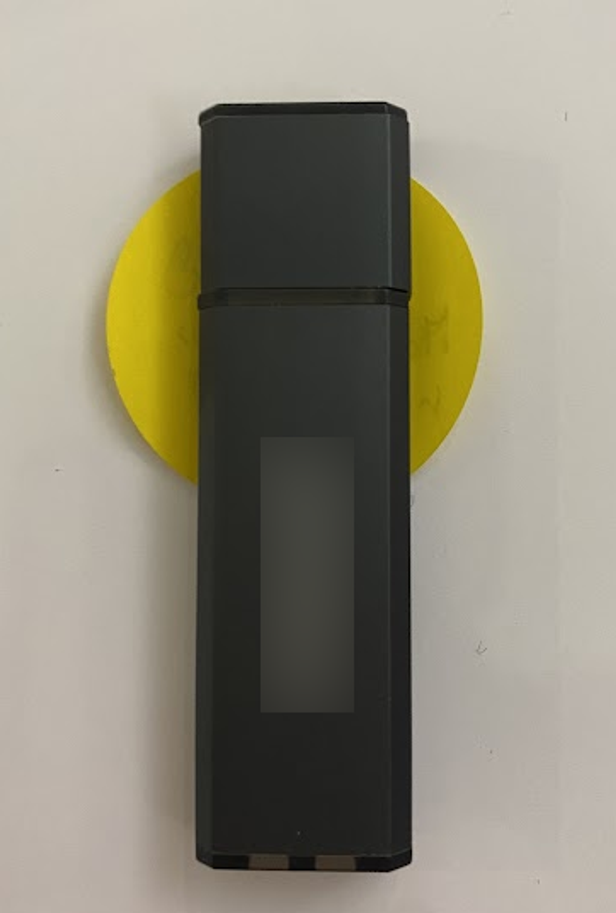
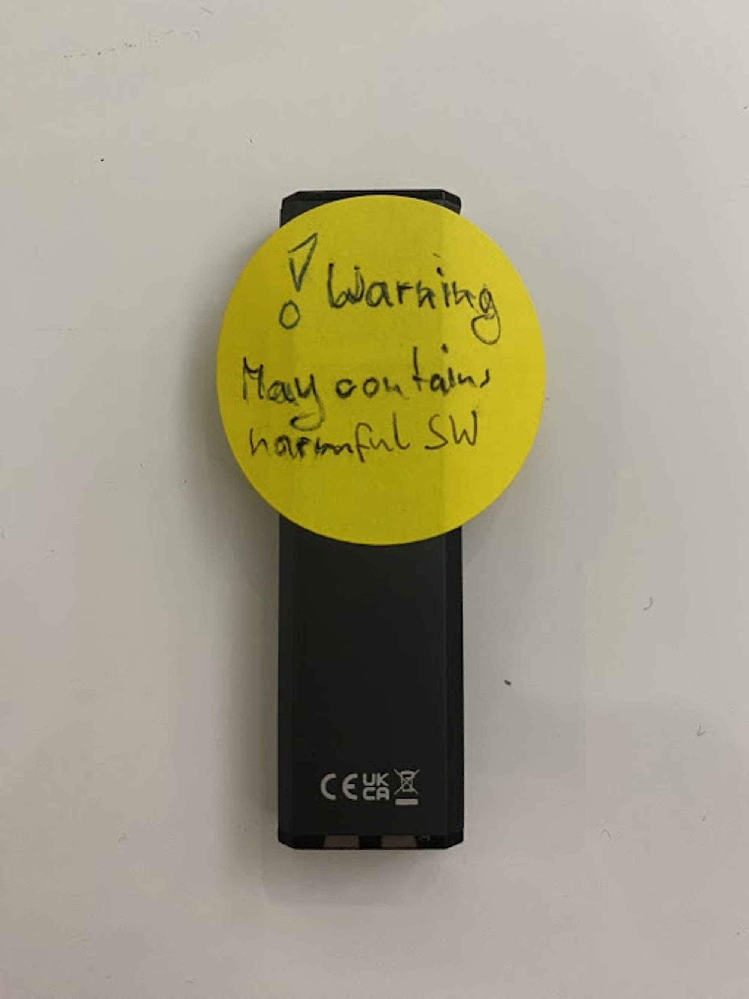
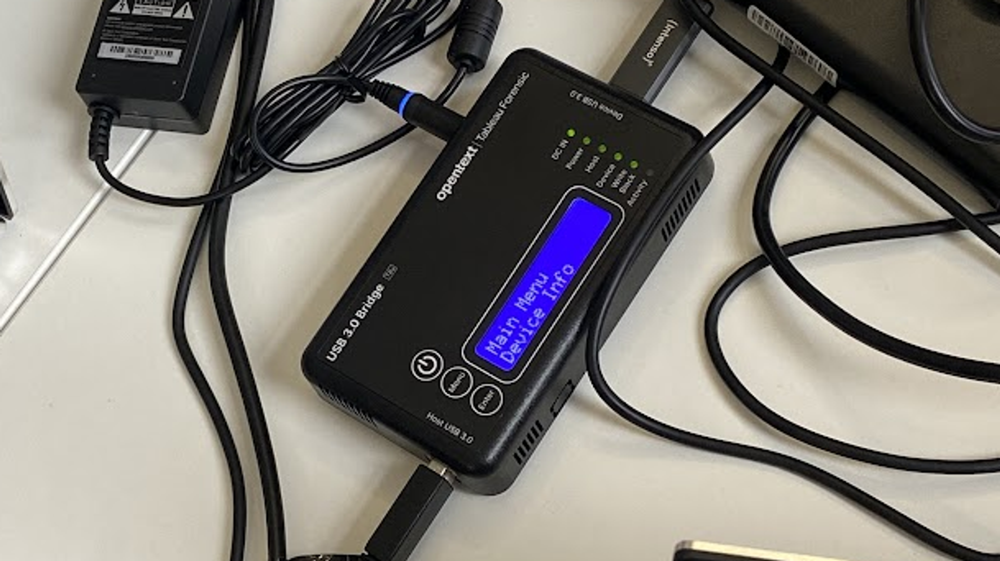

JUMPSEC believes heavily in learning and developing through real world experience. The incident described in this blog post presented a fantastic opportunity for 3 junior team members to learn first hand how to conduct, report and respond to an incident investigation. This blog post is split into two parts: Part I focuses on the prerequisites and preparation work done before kicking off the investigation, such as explaining the forensic principles used in the investigation, how the evidence is preserved and introducing tools deployed. Part 2 emphasises on how we utilise the tools to conduct the investigation and how we assemble all the available evidence to conclude the investigation.

Imagine, you come into work one morning to find a mysterious USB drive on your desk. It’s not addressed to anyone in particular and no note is left to explain its origin. What would you do?

 The suspicious USB

This is what happened to an organisation early this year. To conduct an investigation into the mystery USB drive they contacted JUMPSEC!

In this blogpost, we walk you through a real case of an unexpected USB drive mailed in to an organisation, showing the step-by-step process of how a Digital Forensics and Incident Response (DFIR) investigation was carried out, what principles and tools were used, and the perspectives from three rookies in the cyber security field doing their first investigation!

This is how it all began….

### Preparation

### 

Before the start of the investigation, we caught up on the Association of Chief Police Officers (ACPO) Principles of Digital Based Evidence\[1\]. It provides guidance not only to assist law enforcement but anyone performing forensic investigations involving digital evidence. It’s widely used by practitioners operating in the digital forensics field in England and Wales.

There are 4 principles:

- **Principle 1:** No action taken by law enforcement agencies, persons employed within those agencies or their agents should change data which may subsequently be relied upon in court.
- **Principle 2:** In circumstances where a person finds it necessary to access original data, that person must be competent to do so and be able to give evidence explaining the relevance and the implications of their actions.
- **Principle 3:** An audit trail or other record of all processes applied to digital evidence should be created and preserved. An independent third party should be able to examine those processes and achieve the same result.
- **Principle 4:** The person in charge of the investigation has overall responsibility for ensuring that the law and these principles are adhered to.

Initially we did not grasp how these were practically applied in performing the investigation. To put them into a more practical perspective, these are actions we took that directly relate to each of the principles:

 Write Blocker

- Obtained a Write Blocker. Write Blocker is a tool that prevents all computer storage media connected to a computer from being written to or modified, allowing us to make a bit-by-bit copy of the data in the USB drive without tempering it (Principle 1)
- Organised an investigation team where senior members with extensive experience handling DFIR investigations would be participate in the investigation (Principle 2)
- Assigned a designated place to store the USB drive and relevant evidence securely where only authorised people can access, and prepared the necessary tools for recording all processes (Principle 3)
- Assigned a lead investigator to be in charge of the investigation and ensured that the investigation would be carried out in accordance to the principles. (Principle 4)

Emilia was appointed to be the lead investigator. A lead investigator is an important role, they coordinate evidence acquisition, making sure the investigation is progressing, and ensuring the stakeholders involved are kept informed.

As the lead investigator learnt a great deal and the responsibilities included:

- Keeping an audit trail of and preserving evidence
- Ensuring the analysis was documented appropriately
- Sending out updates to inform the client the process of the investigation and make sure everyone in the team was updated with the current status
- Producing the final investigation report

Despite she’d only recently started doing investigation training exercises, the lead responder was very excited to take on a new challenge of being the lead investigator. As the team knew more about how an investigation was supposed to carry out with the help of other more experienced team members, the investigation became more and more enjoyable.

Now everything was ready and we were set to begin our first ever journey of an incident investigation!

### Preserving Evidence: Documentation and Isolation

Once we’d completed scoping the incident and verified we had the appropriate equipment we waited patiently for the USB drive to arrive. Once the USB arrived we were so excited and couldn’t wait to start plugging the USB drive into the Write Blocker to see what was inside, but we held off  in order to document everything from the moment we received it as it is important to leave an audit trail for any DFIR investigations. Otherwise the integrity of the evidence cannot be guaranteed and as a result, the evidence will not be accepted in court in occasions where legal involvement is required. (Principal 3)

So we documented everything. By everything, we meant everything. This involved taking close-up photographs of the envelope the USB drive arrived in and the letter attached, capturing any markings or labels on the drive itself, and noting details like its brand and size. The reason for doing so is because every piece of information, despite seemingly insignificant, could hold value later in the investigation.

We also started building a chain of custody, by recording every individual who handled the USB drive, the date, time and location of each transfer, and the purpose for the transfer. (Principal 3)

### Configuring a Safe Investigation Environment

Before dissecting what was inside the USB drive, since we assumed the USB drive was malicious as its origin was unknown and we defintely didn’t want to perform another incident investigation later on on one of our own devices as well. So instead of analysing the USB drive in an actual device and risking our device to get infected by the potentially malicious content, we decided to carry out the analysis in a virtual machine.

Virtual machine (VMware in this case) is an emulation of a computer system and provides the functionality of a physical computer. It creates an isolated environment and ensures any malicious content on the USB drive is contained within the virtual machine, safeguarding our primary system from potential infection.

In the next part, we will show how to set up a virtual machine and what details need particular attention, and we will continue the investigation from there!

### Reference

\[1\] ACPO, ACPO Good Practice Guide for Digital Evidence Available at: https://www.digital-detective.net/digital-forensics-documents/ACPO_Good_Practice_Guide_for_Digital_Evidence\_v5.pdf (Accessed: 6 August2024), (2012) .

#### Disclaimer

The incident response case described in this blog is based on a real event. However, specific details, including the names, locations, and other identifying information of the organisation involved, have been altered to protect their privacy and confidentiality. Any resemblance to actual events or entities is purely coincidental.
