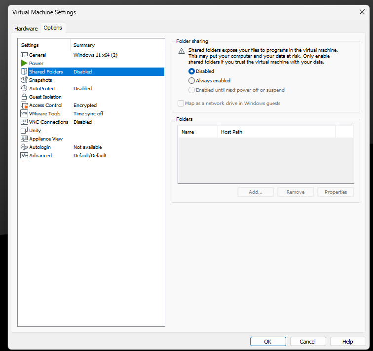
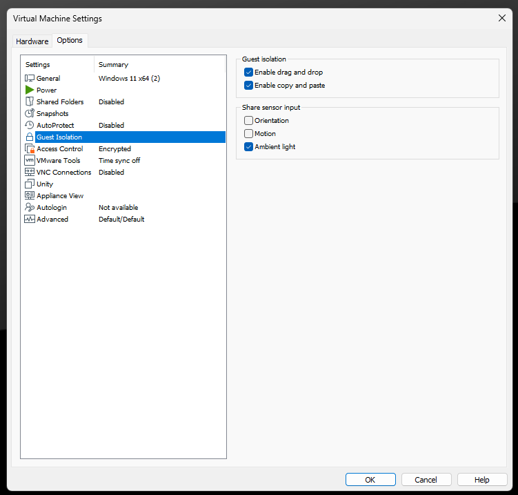
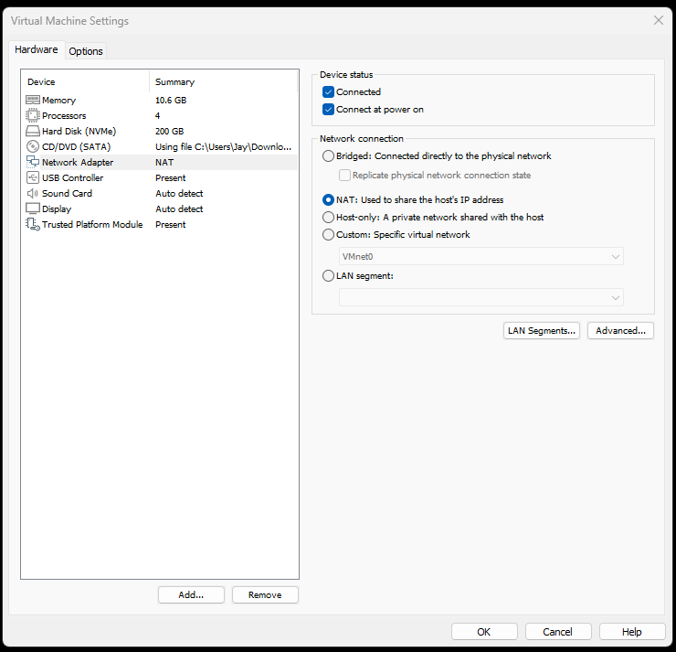
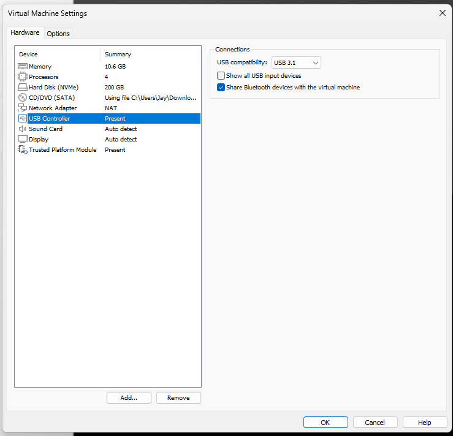
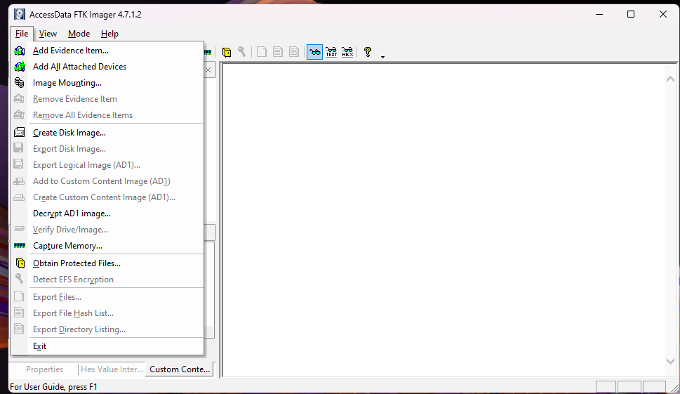
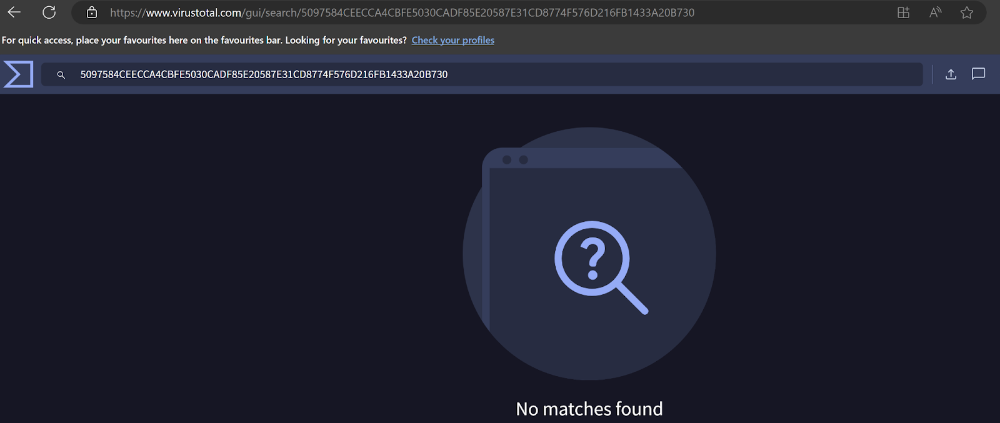
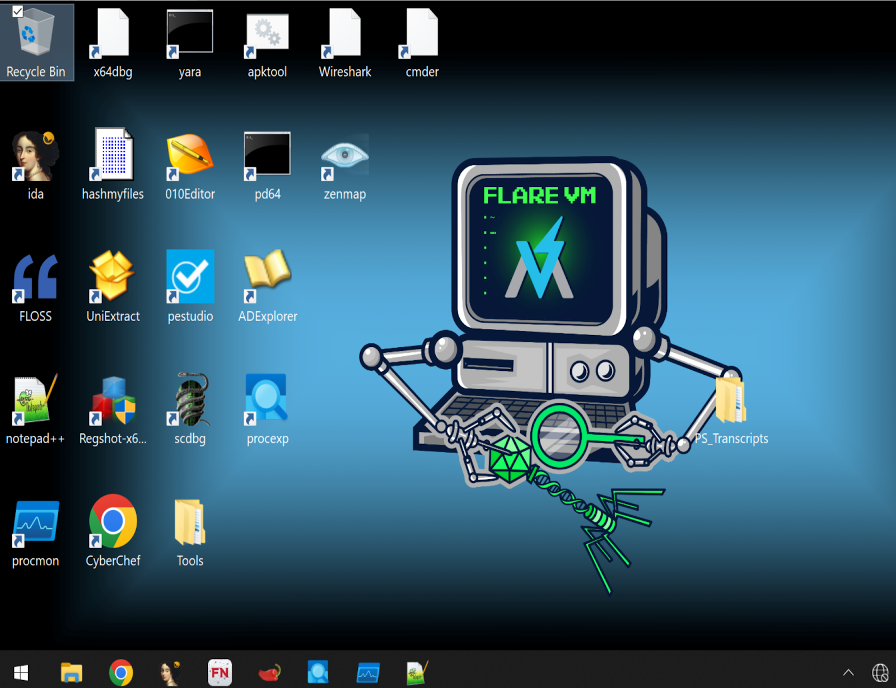

In this part 2, we'll walk you through the step-by-step process of setting up and conducting a Digital Forensics and Incident Response (DFIR) investigation using a virtual machine (VM). We’ll cover everything from configuring the VM to ensure it’s completely isolated to tackling the challenges of USB passthrough with a write blocker. You'll also learn about the risks of using public threat intelligence platforms like VirusTotal and discover alternative methods for secure file analysis.

Our goal is to share practical experiences and lessons learned from our investigation, offering useful insights and tips for anyone new to the field or looking to refine their DFIR skills. Whether you're a seasoned pro or just starting out, this article provides a clear and detailed look at best practices and important considerations in digital forensics and incident response.

### **Setting Up the Virtual Machine**

**Muhammad** was responsible for continuing the investigation by extracting data from the USB stick using a write blocker and a virtual machine.

Setting up the VM for this DFIR investigation is mostly straightforward, thanks to prior experience with virtual machines. We used VMware Workstation Pro with a Windows 11 environment. However, there were some challenges.

We configured the VM to block data transfer between the VM and the host system with the detailed steps below. This step is crucial for preventing data leaks, preventing malware from spreading. It protects against accidental data leaks and tampering of the evidence, ensuring the integrity of the investigation by segregation the Virtual Machine environment from the host environment.

To achieve this, disable shared folders and other options that could potentially allow data exchange between the VM and the host. Here’s how to do it:

**1\. Disable Shared Folders:**

- - - Go to the VM settings.
        - Navigate to the "Options" tab.
        - Select "Shared Folders" and set it to "Disabled."

 

**2\. Disable Drag-and-Drop and Copy-Paste:**

- - - Still under the "Options" tab, select "Guest Isolation."
        - Uncheck both "Enable drag and drop" and "Enable copy and paste."

 

 

Additionally, disable the VM's internet connection to ensure the VM is not connected to the internet. This precaution was necessary since the contents of the USB were unknown, and wanted to prevent any potential malicious activity from communicating with external networks. To achieve this the following steps should be followed

**3\. Disable the internet in VMware Workstation**

- - - Right-click the VM and select Settings.
        - Go to the Hardware tab and select Network Adapter.
        - Uncheck “Connected” and “Connect at power on”.

### **USB Passthrough and Write Blocker Integration**

Getting USB passthrough to work with the write blocker presented its own set of challenges. Initially, when we connected the USB to the write blocker and passed it through to the VM, there was no response from the virtual machine. After some troubleshooting, discovered that we needed to adjust the USB settings within VMware Workstation Pro to ensure proper recognition of the device.

Here's how to do it:

1. **Adjust USB Compatibility:**
    - - - In the VM settings, navigate to the "USB Controller" option.
            - Set the "USB compatibility" to USB 2.0 or 3.0, depending on the write blocker’s compatibility.
            - Enable "Show all USB input devices" to ensure the VM detects the write blocker.
2. **Manually Connect the USB Device:**
    - - - After booting the VM, go to the "VM" menu in VMware Workstation.
            - Select "Removable Devices," then find the USB device, and click "Connect (Disconnect from Host)." This action passes the USB device directly to the VM, bypassing the host system.

These steps were essential in ensuring that the USB device was correctly recognized by the VM through the write blocker, allowing us to proceed with the forensic analysis.

### **Integrating the Write Blocker**

The integration of the write blocker was a critical step in ensuring that the data on the USB drive remained unaltered during the investigation. We used AccessData FTK Imager for this task, a trusted tool in the DFIR community for acquiring and analysing digital evidence. The write blocker was necessary to prevent any accidental writes or modifications to the USB drive, which could compromise the integrity of the evidence.

A challenge that we faced was ensuring that the write blocker was properly connected and recognized by both the VM and FTK Imager. This required carefully following the correct sequence of connections: first plugging the USB into the write blocker, then connecting the write blocker to the host machine, and finally configuring the VM to recognize the USB device as described earlier.

### **Threat Intelligence Research**

**Marin** was responsible for researching the data collected from the USB (file hashes) through various threat intelligence platforms.

Here, we’ll learn about the risks of uploading files to VirusTotal and explore alternative analysis methods. Uploading files to VirusTotal can be risky because this popular threat intelligence platform is public, meaning that any files you upload and their analysis results can be seen and downloaded by users with premium VT subscriptions - from cybersecurity professionals to researchers and even malicious threat actors. This visibility could unintentionally expose sensitive information or proprietary data. If the files are unique to your organisation, uploading them could alert adversaries to potential vulnerabilities or ongoing investigations, compromising your security measures.

**Potential Risks:**

1. 1. **Exposure of Sensitive Data:** Uploading files with confidential information to VirusTotal can lead to unintended disclosure.
    2. **Intellectual Property Theft:** Other companies or competitors might reverse-engineer proprietary software or unique data structures.
    3. **Targeted Attacks:** Malicious threat actors monitoring VirusTotal could use the information to launch targeted attacks against your organisation.
    4. **Legal and Compliance Issues:** Uploading certain files might breach data protection regulations and policies.

To avoid these risks, we considered alternative methods for analysing files. One effective approach is using private sandbox environments. Sandboxing means running files in an isolated, controlled setting to observe their behaviour without risking the security of your broader network. This method allows for a thorough analysis of potential threats while keeping sensitive data secure and under control.

One sandboxing option is [FLARE VM](https://github.com/mandiant/flare-vm), a collection of software installed on top of Windows VM. Once running some flare vm script to install tools, it will allow you to maintain a reverse engineering environment on a VM, for malware analysis, incident response, and forensic analysis.

 

**Importance of Private Sandboxing:**

1. 1. **Confidentiality:** Keeps sensitive files and analysis results within your organisation.
    2. **Customization:** You can tailor the sandbox environment to closely mimic your actual network, providing more relevant insights.
    3. **In-Depth Analysis:** Allows for detailed behavioural analysis of files, uncovering sophisticated or previously unknown threats that simple hash comparisons might miss.

Another way to mitigate risk is by testing the hash of a file instead of uploading the entire file. A hash generates a unique identifier representing the file’s contents without revealing the actual data, allowing for secure and private verification against known threat databases.

**Benefits of Testing Hashes:**

1. 1. **Privacy Preservation:** Hashes don’t expose the actual file content, maintaining confidentiality.
    2. **Efficiency:** Comparing hashes is less computationally intensive than analysing full files.
    3. **Integrity Verification:** Hashes confirm that files haven’t been altered, ensuring data integrity.

**SHA-256**, which stands for Secure Hash Algorithm 256-bit, is a cryptographic hash function that produces a fixed-size, 256-bit hash value from an input of any size. The use of a hash varies depending on the scenario; it can be used to confirm whether the content of two files is identical, or in this case, whether the file the hash belongs to has been reported as malicious previously, and to check the file’s originality by comparing the hash against threat intelligence platforms, such as VirusTotal.

The good news was that the SHA-256 hashes did not match any known malicious files in VirusTotal’s extensive database, but we still couldn’t determine its origin. Despite this initial relief, we conducted further analysis to ensure the files were safe.

### **Further Investigation: Antivirus Scan**

Next, we ran an antivirus scan and a static analysis on the files. Both analyses aimed to ensure the files were not malicious. Antivirus scans look for patterns based on the signatures or definitions of known malware, while static analysis involves examining the code without executing the program. This method helps identify potential threats by analysing the file structure and content.

The antivirus scan didn’t discover any indications of infection and confirmed that the files did not contain any malicious features. The results of the static analysis echoed that.

By now, the files appeared to be non-malicious, so we could finally open them to see what they actually were!

### **Final Investigation: Examining the Files' Content**

Voila! Guess what the content of the files was? They were… two different files! :)

Since we aim to share knowledge applicable to general scenarios, we won’t dive into specifics here. However, a general rule of thumb to determine if the content is malicious (especially after running scans like antivirus and static analysis with no concerning results) is to understand what might be expected or unexpected for the client, and whether phishing could be a possible threat based on the content. That was the approach we used for examining the files' content.

For example, a company might expect an email with remittance details from its supplier. This is relevant to the company and involves potential risks, such as when someone impersonating the supplier sends an email that appears to be remittance-related, embedding a link that supposedly directs you to a remittance document, but instead leads to a phishing page designed to deceive you into entering your credentials.

The two files appeared to be related to a project the client was working on at that moment. The information and tone of language used in the files suggested the sender was purely offering their advice on the project. Although it wasn’t something the client was expecting, we believed we had identified the origin and purpose of the USB drive.

### **Verdict: A Clean Bill of Health**

At this point, we’d conducted several analyses, and by piecing all the results together, we concluded that the USB drive was not malicious. If it had been a computer that needed investigating, we would have also analysed unusual registry entries or network connections to known malicious servers.

Throughout the entire investigation, we kept the client in the loop, informing them of the process at each stage. Clear communication is essential in any DFIR investigation, and clients might also provide valuable information that could assist the investigation.

**Key Takeaways and Lessons Learned**

Although the files on the USB drive were not malicious—which was definitely a relief—we still gained valuable experience by conducting an incident investigation from start to finish, all under the guidance of an experienced team. As rookies, we learned how to preserve evidence in line with best practices, utilise various tools, leverage threat intelligence, and maintain a proper chain of custody to draw meaningful conclusions.

Through this process, we discovered several critical lessons:

- **Importance of Isolation**: Isolating the VM from the host system and external networks is crucial when handling unknown devices. This step prevents potential contamination or compromise of the main system.
- **Attention to Detail in Settings**: Correctly configuring the VM and USB passthrough settings is essential. Small oversights can lead to significant delays or even jeopardise the investigation.
- **Familiarity with Tools**: Being well-versed with forensic tools like FTK Imager and knowing how to use a write blocker properly can significantly enhance the efficiency and accuracy of the investigation.

### **Advice for Beginners**

For anyone attempting this process for the first time, here are some tips:

- **Double-Check VM Settings:** Before starting your investigation, make sure to disable any features that allow data exchange between your VM and the host system, and disconnect the VM from the internet.
- **USB Passthrough Troubleshooting:** If your USB device isn’t being recognized, check the USB compatibility settings in your VM. Also, manually connect the USB device through the VMware menu to ensure proper passthrough.
- **Understand Your Tools:** Take the time to familiarise yourself with both the write blocker and the forensic tools you’re using. This knowledge will help you avoid mistakes that could compromise your investigation.
- **Stay Patient and Methodical:** DFIR work requires a lot of patience and attention to detail. Rushing through steps or skipping checks can lead to errors that are difficult to correct later on.

All of these experiences broadened our horizons and provided a better understanding of the DFIR world, which will definitely benefit us in the long term. We hope this article provided some insights, especially for those interested in cybersecurity or someone who, like us, is just starting their career in the field. We also hope you enjoyed the read as much as we enjoyed our first investigation! :)

_Disclaimer: The incident response case described in this blog is based on a real event. However, specific details, including the names, locations, and other identifying information of the organisation involved, have been altered to protect their privacy and confidentiality. Any resemblance to actual events or entities is purely coincidental._
