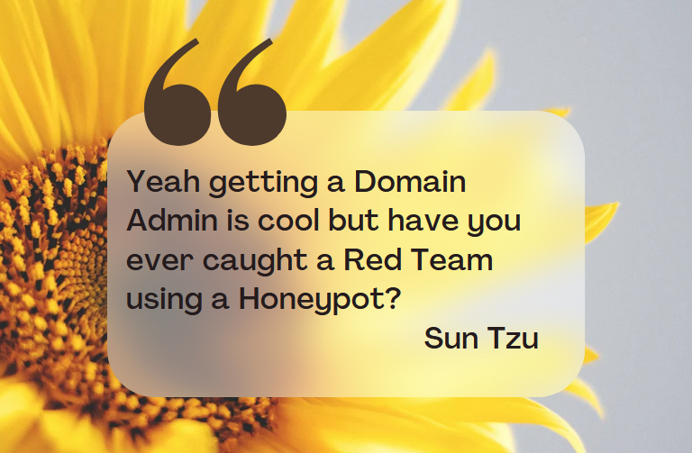

Every good cybersecurity article needs a Sun Tzu quote, here is one lesser known quote from Sun Tzu to start us off.

 

## What Happened?

Recently, JUMPSEC’s Detection and Response Team (DART) caught a Red Team  inside one of our MxDR clients' networks using a honeypot server. The honeypot server was set up using Thinkst Applied Research’s project called [OpenCanary](https://github.com/thinkst/opencanary). This open-source project from Thinkst emulates different network protocols and when interacted with, creates an alert providing information to the defensive team, such as the source of the request.

 

## An unfair advantage

We believe all organisations should be able to incrementally build on their level of security, year-on-year. This means leaving generic behind and focusing on the specific threats you face, and outcomes you need to be secure from them. To do this, we draw on the expertise and attacker mindset of our offensive Team to develop sophisticated attack paths tailored to each client’s environment. These are then used to test the defences and monitoring systems set up by our Detection and Response Team (DART).

As a member of the DART working on the defensive side, I find these engagements particularly rewarding. I’m confident that this sentiment is shared by the offensive team and our clients as well, since both teams ultimately work together to strengthen the security of our client.

This collaborative, and at times competitive, dynamic between the teams where the defensive team gains insights into the inner workings of exploit tools, while the offensive team learns how to avoid detection, helps us to create new detections and anticipate potential future evasion techniques.

If you are a Blue Teamer or working on the defensive side in a SOC and have experienced a Purple team engagement, you may have noticed that almost always the offensive team will achieve their set objectives. Often this is thanks to the client’s IT admins with their easy-to-guess passwords which are set to never expire, or SMB shares with credentials in a cleartext file, or thanks to Active Directory Certificate Services; a gift that keeps on giving

Detection and or prevention for all of these techniques is a challenge for a defender.

One can only cover so many techniques from MITRE ATT&CK bingo.

\[learn\_more caption="MITRE ATT&CK bingo." state="open"\] The process of shouting “Bingo!” when you have covered a technique from the ATT&CK matrix. Just because you have identified a single way to detect a technique does not mean you can colour the box green, adversaries have multiple ways they can perform most techniques. [Read more about how NOT to use ATT&CK](https://attack.mitre.org/resources/)  \[/learn\_more\]

To make matters more complicated, your adversary—in this case, the offensive team—sometimes starts with access to the client's network (an assumed breach), which is common practice when aiming to fully leverage the offensive team's capabilities.

So, you can quickly imagine the offensive team enumerating and accessing network shares as a regular user only to discover admin credentials within a PowerShell script. In some cases we have seen these  scripts were created by an IT admin with domain admin privileges to automate various tasks and simplify their work. You might think this scenario is uncommon, however it is how [Uber was hacked](https://arstechnica.com/information-technology/2022/09/uber-was-hacked-to-its-core-purportedly-by-an-18-year-old-here-are-the-basics/) in 2022 and this happens so frequently that there are memes on X/Twitter on the topic.

As a defender all those latest detections you put in place to detect Mimikatz or the sophisticated bloodhound queries are now useless. The adversary (again, the offensive team in this case) got the keys to the castle and can stroll right through the front door. This situation can feel like an overwhelming challenge and an unfair advantage for the adversary, so what’s a defender to do?

Go ahead, cry if you need to—let it out. But no, that's not where it ends. I'm not saying you shouldn't cry, but after you do, it's time to regain control.

## "No more tears" formula

Consider it this way: an adversary has entered your environment, but it's your environment—you know what happens in this environment from the logs you have and pretty dashboards that you see everyday, you know which of your IT admins still use [PsExec](https://attack.mitre.org/software/S0029/) to troubleshoot problems on remote servers, you know which developer has created a script that bruteforces your entire AD user database just to create an inventory of users. Now, the attacker is on your turf, and you set the rules of engagement. You control what they see, what they interact with, and how you can use this knowledge to your advantage.

Instead of passively waiting for an alert to trigger, you take an active role in countering the threat actor through Active Cyber Defence. This involves proactively engaging, disrupting, and countering the attack. To clarify, this isn't about hacking back. Rather, it's about setting traps within your environment and waiting for the threat actor to interact with them—one type of trap is is known as a honeytoken. Honeytokens are decoys that are designed to detect unauthorised or malicious activity within a system in your network. They can take many forms, such as fake credentials, files, user accounts that seem legitimate but are actually traps. When an attacker interacts with a honeytoken, it triggers an alert, allowing the defenders to detect a breach or malicious intent early.  The challenge then becomes how to implement this strategy in a way that is easy to deploy, maintain, and most importantly, doesn't increase your attack surface.

Let’s revisit what actually happened in the incident I mentioned previously after being challenged by an assumed breach in one of our Managed Extended Detection & Response (MxDR) clients, we realised the need to improve our response and regain control. Over the years, we had developed numerous detection use cases in collaboration with our offensive team, but on the flip side, the offensive team also created bypass techniques and constantly introduced new evasion strategies. We needed a quick win—something that would provide us with high-fidelity alerts as early as possible in the attack cycle, or in some cases, even at an advanced stage of the adversary's objectives.

We deployed [OpenCanary](https://github.com/thinkst/opencanary); a free and open-source decentralised honeypot by the amazing people at Thinkst Applied Research. We configured that server to expose fake SSH and HTTP servers. The HTTP server had a web page that looked like this.

An old Synology DiskStation NAS server with usernames and passwords fields. Now tell me if you are an offensive security consultant who has done a little HackTheBox boxes or played in CTF what’s the first thing you are going to do to this page?

Naturally, you'd try `admin/admin` or `admin/password` combinations. If not, I might question your L33T hacker credentials and that’s exactly what the offensive team in question did during their reconnaissance. The mere fact that they visited this page had already triggered an alert in our system. No one was supposed to access this page, and its existence was known to only a few people. Only the offensive team, after scanning the entire network, discovered this server with an exposed, outdated HTTP service and decided to take their shot.

> In combat, deception can strengthen the weaker side. When all other factors are equal the more deceptive player or the team will always win. - Barton Whaley

I had configured this alert to be sent to two different outputs (Google + Slack). When I first saw the alert, I was in complete disbelief. My mind started racing—the excitement, the adrenaline. Thoughts like “There’s no way,” “This can’t be real,” “It must be a misfire from the canary server restarting,” kept running through my head. But then I remembered, I had fine-tuned that alert a long time ago. “Did I really just catch something…?” No, that can’t be it. I needed to double-check—actually, triple-check—to be sure.

\[box type="shadow"\]

> { "dst\_host": "172.XX.X.X", "dst\_port": 80, "local\_time": "2024-06-19 13:20:12.162738", "local_time_adjusted": "2024-06-19 13:20:12.162764", "logdata": { "HOSTNAME": "10.XXX.XXX.XX", "PASSWORD": "", "PATH": "/index.html", "SKIN": "nasLogin", "USERAGENT": "Mozilla/5.0 (Windows NT 6.4;) AppleWebKit/537.36 (KHTML, like Gecko) Chrome/125.0.2535.51 Safari/537.36 Edge/125.0.2535.10122", "USERNAME": "admin" }, "logtype": 3001, "node\_id": "CANARY-SERVER", "src\_host": "10.XXX.XXX.XX", "src\_port": 44214, "utc\_time": "2024-06-19 13:20:12.162760" }

Details of alert \[/box\]

So, I triple-checked. The client had an ongoing assumed breach engagement, but I wasn’t directly involved in the day-to-day alerts. I looped in my fellow DART members for a sanity check, and we agreed to raise it with the client to confirm, just to be absolutely certain. And yes, we did it.

You might think it’s not such a big achievement, but let me tell you…as a Defender, catching an attacker in the assumed breach, right in their reconnaissance stage, using such a simple tool is nothing short of incredible. The satisfaction that comes from outmanoeuvring them before they even trigger other detections is beyond words. This is the kind of victory that reinforces why we do what we do—staying one step ahead and stopping the threat before it even starts.

We chose OpenCanary over other honeypots like Cowrie, Mailoney, and Snare for several reasons, but the primary one is its ease of deployment—especially if you have Docker installed on your host. It's modular and can simulate various services such as SSH, FTP, HTTP, and VNC, plus it can send alerts directly to a webhook. This makes deployment and maintenance straightforward. In contrast, using multiple honeypot services would require installing each one separately, collecting their logs, forwarding them to a centralised SIEM, and setting up alerts there. If any part of that pipeline fails, you risk missing your most critical alerts.

Deploying OpenCanary is straightforward, but some maintenance is needed depending on your environment. If you're using regular vulnerability scanners like Nessus or network mapping tools like PRTG Network Monitor, you'll want to add those IP ranges to the `ip.ignorelist` in the configuration file to avoid false alarms. After that, you can connect it to your Teams or GoogleChat via webhook, forward the alerts to your SIEM, or set up email notifications—whatever works best for you. Once configured, you can set it and forget it.

Setting up a server like OpenCanary is just one of many ways to set traps for your adversaries. For instance, you can create multiple fake user accounts in Active Directory, each with different roles. (Pro tip: Use ChatGPT to help you generate realistic fake personas and create fake LinkedIn profiles for them.) Ensure these accounts have complex passwords, and configure your SIEM to alert you if anyone tries to authenticate them. If you use Microsoft Defender for Identity(MDI), you can designate these accounts as honeytokens, and MDI will handle the rest (https://learn.microsoft.com/en-us/defender-for-identity/entity-tags). This is particularly useful during the Red Team's reconnaissance phase when they might use tools like BloodHound to enumerate users from the Domain Controller—triggering an alert in the process. It's a simple win that saves you from having to baseline requests sent to the DC for your detection queries.

Additionally, you can visit [canarytokens.org](https://canarytokens.org) to easily create various types of Canary tokens, such as Microsoft Word/Excel or PDF documents that trigger an alert when opened. These files can be strategically placed in your organisation's internal shares. Tools like [MANSPIDER](https://github.com/blacklanternsecurity/MANSPIDER), which crawl SMB shares in search of valuable data, may stumble upon and activate these Canarytokens.

One of my favourite examples involves using a "Fast Redirect Token" from [canarytokens.org](https://canarytokens.org) which alerts when someone visits your URL.

Here is one of our Senior Security Consultants I lured into triggering this alert and getting rickrolled in the process.

I'll wrap up this blog post by encouraging you to implement Cyber Deception techniques in your environment. These methods aren't new, are often free, easy to set up, and offer some of the most reliable alerts available.

If you're interested in learning more about Cyber Deception, I highly recommend checking out John Strand’s course, which you can find here: [Active Defense and Cyber Deception with John Strand](https://www.antisyphontraining.com/course/active-defense-and-cyber-deception-with-john-strand/).

Additionally, be sure to explore the free Canary Tokens service provided by the fantastic team at Thinkst: [Canary Tokens](https://canarytokens.org/nest/).
