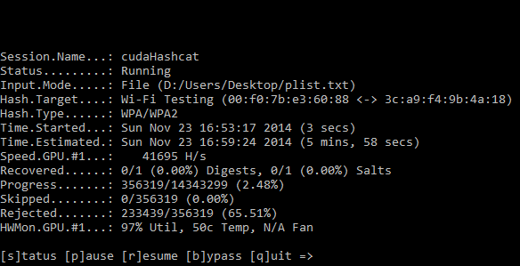

Ditch the CPU for password cracking even if you have an overclocked Extreme Intel Core i7, they just aren't made for password cracking since they only contain a small number of cores. Instead set your sights on a high powered graphics cards with with the primary aim of finding cards with a high number of cores, for instance the GeForce GTX TITAN Z features a whopping 5760 cores. Imagine the insane speeds of password cracking with all those cores working harmoniously in parallel to crack a password. A professional setup might include a few graphics cards per rig or if you are really serious you might want to branch out into a distributed cracking network using multiple machines.

I give you a real world example of how the GPU saves you so much time, on a recent an internal penetration test we conducted a wireless network assessment and part of this test was to assess the wireless password key strength and identify how easy it is to crack. We captured the all important WPA2 handshake and loaded up our password cracking software [oclHastcat](http://hashcat.net/oclhashcat/ "Hashcat"). We were using a relatively small password list that contained about 14,000,000+ passwords, using Hashcat which utilises the graphics card, we were able to munch through the entire list in about three and a half minutes. As a test we ran the same password list using [aircrack-ng](http://www.aircrack-ng.org "Aircrack") which utilises the CPU and the same key took 45 minutes to crack, an eternity! A larger 14GB password list was later used to actually crack the password, since our quick hit password list didn't yield any promising results, always worth a try though :).

\[caption id="attachment\_62" align="alignnone" width="584"\] Hashcat Animation\[/caption\]

[oclHashcat](http://hashcat.net/oclhashcat/ "Hashcat") password cracker for the graphics card is a great piece of software that supports the the two major graphics card vendors AMD and Nvidea, it's not just limited to wireless password cracking, it pretty much does it all from NTLM, MD5, SHA, Whirlpool, Truecrypt to name a few. Hashcat has two main types of attack which are dictionary attack and rule based brute-force attack. Be sure to check you have the latest graphics card drivers installed and checkout the benchmark feature.

So I leave you with the thought of... buy yourself a good Graphics Card or three :)
