Recently two 0-day exploits were revealed. The first one was given the name Sandworm, however, the name convention was mistakenly including the "worm" term as we will see. The second one CVE-2014-4113 is a privilege escalation local exploit for Windows. Sandworm as said includes the word  "worm" most likely for making the situation more dramatic. A worm is a self-propagating piece of code that does not take human intervention. It is said that Sandworm was used in cyber espionage operations from Russians against NATO, European Union, and also against specific industries such as the energy sector (by targeting SCADA systems). Vulnerable targets are Windows Office 2010 and 2013.  In order to have a successful attack, someone naive (or convinced!) to execute (open) a PowerPoint show file is needed. It is said that CVE 4113 strikes win32k.sys which is the kernel-mode drivers in Microsoft Windows Server 2003 SP2, Windows Vista SP2, Windows Server 2008 SP2 and R2 SP1, Windows 7 SP1, Windows 8, Windows 8.1, Windows Server 2012, and allows local users to gain privileges via a crafted application, as exploited in the wild in October 2014.  Win32k.sys is responsible for window management, and any GUI process/thread that will use it. Its related user-mode modules are user32.dll and GDI32.dll. Due to the complex interaction with user-mode applications, there are many problems in Win32k.sys. The exploit was acquired in the wild, and a hacking team called HURRICANE PANDA created it. A null pointer de-reference in win32k.sys is the vulnerability and by abusing the xxxSendMessageTimeout function it is possible to execute arbitrary code.

## Attacking

Let's see Sand worm initially... In summary, the attack works as follows: a malicious PowerPoint show file is sent to the victim, the victim opens it, then the victim connects back to an attacker's controlled host in order to fetch the payload and finally after downloading it, executes it. As it is easily spotted, this attack has many different factors in order to succeed. A single firewall blocking outgoing connections to SMB (Port 445) can stop the attack.

1) Attacker generates the malicious powerpoint file and sends the file to victim. Lets use the metasploit framework for that...

\[caption id="attachment\_10" align="alignnone" width="721"\][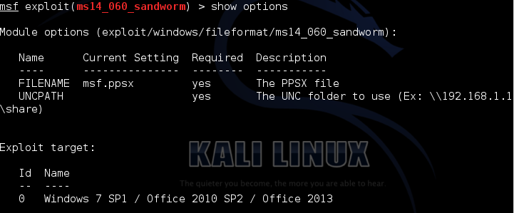](https://labs.jumpsec.com/wp-content/uploads/sites/2/2014/11/sandworm-options.png) MS14-060 options\[/caption\]

\[caption id="attachment\_12" align="alignnone" width="687"\][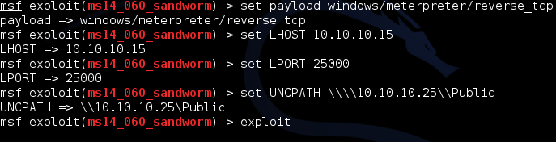](https://labs.jumpsec.com/wp-content/uploads/sites/2/2014/11/sandworm-options2.png) Adding the necessary stuff\[/caption\]

Keep in mind to escape the "\\".

\[caption id="attachment\_13" align="alignnone" width="722"\][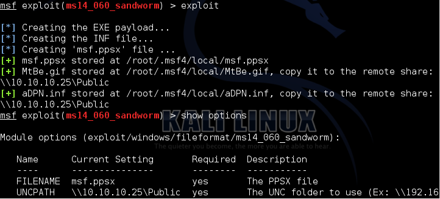](https://labs.jumpsec.com/wp-content/uploads/sites/2/2014/11/Sandworm-generation.png) Generating the malicious ppsx\[/caption\]

As metasploit informs us, we have to place these files to a shared directory (with public/anonymous access). I had the issue that I was getting prompted for a password (after I was opening the ppsx file). It turns out that some latest versions of Windows are asking for a password even if the folder is publicly available. I changed to Linux world and everything worked fine!

Now... What are these 2 files... First lets see the MtBe.gif file

[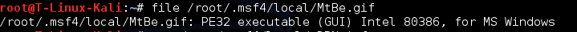](https://labs.jumpsec.com/wp-content/uploads/sites/2/2014/11/sandworm-gif-executable.png)

And what about the aDPN.inf file?

By the way, do you remember the famous autorun.inf files ? These files were responsible for what to be executed when we were plugging a CD-ROM, etc. INF files are also known as Setup Information files (check the wiki page!)

\[caption id="attachment\_15" align="alignnone" width="731"\][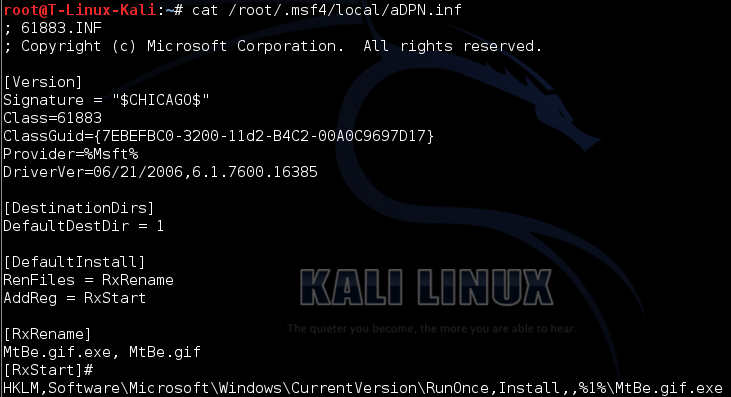](https://labs.jumpsec.com/wp-content/uploads/sites/2/2014/11/sandworm-renaming.png) Aha! Renaming!\[/caption\]

See the \[RxRename\] entry... So what it does is that it renames the MtBe.gif file to MtBe.gif.exe file... Why ? Obviously, because it will execute it afterward!

We mount the remote shared dir and we place these 2 files there. We edit the output powerpoint file so it looks more innocent than the "Example / Example" of the default generation \[ok I didnt.. but you get the point!\] . After we send the file to the victim and we start our handler in metasploit. Patiently waiting...

\[caption id="attachment\_16" align="alignnone" width="1268"\][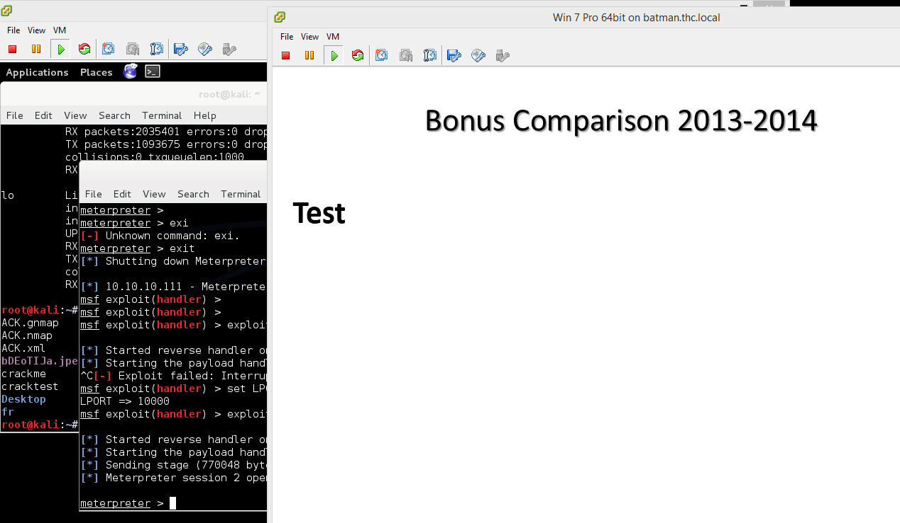](https://labs.jumpsec.com/wp-content/uploads/sites/2/2014/11/sweet.png) b00m\[/caption\]

Now lets see our privileges...

\[caption id="attachment\_17" align="alignnone" width="896"\][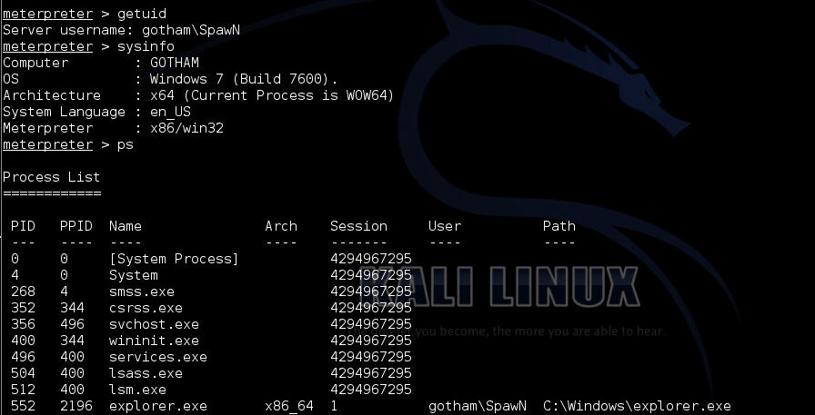](https://labs.jumpsec.com/wp-content/uploads/sites/2/2014/11/blog-going-around-the-WoW64-by-migrating.png) Going around WoW64\[/caption\]

As we see here the current process is running in the Windows x32 on Windows x64 emulation. That means that if we try to launch a local exploit it will fail saying "Failure::NoTarget, "Running against _WOW64_ is _not supported_"". How to get around this? Easy... We see the processes with "ps" and we migrate to a "native" x64 process.

\[caption id="attachment\_18" align="alignnone" width="944"\][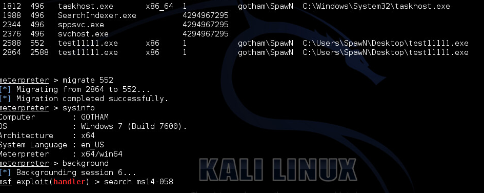](https://labs.jumpsec.com/wp-content/uploads/sites/2/2014/11/blog-going-around-the-WoW64-by-migrating2.png) escaping WoW\[/caption\]

As you see in the picture above we successfully escaped WoW64 and now we can launch our local exploit.

\[caption id="attachment\_19" align="alignnone" width="967"\][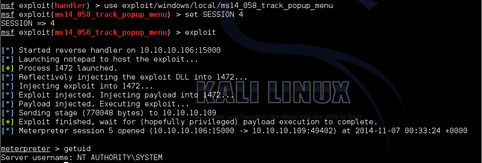](https://labs.jumpsec.com/wp-content/uploads/sites/2/2014/11/blogspot-2008-SP2-ms04-058-32bit.png) b00m\[/caption\]

## Defending

Let's take a look at the network activity during this. I will focus on the time that the ppsx file is opening (there is the juicy part ;))

\[caption id="attachment\_20" align="alignnone" width="693"\][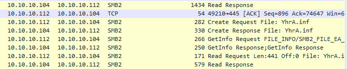](https://labs.jumpsec.com/wp-content/uploads/sites/2/2014/11/analysis-.inf-file.png) INF file busted\[/caption\]

Wireshark shows us that we have a SMB2 Read Response. Right after we see the request file for the .inf file. Hmmm lots of noise...

\[caption id="attachment\_21" align="alignnone" width="689"\][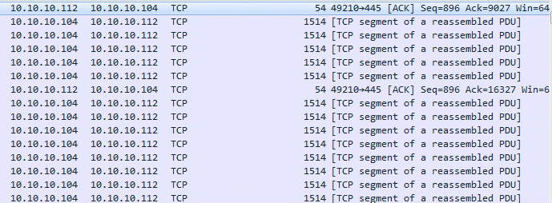](https://labs.jumpsec.com/wp-content/uploads/sites/2/2014/11/analysis-data-segments.png) Downloading the files\[/caption\]

Right after we see the downloading of the files...

\[caption id="attachment\_22" align="alignnone" width="713"\][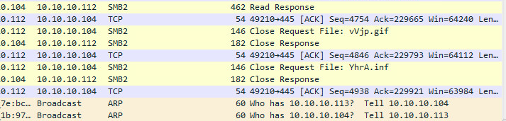](https://labs.jumpsec.com/wp-content/uploads/sites/2/2014/11/analysis-data3.png) And the closing of the files...\[/caption\]

And finally the end of the files (notice also the .gif file here)

What else we can see from Wireshark? Let's follow the stream...

\[caption id="attachment\_23" align="alignnone" width="376"\][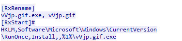](https://labs.jumpsec.com/wp-content/uploads/sites/2/2014/11/analysis-follow-the-stream.png) Following TCP Stream\[/caption\]

Remember this line?

## Solutions

Solutions for these 2 vulnerabilities are patching. MS14-058 and MS14-060 are fixing the problems. Here I have to pinpoint that even if a host is vulnerable, by staying behind from a properly configured firewall will be still safe since it won't be able to download the files. These types of malicious files are well known to malware analysts since they have assigned them as drive-by downloads. The name comes from the fact that at some point the victim host will try to fetch the payload and will execute it right after. From the host perspective in order to mitigate the risk, there are a couple of choices. Having signatures of the exploit itself could mitigate the exploitation. Also depending on the payload that it will be executed it could be picked up from the AV.
