Hello there, in this post I will describe how I solved the cloudfs challenge of Ghost In The Shellcode 2015. This challenge was under the Forensics category and was awarded 200 points (middle ground!). It wasn't so hard, and someone could argue that shouldn't award the same points with "the alpha molecular" or the similars from the crypto category but it's okay (it's very common actually in every CTF to argue about points etc..). The point of that challenge was that it was using ICMP (so there isn't any TCP Follow Stream option...) and that the file that was included was scattered across multiple packets.

So the file of the challenge was an .xz file meaning that we had to decompress it first.

[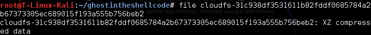](https://labs.jumpsec.com/wp-content/uploads/sites/2/2015/01/xz-file.png)

xz file awaits

We open the pcap file with wireshark and we see all these ICMP ping requests/replies.

\[caption id="attachment\_70" align="alignnone" width="1173"\][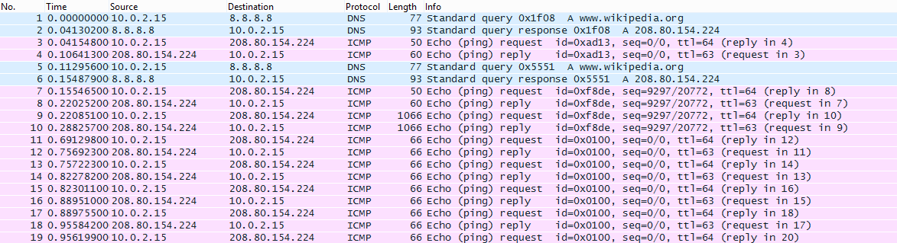](https://labs.jumpsec.com/wp-content/uploads/sites/2/2015/01/ICMP-traffic.png) Lots of ICMP ping requests/replies\[/caption\]

By doing `tshark -r pcapfile -T fields -e data -w outputfilee ; strings outputfilee` we can dump all the data from the pcap and search for ASCII characters. There is a bunch of delicious apples and ripe yellow bananas there (at some point I thought that the key is something related to that!).

\[caption id="attachment\_83" align="alignleft" width="780"\][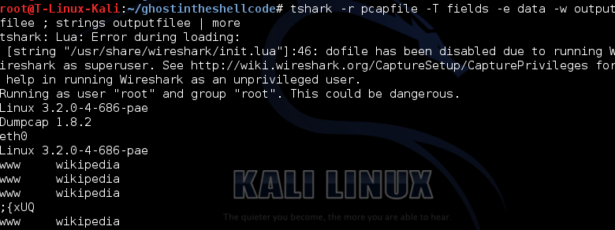](https://labs.jumpsec.com/wp-content/uploads/sites/2/2015/01/strings-of-data-1.png) Exporting all data\[/caption\]

\[caption id="attachment\_71" align="alignnone" width="300"\][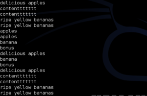](https://labs.jumpsec.com/wp-content/uploads/sites/2/2015/01/apples-bananas-contentttttt.png) strings show bananas and apples\[/caption\]

Since I was searching for the key I did the following filter initially `icmp contains key` and manage to find a packet that was giving away the existence of a `key.tbz` file. So I know that there is a tbz file somewhere around...

\[caption id="attachment\_69" align="alignleft" width="1111"\][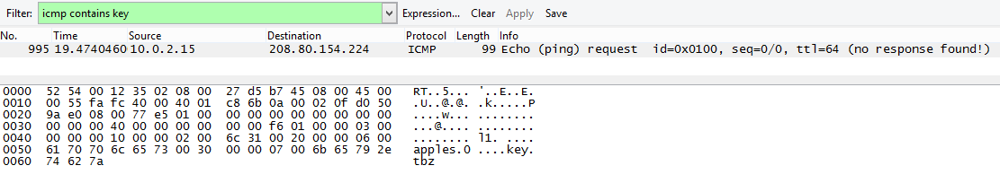](https://labs.jumpsec.com/wp-content/uploads/sites/2/2015/01/icmp-contains-key.png) icmp contains key filter saved half aday\[/caption\]

I created a file and make it .tbz to see the header and right after I updated my wireshark filter to `icmp contains 425a` The data section of the first \[No. 1041\] packet ended with the bytes "da 61". I saw that the replies where basically having the same data so I filtered em out.

\[caption id="attachment\_78" align="alignnone" width="564"\][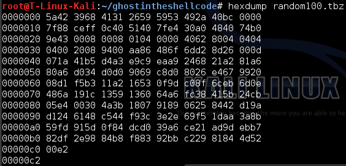](https://labs.jumpsec.com/wp-content/uploads/sites/2/2015/01/tbz-file.png) header of a random.tbz file\[/caption\]

\[caption id="attachment\_77" align="alignnone" width="1087"\][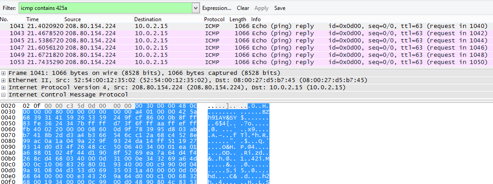](https://labs.jumpsec.com/wp-content/uploads/sites/2/2015/01/icmp-contains-425a.png) Updating filter for searching for the tbz file\[/caption\]

Then the 2nd piece of the tbz file is in packet \[No. 1051\] ending with bytes "30 98". The 3rd piece was in the next packet \[No. 1052\]. Then there is a series of packet exchanges with these 3 pieces and in packet \[No. 1075\] it is the last part of the .tbz file which ends with bytes "f0 c0". I exported these 4 data sections of these packets and then I used the HxD editor for copy/paste the bytes (I had also to remove some bytes from the first packet's data section)

\[caption id="attachment\_67" align="alignnone" width="621"\][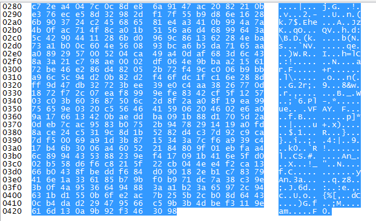](https://labs.jumpsec.com/wp-content/uploads/sites/2/2015/01/2nd-packet-trailer.png) 2nd part of the file\[/caption\]

\[caption id="attachment\_68" align="alignnone" width="823"\][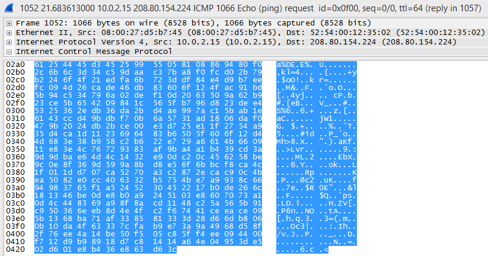](https://labs.jumpsec.com/wp-content/uploads/sites/2/2015/01/3rd-piece.png) 3rd part of the file\[/caption\]

\[caption id="attachment\_76" align="alignnone" width="644"\][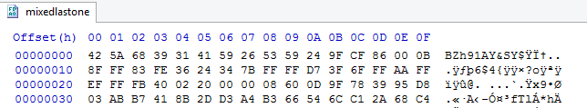](https://labs.jumpsec.com/wp-content/uploads/sites/2/2015/01/header-of-final-file-.png) Top of the final assembled file\[/caption\]

\[caption id="attachment\_79" align="alignnone" width="547"\][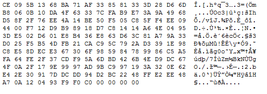](https://labs.jumpsec.com/wp-content/uploads/sites/2/2015/01/trailer-of-final-file.png) The end of the final file\[/caption\]

\[caption id="attachment\_85" align="alignnone" width="728"\][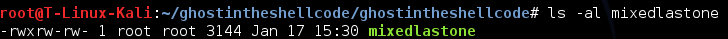](https://labs.jumpsec.com/wp-content/uploads/sites/2/2015/01/final-size1.png) Size of the file\[/caption\]

I renamed the file to be able to extract it and then that was it. The ping.py was also included in that tbz file!

\[caption id="attachment\_82" align="alignnone" width="728"\][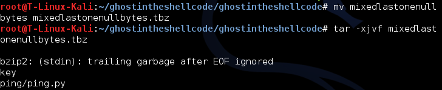](https://labs.jumpsec.com/wp-content/uploads/sites/2/2015/01/rename-the-file-for-extract.png) Renaming and extracting. Boom ;)\[/caption\]

[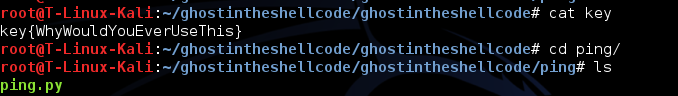](https://labs.jumpsec.com/wp-content/uploads/sites/2/2015/01/boom.png)
