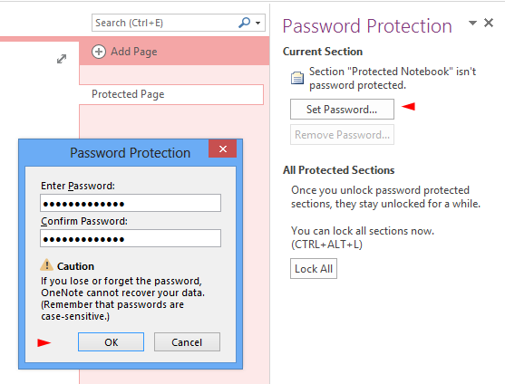
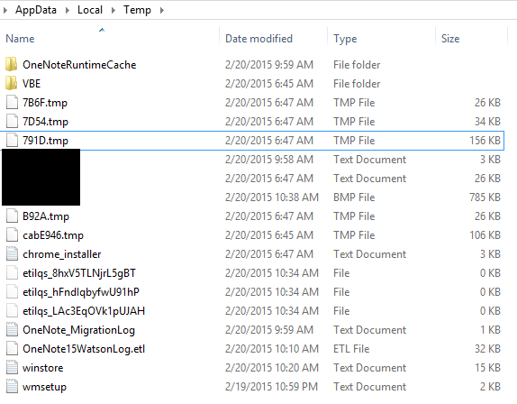
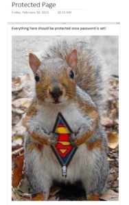
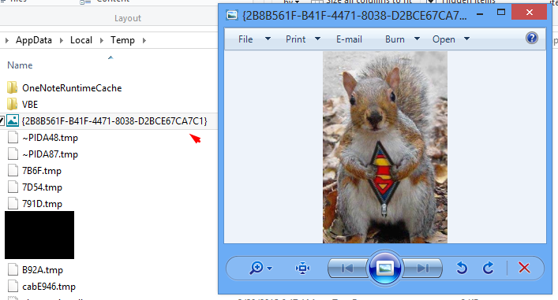

## Bug Summary

A security bug in the Microsoft Onenote allows images placed in user-created password-protected sections to be cached persistently in the user profile temporary directory folder:

_C:\\Users\\%username%\\AppData\\Local\\Temp._ 

Analysing the content the temporary folder will reveal images that should be securely protected by Onenote.

## Bug Scope

This has only been tested with Microsoft Onenote 2013 with all known updates installed. Last testing on 01/03/2015.

## Find the Bug Guide

1) Open Onenote and add a section to any existing notebook this will automatically create a page too.

\[caption id="attachment\_95" align="alignnone" width="501"\] Create Section in Onenote\[/caption\]

2) Navigate to the REVIEW tab in the main menu and click password button (see image above), the pane on the right will appear and allow you to set a new section password (see image below). You should set one now.

\[caption id="attachment\_96" align="alignnone" width="557"\] Set a section password\[/caption\]

3) Exit Onenote, then reopen it and enter password to unlock section. Now we are secure right!

4) Open your explorer, and navigate to the following location:   _C:\\Users\\%username%\\AppData\\Local\\Temp_

Leave this window open, your images will appear here shortly!

\[caption id="attachment\_107" align="alignnone" width="574"\] Navigate to Temporary Directory\[/caption\]

5) Open your web browser/explorer, find some images and copy and paste them into OneNote.

\[caption id="attachment\_97" align="alignnone" width="188"\] Copy and Paste Image into Onenote\[/caption\]

On some occasions Onenote will cache the image immediately in the temp folder, you can delete these since they will be back shortly.

6) Now close and reopen Onenote, you should enter the password to unlock section. During this stage Onenote caches the images in this password protected section in the temporary directory. Go take a look.

\[caption id="attachment\_108" align="alignnone" width="707"\] Microsoft Onenote Caches Image\[/caption\]

## Conclusion

Everything saved here is suppose to be in a password-protected section, but image are saved **persistently** in the temp directory and could potentially leak confidential information.

## Scenario

There are a number of problems that arise from this security bug, a few example could be a scanned image of a handwritten form reveals confidential information or a screenshot of usernames/passwords/finances saved in Onenote.
