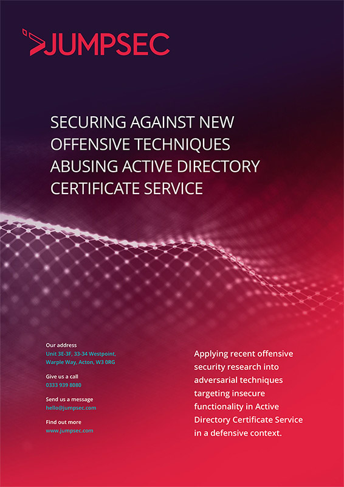

SpecterOps recently released an offensive security research paper that details techniques enabling an adversary to abuse insecure functionality in Active Directory Certificate Service.

SpecterOps reports that abusing the legitimate functionality of Active Directory Certificate Service will allow an adversary to forge the elements of a certificate to authenticate as any user or administrator in Active Directory. JUMPSEC has highlighted numerous changes that can be made to Active Directory Certificate Service configuration to protect the domain through a defence-in-depth approach.

We at JUMPSEC wanted to understand the defensive application of this offensive research to pre-emptively defend our clients from these techniques before exploitation is observed in the wild. To do this, we utilised our Active Directory lab and attempted to harden the service to reduce the risk of compromise and limit the ability for an attacker to cause harm.

In this article, JUMPSEC has documented the most effective and efficient methods we took to implement the broad defensive guidance in SpecterOps research. In our attempts to harden Active Directory Certificate Service, we have identified ways to harden the environment against compromise, and leverage auditing toolkits to make it easier to identify and remediate areas of exposure.

**[Read here for technical extracts](https://labs.jumpsec.com/active-directory-certificate-service-defensive-guidance/)** or for the full technical guide [**click here**](https://labs.jumpsec.com/wp-content/uploads/sites/2/2021/07/Active-Directory-Certificate-Service-Defensive-Guidance-v1.pdf)

**Article written by Dray Agha, Security Researcher |** Any questions, comments, or criticisms please drop me a line on: [Twitter](https://twitter.com/Purp1eW0lf), [Github](https://github.com/Purp1eW0lf/), or [Email](mailto:dray.agha@jumpsec.com)

