Hello w0rld! JUMPSEC researchers have spent some time on the glibc DNS vulnerability indexed as CVE 2015-7547 (It hasn’t got a cool name like GHOST unfortunately…). It appears to be a highly critical vulnerability and covers a large number of systems. It allows remote code execution by a stack-based overflow in the client side DNS resolver. In this post we would like to present our analysis.

## Google POC overview

[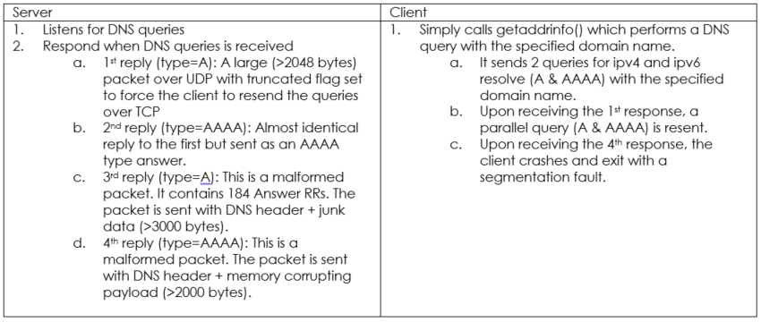](https://labs.jumpsec.com/wp-content/uploads/sites/2/2016/03/1sts.png)

## Google POC Network Exploitation Timeline

## Google POC Exploit Code Analysis

### First response

\[caption id="attachment\_184" align="alignnone" width="741"\][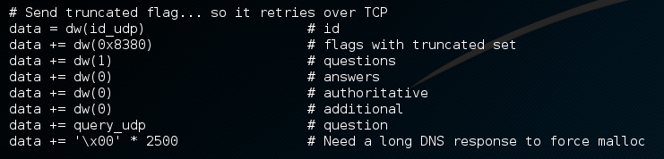](https://labs.jumpsec.com/wp-content/uploads/sites/2/2016/03/test.png) Code snippet\[/caption\]

[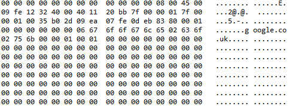](https://labs.jumpsec.com/wp-content/uploads/sites/2/2016/03/alter1.png)

Packet capture snippet

The dw() function calls a “struct” module from python library. According to the documentation, it performs conversion between python values and C structs represented as python strings. In this case, it interprets python integer and pack it into little-endian short type binary data. This is a valid response sent by the “malicious” DNS server when it receives any initial queries. This response packet is constructed intentionally in large size (with 2500 bytes of null), it forces the client to retry over TCP and allocate additional memory buffer for the next response. This also triggers the dual DNS query from getaddrinfo() on the client side, which is a single request containing A and AAAA queries concatnated.

### Second Response

\[caption id="attachment\_162" align="alignnone" width="531"\][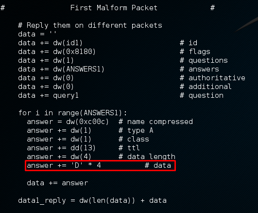](https://labs.jumpsec.com/wp-content/uploads/sites/2/2016/03/alter3.png) Code snippet\[/caption\]

\[caption id="attachment\_163" align="alignnone" width="484"\][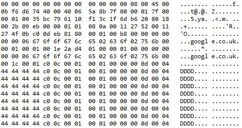](https://labs.jumpsec.com/wp-content/uploads/sites/2/2016/03/alter4.png) Packet capture snippet\[/caption\]

This is the second response sent by the malicious DNS server. It is a malformed packet sending large numbers of “fake records” (184 Answer RRs) back to the client. According to google, this forces \_\_libc\_res\_nsend to retry the query.

### Third response

\[caption id="attachment\_164" align="alignnone" width="482"\] Code snippet\[/caption\]

\[caption id="attachment\_165" align="alignnone" width="493"\][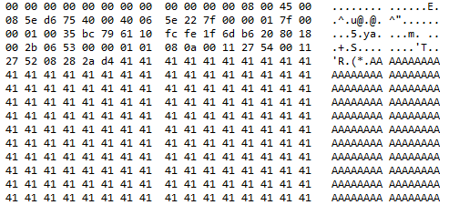](https://labs.jumpsec.com/wp-content/uploads/sites/2/2016/03/alter5b.png) Packet capture snippet\[/caption\]

This is the third response sent by the “malicious” DNS server. It is another malformed packet which is carrying the payload. JUMPSEC researcher has modified the Google POC code to identify the the number of bytes to cause a segmentation fault (possibly overwriting the RET address) of the buffer. It is found that the RET address is being overwritten on the 2079th byte. With the addition of return\_to\_libc technique, an attacker can bypass OS protection such as NX bit or ASLR and perform remote code execution.

## Google POC debugging and crash analysis

JUMPSEC has run it through the trusty gdb. It crashes with a SEGMENTATION FAULT which verifies that the DNS response has smashed the stack of the vulnerable client application when running getaddrinfo(). The vulnerable buffer is operated in gaih\_getanswer. The entry address has been overwritten with 0x4443424144434241 (ABCDABCD). The state of the register also showing the overflowed bytes.

\[caption id="attachment\_166" align="alignnone" width="888"\][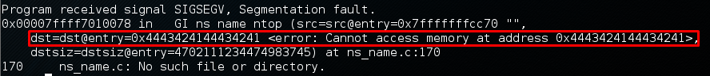](https://labs.jumpsec.com/wp-content/uploads/sites/2/2016/03/alter6.png) SEGFAULT from vulnerable client. RET address is overwritten with “ABCDABCD”\[/caption\]

\[caption id="attachment\_167" align="alignnone" width="889"\][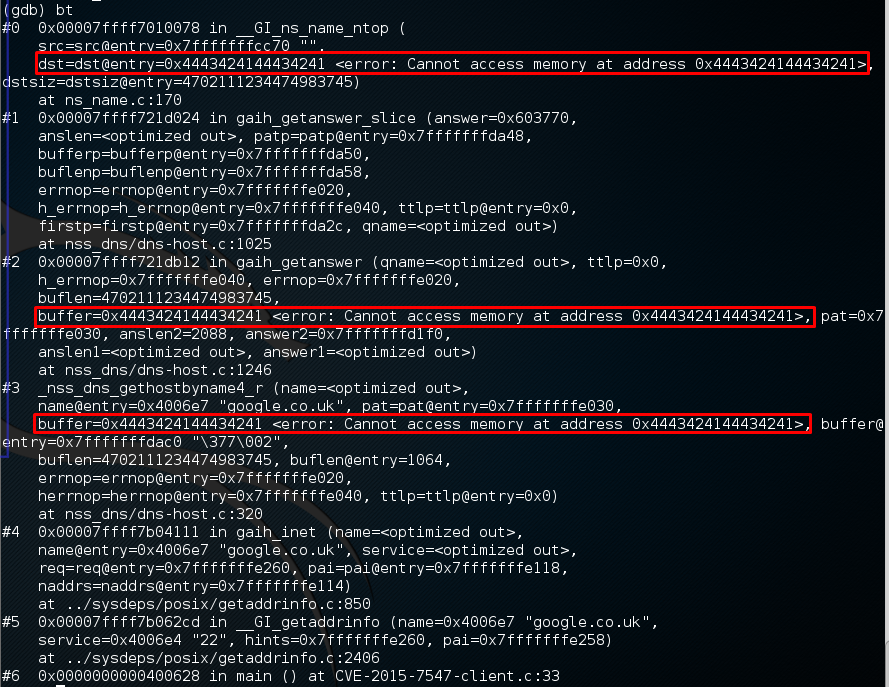](https://labs.jumpsec.com/wp-content/uploads/sites/2/2016/03/alter7.png) Backtrack\[/caption\]

\[caption id="attachment\_194" align="alignnone" width="666"\][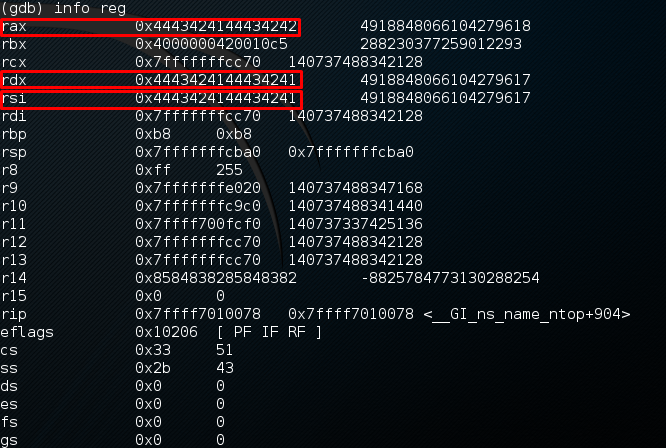](https://labs.jumpsec.com/wp-content/uploads/sites/2/2016/03/cropped.png) Registers\[/caption\]

JUMPSEC has also tested it on a few other applications. It was found that the getaddrinfo() function in glibc is commonly used…

[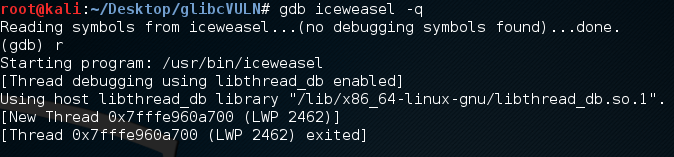](https://labs.jumpsec.com/wp-content/uploads/sites/2/2016/03/alter9.png)

\[caption id="attachment\_170" align="alignleft" width="938"\][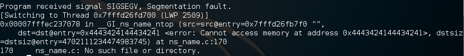](https://labs.jumpsec.com/wp-content/uploads/sites/2/2016/03/alter10.png) Iceweasel crashing\[/caption\]

## Conclusion

The best way to mitigate this issue is to enforce proper patching management. Make sure to update all your systems with the latest version of glibc . If you have any systems exposed on the internet and you want to make sure that this vulnerability is not triggered then the following Wireshark filter could be useful: (DNS.length>2048 to see malformed packets). A DNS response has a maximum of 512 bytes (typically), note that the DNS reply is truncated. Even if the client does not accept large response, smaller responses can be combine into a large one which can also trigger the vulnerability. A possible filter is to monitor the size of the entire conversation as a distinct amount of bytes in total is require to trigger specific responses from vulnerable client and all of them requires more than 2048 bytes.

The above vulnerability can be fixed by patching. If you are running RedHat or CentOS a simple

_yum -y update glibc_

will update the libc and resolve the issue (remember to restart the service right after the update!).

## Reference links

[https://cve.mitre.org/cgi-bin/cvename.cgi?name=CVE-2015-7547](https://cve.mitre.org/cgi-bin/cvename.cgi?name=CVE-2015-7547)

[http://pubs.opengroup.org/onlinepubs/9699919799/functions/freeaddrinfo.html](http://pubs.opengroup.org/onlinepubs/9699919799/functions/freeaddrinfo.html)

[https://googleonlinesecurity.blogspot.co.uk/2016/02/cve-2015-7547-glibc-getaddrinfo-stack.html](https://googleonlinesecurity.blogspot.co.uk/2016/02/cve-2015-7547-glibc-getaddrinfo-stack.html)

[https://sourceware.org/ml/libc-alpha/2016-02/msg00416.html](https://sourceware.org/ml/libc-alpha/2016-02/msg00416.html)
