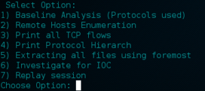

“_Indicator of compromise (IOC) in computer forensics is an artifact observed on a network or in an operating system that with high confidence indicates a computer intrusion. Typical IOCs are virus signatures and IP addresses, MD5 hashes of malware files or URLs or domain names of botnet command and control servers. After IOCs have been identified in a process of incident response and computer forensics, they can be used for early detection of future attack attempts using intrusion detection systems and antivirus software._” _Wikipedia_

Hello w0rld! In this post I am planning to do a brief introduction into network forensics and how network monitoring can be used to identify successful attacks. Network monitoring is essential in order to identify reconnaissance activities such as port scans but also for identifying successful attacks such as planted malware (such as ransomware) or spear-phishing. Generally when doing network forensics the network footprint is of significant importance since it allows us to replicate the timeline of events. With that said, network footprint can still be obscured/hidden by using cryptographic means such as point-2-point encryption. Even if you can’t see the actual traffic because it is encrypted, what you can see is the bandwidth load which might be an IoC.

In incident response the first step is the time that is needed for the attack realization. If the attack is not realized then of course there is no ‘incident response’ (doh!). There is a list of things that the analyst should go over in order to try to identify if an attack was successful. The list is not definite and there are far more things that need to be checked than those discussed here. Whether an attack is targeted or non-targeted, if it is utilizing the Internet connection in any way it will leave network footprints behind. In targeted attacks we see things like spear-phishing and USB planting that quite often are targeting susceptible individuals with lack of security awareness. Non-targeted attacks might include attack vectors such as malware, ransomware, malicious javascripts, flash exploits, etc. This is not exhausting since flash exploits and malicious javascripts can be used also in a targeted fashion. By identifying the Indicators of Compromise (IoC), we can have briefly describe each attack vector as follows depending on the network footprint that will have:

- IP addresses
- domain names
- DNS resolve requests/response
- downloadable malicious content (javascripts, flash, PDF files with embedded scripts, DOCX with Macros enabled)

There are also indicators coming out from behavioural analysis. For example a malware which contacts a Command & Control server will ‘beacon’ in a timely (usually) fashion. This ‘beaconing’ behaviour can be identified by monitoring spikes of specific traffic or bandwidth utilisation of a host. Moreover it can be spotted by monitoring out-of-hours behaviour since a host shouldn’t send data except of X type (which is legit) or shouldn’t be sending any data at all. Ransomware will encrypt all accessible filesystems/mounted drives and will ask (guess what!?) for money! Most likely it will be downloaded somehow or will be dropped by exploit kits or other malware. Sometimes it is delivered through email attachments (if mail administrator has no clue!). As stand-alone ‘version’ ransomware comes in portable executable (PE file) format. However variants of Cryptolocker are employing even PowerShell for doing so. In order to detect them we need a way to extract the files from the network dump. There are couple of tools that does this such as foremost but it is also possible to do it ‘manually’ through wireshark by exporting the objects. This assumes that the file transfer happened through an unencrypted channel and not under SSL. Malware might serve many different purposes such as stealing data, utilizing bandwidth for DDoS, or used as a ‘dropper’ where a ransomware is pushed. One of the more concerning is turning a compromised host into a zombie computer. Fast flux malware have numerous IPs associated with a single FQDN whereas domain flux malware have multiple FQDN per single IP. The latter is not ideal for malware authors since this IP will be easily identified and traffic will be dropped (a bit more about '_sinkhole_' in the next paragraph!). Assuming that we are after a fast flux malware that uses a C&C, then there are ways to locate the malware by looking for beaconing. Quite often these malware make use of DGAs (Domain Generation Algorithms) which basically hide the C&C IP behind a series of different domain names. Malware that uses DGA are actively avoiding ‘sinkhole’ which allows ISPs to identify the malicious IP (C&C) and leading to the ‘blackhole’ of the traffic, shunning the communication of the infected system with it. An infected host will attempt to resolve (through DNS) a series of domain names acquired from the DGAs, This behaviour will lead to lots of ‘Non-Existent’ _NX_ responses from the name server back to the infected machine. Monitoring the number of _NX_ responses might help us identify infected systems. Moreover monitoring the DNS queries should also help.

In a latter post I will publish a small script that I am using for looking for IoC.

\[caption id="attachment\_217" align="aligncenter" width="300"\] Script under development ;)\[/caption\]
