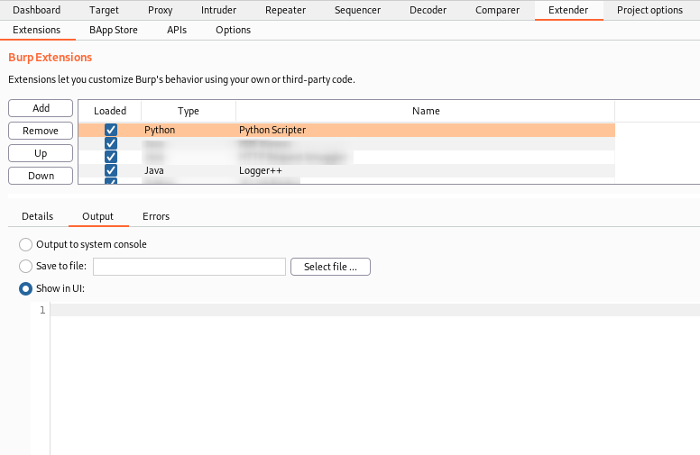
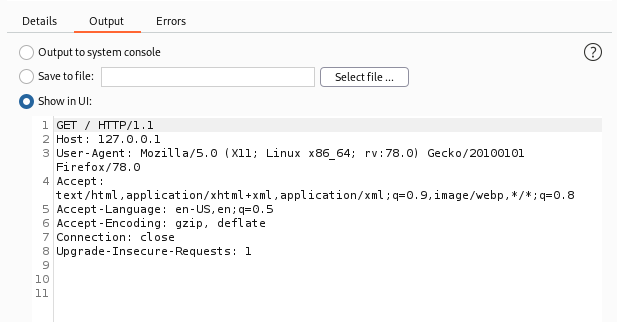
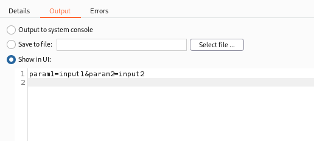
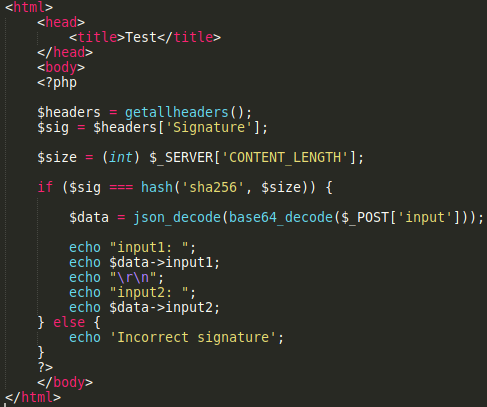
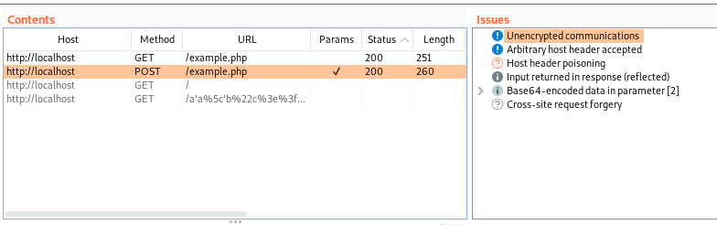
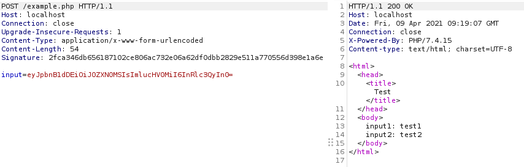
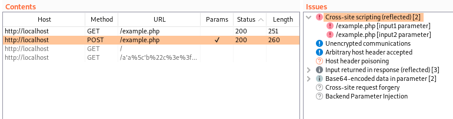

### Summary / TL:DR

I recently encountered some issues when using Burp Suite Professional which led me to playing around with the Python Scripter extension. The extension allows running custom Python scripts on every request/response processed by Burp, including those generated by functionality such as Burp's active scanner. This has a number of potential use cases, but I found it particularly useful to re-implement client-side functions that prevented the active scanner from identifying vulnerabilities it would normally detect. The extension is quite simple to use but has a somewhat steep learning curve, so I have shared some of my processes, findings and code samples which may be useful for others in similar situations.

### Background

When working on a recent client project I encountered an issue where the login functionality base64 encoded the username and password before sending it in a JSON request to the server. An example of this is shown below.

```
{
	"payload":"eyJ1c2VybmFtZSI6InRlc3R1c2VyIiwicGFzc3dvcmQiOiJ0ZXN0cGFzcyJ9"
}
```

The base64 encoded string decodes to {"username":"testuser","password":"testpass"} which is another JSON body with the input username and password. Unfortunately, at the time this format caused a lot of issues with fuzzing tools such as Burp Suite Professional’s active scanner. When scanning the endpoint Burp wasn’t quite smart enough to handle the encoding and decoding and didn’t fuzz the inner parameters inside the base64 encode input. Knowing that the web server logic wouldn’t correctly decode the fuzzed input, I set out to find a way to scan the parameters before they are encoded and have Burp automatically encode the input before it’s sent to the server.  
  
I found a number of extensions which appeared to work with base64 encoded values. However, none of these worked when the request to the server was sent in a JSON format. Eventually, I came across the Python Scripter extension \[[1](https://portswigger.net/bappstore/eb563ada801346e6bdb7a7d7c5c52583)\] which claimed to allow the execution of custom Python scripts on every request/response processed by Burp. As someone who enjoys writing Python scripts this sounded perfect for me and I decided to learn how to use it. Unfortunately, there was very little documentation about the extension and the user interface was simply an empty text box with no additional information.  
  
At this point I spent time googling and finding any existing code samples online to try and figure out how to actually use the extension. A particularly useful resource I found was lanmaster53’s pyscripter-er github repo \[[2](https://github.com/lanmaster53/pyscripter-er)\] which is worth checking out if you want to learn more advanced usage. Eventually, I managed to get a good enough understanding to be able to make a python script that would take a normal request with a username and password parameter and format it as a base64 encoded string sent in a JSON request. Since carrying out the test and writing this blog post, Burp has been updated and the active scanner now performs fuzzing of base64 encoded input. However, I thought I’d still write this up to provide a resource for understanding how to actually use the Python Scripter extension as base64 encoding was just one example of where it could be useful.

### Basic Setup

Along with installing the extension, I recommend installing the logger++ extension \[[3](https://portswigger.net/bappstore/470b7057b86f41c396a97903377f3d81)\] as this is useful for viewing the request after it has been modified by the python script. Overall, the basic setup involves three areas:

- The extension script window – For writing the python code
- The extension output/error window – For debugging the python code
- Logger++ – Seeing the transformed request as it is sent to the server

<figure>



<figcaption>

_**Print statements or other python console output will be displayed here, with errors shown in the “Errors” tab.**_

</figcaption>

</figure>

### Intercepting and Viewing Requests

Perhaps the most difficult part when using the extension is figuring out how to actually intercept the requests sent so that you can begin modifying it. As mentioned previously, there isn’t much in the way of documentation, but as the extension makes use of the Burp Suite extender API \[[4](https://portswigger.net/burp/extender/api/)\] we can use the documentation for that to learn a bit more about how to interact with requests. We know the extension implements the following variables and after reviewing the extender API documentation we can get a rough estimate of what class or value they correspond to:

- extender – IBurpExtender class
- callbacks – IBurpExtenderCallbacks class
- helpers – IExtensionHelpers class
- toolFlag – Integer value defining which Burp tool created the request
- messageIsRequest – Boolean value indicating whether the current message being processed is a request
- messageInfo – IHttpRequestResponse class

After reviewing the documentation of these classes, we can make a simple script to print out core information about the request such as the HTTP request headers and the body of a POST request. This includes all the information we likely want to modify such as any request parameters.

GET Request:

```
if messageIsRequest:
	reqbytes = messageInfo.getRequest()
	req = helpers.bytesToString(reqbytes)
	print(req)
```

POST Request:

```
if messageIsRequest:
	reqbytes = messageInfo.getRequest()
	req = helpers.analyzeRequest(reqbytes)
	headers = req.getHeaders()
	parameters = reqbytes[(req.getBodyOffset()):].tostring()
	print(parameters)
```


<figure>



<figcaption>

_**With the script included the request headers are stored in the req variable and can be printed to the output window.**_

</figcaption>

</figure>


<figure>



<figcaption>

_**Similarly, using a script we can access the POST request parameters.**_

</figcaption>

</figure>

### Modifying a Request

Now that we can get core information about the request, we can write whatever Python code we want to start extracting specific information from the request and change it. This could be using regular expressions or simply functions such as split and strip to process the input and combine it with specific functions based on the context of the application, e.g. base64 encoding the input.  
  
After we have modified our input value the request will need to be recreated using the new modified input. For GET requests this process is simple, we simply need to convert the modified request back to byte format and then set the message as the new request. For POST requests we will need to build a new request that combines the previous HTTP headers with the modified body and then set this as the new request.

GET Request:

```
newreq_bytes = helpers.stringToBytes(modified_req)
messageInfo.setRequest(newreq_bytes)
```

POST Request:

```
newreq_bytes = helpers.buildHttpMessage(headers,output_body)
messageInfo.setRequest(newreq_bytes)
```

Putting it together with the previous code an example GET request where we want to base64 encode an input we could use the following code.

```
import re
import base64

if messageIsRequest:
	reqbytes = messageInfo.getRequest()
	req = helpers.bytesToString(reqbytes)
	
	input_val = re.findall(r'input=[^\s]*', req)[0].split('&')[0].split('=')[1]
	output_val = base64.b64encode(input_val)
	
	output_param = r'input=%s' % (output_val)
	output_req = req.replace(input_param, output_param)
	
	newreq = helpers.stringToBytes(output_req)
	messageInfo.setRequest(newreq)
```

There isn’t really much more required to use the extension and whilst there is a lot more that can be done with it, this blog is only intended to help understand how to get started with it by providing some basic usage examples. In the final section of this blog, I’ve added an example showing how to use it to bypass a simple request signing implementation.

### Practical Example – Message Request Signing

As I mentioned previously, Burp is now smart enough to recognise the base64 encoded input and inject payloads into the body before its encoded – the original reason I had for using the extension. However, there are a number of potential use cases for the extension. As such, I thought I’d provide an example of another use for it.  
  
Another penetration test I conducted featured an application that implemented request signing, where every request sent to the server sent a signature generated from the request. As the signing was carried out by client-side code, it was possible to review the implementation and sign any request we make to the server. However, the signature would break a lot of Burp functionality, including the active scanner, as this isn’t automatically updated for every new request. To overcome this, once the signing implementation is understood, we can then use the Python Scripter extension to carry out the signing process on each request that Burp processes.  
  
As an example, I’ve created a very basic PHP web app that simply takes a base64 JSON encoded string containing two user input values and reflects those inputs in the web response. The application also requires a “Signature” header to be sent which contains a SHA256 hash of the length of the body of the POST request. This application is obviously vulnerable to reflected cross-site scripting, but if we try to use Burp’s active scanner to identify this it will fail. This happens as the request signature isn’t updated when fuzzing with XSS payloads, so Burp won’t detect the payloads in the response.

<figure>



<figcaption>

_**Simple PHP web app vulnerable to cross-site scripting.**_

</figcaption>

</figure>

<figure>


<figcaption>

_**Base64 string sent as input along with the signature header. Input is reflected in the web response**_.

</figcaption>

</figure>

<figure>



<figcaption>

**_Using_ B_urp's_ a_ctive scanner fails to pick up any cross-site scripting issues_**_._

</figcaption>

</figure>

We want our python script to do a number of things including:

- Extract two input values (input1 and input2) from the starting request.
- Format them in to a JSON request body.
- Base64 encode the JSON request body.
- Use the base64 encoded value as the value of the input parameter.
- Create a SHA256 hash of the length of the POST request body.
- Add the hash as a HTTP request header.

The following snippet of python code can be used to carry out all of this. We can then copy this into the extension script window, and it will automatically update a basic request with input1 and input2 parameters to the desired format. This will happen for all requests Burp Suite processes including those generated by functionality such as the active scanner, meaning the scanner should now pick up any vulnerabilities.

```
import re
import base64
import hashlib

if messageIsRequest:
	reqbytes = messageInfo.getRequest()
	req = helpers.analyzeRequest(reqbytes)
	parameters = reqbytes[(req.getBodyOffset()):].tostring()
	headers = req.getHeaders()

	val_1 = re.findall(r'input1=[^\s]*', parameters)[0].split('&')[0].split('=')[1]
	val_2 = re.findall(r'input2=[^\s]*', parameters)[0].split('&')[0].split('=')[1]
	
	input_val = '{"input1":"%s","input2":"%s"}' % (val_1, val_2)
	base64_val = base64.b64encode(input_val)
	output_body = r'input=%s' % base64_val
	
	hash_body_len = hashlib.sha256(str(len(output_body)).encode('utf-8')).hexdigest()
	sig = "Signature: " + hash_body_len
	headers.add(sig)
	
	newreq = helpers.buildHttpMessage(headers, output_body)
	messageInfo.setRequest(newreq)
```

<figure>


<figcaption>

_**With the script, we can now send a valid request without the signature and without the base64 encoding.**_

</figcaption>

</figure>

<figure>



<figcaption>

_**Using logger++ we can see that the script automatically modifies the request and adds the signature as well as converts the input into a base64 encoded string.**_

</figcaption>

</figure>

<figure>



<figcaption>

_**Now if we active scan the request the scanner will instantly pick up cross-site scripting vulnerabilities.**_

</figcaption>

</figure>

### Conclusion

There are a vast number of potential use cases for the Python Scripter extension when conducting testing using Burp Suite Professional. In particular, it is useful for any scenario where client-side code disrupts the function of automated tools by heavily modifying user input or the request before it is sent to the server. Some potential examples include:

- Encoding / encrypting user input (where keys and algorithms are known)
- HTTP request signature algorithms
- Weak captcha implementations
- Functionality which requires a unique value per request to the server

By following the processes outlined in this blog, you should be able to write your own Python scripts which can be executed on any request sent through Burp Suite and use this to overcome application specific complications that interfere with automated testing tools.  
  
Sample scripts for using the Python Scripter extension can be found at the JumpsecLabs GitHub repository \[[5](https://github.com/JumpsecLabs/python-burp)\].

### References

\[1\] [https://portswigger.net/bappstore/eb563ada801346e6bdb7a7d7c5c52583](https://portswigger.net/bappstore/eb563ada801346e6bdb7a7d7c5c52583)  
\[2\] [https://github.com/lanmaster53/pyscripter-er](https://github.com/lanmaster53/pyscripter-er)  
\[3\] [https://portswigger.net/bappstore/470b7057b86f41c396a97903377f3d81](https://portswigger.net/bappstore/470b7057b86f41c396a97903377f3d81)  
\[4\] [https://portswigger.net/burp/extender/api/](https://portswigger.net/burp/extender/api/)  
\[5\] [https://github.com/JumpsecLabs/python-burp](https://github.com/JumpsecLabs/python-burp)
