#### **By shd**

<figure>

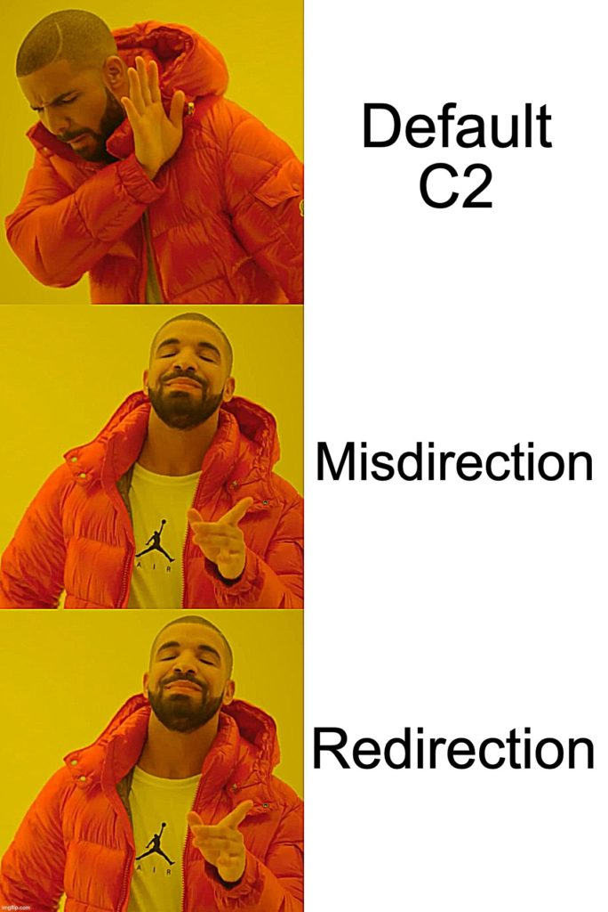

<figcaption>

Red Team and Magicians...

</figcaption>

</figure>

# **1.What is Command and Control**

Command-and-Control (C2) infrastructure is one the most important tools in a red teamer’s arsenal. In this article, we introduce a few simple methods that red teams use to harden their C2 infrastructure. 

C2 comes in various forms - but regardless they all share a basic function: **they allow the red teamer (or threat actor) to communicate with a compromised machine.** During an offensive campaign, testers may accumulate a number of compromised machines but it can be difficult and overwhelming to **maintain, orchestrate, and control** them in large numbers. On top of this to guarantee the campaign’s longevity, malicious communications back and forth to the compromised machine must be **secure, obfuscated, and reliable,** adding a further layer of complexity.

## 1.1 C2 in the Wild

**Not all C2s are born equal.** Leveraging the right apparatus, with particular design, is paramount to the success of the engagement. Covert offensive engagement can **last weeks if not months when simulating a realistic, stealthy attacker**. This places significant demands and **pressures on the C2 infrastructure.** Ethical red teamers and real-world adversaries begrudgingly share many tools and tricks. Both are purveyors of the finest C2 frameworks to manage their malicious campaign from.

In the field, there are some choice C2 frameworks for red teamers. [**Metasploit**](https://docs.rapid7.com/metasploit/manage-meterpreter-and-shell-sessions/) is incredibly popular for it’s **intuitive** use and stripped-back command line approach (script-kiddie-friendly indeed!). However, **Metasploit** loses major points for its **fragility** and lack of **maintainability** - the red team can’t trust **unreliable** tools! There are other C2 frameworks like [**PowerShell Empire**](https://www.powershellempire.com/) or it’s (GUI-version) [**successor Covenant**](https://stealthbits.com/blog/next-gen-open-source-c2-frameworks/) that offer a red team the **malleability** they desire from a C2 infrastructure. However, there is a particular C2 that meets most if not all the red team’s requirements, and are the [**evidenced-favourite**](https://intel471.com/blog/cobalt-strike-cybercriminals-trickbot-qbot-hancitor) of the adversary: **Cobalt Strike.**

> **At JUMPSEC**  we’ve come up against adversaries who have leveraged Cobalt Strike in incredibly sneaky ways. We’ve identified some interesting detections to hunt this C2 down, however it really is a **cat and mouse game**. As defenders tune and improve their monitoring controls, adversaries will shift their behaviour over time to evade detection - meaning that that defenders must identify new behaviours and techniques to monitor for. 

> Regardless of the obfuscation, C2’s must be commanded and reported back. This **beaconing** is an ebb and flow that must occur and therefore is something a defender can zero in on to detect across their network. This is no easy feat of course. JUMPSEC’s **red team and blue team work togethe**r to apply the innovate offensive security research from the red team in defensive context to continuously develop detection for the latest techniques.

As criminal adversaries often choose **Cobalt Strike as their** [**weapon of choice**](https://www.recordedfuture.com/2020-adversary-infrastructure-report/), blue teams have given it acute attention. Defensive security researchers have [**devoted entire reports**](https://talos-intelligence-site.s3.amazonaws.com/production/document_files/files/000/095/031/original/Talos_Cobalt_Strike.pdf) to detecting Cobalt Strike C2 communication! The uncomfortable attention of the blue team has compelled red team operators to ensure that their C2 infrastructure is **customised** for each assessment, remains **covert**, and should elude blue team sight for an extended period.

In this article, we share some **red team tips** on **hardening** command-and-control that ensure offensive engagements remain **flexible, reliable, and elusive.** There are many ways to harden one's C2 infrastructure. Let's zero in on one particular component - **redirectors** - which we have found are rather important for obfuscation.

## **2\. Redirectors**

### 2.1 What is a Redirector?

Redirectors are an essential component for advanced red teaming. Redirectors allow malicious traffic to come and go as it pleases, but remain **hidden from detection**. The objective of a redirector is to **mask the core C2 infrastructure from prying blue team eyes**, and allow the red team operator **hidden communication with a compromised machine**. Redirectors seek to mask and protect their backend server, the main orchestration server for all C2.

<figure>

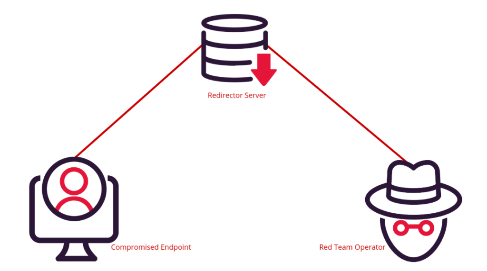

<figcaption>

Simplified, but you get the idea

</figcaption>

</figure>

Redirectors offer many advantages around obfuscation but they also offer a **resilience** and **persistence** advantage. If the blue team are able to successfully identify and block an IP address associated with the C2 infrastructure, the red team operator can quickly spin up a redirector and continue to keep the core backend server IP address hidden. 

### 2.2 Example of C2 without a Redirector

To understand the benefit of a redirector, let’s demonstrate how easy an attentive blue team defender can shut down and ruin a red team engagement that uses a vanilla C2. 

We can use **msfvenom** to generate a payload that doesn’t do anything special, it simply creates an executable that will call back to our C2 server. There’s no obfuscation, no clever C2-over-DNS techniques, no redirection - **nothing!**

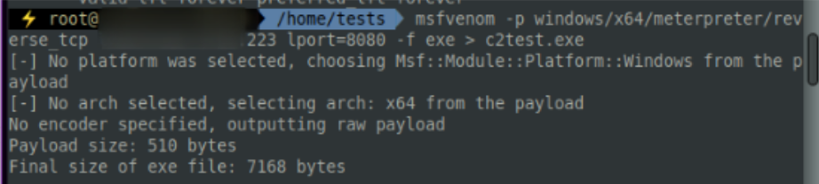

If we take this C2 payload and execute it on a machine, we will inevitably be caught by any blue team worth their salt. Using **netstat** on the target machine, from a defender’s perspective it’s clear to see the machine is currently communicating to a strange and new IP address on port 8080, based on an unusual executable (C2test.exe).

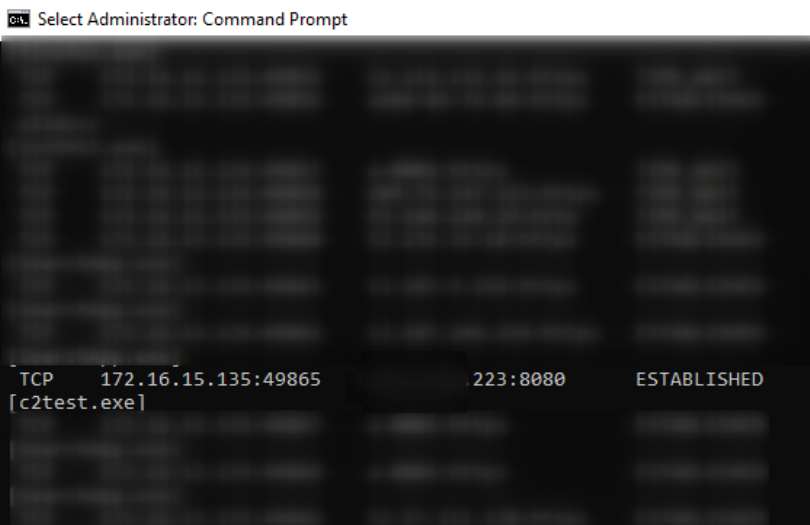

This would invariably stand out to a defender as suspicious - they would not recognise the executable (even if it was called something less obvious) and would not recognise the private IP in the conversation. The blue team would quarantine the machine and sever the malicious connection we worked so hard to establish.

# **3\. Redirectors save the Red Team’s day** 

The above is a textbook example of red team bad practice. A better approach is to use **redirectors** to prevent the infrastructure from being exposed at the first hurdle.

There are a plethora of redirection techniques, and we couldn’t possibly spoil all of our own fun by sharing them (the blue team can read too you know?). We’ll focus on the technical approach behind network traffic redirection. 

## **3.1 Dumb Pipe Redirection**

Dumb pipe redirection does exactly what it says on the tin. It blindly forwards our malicious traffic from node to node, but lacks sophistication for controlling the traffic. It does however allow us to obfuscate the IP of the core server, so that’s all that matters for now.

To achieve dumb pipe redirection we can rely on **socat,** with different **firewall** implementations to improve it.  

### **3.1.1 Socat**

The following socat command would be run on our **burnable redirector server** to enable  dumb pipe redirection towards our C2 server. 

```shell
sudo socat TCP4-LISTEN:8080,fork TCP:c2address:PORT
```

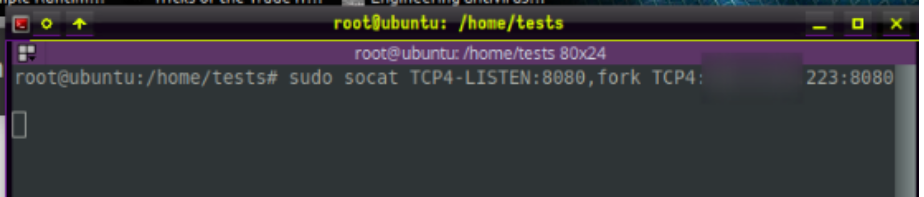

This allows TCP network traffic on port 8080 of the **redirection** **machine** to communicate on port 8080 of the **C2 server.** So now our C2 server can communicate with our disposable redirection server, we now need to put the compromise machine in communication with the redirection server. This then allows a nice **chain of communication from C2 server, to redirector, to compromised machine,** which remains hidden from the eyes of defenders. 

We now need to generate a payload that will complete the link in the chain and allow the compromised machine to communicate to our redirect server, the middle-man.

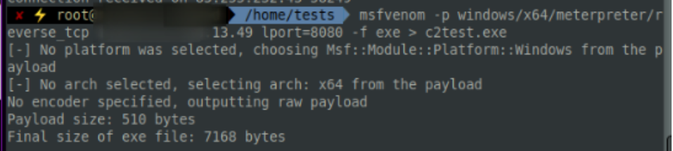

We can take this executable payload and detonate it on the target machine.When executed, it connects to our redirector server, which then forwards TCP port 8080 to our core C2 server blindly. In the screenshot below, we can see that there is a three-machine relay for communication: the top image shows the **172.16.15.135** target machine in communication with the **redirector** **server** on **x.x.13.49:8080,** the redirector machine is then in communication with the **C2 server** on **x.x.x.223:8080**. If the blue team catch us now, **all we will lose is the redirector server** and not our core infrastructure.

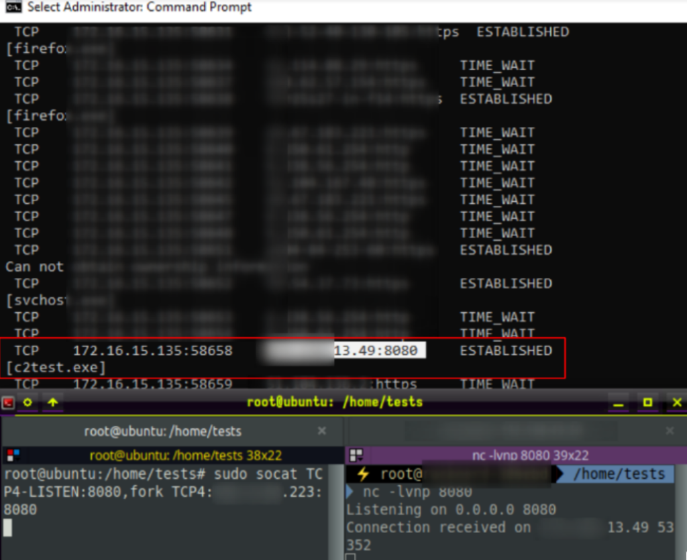

### **3.1.2 Socat and Uncomplicated Firewall**

There is, however, one **disavantadge** to this method of **socat dumb pipe redirection**. Anyone with the **redirector's** **IP** **address** can now connect to our listener via the specified port. Let’s illuminate this using the network scanning tool **nmap,** which shows that we’re running a **proxy** (the redirector). A defender would definitely notice if there was an unrecognised web proxy in communication with a machine in their internal network. 

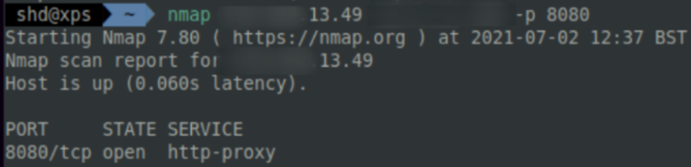

To avoid this situation, let’s maker our dumb pipe redirector a bit smarter. We can configure a **firewall** that will protect our infrastructure and allow only the redirector to directly connect. In this case, we're going to use **ufw**, which stands for **Uncomplicated Firewall** and is available for a variety of UNIX distributions. 

Let’s configure UFW on our **core C2 server** and **redirector server** to allow for traffic monitoring:

- Let’s configure Port **22**, which is usually reserved for SSH services. 

- Let’s configure Traffic from our **redirector** IP **outbound** and **inbound** from TCP port **8080**

- And then let’s finish up by **disallowing outbound traffic** anywhere else

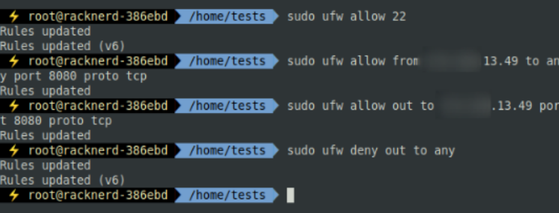

What we have here is a firewall configuration that allows C2 communication from our malicious core server to our malicious core redirector.  We then need to duplicate our efforts on the **redirector server’s firewall.**

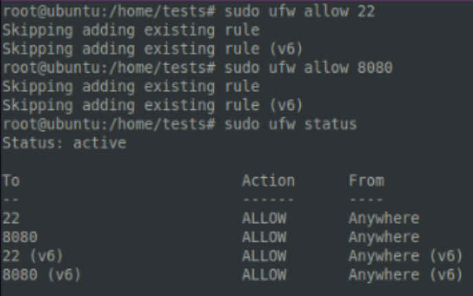

When we’re all done, our tracks should be covered. We can confirm this using **nmap**. When we scan our Core C2 IP address, it now displays as filtered, indicating that traffic is secured and is only accessible via the redirector server. **Awesome for us**, not so much for the blue team!

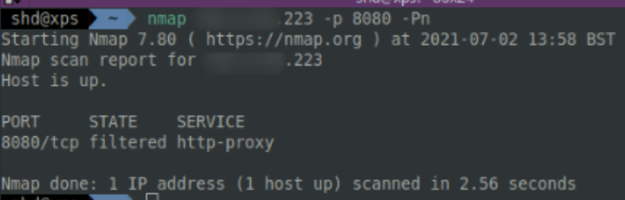

### **3.1.3 IPTables Redirection**

**IPtables** is a unix tool that allows granular control of network traffic, down to the packet level. It’s an incredibly powerful tool that can be leveraged for both defense and offense - let’s try the latter. 

It is possible to acheive **same** **result** as socat dumb pipe redirection but using **IPTables** instead. Here, we specify exactly which network traffic **packets** should accepted or dropped, and where they should be **forwarded** or **rerouted** in order to meet our tailored specification for masking the traffic to and from our core C2 server. 

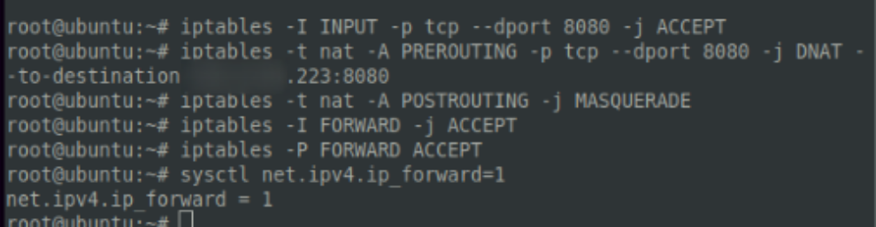

The end result is similar to **socat** and **ufw**, and we manage to communicate from C2 server, to redirector, to compromised endpoint all without revealing the C2 server to the blue team! In the screenshot below, we’re actively running malicious commands to the compromised machine whilst leveraging the granular iptables rules to obfuscate our rerouted malicious network traffic. 

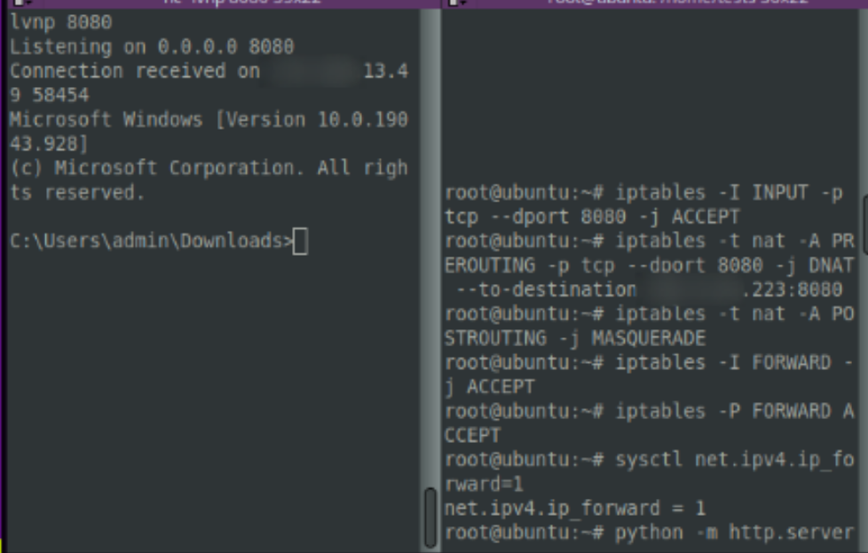

## **3.2 Redirection using Apache mod\_rewrite**

An alternate method to dumb pipe redirection employs **Apache mod\_rewrite**, which offers a number of techniques to strengthen our infrastructure. 

Essentially, apache mod\_rewrite allows a proxy to behave differently if fed different arbitrary information - such as user agent, operating system, IP address and more. This creates more varied network traffic, as the rules we give will dictate if traffic should be dropped, accepted, or redirected according to particular prescribed behaviour. There is significant time and effort consumption to using this method compared to socat and the firewalls, delivering improved results in return. 

We can accomplish this by specifying rulesets and a _.htaccess_ file in the webserver's root directory. In our case, we're going to create a rule that redirects curious visitors to our labs.jumpsec.com page. Let’s take a deep dive into setting this up. 

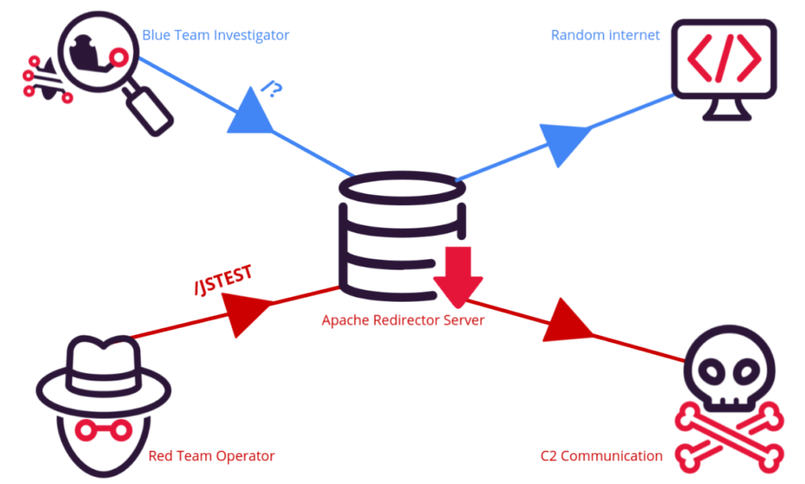

### **3.2.1 Configuring Apache Mod\_Rewrite** 

To begin, we need Apache2 on our redirection server. We then need to open up its configurations file, and change _AllowOverride_ from **None** to **All** inside _/etc/apache2/apache.conf_ to begin the process of abusing mod\_rewrite for our own malicious intent. 

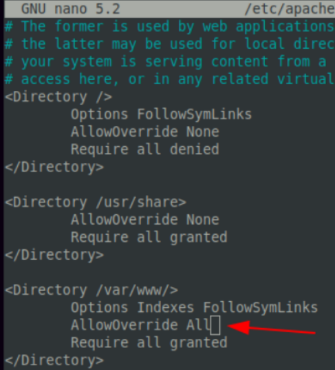

We then can **enable** Apache2 module rewrite, and follow up by restarting the apache web service so the change can take effect. 

```shell
sudo a2enmod rewrite proxy proxy_http
sudo service apache2 restart
```

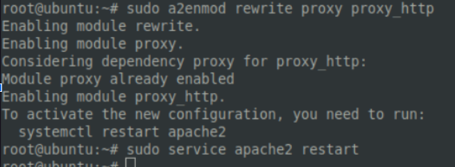

Then, within the web server's root directory, we must create a **.htaccess** file. This will filter traffic based on our specified criteria and is therefore a crucial component in this whole operation (so let’s not make any mistakes here!). Set  **.htaccess** file's _chmod_ permissions to **644**.

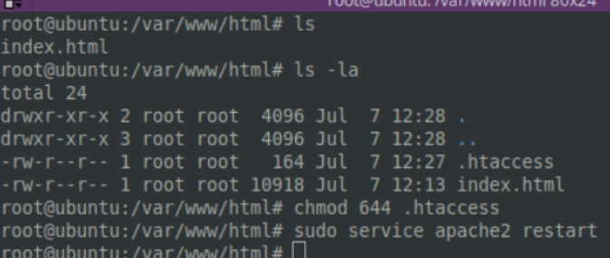

### **3.2.2 Malicious Rules**

Now that we’ve installed the necessities, let’s get to work. We need to create our ruleset that will filter proxy traffic based on arbitrary behaviours / strings that we give to the web server. 

Let’s create a rule that behaves differently depending on if an incoming request has a particular **directory.** Only we will know the secret directory that will facilitate malicious traffic. To everyone else, we will forward them to this awesome site we know…

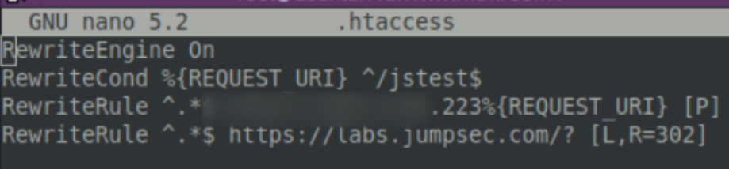

In the above ruleset, we can see that if the directory **/jstest** is explicitly included in the http(s) traffic, it will be forwarded to our **C2 core server** running on **x.x.x.223.** If any traffic attempts to come that does not include that specific **/jstest** directory, then the apache web server will behave differently and reroute the nosey, inquisitive investigator to **_labs.jumpsec.com_**.

To the unwitting visitor to our redirector middle-man server, they are simply visiting the JUMPSEC labs website. They did include the secret **/jstest** directory in their request, and therefore they will not discover the hidden malicious infrastructure we have set up.

Conversely, by offering the **/jstest** directory in a request, we are able to control and issue commands across our obfuscated communication line. In our example below, we could have had something incredibly sophisticated and malicious...instead we chose to issue a warning.

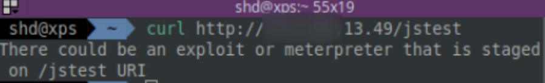

### **3.2.3 Integrating mod\_rewrite elsewhere**

It’s awesome to use mod\_rewrite to arbitrarily change the behaviour of our web server. However the default C2 usability of this method is unwieldy. In the example below, we can see it’s a bit clunky and doesn’t lend itself to the rapid action that a red team operator needs. 

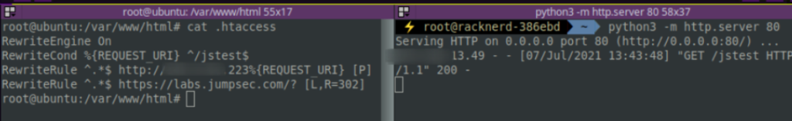

It is possible to fit this apache mod\_rewrite technique in as a component to other C2 infrastructure. Earlier, we spoke about **Metasploit**, and whilst it isn’t the most reliable of it’s peers it is quite flexible and good at fitting new components in. We can make **Metasploit** and **apache mod\_rewrite** play nicely with each other, which will make our ability to issue commands that much easier.

In **Metasploit**, we can leverage the _\-URI uriflag_. If we run a meterpreter payload on the compromised machine, we can ensure that only payloads with this URI flag can connect to our C2 Server, preventing anybody interested from peeking into our domains. This step doesn’t just ensure our C2 remains **hidden** but also **improves** the **usability** of our redirections.

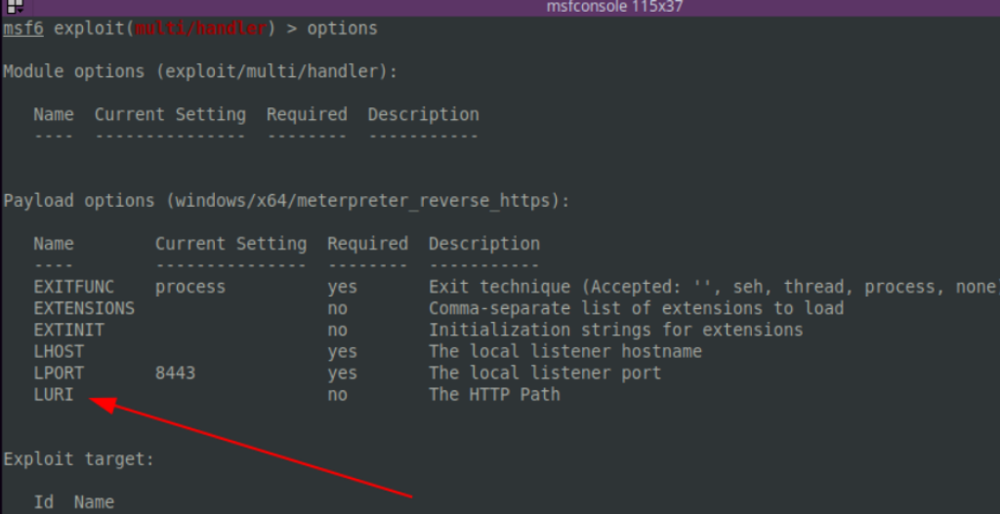

# **4\. Beyond C2**

This article only covered one of the many elements of the offensive security arsenal. Robust and obfuscated C2 is one of the most critical actions that successful red teamers and real-world attacker’s alike take when compromising a network. I hope that this high-level article demonstrates that creating a covert infrastructure is a critical step in effective and covert attack simulation.

There is much more to talk about overall about the red team’s attack path repertoire. And there is still more to talk about C2 itself! There are so many ways to customise a C2 infrastructure that some have even written and deployed [C3 infrastructure](https://labs.f-secure.com/tools/c3/) as part of their engagements. Adversaries in real life have used C3 to create kernel-level APIs that they then use to communicate, rather than utilising the protocols and services that C2 uses (like SSH or HTTPs). The limits are truly endless for command-and-control.

Shd is a Red Team Operator @ JUMPSEC
