**Software**: Zoho ManageEngine Desktop Central  
**Affected Versions**: Before 10.0.662  
**Vendor page**: https://www.manageengine.com/products/desktop-central/vulnerabilities-in-reports-module.html  
**CVE Reference**: CVE-2021-46164  
**Published**: 09/01/2022  
**CVSS 3.1 Score**: 8.8 High  
**Attack Vector**: SQL Injection / Arbitrary File Write  
**Credits**: Tom Ellson

This is the first post in a two part series on Manage Engine Desktop Central. All of the reported issues have since been acknowledged and resolved by Managed Engine.

## **Summary**

Whilst logged in as a user who has full control over the "reporting" module within Desktop Central, an attacker could directly query the underlying Postgres DB.

By default, queries are made by the "dcuser" user. This user is a database administrator and has unrestricted access to all tables and databases within the postgres instance. Therefore, this user can use the built in server side functions _lo\_import_ and _lo\_export_ to achieve arbitrary file write. 

> [Here](https://srcincite.io/blog/2020/06/26/sql-injection-double-uppercut-how-to-achieve-remote-code-execution-against-postgresql.html) is some great content on the abuse of _lo\_import_ and _lo\_export_.

_lo\_import_ can be used to import any file system both on the server and hosted on an attacker-controlled SMB share via UNC path. Following this, it is possible to use _lo\_export_ to write the file anywhere on the system; as the _postgres_ service is running as NT AUTHORITY SYSTEM, the owner property of this file was set to SYSTEM with the highest integrity. This also means that a malicious user is able to write any file on the system to the Desktop Central base directory and could then browse to the web root to retrieve its contents. 

In order to achieve code execution JUMPSEC observed that when the _UEMS.exe_ service stops or starts it attempts to run the "_java.com_" executable from the _"C:\\program files\\desktopcentral\_server\\jre\\bin\\_" directory. By default, _java.com_ is not present, meaning that JUMPSEC could write a executable file named _java.com_ to that location and hence it will be executed at the service start time. This file is executed as NT AUTHORITY SYSTEM meaning that code execution is achieved with the highest integrity. 

#### Attack Path

- SQL injection executing the _lo\_import_ to import a malicious executable into the large objects on the Postgres DB, and then using _lo\_export_ to export them to anywhere on the underlying operating system.
- Writing the attacker-controlled exe to the "_C:\\program files\\desktopcentral\_server\\jre\\bin\\_" directory as _java.com._
- Waiting for the service to restart.

## **Arbitrary File Write - Query Report**

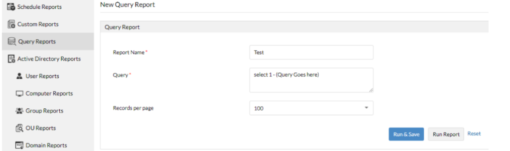

It was apparent that the _query_ field was directly querying the database. This was determined by running "SELECT 1" within the query field. 

From here it was trivial to weaponise. The first step was to enumerate the postgres service and which user was being used to run the queries:

#### Post Request to Enumerate The Current User

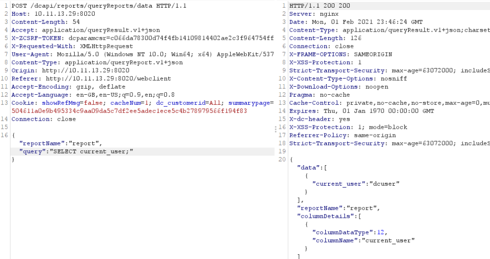

#### Post Request to Enumerate The Postgres Users

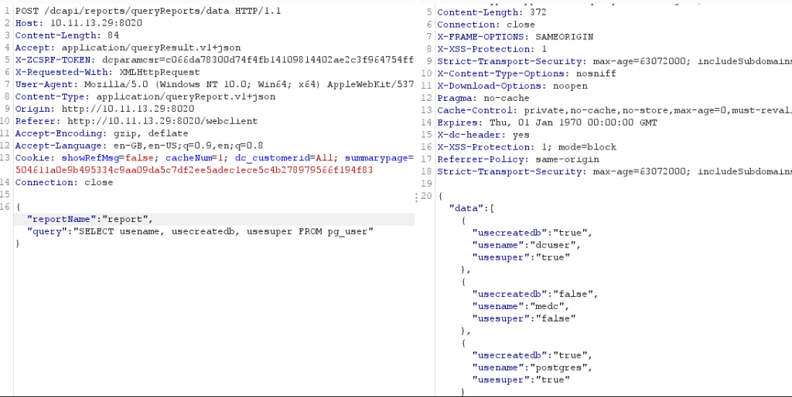

The queries were being run as _dcuser_, who is a _superadmin_. From here there was multiple avenues that could be explored to extract data from the database, firstly we attempted to take the password hashes from the pg\_shadow table:

#### Post Request to Enumerate The Hashes from the pgshadow Table

This would still require us to be able to crack the hashes or additional steps on the attack path, it's also likely that the _postgres_ service is limited to localhost.

Usually in this situation we attempted to create a function in order to execute code. This wasn't possible due to server side validation ensuring that only _SELECT_ commands could be used within the query. It was apparent that we would have to use the server-side functionality that is built into POSTGRES, and as such lo\_import and lo\_export were explored.

[lo\_import and lo\_export](https://www.postgresql.org/docs/9.1/lo-funcs.html) seemed a good candidate for being able to read and write files, so we dropped _secretfile.txt_ onto the administrator desktop to attempt to use lo\_import to import it into large objects. 

#### Post Request using lo\_import

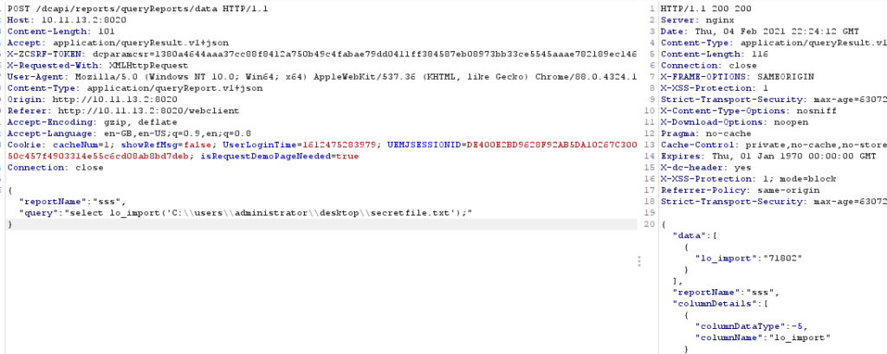

<table><tbody><tr><td></td></tr></tbody></table>

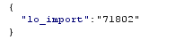

The response from the query was the OID number of the large object that had been imported. This is important because it will need to be used to identify the large object within the lo\_export command.

The obvious next step is to write this file to the web root, however there was an issue writing a _jsp_ shell to the web root. JUMPSEC determined this was due to restrictions in the java configuration and no further digging was done.

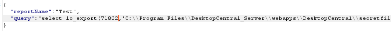

<table><tbody><tr><td></td></tr></tbody></table>

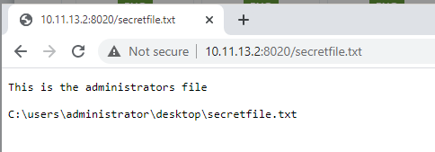

Once arbitrary read / write was confirmed, the attacker was required to know the file name before it can be used with lo\_import and moved with lo\_export.  Next, we analysed what is loaded at service start and stop time to see if this could be abused to execute code leveraging the arbitrary file write. Surprisingly, the service attempted to load the java.com binary at service start and stop time.

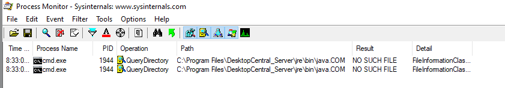

By placing a binary here and getting the service to stop and start we were able to achieve code execution. But, we still had the problem of being able to load a malicious file into large objects using lo\_import.

It was apparent that UNC paths could be used to load a malicious file into large objects. If an attacker can host a SMB server on the same network as the MEDC server, we can use lo\_import to pull an exe from the SMB server and write it to a location of our choosing. 

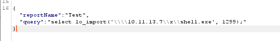

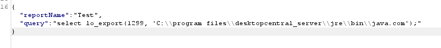

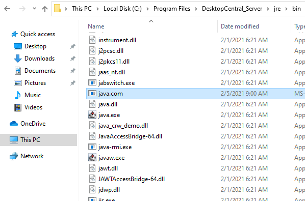

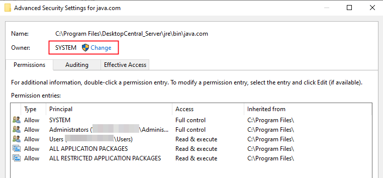

<table><tbody><tr><td></td></tr></tbody></table>

## **Summary**

To recap, by this point we had achieved arbitrary file write as NT AUTHORITY SYSTEM, and had identified a binary that was loaded at boot time and whenever the service stops or starts. The j_ava.com_ binary was missing within the default standard build of MEDC.

Whilst not finding a way to directly trigger the service start and stop using the MEDC portal, it was trivial to cause denial of service (DoS) on the platform by writing the file _bcrypt.dll_ to the postgres bin directory. This completely kills the web portal and instructs an administrator to reboot the service (the service won't start again until that file has been removed, so this can be incredibly tough for an administrator to unpick). Then once the administrator restarts the service, the java.com binary will be executed as SYSTEM.

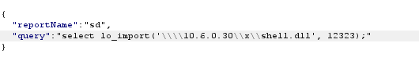

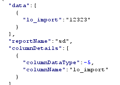

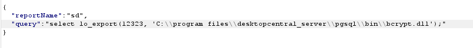

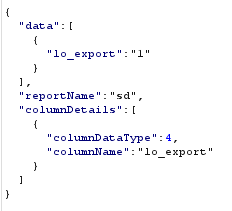

JUMPSEC stopped the attack path here and reported this issue to Managed Engine (Zoho). 

The issue was quickly addressed by Managed Engine. While the patch does not cover all aspects of this attack chain, it addresses the root cause by removing the dcuser from the superadmins postgres group. Therefore server-side queries cannot be used to load large objects. The service is still running as SYSTEM, the java.com binary is still missing on service start and stop and the bcrypt.dll still kills the entire service.
