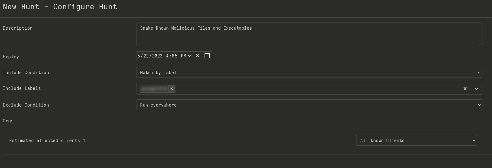
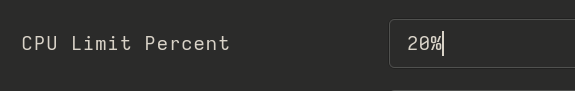
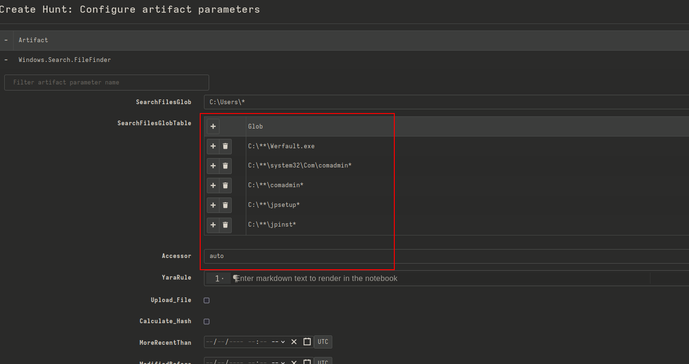
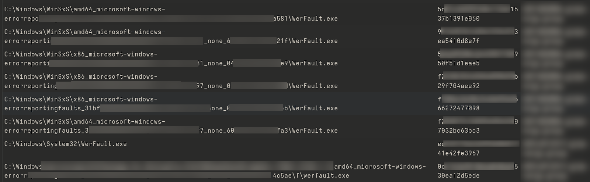
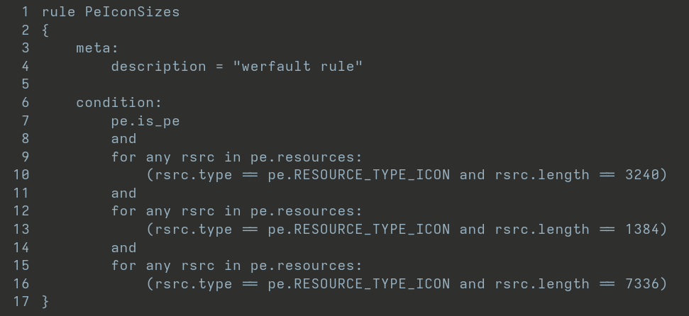
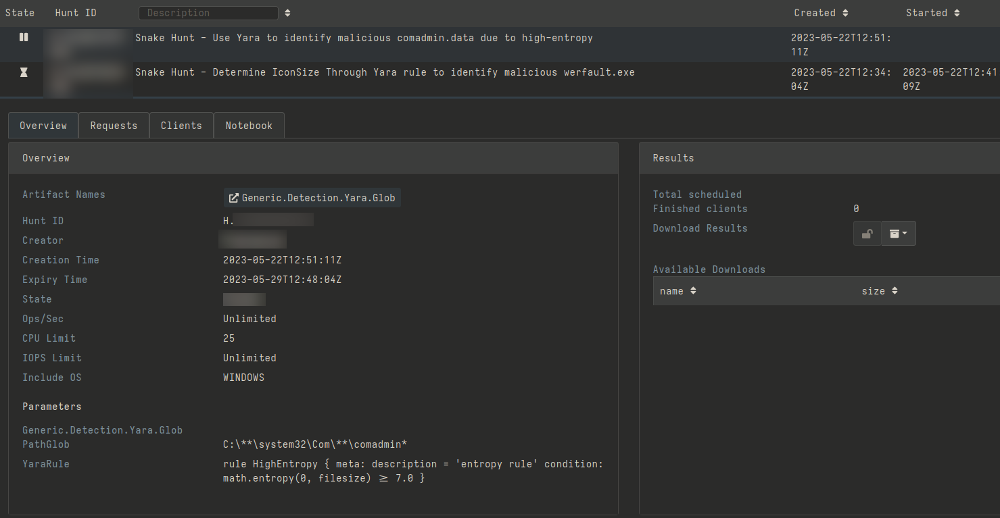
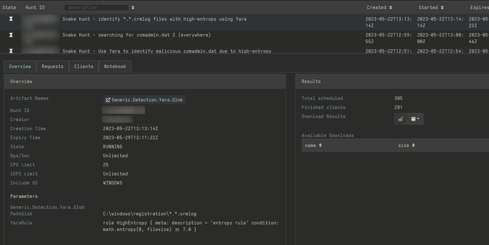
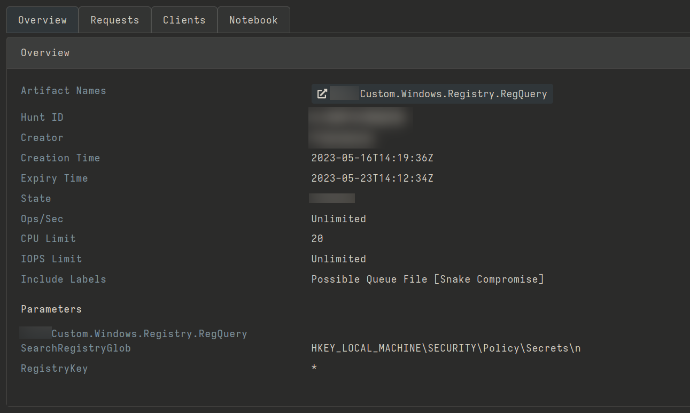
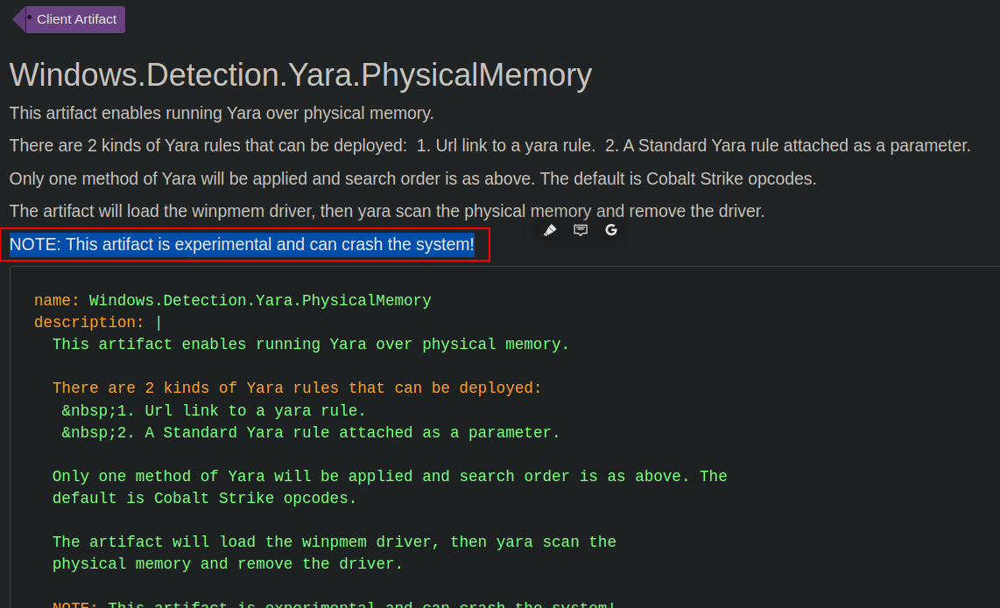

In May 2023 the NCSC and CISA released a joint cyber security advisory addressing a piece of Russian malware called [**Snake**](https://www.ncsc.gov.uk/news/uk-and-allies-expose-snake-malware-threat-from-russian-cyber-actors). According to them, this malware has been gathering intelligence for the FSB in more than 50 countries for the last 20 years. Off the back of this advisory JUMPSEC decided to perform a number of threat hunts to provide assurance for some of our clients.

Whilst conducting these hunts, we thought it would be beneficial to share the high-level methodology for this in the form of a blog post, to encourage other security professionals to proactively search for emerging threats in their infrastructure. This post will show that whilst a rich understanding of malware, TTPs, and threat hunting would certainly be beneficial, this is not a hard requirement to get started with your first hunt. Using free open-source tooling such as [**Velociraptor**](https://github.com/Velocidex/velociraptor), anyone can get started.

Velociraptor enables incident responders, blue teamers and threat hunters to gather data about hosts through a Velociraptor agent deployed on the machine, and run modules (called “artifacts”) to carry out various checks (called “hunts”). The ultimate goal is to determine whether any malicious activity can be observed on the machine, and search for “undetectable” malware that might be running under the hood.

A more detailed overview of the TTPs and IoCs discovered by the NCSC and CISA’s detailed joint advisory can be found in our recent “[**Hunting for Snake**](https://labs.jumpsec.com/hunting-for-snake/)". We urge readers who are interested or concerned about Snake to go and read that.

Although the hunt came back “clean” (no Snake related implants or IoC were identified in the estate) we thought that readers could still benefit from commands, directions and the thought process that came from our approach when looking for the malicious implant.

Before starting, our “hunting plan” was designed to consider the following phases when using Velociraptor for hunting:  

3. Identify executables and known-malicious files (in an attempt to reduce the scope)
  
\[table id=3 /\]

6. Identify anomalous Registry entries on Windows Systems:
  
\[table id=4 /\]

9. Identify persistence mechanisms (based on mitre TTPs):
    
    - Scheduled Tasks
    
    - Autoruns (autorunsc)
    
10. Identify and check unsigned executables against VirusTotal (possibly using a more targeted scope)
  

13. Execute [**Hayabusa**](https://docs.velociraptor.app/exchange/artifacts/pages/windows.eventlogs.hayabusa/) through the Velociraptor agent across the identified possibly-compromised hosts for a forensic analysis of Windows Event Logs.

For this specific client we performed a hunt using Velociraptor combined with the aforementioned list of IoCs. This is a relatively comprehensive set of hunts for an in-depth analysis needed to determine if the positive IoCs returned at an initial stage are to be considered an incident or not.

With our game plan laid out, we began the hunt. To start, we looked for executables and known-malicious files using the \`Windows.Search.FileFinder\` artifact available on Velociraptor, targeting all Windows machines and looking for files such as:

> _jpsetup.exe, jpinst.exe, comadmin.dat, werfault.exe_

And for the following regex string:

```
".*\/registration/(\{[0-9A-F]{8}\-([0-9A-F]{4}\-){3}[0-9A-F]{12}\}\.){2}crmlog"(regex).
```



_Configuring a hunt on Velociraptor._

If you’ve deployed Velociraptor in your estate you can leverage its features to configure and start hunting for indicators of compromise through the sheer amount of “artifacts” provided to speed up the information gathering phase, as well as labelling and taking actions based on the data returned.

Velociraptor’s artifacts can be explored on the following two web pages:

- - Artifacts Reference: [https://docs.velociraptor.app/artifact\_references/](https://docs.velociraptor.app/artifact_references/)
        
    - Artifacts Exchange - for community developed artifacts: [https://docs.velociraptor.app/exchange/](https://docs.velociraptor.app/exchange/)
        

During the hunt setup, it is possible to select how resource-intensive the agent should be when searching for IoCs within the individual hosts.



_Limiting the CPU usage for the agents to 20%._

This is useful when there are sensitive legacy hosts running in the network. However, do note that this only applies to the CPU usage and not the actual bandwidth utilised by Velociraptor’s agents.

Subsequently, we used the following paths to look for wefault.exe, the persistence mechanism employed by Snake:

- - C:\\Windows\\\*\*\\werfault.exe
        
    - C:\\windows\\system32\\\*\*\\werfault.exe
        
    - C:\\windows\\system32\\x86\_microsoft-windows-errorreportingfaults\_31bf3856ad364e35\_4.0.9600.16384\_none\_a13f7e283339a0502\\\*.exe
        
    - C:\\Users\\\*\*\\werfault.exe
        



_Configuring the hunt for werfault.exe_

While multiple instances for this file were returned, none of them were actually revealing a compromise as they are legitimately signed and presenting a standard icon size.



_Multiple instances of werfault.exe were returned, but they were not malicious._

This file should also be searched using the following YARA rule to identify versions using an icon size different from the standard (one of the IoCs associated with this threat). This rule should be run on all files in the typical path, but more specifically for the \`%Windows%\\WinSxS\` directory.



_YARA rule to search for malicious wefault.exe files._

The YARA rule confirmed that no hosts running `werfault.exe` presented a non-standard icon size.

Another IoC to look for is \`comadmin.dat\` which contains Snake's Queue File (one of snake's components, listed in our accompanying [**blog**](https://labs.jumpsec.com/hunting-for-snake/)). If nothing comes back from this search, further searches can be done utilising a yara rule to search for a \`comadmin.dat\` with high entropy.

We hunted for instances of comadmin.dat, using both the \`Windows.Search.FileFinder\` and the \`Generic.Detection.Yara.Glob\` artifacts. The YARA rule is required to identify instances of this file presenting high-entropy.



_Configuring YARA rule to hunt for comadmin.dat_

The above-mentioned rule can also be used to look for files presenting a similar filename to the following glob:

> \*.\*.crmlog



_Hunting for \*.\*.crmlog using the YARA rule_

The last search we performed was in relation to the registry values known to be present when Snake is running on a host. We looked for default instances of known encryption / decryption keys from Snake in the \`SECURITY\\Policy\\Secrets\\n\` registry.

Using the known-malicious values listed in the original advisory we used a custom module to execute this hunt.



_Configuring the hunt to search for known malicious values in Windows Registry._

At this point, we were satisfied with the consistency of negative results and since nothing suspicious came back we stopped the hunt there. However, one last check could consist of searching the memory of the hosts using the Yara rule developed by researchers at [**SigmaHQ**](https://gist.github.com/msuiche/8c8fd278430dda0292b4cfdfc549ca2d).

Velociraptor provides an artifact that allows you to run YARA rules in memory, however do use this at your own discretion and based on your network stability, reliability and bandwidth as the document referencing this artifact actually warns users that the feature is experimental and can end up crashing your system!



_YARA rule that can be deployed to search in-memory execution_

In this case I could happily conclude that no indicators of compromise were observed on any of the Windows hosts analysed in our client’s network.

In conclusion, JUMPSEC recommends readers to hunt for Snake in their estate as soon as possible to rid themselves of all concerns relating to this persistent threat actor. Tools like Velociraptor have made this straightforward and can enable hunting and incident response capabilities relatively painlessly. Steps like the ones presented in this blog post can help readers become first-time hunters - identifying, isolating or entirely eliminating threats from within their estate.
