I am old enough to remember that it was not always possible to get domain admin within the first hour of a test via Active Directory Certificate Services (ADCS) misconfigurations or over permissioned SCCM NAA accounts. At present we are spoilt for choice in regards to privilege escalation vectors within the on-premise AD environment's, but I wanted to take a look at some of the other misconfigurations that proved to be fruitful before the advent of ADCS and SCCM and continue to land me quick wins on engagements, such as:

- Lack of SMB signing
- Lack of LDAP signing and/or channel binding
- Machine Account Quota > 0
- NTLM relaying

The undelaying exploits are not new here, only the old revisited, but just maybe some of the modern techniques for abusing them have slipped your mind in the rush to abuse ESC1. These techniques should be part of your on-premise AD toolkit, so let's jump into the details.

Below is a diagram of my very basic KENNEDY.local home domain setup consisting of:

- 1x Windows Server acting as Domain Controller: KENNEDY-DC (192.168.0.137)
- 1x Windows Server acting as Certificate Authority: KENNEDY-CA (192.168.0.84)
- 1x Windows 10 Workstation: ELISH (192.168.0.99)
- 1x Kali VM acting as Attacker (192.168.0.203)

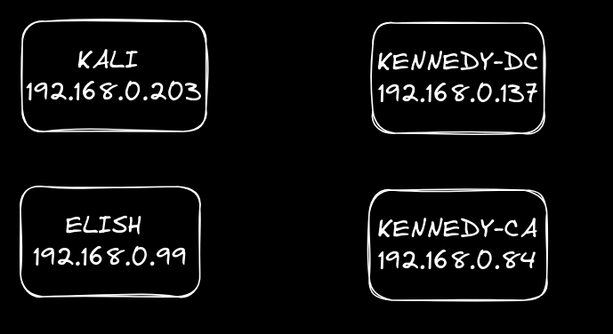

The users will be:

- jkennedy (standard domain user)
- ekennedy (administrative user)

### **Lack of SMB Signing**

Nothing illustrates the power of the SMB signing vulnerability quite like LNK files placed on shares. My favourite tool for demonstrating this, is the ‘slinky’ module on ‘[nxc](https://github.com/Pennyw0rth/NetExec)’.

You can build up a list of all the machines with SMB signing as ‘false’ with the following command:

```
nxc smb targets.txt --gen-relay-list nosigning.txt
```

But in my small lab I can just manually check the machines like so:

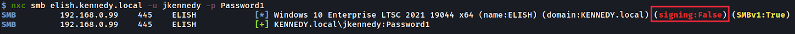

We can see above that the ELISH machine has no signing so it won’t be able to identify for sure who is authenticating to it over the SMB protocol.

With that in mind we first use nxc to analyse the KENNEDY-CA machine to see if we have any available writable directories for us to place our LNK file and it identifies the ‘share’ directory:

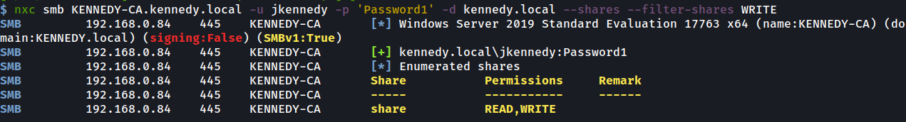

We then use slinky to create a LNK file on this share which points back to our Kali VM 192.168.0.203. Now when anyone enters that share via file explorer (not command line) and without even clicking it the LNK file will be triggered and their authentication will be sent back to the attackers Kali machine.

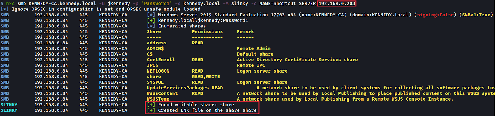

Back at the attackers Kali machine we set up a [ntlmrelayx](https://github.com/fortra/impacket/blob/master/examples/ntlmrelayx.py) listener for any authentications coming in and, if any are received, we target the 192.168.0.99 machine where we know signing is disabled. At that point ntlmrelayx can automatically open a socks connection with that machine as the user who entered the share using their authentication. We are essentially carrying out a man in the middle attack.

 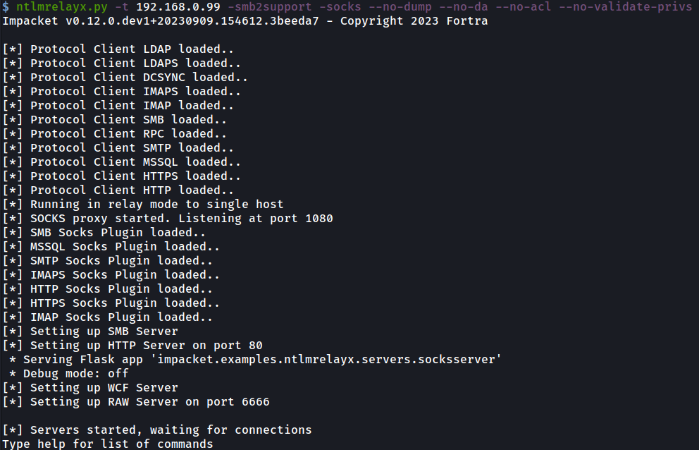

When the authentication comes in after ‘ekennedy’ enters the share, we get a hit, and a socks connection is opened with the 192.168.0.99 machine that has no signing as shown:

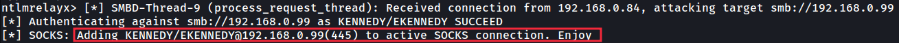

A persistent socks connection is then maintained within ntlmrelayx which is visible when you enter the ‘socks’ command as shown:

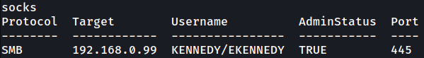

We can then edit our proxychains configuration file to allow us to access this socks connection to the remote machine, which uses port 1080 by default:

In ‘/etc/proxychains4.conf’ add the line “socks4 127.0.0.1 1080”

Now using proxychains we can dump the sam data given that the ‘ekennedy’ authentication was of an Administrator. It should be noted we don’t need a password at this point using nxc, given we are using a live socks tunnel which has already been authenticated over NTLM.

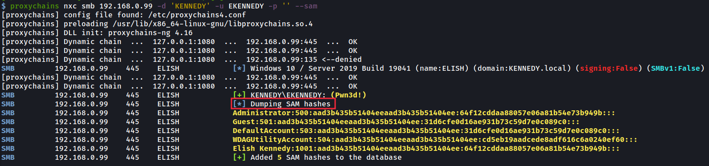

Taking complete control of this machine is now trivial with the hashes received. In the above scenario, ntlmrelayx was used to relay the ‘ekennedy’ admin authentication to just 1 machine but in practice it could relay it to 50 machines with SMB signing off, therefore opening up 50 admin socks connections to pick and choose from.

This most certainly has happened to me on a real test.

Next up are 2 techniques that rely less on luck, especially if you are impatient waiting for someone to trigger a LNK file.

### **LDAP Signing - RBCD**

Similar to SMB signing, LDAP signing - or the lack there of - allows attackers to send HTTP authentication to the LDAP service available on a Domain Controller (DC) but, because signing is disabled, the DC is unable to verify that the authentication coming in is from the actual machine that sent it. This, once again, opens up the possibility of MiTM attacks.

First we check the ‘KENNEDY-DC’ machine to see if LDAP signing or channel binding is enforced, which it isn’t.

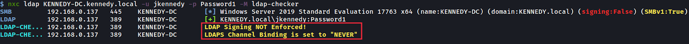

We then search for a machine that has a WebClient running on the network using nxc’s 'webdav' module as shown below, and we can see that the ‘KENNEDY-CA’ machine has it enabled. Why are we interested in webdav? Well, we can coerce the WebClient service to authenticate back to us over HTTP:

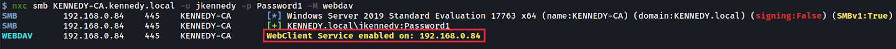

From our attacker’s Kali machine, we now launch ntlmrelayx to target LDAPS of ‘KENNEDY-DC’ and when doing so to use the the ‘delegate access’ flag  to launch a RBCD attack on that machine.

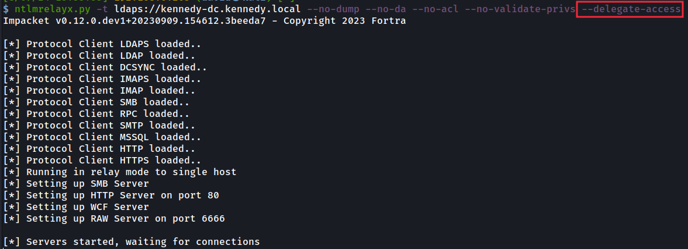

In simple terms what delegate access does is create a new machine on the network and gives the new machine permissions over the machine whose authentication we have passed to the DC. These permissions allow us, as the attacker, to impersonate anyone else on the machine (e.g. an administrator).

To now force the WebClient to authenticate to ntlmrelayx, we first launch [Responder](https://github.com/lgandx/Responder). Ensure its HTTP and SMB servers are turned off, as we don’t want to catch the authentication with this tool but instead using ntlmrelayx.

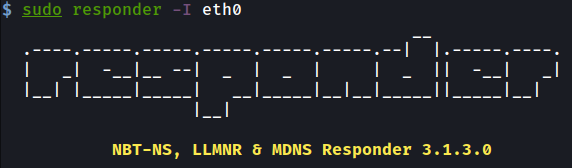

The only reason we use Responder is to provide us with a ‘Machine Name’ on the network that we can use to advertise itself and receive authentications into our Kali machine. This machine name can be seen below:

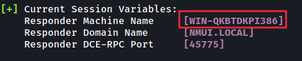

We now coerce the ‘KENNEDY-CA’ (192.168.0.84) machine to authenticate to our attacker Kali Responder machine over HTTP, then relay that authentication to ‘KENNEDY-DC’, which will be unable to verify who is authenticating to it. The call back to our Responder machine instead hits our ntlmrelayx server, listening on port 80:

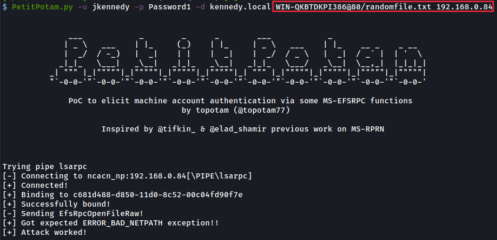

After executing that command, ntlmrelayx forwards the authentication to ‘KENNEDY-DC’ with LDAP signing disabled, and we receive a new machine on the network with a random name, called ‘KQCLXPVT$’. This new machine will also present added information required to impersonate users on the ‘KENNEDY-CA’ server.

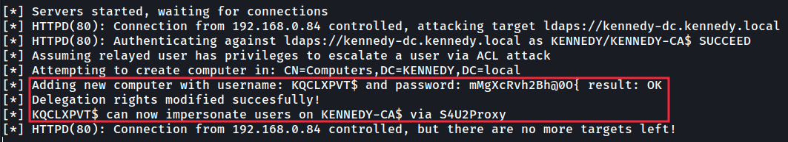

This new machine can now be seen in Active Directory as shown:

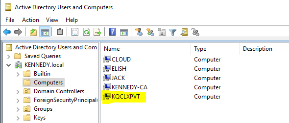

Using the module named ‘group-mem’ that I wrote for nxc we can now see who we would like to impersonate by looking up the privileged ‘Domain Admins’ members:

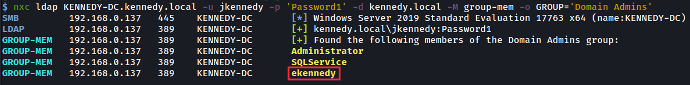

After choosing ‘ekennedy’ we can now impersonate them by using our new machine account username and password via the getST.py command from impacket.

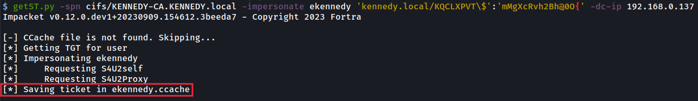

This will provide us an ‘ekennedy’ service ticket (a.k.a. silver ticket) for the cifs service on that specific machine, which can’t be used elsewhere.

We can import this into our Kali memory as so:

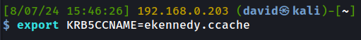

We can then use this ticket in various tools by specifying the ‘-k’ flag on the command line, so it will grab the ticket directly from that KRB5CCNAME variable we set.

Here I use [secretsdump](https://github.com/fortra/impacket/blob/master/examples/secretsdump.py) to now dump the hashes from the machines memory which, like passwords, we can use to access the machine as an Administrator, for example:

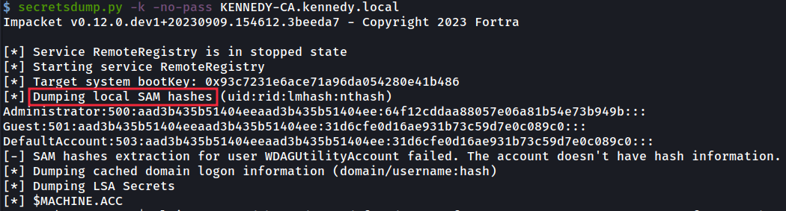

### **LDAP Signing - Shadow Credentials**

This technique is very very similar to the previous one so I will cover it in less detail. The key benefit to using this one is that it isn’t reliant on creating a new machine on the network, which can be useful when some organisations have the ‘Machine Account Quota’ set to zero. Remember that, by default,  regular AD users are allowed to add 10, which is crazy!

This technique allows an attacker to take over an AD computer account if we can modify the computer’s attribute ‘msDS-KeyCredentialLink’ and append it with alternate credentials in the form of a certificate which we have control over. This certificate will then allow us to have control over that machine.

So once again we set up our trusty ntlmrelayx to target ‘KENNEDY-DC’ with no LDAP signing in place but specifying two different flags. They are shadow credentials to tell it what attack we are doing, then a shadow-target to specify the machine we are targeting. The machine we are targeting in this case is again the ‘KENNEDY-CA’ machine with the WebClient running, so we can coerce it towards us as shown previously.

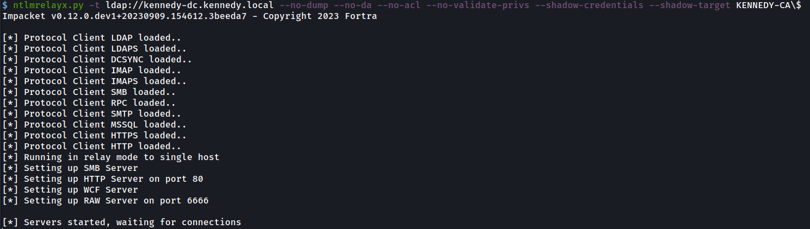

We again use Responder to provide a machine name and [PetitPotam](https://github.com/topotam/PetitPotam) to carry out the coercion back to us as shown:

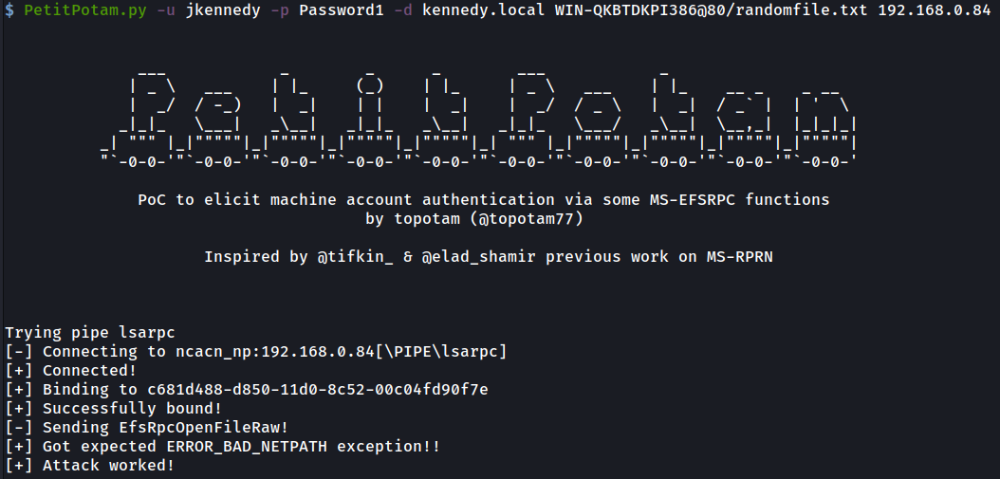

Once again ntlmrelayx gets a hit but this time instead of being able to impersonate anybody else on the victim machine we receive a certificate for the machine account.

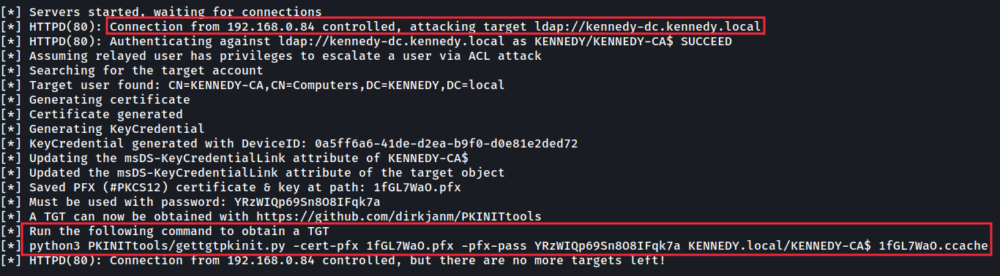

Quite handily above, ntlmrelayx provides the command to use next with the tool [gettgtpkinit.py](https://github.com/dirkjanm/PKINITtools/blob/master/gettgtpkinit.py) to convert the certificate into a TGT (Ticket Granting Ticket) for the machine. A TGT is just as good as a username and password in the Kerberos world so we can use that to act as the machine we are attacking.

After running that command the TGT is saved to file:

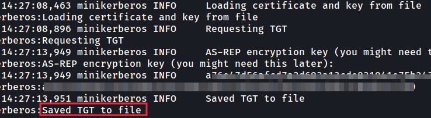

Once again we import it into our variable to be used by our tools:

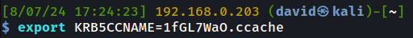

Then once again run secretsdump with the ‘-k’ flag to use the TGT to dump all the hashes of the machine, allowing us a complete takeover.

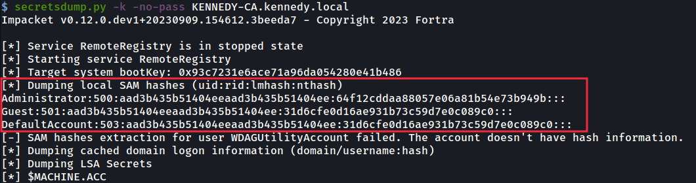

Well, that completes my little foray into some of the older adversary techniques that have helped me compromise countless Active Directory environments. Whilst older, these are still very real-world and usable attack paths so hopefully this provides the testers out there with some added insights and the defenders with some visibility over attack paths adversaries may take in their Active Directory domains.

Some remediation steps that you can take to hinder these attacks in your domain are:

- Enabling SMB signing
- Enabling LDAP signing
- Set the ‘Machine Account Quota’ to zero
- Try to move away from NTLM to Kerberos

Until next time.
